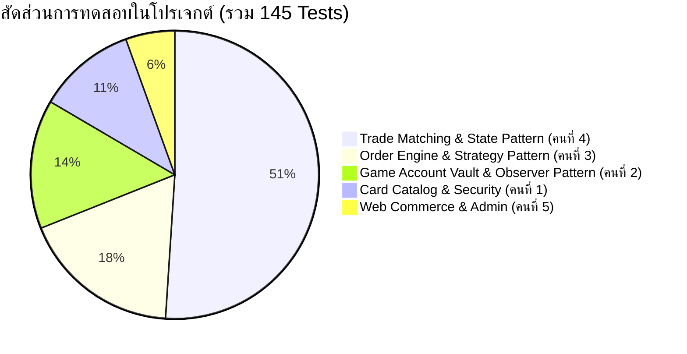

# 🧪 PokéVault Commerce — Testing Guide & Test Suite Catalog (README-TEST.md)

> **โปรเจกต์**: PokéVault Commerce — Pokémon TCG Pocket Chat Commerce System  
> **วิชา**: CP353002 Principles of Software Design and Development  
> **เฟรมเวิร์กการทดสอบ**: JUnit 5 (Jupiter) • Mockito • Spring Test (MockMvc) • AssertJ  
> **เวอร์ชัน Java**: Java 17 LTS (Eclipse Temurin)  
> **ผลลัพธ์การทดสอบล่าสุด**: ✅ **145 / 145 Tests Passed (100% Success — 0 Failures, 0 Errors)**  
> **เวลาประมวลผลเฉลี่ย**: ~6-8 วินาที  

---

## 📑 สารบัญ (Table of Contents)

1. [ภาพรวมการทดสอบของระบบ (Testing Overview)](#1-ภาพรวมการทดสอบของระบบ-testing-overview)
2. [ข้อกำหนดและสภาพแวดล้อมก่อนเริ่มรัน (Prerequisites & Environment Setup)](#2-ข้อกำหนดและสภาพแวดล้อมก่อนเริ่มรัน-prerequisites--environment-setup)
3. [คำสั่งและวิธีการรันเทส (How to Execute Tests)](#3-คำสั่งและวิธีการรันเทส-how-to-execute-tests)
   - [3.1 รันการทดสอบทั้งหมดทุกคลาสในระบบ](#31-รันการทดสอบทั้งหมดทุกคลาสในระบบ-145-tests)
   - [3.2 รันเฉพาะคลาสของสมาชิกคนที่ 4 (Trade Matching & State Pattern Specialist)](#32-รันเฉพาะคลาสของสมาชิกคนที่-4-trade-matching--state-pattern-74-tests)
   - [3.3 รันแยกตามโมดูลการทำงาน](#33-รันแยกตามโมดูลการทำงาน-modular-test-execution)
   - [3.4 รันเฉพาะรายคลาสหรือรายเมธอด](#34-รันเฉพาะรายคลาสหรือรายเมธอด-single-class--method)
   - [3.5 การรันเทสผ่าน IDE (VS Code / IntelliJ IDEA)](#35-การรันเทสผ่าน-ide-vs-code--intellij-idea)
4. [ตารางสรุปคลาสทดสอบทั้งหมด 16 คลาส (Comprehensive Test Matrix)](#4-ตารางสรุปคลาสทดสอบทั้งหมด-16-คลาส-comprehensive-test-matrix)
5. [เจาะลึกชุดการทดสอบของสมาชิกคนที่ 4 (Member 4 Deep-Dive)](#5-เจาะลึกชุดการทดสอบของสมาชิกคนที่-4-member-4-deep-dive)
   - [5.1 OrderStateTest (GoF State Pattern Lifecycle & Guards)](#51-orderstatetest-gof-state-pattern-lifecycle--guards)
   - [5.2 TradeMatchingServiceTest (Auto-Match Algorithm & Two-Tier Recommendation)](#52-tradematchingservicetest-auto-match-algorithm--two-tier-recommendation)
   - [5.3 TradeMatchingApiControllerTest (REST Endpoints & HTTP Error Mapping)](#53-tradematchingapicontrollertest-rest-endpoints--http-error-mapping)
   - [5.4 OrderApiControllerTest (Order State & Trade Status Lifecycle API)](#54-orderapicontrollertest-order-state--trade-status-lifecycle-api)
   - [5.5 GlobalExceptionHandlerTest (Centralized HTTP Exception Mapping)](#55-globalexceptionhandlertest-centralized-http-exception-mapping)
   - [5.6 TradeRecommendationResponseTest (DTO & Builder)](#56-traderecommendationresponsetest-dto--builder)
   - [5.7 CustomExceptionTest (Domain Exception Classes)](#57-customexceptiontest-domain-exception-classes)
6. [ชุดการทดสอบของโมดูลอื่นๆ ในระบบ (Other Team Modules Test Suites)](#6-ชุดการทดสอบของโมดูลอื่นๆ-ในระบบ-other-team-modules-test-suites)
7. [การทดสอบ Design Patterns 3 รูปแบบ (Design Patterns Verification)](#7-การทดสอบ-design-patterns-3-รูปแบบ-design-patterns-verification)
8. [เทคนิคและมาตรฐานการเขียนเทสในโปรเจกต์ (Testing Standards & Practices)](#8-เทคนิคและมาตรฐานการเขียนเทสในโปรเจกต์-testing-standards--practices)
9. [การแก้ไขปัญหาทั่วไปเมื่อรันเทส (Troubleshooting & FAQs)](#9-การแก้ไขปัญหาทั่วไปเมื่อรันเทส-troubleshooting--faqs)

---

## 1. ภาพรวมการทดสอบของระบบ (Testing Overview)

สถาปัตยกรรมชุดทดสอบของ **PokéVault Commerce** ถูกออกแบบตามหลัก **Testing Pyramid** และ **Fast Feedback Loop**:
* **Pure Domain & State Tests**: ทดสอบ Business Invariants และ State Machine โดยไม่เปิด Spring Context เพื่อความเร็วระดับมิลลิวินาที
* **Service Unit Tests with Mockito**: แยกทดสอบ Business Logic และอัลกอริทึมอย่างเป็นอิสระจากฐานข้อมูลจริงด้วย `@ExtendWith(MockitoExtension.class)`
* **Controller MockMvc Tests**: ทดสอบ REST API, Request Parameter Binding, DTO Serialization และ Exception Mapping ผ่าน `MockMvcBuilders.standaloneSetup()` เพื่อป้องกันปัญหา Sliced Context กับ `@EnableJpaAuditing`
* **Centralized Exception Handler Tests**: ทดสอบ AOP `@RestControllerAdvice` ในการแปลงข้อผิดพลาดเป็นมาตรฐาน JSON `ErrorResponse`



---

## 2. ข้อกำหนดและสภาพแวดล้อมก่อนเริ่มรัน (Prerequisites & Environment Setup)

| รายการ | รายละเอียดที่ต้องการ | หมายเหตุ |
| :--- | :--- | :--- |
| **Java Development Kit** | **Java 17 LTS** (แนะนำ: Eclipse Temurin JDK 17) | *คำเตือน*: หากใช้ JDK 22+ อาจมีปัญหากับ Lombok ในขั้นตอนคอมไพล์ |
| **Build Tool** | **Maven Wrapper (`./mvnw` หรือ `.\mvnw.cmd`)** | ติดตั้งมากับโปรเจกต์แล้ว ไม่จำเป็นต้องติดตั้ง Maven แยก |
| **Operating System** | Windows 10/11, macOS หรือ Linux | |
| **Terminal** | PowerShell (Windows), Bash / Zsh (macOS / Linux) | |

### การตั้งค่า JAVA_HOME บน Windows PowerShell
ก่อนรันคำสั่ง Maven Wrapper บน Windows ให้ตรวจสอบหรือกำหนดตัวแปรสภาพแวดล้อมให้ชี้ไปยัง JDK 17:

```powershell
# ตัวอย่างสำหรับ Eclipse Temurin JDK 17 บน Windows
$env:JAVA_HOME="C:\Program Files\Eclipse Adoptium\jdk-17.0.20.101-hotspot"
$env:Path="$env:JAVA_HOME\bin;$env:Path"

# ตรวจสอบเวอร์ชัน Java
java -version
```

---

## 3. คำสั่งและวิธีการรันเทส (How to Execute Tests)

### 3.1 รันการทดสอบทั้งหมดทุกคลาสในระบบ (145 Tests)

รันคำสั่ง Maven Wrapper จากรูทโฟลเดอร์ของโปรเจกต์:

* **Windows (PowerShell / Command Prompt)**:
  ```powershell
  .\mvnw.cmd clean test
  ```
* **macOS / Linux (Bash / Zsh)**:
  ```bash
  ./mvnw clean test
  ```

> **ผลลัพธ์ที่คาดหวัง**:  
> `[INFO] Tests run: 145, Failures: 0, Errors: 0, Skipped: 0`  
> `[INFO] BUILD SUCCESS` (เวลาประมวลผลประมาณ 6-8 วินาที)

---

### 3.2 รันเฉพาะคลาสของสมาชิกคนที่ 4 (Trade Matching & State Pattern — 74 Tests)

สมาชิกคนที่ 4 (**นายแทนคุณ พันธ์นิกุล, 673380301-0 — Branch: `Tankun_6733803010_01`**) รับผิดชอบ 7 คลาสทดสอบ:

```powershell
# Windows PowerShell (จำเป็นต้องมีเครื่องหมายคำพูดครอบ -Dtest)
.\mvnw.cmd test "-Dtest=OrderStateTest,TradeMatchingServiceTest,TradeMatchingApiControllerTest,OrderApiControllerTest,GlobalExceptionHandlerTest,TradeRecommendationResponseTest,CustomExceptionTest"
```

*บน macOS / Linux:*
```bash
./mvnw test -Dtest=OrderStateTest,TradeMatchingServiceTest,TradeMatchingApiControllerTest,OrderApiControllerTest,GlobalExceptionHandlerTest,TradeRecommendationResponseTest,CustomExceptionTest
```

> **ผลลัพธ์ที่คาดหวัง**:  
> `[INFO] Tests run: 74, Failures: 0, Errors: 0, Skipped: 0`  
> `[INFO] BUILD SUCCESS` (เวลาประมวลผลประมาณ 2-3 วินาที)

---

### 3.3 รันแยกตามโมดูลการทำงาน (Modular Test Execution)

#### ก) โมดูล Trade & State Pattern (GoF State, In-Game Matching, Exception Advice):
```powershell
.\mvnw.cmd test "-Dtest=OrderStateTest,TradeMatchingServiceTest,TradeMatchingApiControllerTest,GlobalExceptionHandlerTest,TradeRecommendationResponseTest,CustomExceptionTest"
```

#### ข) โมดูล Order Processing (Order Service, State Transitions, Strategy Discount):
```powershell
.\mvnw.cmd test "-Dtest=OrderServiceTest,OrderApiControllerTest,DiscountStrategyTest"
```

#### ค) โมดูล Vault & Inventory (Card Inventory, Game Accounts, Low Stock Observer):
```powershell
.\mvnw.cmd test "-Dtest=CardInventoryTest,GameAccountServiceTest,LowStockObserverTest"
```

#### ง) โมดูล Card Catalog & Security (Card Catalog, User Details & Roles):
```powershell
.\mvnw.cmd test "-Dtest=CardServiceTest,CustomUserDetailsServiceTest"
```

#### จ) โมดูล Web & Store Admin (Customer Registration, Tier Upgrades, Price Updates):
```powershell
.\mvnw.cmd test "-Dtest=RegistrationServiceTest,StoreAdminServiceTest"
```

---

### 3.4 รันเฉพาะรายคลาสหรือรายเมธอด (Single Class / Method)

* **รันเฉพาะคลาส `OrderStateTest`**:
  ```powershell
  .\mvnw.cmd test -Dtest=OrderStateTest
  ```
* **รันเฉพาะเมธอด `testCancelRejectedWhileShipping` ใน `OrderStateTest`** (ทดสอบ Anti-Fraud Guard):
  ```powershell
  .\mvnw.cmd test -Dtest=OrderStateTest#testCancelRejectedWhileShipping
  ```
* **รันเฉพาะคลาส `TradeMatchingApiControllerTest`**:
  ```powershell
  .\mvnw.cmd test -Dtest=TradeMatchingApiControllerTest
  ```

---

### 3.5 การรันเทสผ่าน IDE (VS Code / IntelliJ IDEA)

#### สำหรับ VS Code:
1. ติดตั้งส่วนขยาย **Extension Pack for Java** และ **Test Runner for Java**
2. เปิดแถบข้าง **Testing** (ไอคอนรูปหลอดทดลองรูปตัว Y ทางซ้าย)
3. กดปุ่ม **Run Tests** หรือกดไอคอน Play หน้าชื่อคลาส/เมธอดในหน้าต่างโค้ดได้ทันที

#### สำหรับ IntelliJ IDEA:
1. คลิกขวาที่โฟลเดอร์ `src/test/java`
2. เลือก **Run 'All Tests'** หรือกดทางลัด `Ctrl + Shift + F10` (Windows) / `Ctrl + Shift + R` (macOS)
3. หรือเปิดไฟล์เทสที่ต้องการแล้วคลิกปุ่มลูกศรสีเขียวหน้าประกาศชื่อคลาส

---

## 4. ตารางสรุปคลาสทดสอบทั้งหมด 16 คลาส (Comprehensive Test Matrix)

| # | ชื่อคลาสทดสอบ (Test Class) | แพ็กเกจ (Package) | ผู้รับผิดชอบหลัก | หน้าที่และความรับผิดชอบที่ทดสอบ | จำนวนเคส |
| :---: | :--- | :--- | :---: | :--- | :---: |
| 1 | **`OrderStateTest`** | `modules.trade.state` | สมาชิกคนที่ 4 | GoF State Pattern lifecycle, State Transitions, Anti-Fraud Guard, Auto Stock Restore | **21** |
| 2 | **`TradeMatchingServiceTest`** | `modules.trade.service` | สมาชิกคนที่ 4 | อัลกอริทึม Auto-Match Stock-Maximization, การสร้างคำแนะนำ 2 ระดับ, Manual Account Assignment | **12** |
| 3 | **`TradeMatchingApiControllerTest`** | `modules.trade.controller` | สมาชิกคนที่ 4 | MockMvc ครบทั้ง 5 REST Endpoints ของการจับคู่เทรดการ์ด พร้อมการแปลง HTTP Status (200, 400, 404, 409) | **13** |
| 4 | **`OrderApiControllerTest`** | `modules.order` | สมาชิกคนที่ 4 & 3 | MockMvc ทดสอบ State Transition (`PATCH /status`), Trade Fulfillment Status (`PATCH /trade-status`) และ Security (403) | **13** |
| 5 | **`GlobalExceptionHandlerTest`** | `modules.trade.advice` | สมาชิกคนที่ 4 | AOP `@RestControllerAdvice` ตรวจทานการแปลง Exception ทุกประเภทเป็น ErrorResponse JSON มาตรฐาน (400, 403, 404, 409, 500) | **10** |
| 6 | **`TradeRecommendationResponseTest`**| `modules.trade.dto` | สมาชิกคนที่ 4 | DTO, Builder Pattern, Default Lists และ Inner Class `CandidateAccountResponse` | **3** |
| 7 | **`CustomExceptionTest`** | `common.exception` | สมาชิกคนที่ 4 | ตรวจสอบ Constructor และ Cause Chaining ของ `TradeStateConflictException` และ `InvalidOrderStateException` | **2** |
| 8 | **`OrderServiceTest`** | `modules.order` | สมาชิกคนที่ 3 & 4 | ตรรกะการจองการ์ด, คำนวณยอดเงิน, ลำดับวงจรชีวิต Trade Status (`UNASSIGNED` ➔ `FRIEND_PENDING` ➔ `TRADE_SENT` ➔ `COMPLETED`) | **20** |
| 9 | **`DiscountStrategyTest`** | `modules.order` | สมาชิกคนที่ 3 | GoF Strategy Pattern การคำนวณส่วนลดตามระดับสมาชิก (`REGULAR`, `VIP`, `WHOLESALE`) | **6** |
| 10 | **`LowStockObserverTest`** | `modules.vault.observer` | สมาชิกคนที่ 2 | GoF Observer Pattern ดักฟังอีเวนต์ `OrderPlacedEvent` และแจ้งเตือนสต็อกการ์ดต่ำกว่าเกณฑ์ | **7** |
| 11 | **`GameAccountServiceTest`** | `modules.vault.service` | สมาชิกคนที่ 2 | การจัดการบัญชีร้านค้าในเกม, เปลี่ยนสถานะเทรดบัญชี, บันทึกการ์ดที่เปิดซองเข้าคลัง | **9** |
| 12 | **`CardInventoryTest`** | `domain.entity` | สมาชิกคนที่ 2 | Entity Business Methods: การหักสต็อก (`deductStock`), การคืนสต็อก (`restoreStock`), การอัปเดตราคา | **5** |
| 13 | **`CardServiceTest`** | `modules.catalog` | สมาชิกคนที่ 1 | ค้นหาและกรองการ์ดตามธาตุ, ระดับความหายาก, หมวดหมู่, สรุปสต็อกคงเหลือ | **13** |
| 14 | **`CustomUserDetailsServiceTest`** | `common.security` | สมาชิกคนที่ 1 | การโหลดข้อมูลผู้ใช้สำหรับ Spring Security, การแปลง Roles และ Authorities | **3** |
| 15 | **`RegistrationServiceTest`** | `modules.web` | สมาชิกคนที่ 5 | การลงทะเบียนลูกค้าใหม่, ตรวจสอบ Username ซ้ำ, แฮชรหัสผ่านด้วย BCrypt | **3** |
| 16 | **`StoreAdminServiceTest`** | `modules.web` | สมาชิกคนที่ 5 | ฟังก์ชันแอดมิน: การปรับระดับสมาชิกของลูกค้า และการแก้ไขราคาขายของการ์ด | **5** |
| **รวม** | **16 Test Classes** | — | **ทั้งทีม** | **ครอบคลุมทุกโมดูล ทุก Layer และทุก Pattern ในโปรเจกต์** | **145** |

---

## 5. เจาะลึกชุดการทดสอบของสมาชิกคนที่ 4 (Member 4 Deep-Dive)

> **สมาชิกผู้พัฒนา**: นายแทนคุณ พันธ์นิกุล (รหัสนักศึกษา: 673380301-0)  
> **บทบาท**: Trade Matching & State Pattern Specialist  
> **Git Branch**: `Tankun_6733803010_01`  
> **ความรับผิดชอบหลัก**: GoF State Pattern, In-Game Trade Matching Algorithm, Centralized Exception Handling  
> **จำนวนเคสรวม**: **74 Scenarios (100% Passed)**  

```
src/test/java/com/pokevault/
├── common/
│   └── exception/
│       └── CustomExceptionTest.java                  [2 เคส]  (Member 4)
├── modules/
│   ├── order/
│   │   ├── OrderApiControllerTest.java               [13 เคส] (Member 4 & 3)
│   │   └── OrderServiceTest.java (Trade Lifecycle)   [20 เคส] (Member 3 & 4)
│   └── trade/
│       ├── advice/
│       │   └── GlobalExceptionHandlerTest.java       [10 เคส] (Member 4)
│       ├── controller/
│       │   └── TradeMatchingApiControllerTest.java   [13 เคส] (Member 4)
│       ├── dto/
│       │   └── TradeRecommendationResponseTest.java  [3 เคส]  (Member 4)
│       ├── service/
│       │   └── TradeMatchingServiceTest.java         [12 เคส] (Member 4)
│       └── state/
│           └── OrderStateTest.java                   [21 เคส] (Member 4)
```

---

### 5.1 `OrderStateTest` (GoF State Pattern Lifecycle & Guards)
* **ที่ตั้งไฟล์**: [`src/test/java/com/pokevault/modules/trade/state/OrderStateTest.java`](file:///e:/Coding/Pok-Vault_Commerce/src/test/java/com/pokevault/modules/trade/state/OrderStateTest.java)
* **จำนวนเคส**: 21 Scenarios (แบ่งเป็น 9 Nested Test Classes)
* **ประเด็นสำคัญที่ทดสอบ**:
  1. **Full Happy Path**: คำสั่งซื้อสามารถเปลี่ยนสถานะอย่างถูกต้องตามลำดับ:  
     `PENDING` ➔ (ชำระเงิน `pay()`) ➔ `PAID` ➔ (ส่งมอบ `ship()`) ➔ `SHIPPING` ➔ (ยืนยันรับการ์ด `complete()`) ➔ `COMPLETED`
  2. **Order Cancellation & Stock Restoration**:
     - ออเดอร์ในสถานะ `PENDING` และ `PAID` สามารถกดยกเลิกได้ (`cancel()`)
     - กลไก **Automatic Stock Restoration**: เมื่อคำสั่งซื้อถูกยกเลิก ระบบจะคืนจำนวนการ์ดที่ถูกจองไว้กลับเข้า `CardInventory` ของแต่ละรายการโดยอัตโนมัติ
  3. **Critical Anti-Fraud Guard (Free-Card Loss Protection)**:
     - **คำสั่งซื้อที่อยู่ในสถานะ `SHIPPING` ต้องปฏิเสธการยกเลิกทุกกรณี** เพื่อป้องกันลูกค้ากดโกงขอยกเลิกขณะที่การ์ดถูกส่งเข้าบัญชีในเกมไปแล้ว (`InvalidOrderStateException`)
  4. **Terminal State Protection**:
     - สถานะ `COMPLETED` และ `CANCELLED` ถือเป็นสถานะสิ้นสุด (Terminal State) ต้องปฏิเสธทุกการกระทำ (`pay`, `ship`, `complete`, `cancel`)
  5. **Illegal Transition Fail-Fast**:
     - ปฏิเสธการข้ามขั้น เช่น สั่ง `ship()` ขณะยังเป็น `PENDING` หรือสั่ง `pay()` ขณะเป็น `PAID` อยู่แล้ว
  6. **Context Action via String**:
     - ทดสอบเมธอด `executeAction(String)` รองรับ Case-insensitive ("PAY", " ship ", "CoMpLeTe") และปฏิเสธ Action ที่ไม่ถูกต้อง
  7. **Defensive Null-Safety & Edge Cases**:
     - ป้องกัน Null Pointer เมื่อบริบทไม่มีออเดอร์ผูก หรือรายการสินค้าไม่มีคลังอ้างอิง

---

### 5.2 `TradeMatchingServiceTest` (Auto-Match Algorithm & Two-Tier Recommendation)
* **ที่ตั้งไฟล์**: [`src/test/java/com/pokevault/modules/trade/service/TradeMatchingServiceTest.java`](file:///e:/Coding/Pok-Vault_Commerce/src/test/java/com/pokevault/modules/trade/service/TradeMatchingServiceTest.java)
* **จำนวนเคส**: 12 Scenarios (แบ่งเป็น 4 Nested Groups)
* **ประเด็นสำคัญที่ทดสอบ**:
  1. **Auto-Match Greedy Stock-Maximization Algorithm**:
     - ระบบคัดกรองเฉพาะบัญชีเกมที่มีสถานะ **`READY`** เท่านั้น (ไม่เลือกบัญชี `BUSY_TRADING` หรือ `COOLDOWN`)
     - จากนั้นเลือกบัญชีที่ **ถือสต็อกการ์ดใบนั้นมากที่สุด** เพื่อทำหน้าที่ส่งมอบการ์ดให้ลูกค้า (Load Balancing)
     - เมื่อจับคู่สำเร็จ จะอัปเดต `OrderItem.tradeStatus` เป็น `FRIEND_PENDING` ทันที
  2. **Two-Tier Recommendation Architecture**:
     - คืนค่าอันดับ 1 ที่ดีที่สุด (**Best Match**) พร้อมเหตุผลการแนะนำ
     - คืนค่ารายชื่อบัญชีสำรอง (**Alternative Candidates**) สำหรับให้พนักงานร้านเลือกสลับได้
  3. **Batch Order Auto-Match**:
     - เมธอด `autoMatchOrder(orderId)` ทำการวนลูปจับคู่ไอดีเกมให้อัตโนมัติครบทุกรายการในคำสั่งซื้อ
  4. **Manual Account Assignment**:
     - เมธอด `assignAccountToOrderItem(orderItemId, accountId)` สำหรับพนักงานเลือกไอดีเอง
     - ปฏิเสธการมอบหมายหากบัญชีไม่ได้อยู่ในสถานะ `READY`
     - ปฏิเสธการเปลี่ยนไอดีหากสินค้านั้นมีสถานะเทรดเสร็จสิ้นแล้ว (`COMPLETED`)

---

### 5.3 `TradeMatchingApiControllerTest` (REST Endpoints & HTTP Error Mapping)
* **ที่ตั้งไฟล์**: [`src/test/java/com/pokevault/modules/trade/controller/TradeMatchingApiControllerTest.java`](file:///e:/Coding/Pok-Vault_Commerce/src/test/java/com/pokevault/modules/trade/controller/TradeMatchingApiControllerTest.java)
* **จำนวนเคส**: 13 Scenarios
* **ประเด็นสำคัญที่ทดสอบ**:
  1. `GET /api/v1/trades/orders/{orderId}/recommendations`:
     - 200 OK: ดึงรายการแนะนำไอดีสำหรับทุกการ์ดในออเดอร์
     - 404 NOT FOUND: เมื่อระบุ Order ID ที่ไม่มีอยู่ในระบบ
  2. `GET /api/v1/trades/items/{orderItemId}/recommendation`:
     - 200 OK: ดึงคำแนะนำสำหรับรายการสินค้าเดี่ยว
     - 404 NOT FOUND: เมื่อไม่พบ OrderItem
  3. `POST /api/v1/trades/items/{orderItemId}/auto-match`:
     - 200 OK: สั่งจับคู่อัตโนมัติสำเร็จ
     - 400 BAD REQUEST: เมื่อสต็อกการ์ดในไอดีเกมไม่เพียงพอ (`INSUFFICIENT_STOCK`)
     - 409 CONFLICT: เมื่อรายการสินค้านี้เทรดเสร็จสิ้นไปแล้ว (`STATE_CONFLICT`)
  4. `POST /api/v1/trades/orders/{orderId}/auto-match`:
     - 200 OK: สั่งจับคู่อัตโนมัติทั้งคำสั่งซื้อ
     - 404 NOT FOUND: เมื่อไม่พบออเดอร์
  5. `POST /api/v1/trades/items/{orderItemId}/assign?accountId={}`:
     - 200 OK: มอบหมายไอดีเกมสำเร็จ
     - 409 CONFLICT: เมื่อไอดีเกมที่ระบุติดสถานะอื่น เช่น `BUSY_TRADING`
     - 404 NOT FOUND: เมื่อไม่พบไอดีเกมหรือสินค้า
     - 400 BAD REQUEST: เมื่อขาด Query Parameter `accountId` (`MISSING_PARAMETER`)

---

### 5.4 `OrderApiControllerTest` (Order State & Trade Status Lifecycle API)
* **ที่ตั้งไฟล์**: [`src/test/java/com/pokevault/modules/order/OrderApiControllerTest.java`](file:///e:/Coding/Pok-Vault_Commerce/src/test/java/com/pokevault/modules/order/OrderApiControllerTest.java)
* **จำนวนเคส**: 13 Scenarios
* **ประเด็นสำคัญที่ทดสอบ**:
  1. **GoF State Pattern API**:
     - `PATCH /api/v1/orders/{id}/status?action=pay` ➔ 200 OK (สถานะกลายเป็น `PAID`)
     - `PATCH /api/v1/orders/{id}/status?action=ship` ➔ 200 OK (สถานะกลายเป็น `SHIPPING`)
     - `PATCH /api/v1/orders/{id}/status?action=cancel` ➔ 200 OK (สถานะกลายเป็น `CANCELLED`)
     - 409 CONFLICT: ขัดแย้งกับกฎ State เช่น ขอยกเลิกระหว่าง `SHIPPING`
     - 404 NOT FOUND: ไม่พบออเดอร์
     - 400 BAD REQUEST: ขาด Parameter `action`
  2. **Trade Status Lifecycle API**:
     - `PATCH /api/v1/orders/{id}/items/{itemId}/trade-status?status=TRADE_SENT` ➔ 200 OK
     - `PATCH /api/v1/orders/{id}/items/{itemId}/trade-status?status=COMPLETED` ➔ 200 OK
     - 403 FORBIDDEN: เมื่อไม่มีสิทธิ์ (เช่น บัญชีลูกค้าทั่วไปพยายามเรียก)
     - 400 BAD REQUEST: ค่าสถานะสะกดผิด หรือเป็นสถานะที่ไม่อนุญาตให้เปลี่ยนผ่าน API
     - 409 CONFLICT: ออเดอร์ยังไม่อยู่ในสถานะ `SHIPPING` หรือยังไม่ได้จับคู่ไอดีเกม

---

### 5.5 `GlobalExceptionHandlerTest` (Centralized HTTP Exception Mapping)
* **ที่ตั้งไฟล์**: [`src/test/java/com/pokevault/modules/trade/advice/GlobalExceptionHandlerTest.java`](file:///e:/Coding/Pok-Vault_Commerce/src/test/java/com/pokevault/modules/trade/advice/GlobalExceptionHandlerTest.java)
* **จำนวนเคส**: 10 Scenarios
* **ประเด็นสำคัญที่ทดสอบ**:
  - `404 NOT_FOUND`: `ResourceNotFoundException`, `NoResourceFoundException`
  - `409 STATE_CONFLICT`: `TradeStateConflictException`, `InvalidOrderStateException`, `IllegalStateException`
  - `400 BAD_REQUEST`:
    - `MethodArgumentTypeMismatchException` (ส่ง Enum สะกดผิด)
    - `MissingServletRequestParameterException` (ขาด Parameter บังคับ)
    - `IllegalArgumentException` (ส่งค่าที่ไม่รองรับ)
    - `InsufficientStockException` (สต็อกการ์ดไม่พอ)
  - `403 ACCESS_DENIED`: `AccessDeniedException` (สิทธิ์ไม่ถึง)
  - `500 INTERNAL_SERVER_ERROR`: `Exception` (ข้อผิดพลาดที่ไม่คาดคิด)

---

### 5.6 `TradeRecommendationResponseTest` (DTO & Builder)
* **ที่ตั้งไฟล์**: [`src/test/java/com/pokevault/modules/trade/dto/TradeRecommendationResponseTest.java`](file:///e:/Coding/Pok-Vault_Commerce/src/test/java/com/pokevault/modules/trade/dto/TradeRecommendationResponseTest.java)
* **จำนวนเคส**: 3 Scenarios
* **ประเด็นสำคัญที่ทดสอบ**:
  - Builder Pattern และ Getter/Setter ครบทุกฟิลด์
  - ค่า Default ของ `alternativeCandidates` ต้องเป็น List ที่ไม่เป็น null ป้องกัน NPE ใน Frontend
  - การทำงานของ Inner Class `CandidateAccountResponse`

---

### 5.7 `CustomExceptionTest` (Domain Exception Classes)
* **ที่ตั้งไฟล์**: [`src/test/java/com/pokevault/common/exception/CustomExceptionTest.java`](file:///e:/Coding/Pok-Vault_Commerce/src/test/java/com/pokevault/common/exception/CustomExceptionTest.java)
* **จำนวนเคส**: 2 Scenarios
* **ประเด็นสำคัญที่ทดสอบ**:
  - `TradeStateConflictException`: ตรวจสอบ Constructor ทั้งแบบรับ Message และแบบรับ Message + Cause
  - `InvalidOrderStateException`: ตรวจสอบ Constructor ทั้งแบบรับ Message และแบบรับ Message + Cause

---

## 6. ชุดการทดสอบของโมดูลอื่นๆ ในระบบ (Other Team Modules Test Suites)

### 6.1 โมดูล Order Processing (สมาชิกคนที่ 3: ธนภูมิ จันทรา)
* **`DiscountStrategyTest` (6 เคส)**: ทดสอบ GoF Strategy Pattern การคำนวณส่วนลด:
  - `RegularDiscountStrategy`: ลด 0%
  - `VipDiscountStrategy`: ลด 5%
  - `WholesaleDiscountStrategy`: ลด 10%
* **`OrderServiceTest` (20 เคส)**: ทดสอบกระบวนการสร้างคำสั่งซื้อ หักสต็อกการ์ด คืนสต็อก และการควบคุมลำดับสถานะการเทรดแบบเคร่งครัด (`UNASSIGNED` ➔ `FRIEND_PENDING` ➔ `TRADE_SENT` ➔ `COMPLETED`)

### 6.2 โมดูล Vault & Inventory (สมาชิกคนที่ 2: สัพพัญญู คำตุ้ม)
* **`LowStockObserverTest` (7 เคส)**: ทดสอบ GoF Observer Pattern เมื่อเกิดเหตุการณ์ `OrderPlacedEvent` ระบบสังเกตการณ์จะตรวจสอบจำนวนคงเหลือและพิมพ์คำเตือน Low Stock Alert หากการ์ดเหลือน้อยกว่าหรือเท่ากับ 2 ใบ
* **`GameAccountServiceTest` (9 เคส)**: ทดสอบการลงทะเบียนบัญชีเกมร้านค้า, การเปลี่ยนสถานะเทรดของบัญชี, และการบันทึกการ์ดที่เปิดซองเข้าคลัง
* **`CardInventoryTest` (5 เคส)**: ทดสอบเมธอดระดับ Entity ในการหักและคืนสต็อกการ์ด

### 6.3 โมดูล Card Catalog & Security (สมาชิกคนที่ 1: ศิฆรินทร์ อุปจันทร์)
* **`CardServiceTest` (13 เคส)**: ทดสอบการดึงข้อมูลการ์ด กรองตามธาตุ/ความหายาก และการคำนวณยอดสต็อกรวม
* **`CustomUserDetailsServiceTest` (3 เคส)**: ทดสอบการแปลง Entity ผู้ใช้เป็น Spring Security UserDetails พร้อมสิทธิ์ตาม Role

### 6.4 โมดูล Web Commerce & Admin (สมาชิกคนที่ 5: สรวิชญ์ ศาสนสุพินธุ์)
* **`RegistrationServiceTest` (3 เคส)**: ทดสอบการสมัครสมาชิกของลูกค้าใหม่ และการเข้ารหัสผ่าน
* **`StoreAdminServiceTest` (5 เคส)**: ทดสอบการปรับระดับสมาชิกลูกค้า (Membership Tier) และการตั้งราคาขายการ์ด

---

## 7. การทดสอบ Design Patterns 3 รูปแบบ (Design Patterns Verification)

| Design Pattern | คลาสทดสอบหลัก | สิ่งที่ตรวจสอบในเทสเคส (Verification Highlights) |
| :--- | :--- | :--- |
| **GoF State Pattern** | `OrderStateTest`, `OrderApiControllerTest` | - ตรวจสอบว่า `Order` เปลี่ยนพฤติกรรมตามสถานะภายในอย่างถูกต้อง<br>- ป้องกันการเปลี่ยนสถานะที่ผิดกฎแบบ Fail-Fast<br>- ตรวจสอบ **Anti-Fraud Guard** ห้ามยกเลิกขณะอยู่ในสถานะ `SHIPPING`<br>- ตรวจสอบ **Stock Restoration** คืนการ์ดอัตโนมัติเมื่อเกิดสถานะ `CANCELLED` |
| **GoF Strategy Pattern** | `DiscountStrategyTest` | - ตรวจสอบความถูกต้องของการสลับอัลกอริทึมคำนวณราคาตามระดับสมาชิก (`REGULAR` 0%, `VIP` 5%, `WHOLESALE` 10%)<br>- รองรับการเพิ่มกลยุทธ์ใหม่ตามหลัก Open/Closed Principle |
| **GoF Observer Pattern** | `LowStockObserverTest` | - ตรวจสอบการรับฟัง Event `OrderPlacedEvent` แบบ Loose Coupling<br>- ตรวจสอบเงื่อนไขแจ้งเตือนเมื่อสต็อกการ์ดลดลงถึงเกณฑ์ขั้นต่ำ (Threshold <= 2) |

---

## 8. เทคนิคและมาตรฐานการเขียนเทสในโปรเจกต์ (Testing Standards & Practices)

1. **AAA Pattern (Arrange - Act - Assert)**: โครงสร้างของทุกเทสเคสจะแบ่งออกเป็น 3 ส่วนชัดเจน เพื่อให้อ่านเข้าใจง่าย
2. **Descriptive Display Names (`@DisplayName`)**: กำหนดคำอธิบายภาษาไทยและภาษาอังกฤษที่สื่อความหมายชัดเจน แสดงสถานะ HTTP และพฤติกรรมที่คาดหวัง
3. **Nested Test Classes (`@Nested`)**: จัดกลุ่มเทสเคสตามบริบทฟังก์ชัน (เช่น Happy Path, Cancellation, Edge Cases)
4. **MockMvc Standalone Setup**:  
   ```java
   mockMvc = MockMvcBuilders.standaloneSetup(controller)
           .setControllerAdvice(new GlobalExceptionHandler())
           .build();
   ```
   *เหตุผล*: การใช้ Standalone Setup ร่วมกับ `@ExtendWith(MockitoExtension.class)` ช่วยให้เทสทำงานได้เร็วมาก (ระดับเศษเสี้ยววินาที) และไม่ทำให้เกิดปัญหากับ `@EnableJpaAuditing` ที่มักเกิดขึ้นใน sliced `@WebMvcTest`
5. **Fluent Assertions with AssertJ**: ใช้ `assertThat(...)` และ `assertThatThrownBy(...)` เพื่อการตรวจสอบเงื่อนไขที่อ่านเป็นภาษาธรรมชาติ

---

## 9. การแก้ไขปัญหาทั่วไปเมื่อรันเทส (Troubleshooting & FAQs)

### ❓ ปัญหาที่ 1: `mvnw : The term 'mvnw' is not recognized` บน Windows PowerShell
* **สาเหตุ**: PowerShell ไม่อนุญาตให้รันสคริปต์ในโฟลเดอร์ปัจจุบันโดยไม่ใส่พาธนำหน้า
* **วิธีแก้**: ให้พิมพ์ **`.\mvnw.cmd`** (มี `.\` และ `.cmd`) เช่น:
  ```powershell
  .\mvnw.cmd clean test
  ```

### ❓ ปัญหาที่ 2: รันเทสด้วยคำสั่ง `-Dtest=A,B` แล้วเกิดข้อผิดพลาด `Missing argument in parameter list`
* **สาเหตุ**: บน PowerShell เครื่องหมายจุลภาค (`,`) เป็นตัวคั่นอาร์กิวเมนต์ของเชลล์
* **วิธีแก้**: ต้องใส่เครื่องหมายคำพูดรอบพารามิเตอร์เสมอ:
  ```powershell
  .\mvnw.cmd test "-Dtest=OrderStateTest,TradeMatchingServiceTest"
  ```

### ❓ ปัญหาที่ 3: คอมไพล์เทสล้มเหลวด้วยข้อผิดพลาดเกี่ยวกับ Lombok / Java Internal API
* **สาเหตุ**: โปรเจกต์ถูกรันด้วย Java เวอร์ชัน 22 ขึ้นไป ซึ่งขัดแย้งกับ Lombok รุ่นเก่า
* **วิธีแก้**: ตั้งค่าให้ใช้ **Java 17 LTS**:
  ```powershell
  $env:JAVA_HOME="C:\Program Files\Eclipse Adoptium\jdk-17.0.20.101-hotspot"
  $env:Path="$env:JAVA_HOME\bin;$env:Path"
  ```

---

> 📝 **เอกสารนี้จัดทำโดย**: สมาชิกคนที่ 4 — นายแทนคุณ พันธ์นิกุล (673380301-0)  
> ร่วมกับทีมพัฒนา PokéVault Commerce  
> อัปเดตล่าสุด: ตุลาคม 2026
