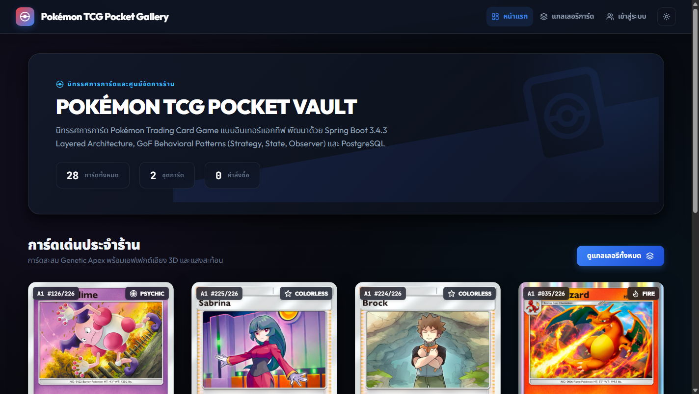
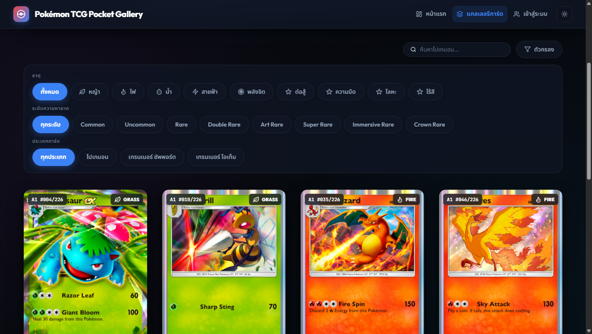
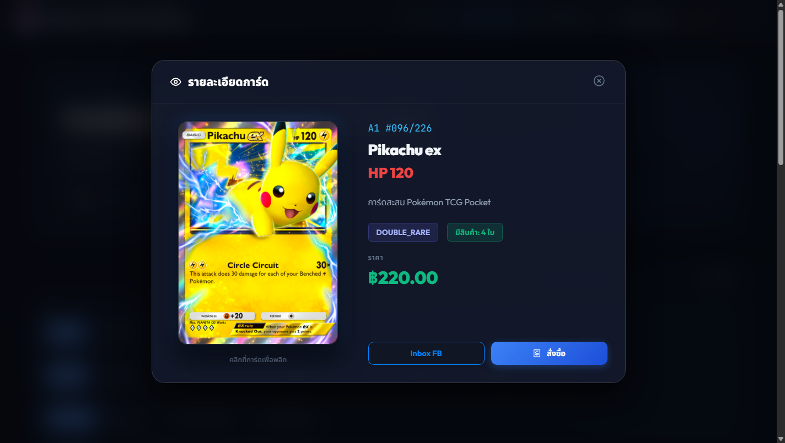
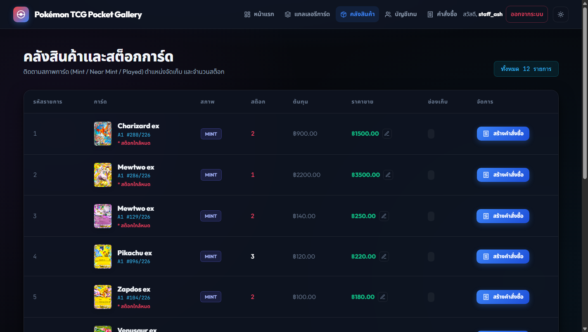
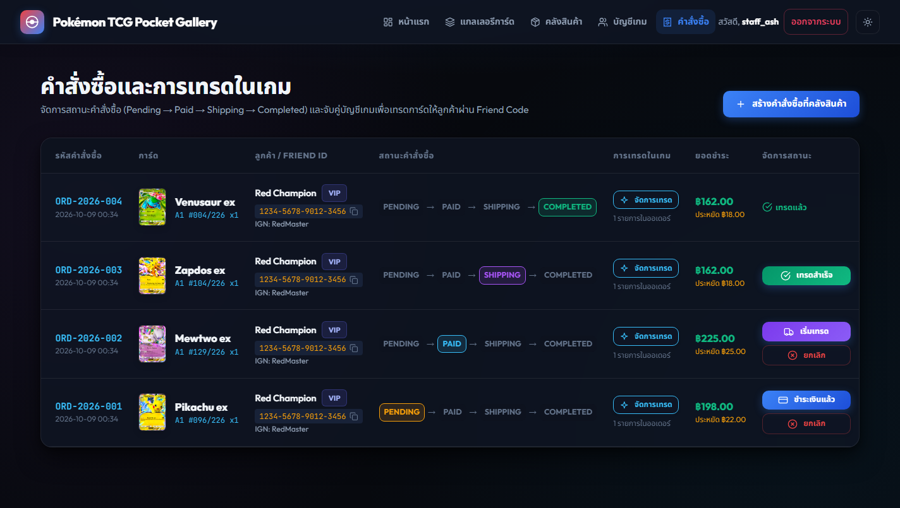
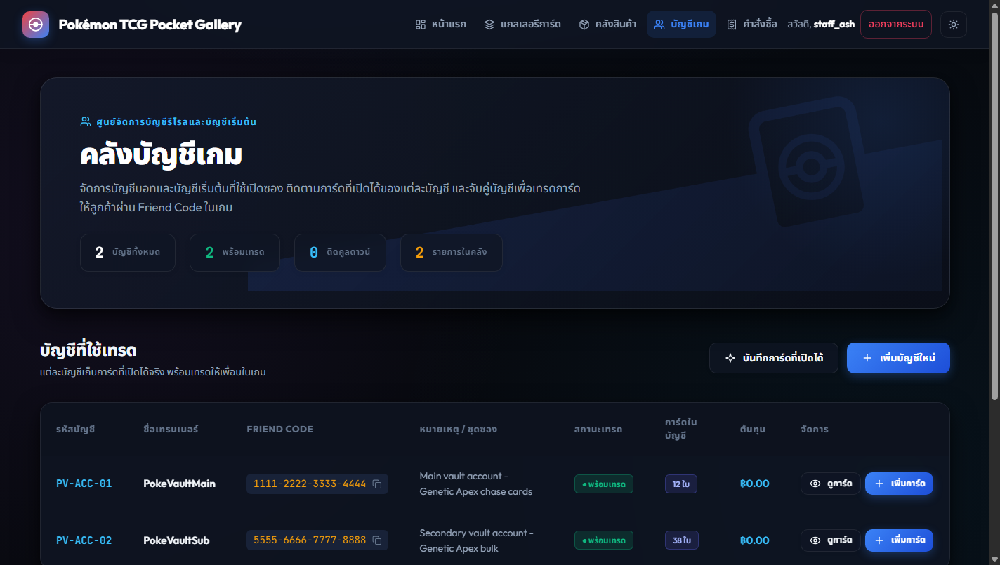

# PokéVault Commerce

ระบบร้านขายการ์ด **Pokémon TCG Pocket** แบบ Chat Commerce: ลูกค้าเลือกการ์ดจากแกลเลอรีบนเว็บ สั่งจอง แล้วร้านส่งการ์ดให้ผ่านการเทรดในเกมด้วย Friend ID

พัฒนาด้วย Spring Boot 3.4.3 (Java 17) แบบ Layered Architecture และใช้ GoF Behavioral Patterns 3 แบบ คือ Strategy, State และ Observer

## สารบัญ

- [สมาชิกในทีม](#สมาชิกในทีม)
- [ความสามารถของระบบ](#ความสามารถของระบบ)
- [ภาพหน้าจอ](#ภาพหน้าจอ)
- [ขั้นตอนการสั่งซื้อ](#ขั้นตอนการสั่งซื้อ)
- [เทคโนโลยีที่ใช้](#เทคโนโลยีที่ใช้)
- [สถาปัตยกรรม](#สถาปัตยกรรม)
- [วิธีรันโปรเจกต์](#วิธีรันโปรเจกต์)
- [บัญชีสำหรับทดสอบ](#บัญชีสำหรับทดสอบ)
- [หน้าเว็บและสิทธิ์การเข้าถึง](#หน้าเว็บและสิทธิ์การเข้าถึง)
- [REST API](#rest-api)
- [Design Patterns](#design-patterns)
- [โครงสร้างโปรเจกต์](#โครงสร้างโปรเจกต์)
- [การทดสอบและ CI/CD](#การทดสอบและ-cicd)
- [เอกสารออกแบบ](#เอกสารออกแบบ)
- [การทำงานร่วมกันด้วย Git](#การทำงานร่วมกันด้วย-git)
- [ข้อจำกัดที่ทราบ](#ข้อจำกัดที่ทราบ)
- [Deployment](#deployment)

## สมาชิกในทีม

| # | ชื่อ | รหัสนักศึกษา | ส่วนที่รับผิดชอบ |
|---|---|---|---|
| 1 | ศิฆรินทร์ อุปจันทร์ | 673380292-5 | Core Entity, Card Catalog, `schema.sql` / `data.sql`, Spring Security |
| 2 | สัพพัญญู คำตุ้ม | 673380066-4 | Game Account Vault, `CardInventory`, Observer Pattern |
| 3 | ธนภูมิ จันทรา | 673380272-1 | Order Engine, Strategy Pattern (ส่วนลดสมาชิก) |
| 4 | แทนคุณ พันธ์นิกุล | 673380301-0 | State Pattern, Trade Matching, Global Exception Handler |
| 5 | สรวิชญ์ ศาสนสุพินธุ์ | 673380294-1 | Frontend, Chat Commerce Handshake, Swagger, Docker, CI/CD, README, Deploy |

## ความสามารถของระบบ

**ลูกค้า**
- ดูแกลเลอรีการ์ดพร้อมเอฟเฟกต์โฮโลแกรม 3D กรองตามธาตุ ระดับความหายาก และประเภทการ์ด
- ดูรายละเอียดการ์ด ราคา และจำนวนที่มีในสต็อก
- สมัครสมาชิก เข้าสู่ระบบ และสั่งซื้อการ์ดด้วย Friend ID ในเกม
- ติดตามสถานะคำสั่งซื้อของตัวเอง และติดต่อร้านผ่าน Facebook Messenger

**พนักงานร้าน (STAFF / ADMIN)**
- ดูคลังสินค้า แก้ไขราคาขาย และเห็นการ์ดที่สต็อกใกล้หมด
- จองการ์ดแทนลูกค้า รวมถึงลูกค้าที่สั่งผ่าน Facebook โดยไม่ได้สมัครสมาชิก (บัญชี Facebook Guest)
- จัดการบัญชีเกมของร้าน และบันทึกการ์ดที่เปิดซองได้เข้าแต่ละบัญชี
- เลื่อนสถานะคำสั่งซื้อ (Pending → Paid → Shipping → Completed หรือ Cancelled)
- จับคู่บัญชีเกมที่ใช้เทรดการ์ดให้ลูกค้า ทั้งแบบเลือกเองและแบบอัตโนมัติ
- กำหนดระดับสมาชิกของลูกค้า (REGULAR / VIP / WHOLESALE)

## ภาพหน้าจอ

| หน้าแรก | แกลเลอรีการ์ดและตัวกรอง |
|---|---|
|  |  |

| รายละเอียดการ์ด (ลูกค้า) | คลังสินค้า (พนักงาน) |
|---|---|
|  |  |

| คำสั่งซื้อและสถานะ (พนักงาน) | บัญชีเกมและระดับสมาชิก (พนักงาน) |
|---|---|
|  |  |

## ขั้นตอนการสั่งซื้อ

1. ลูกค้าเลือกการ์ดในแกลเลอรี กด **สั่งซื้อ** แล้วกรอก Friend ID ในเกม (หรือพนักงานจองแทนที่หน้าคลังสินค้า)
2. ระบบคิดส่วนลดตามระดับสมาชิก (Strategy) หักสต็อก และสร้างคำสั่งซื้อสถานะ `PENDING` ถ้าสต็อกเหลือ 2 ใบหรือน้อยกว่า Observer จะแจ้งเตือนใน log
3. ลูกค้าโอนเงินและแจ้งร้าน พนักงานกด **ชำระเงินแล้ว** → `PAID`
4. พนักงานเปิด **จัดการเทรด** เพื่อเลือกบัญชีเกมที่ถือการ์ดใบนั้น (เลือกเองหรือจับคู่อัตโนมัติ) แล้วกด **เริ่มเทรด** → `SHIPPING`
5. ร้านเพิ่มเพื่อนและส่งการ์ดให้ลูกค้าในเกม แล้วกด **เทรดสำเร็จ** → `COMPLETED`

ยกเลิกได้ขณะเป็น `PENDING` หรือ `PAID` ระบบจะคืนการ์ดเข้าสต็อก การเปลี่ยนสถานะที่ไม่อยู่ในลำดับนี้ถูก State Pattern ปฏิเสธ

## เทคโนโลยีที่ใช้

| ส่วน | เทคโนโลยี |
|---|---|
| Backend | Java 17, Spring Boot 3.4.3 (Web, Data JPA, Validation, Security, Actuator) |
| Frontend | Thymeleaf, HTML / CSS / JavaScript (ไม่ใช้ framework) |
| ฐานข้อมูล | H2 แบบ in-memory (profile `local`), PostgreSQL 16 (profile `prod`) |
| เอกสาร API | springdoc-openapi (Swagger UI) |
| Build / Test | Maven Wrapper, JUnit 5, Mockito |
| Container / CI | Docker (multi-stage), Docker Compose, GitHub Actions |

## สถาปัตยกรรม

Layered Architecture แยกตาม module ของแต่ละโดเมน:

```
Browser (Thymeleaf + JavaScript)
        │  หน้าเว็บ: WebViewController        REST: /api/v1/**
        ▼
Controller  ──►  Service (interface + impl)  ──►  Repository (Spring Data JPA)  ──►  H2 / PostgreSQL
                      │
                      ├─ Strategy  : DiscountStrategy     (module order)
                      ├─ State     : OrderState           (module trade)
                      └─ Observer  : LowStockObserver     (module vault)
```

- **Controller** รับ request ตรวจข้อมูลด้วย Bean Validation และตอบกลับเป็น `ApiResponse`
- **Service** เก็บ business logic ทั้งหมด และเป็นจุดที่เรียกใช้ pattern ทั้งสาม
- **Repository / Entity** อยู่ชั้นล่างสุด ใช้ร่วมกันทุก module
- ข้อผิดพลาดถูกแปลงเป็น response รูปแบบเดียวกันโดย `GlobalExceptionHandler`
- Spring Security ใช้ form login + BCrypt และกำหนดสิทธิ์หน้าเว็บตามบทบาท

แผนภาพฉบับเต็มอยู่ใน [เอกสารออกแบบ](#เอกสารออกแบบ)

## วิธีรันโปรเจกต์

### แบบที่ 1: รันในเครื่องด้วย H2 (ไม่ต้องติดตั้งฐานข้อมูล)

ต้องมี JDK 17

```bash
git clone https://github.com/Bigzzz0/Pok-Vault_Commerce.git
cd Pok-Vault_Commerce
./mvnw spring-boot:run
```

บน Windows ใช้ `mvnw.cmd spring-boot:run`

เปิด <http://localhost:8080> ระบบใช้ profile `local` เป็นค่าเริ่มต้น ข้อมูลตัวอย่างจาก `data.sql` ถูกโหลดใหม่ทุกครั้งที่เปิดแอป และหายเมื่อปิดแอป

### แบบที่ 2: รันด้วย Docker Compose (PostgreSQL)

ต้องมี Docker Desktop

```bash
docker compose up --build
```

เปิด <http://localhost:8080> ข้อมูลเก็บใน volume `pgdata` จึงอยู่ต่อแม้ปิด container

- กำหนดรหัสผ่านฐานข้อมูลเองได้ด้วยตัวแปร `DB_PASSWORD` (ถ้าไม่กำหนดจะใช้ค่าสำหรับพัฒนาในเครื่อง)
- ล้างข้อมูลแล้วเริ่มใหม่: `docker compose down -v`

### ลิงก์ที่ใช้บ่อย

| ลิงก์ | ใช้ทำอะไร |
|---|---|
| <http://localhost:8080> | หน้าเว็บ |
| <http://localhost:8080/swagger-ui.html> | Swagger UI |
| <http://localhost:8080/v3/api-docs> | OpenAPI JSON |
| <http://localhost:8080/actuator/health> | Health check |
| <http://localhost:8080/h2-console> | H2 Console (เฉพาะ profile `local`, JDBC URL `jdbc:h2:mem:tcgdb`, user `sa`, ไม่มีรหัสผ่าน) |

### ตัวแปรสภาพแวดล้อมของ profile `prod`

| ตัวแปร | ความหมาย |
|---|---|
| `SPRING_PROFILES_ACTIVE` | ตั้งเป็น `prod` เพื่อใช้ PostgreSQL |
| `SPRING_DATASOURCE_URL` | JDBC URL ของ PostgreSQL |
| `SPRING_DATASOURCE_USERNAME` | ชื่อผู้ใช้ฐานข้อมูล |
| `SPRING_DATASOURCE_PASSWORD` | รหัสผ่านฐานข้อมูล (บังคับ ไม่มีค่าเริ่มต้น) |
| `PORT` | พอร์ตของแอป (ค่าเริ่มต้น 8080) |

## บัญชีสำหรับทดสอบ

ทุกบัญชีใช้รหัสผ่าน `password123`

| ชื่อผู้ใช้ | บทบาท | หมายเหตุ |
|---|---|---|
| `admin` | ADMIN | เห็นทุกหน้า รวมถึงลิงก์ Swagger |
| `staff_ash` | STAFF | จัดการคลังสินค้า บัญชีเกม และคำสั่งซื้อ |
| `customer_red` | CUSTOMER | สมาชิกระดับ VIP |

ลูกค้าใหม่สมัครสมาชิกเองได้ที่หน้า `/login`

## หน้าเว็บและสิทธิ์การเข้าถึง

| หน้า | เนื้อหา | ใครเข้าได้ |
|---|---|---|
| `/` | หน้าแรกและการ์ดเด่น | ทุกคน |
| `/cards` | แกลเลอรีการ์ด ตัวกรอง รายละเอียดการ์ด และการสั่งซื้อ | ทุกคน (สั่งซื้อต้องเข้าสู่ระบบ) |
| `/login` | เข้าสู่ระบบและสมัครสมาชิก | ทุกคน |
| `/my-orders` | คำสั่งซื้อของตัวเอง | ผู้ที่เข้าสู่ระบบแล้ว |
| `/inventory` | คลังสินค้า แก้ราคา และจองแทนลูกค้า | ADMIN, STAFF |
| `/accounts` | บัญชีเกมของร้าน และระดับสมาชิกของลูกค้า | ADMIN, STAFF |
| `/orders` | คำสั่งซื้อทั้งหมด การเลื่อนสถานะ และ Trade Manager | ADMIN, STAFF |

## REST API

รายละเอียดเต็มและการทดลองเรียกอยู่ใน Swagger UI ทุก endpoint ขึ้นต้นด้วย `/api/v1`

| กลุ่ม | Endpoint | ผู้รับผิดชอบ |
|---|---|---|
| Card Catalog | `GET /cards`, `GET /cards/paged`, `GET /cards/{id}`, `GET /cards/search`, `POST /cards`, `PUT /cards/{id}`, `DELETE /cards/{id}` | คนที่ 1 |
| Card Catalog | `GET /cards/expansions`, `GET /cards/expansions/{code}`, `GET /cards/expansions/{code}/cards` | คนที่ 1 |
| Game Account Vault | `POST /accounts`, `GET /accounts`, `GET /accounts/{id}`, `POST /accounts/{id}/pulls`, `GET /accounts/{id}/cards`, `PATCH /accounts/{id}/trade-status` | คนที่ 2 |
| Order | `POST /orders`, `GET /orders`, `GET /orders/{id}`, `PATCH /orders/{id}/status?action=`, `PATCH /orders/{orderId}/items/{orderItemId}/trade-status?status=` | คนที่ 3, 4 |
| Trade Matching | `GET /trades/orders/{orderId}/recommendations`, `GET /trades/items/{orderItemId}/recommendation`, `POST /trades/orders/{orderId}/auto-match`, `POST /trades/items/{orderItemId}/auto-match`, `POST /trades/items/{orderItemId}/assign?accountId=` | คนที่ 4 |
| Auth | `POST /auth/register` | คนที่ 5 |
| Store Admin | `PATCH /admin/inventories/{inventoryId}/price?price=`, `PATCH /admin/customers/{userId}/membership-tier?tier=` | คนที่ 5 |

ค่า `action` ของ `PATCH /orders/{id}/status` คือ `pay`, `ship`, `complete` หรือ `cancel`
ค่า `status` ของ `PATCH /orders/{orderId}/items/{orderItemId}/trade-status` คือ `TRADE_SENT` หรือ `COMPLETED` (เฉพาะ ADMIN และ STAFF, ซิงค์สถานะออเดอร์เป็น COMPLETED อัตโนมัติเมื่อเทรดครบ)

ทุก response ใช้รูปแบบเดียวกัน:

```json
{ "success": true, "message": "...", "data": { } }
```

## Design Patterns

| Pattern | ใช้ทำอะไร | คลาสหลัก |
|---|---|---|
| **Strategy** | คิดส่วนลดตามระดับสมาชิก: REGULAR 0%, VIP 10%, WHOLESALE 15% | `DiscountStrategy`, `RegularDiscountStrategy`, `VipDiscountStrategy`, `WholesaleDiscountStrategy` |
| **State** | ควบคุมการเปลี่ยนสถานะคำสั่งซื้อ และคืนสต็อกเมื่อยกเลิก | `OrderState`, `PendingOrderState`, `PaidOrderState`, `ShippingOrderState`, `CompletedOrderState`, `CancelledOrderState` |
| **Observer** | แจ้งเตือนเมื่อสต็อกการ์ดเหลือ 2 ใบหรือน้อยกว่า | `LowStockObserver` |

รายละเอียดอยู่ใน [doc/design-patterns.md](doc/design-patterns.md) และการวิเคราะห์ SOLID อยู่ใน [doc/solid-analysis.md](doc/solid-analysis.md)

## โครงสร้างโปรเจกต์

```
src/main/java/com/pokevault/
├── common/          config, exception, response (ApiResponse), security
├── domain/          entity และ enum
├── repository/      Spring Data JPA repository
└── modules/
    ├── catalog/     Card Catalog (คนที่ 1)
    ├── vault/       Game Account Vault + Observer (คนที่ 2)
    ├── order/       Order Engine + Strategy (คนที่ 3)
    ├── trade/       State Pattern, Trade Matching, Exception Handler (คนที่ 4)
    └── web/         หน้าเว็บ, สมัครสมาชิก, งานหลังบ้านของร้าน (คนที่ 5)

src/main/resources/
├── application.yml  profile local (H2) และ prod (PostgreSQL)
├── schema.sql, data.sql
├── templates/       Thymeleaf
└── static/          css, js, รูปการ์ด
```

แต่ละ module แบ่งชั้นเป็น `controller` → `service` → `repository` และรับส่งข้อมูลผ่าน `dto`

## การทดสอบและ CI/CD

รันเทสต์และ build ในเครื่อง:

```bash
./mvnw clean verify
```

GitHub Actions ([.github/workflows/ci-cd.yml](.github/workflows/ci-cd.yml)) ทำงานเมื่อ push หรือเปิด Pull Request เข้า `develop` และ `main`:

1. **Build & Test**: รัน `./mvnw clean verify` กับ PostgreSQL 16 จริง และอัปโหลดรายงานผลเทสต์
2. **Build & Push Docker Image**: สร้าง image แล้ว push ขึ้น GitHub Container Registry (`ghcr.io`) เฉพาะตอน push ไม่รันตอนเปิด PR

## เอกสารออกแบบ

| เอกสาร | ไฟล์ |
|---|---|
| Use Case Diagram | [doc/diagrams/use-case-diagram.md](doc/diagrams/use-case-diagram.md) |
| Domain Model | [doc/diagrams/domain-model.md](doc/diagrams/domain-model.md) |
| Class Diagram | [doc/diagrams/class-diagram.md](doc/diagrams/class-diagram.md) |
| ER Diagram | [doc/diagrams/er-diagram.md](doc/diagrams/er-diagram.md) |
| Sequence Diagrams | [doc/diagrams/sequence-diagrams.md](doc/diagrams/sequence-diagrams.md) |
| State Diagram | [doc/diagrams/state-diagram.md](doc/diagrams/state-diagram.md) |
| Activity Diagram | [doc/diagrams/activity-diagram.md](doc/diagrams/activity-diagram.md) |
| Component & Deployment Diagram | [doc/diagrams/component-deployment-diagram.md](doc/diagrams/component-deployment-diagram.md) |
| Design Patterns | [doc/design-patterns.md](doc/design-patterns.md) |
| SOLID Analysis | [doc/solid-analysis.md](doc/solid-analysis.md) |
| โครงร่างสไลด์นำเสนอ | [doc/slide/presentation-outline.md](doc/slide/presentation-outline.md) |

## การทำงานร่วมกันด้วย Git

- สมาชิกแต่ละคนทำงานใน branch ของตัวเอง ตั้งชื่อแบบ `<ชื่อ>_<รหัสนักศึกษา>_<ลำดับ>` เช่น `soravit_6733802941_02`
- ส่งงานด้วย Pull Request เข้า `develop` ต้องผ่าน CI และมีเพื่อน review ก่อน merge
- `main` เป็น branch สำหรับส่งงาน รับงานจาก `develop`
- commit ใช้รูปแบบ Conventional Commits (`feat:`, `fix:`, `docs:`, `test:`)

## ข้อจำกัดที่ทราบ

- `/api/**` เปิดให้เรียกได้โดยไม่ต้องเข้าสู่ระบบ (ยกเว้น `/api/v1/admin/**` ที่ตรวจบทบาทเอง) เหมาะกับการสาธิตและทดสอบผ่าน Swagger ไม่เหมาะกับการใช้งานจริง
- ปุ่ม Inbox FB เปิดแชท Facebook ของร้านในแท็บใหม่และคัดลอกข้อความให้ ผู้ใช้ต้องวางข้อความเอง
- การ์ดในฐานข้อมูลมี 28 ใบ แต่มีรูปและสต็อก 12 ใบ แกลเลอรีแสดงเฉพาะการ์ดที่มีสต็อก
- ข้อความ error บางส่วนจาก API ยังเป็นภาษาอังกฤษ
- ฐานข้อมูล Docker ที่สร้างจากเวอร์ชันเก่าต้องล้างด้วย `docker compose down -v` ก่อน ข้อมูลตัวอย่างชุดใหม่จึงจะเข้าครบ

## Deployment

ยังไม่ได้ deploy ขึ้น Cloud หัวข้อนี้จะเพิ่มขั้นตอน deploy และ Production URL เมื่อ deploy แล้ว
