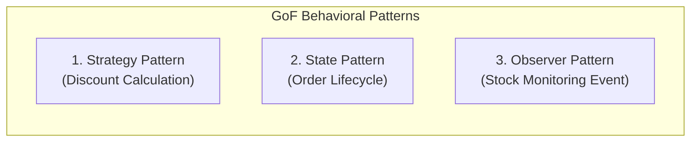

# Gang of Four (GoF) Design Patterns Implementation
## โครงการ: Pokémon TCG Pocket Vault & Chat Commerce Trade Platform
**หลักสูตร**: CP353002 Principles of Software Design and Development (Spring Boot)

---

## สรุปภาพรวมแบบจำลองการออกแบบ (Design Patterns Summary)

ระบบประยุกต์ใช้ GoF Design Patterns 3 รูปแบบหลักในกลุ่ม Behavioral Patterns เพื่อสนับสนุนความยืดหยุ่นและการทดสอบ:

---

## 1. Strategy Pattern: ระบบคำนวณส่วนลดตามระดับสมาชิก (Discount Calculation)

### วัตถุประสงค์ (Intent)
กำหนดกลุ่มของขั้นตอนวิธี (Family of Algorithms) ในการคำนวณส่วนลด แยกแต่ละวิธีออกเป็นคลาสอิสระ และสามารถสลับเปลี่ยนวิธีการคำนวณในขณะรันไทม์ได้

### โครงสร้างคลาส (Class Structure)
- **Strategy Interface**: `com.pokevault.modules.order.strategy.DiscountStrategy`
- **Concrete Strategies**:
  - `RegularDiscountStrategy`: ส่วนลด 0% สำหรับลูกค้าระดับทั่วไป
  - `VipDiscountStrategy`: ส่วนลด 10% สำหรับสมาชิกระดับ VIP
  - `WholesaleDiscountStrategy`: ส่วนลด 20% สำหรับพ่อค้าคนกลาง / ตัวแทนจำหน่าย
- **Context**: `com.pokevault.modules.order.service.DiscountService`

---

## 2. State Pattern: ระบบวงจรชีวิตคำสั่งซื้อ (Order Lifecycle State Machine)

### วัตถุประสงค์ (Intent)
อนุญาตให้วัตถุคำสั่งซื้อ (`Order`) สามารถเปลี่ยนพฤติกรรมเมื่อสถานะภายในเปลี่ยนไป โดยไม่ใช้เงื่อนไข `if-else` หรือ `switch-case` ขนาดยาวที่ดูแลยาก

### โครงสร้างคลาส (Class Structure)
- **State Interface**: `com.pokevault.modules.trade.state.OrderState`
- **Concrete States**:
  - `PendingOrderState`: รอการยืนยันยอด / สลิปโอนเงิน
  - `PaidOrderState`: ตรวจสอบสลิปผ่าน ชำระเงินเรียบร้อย
  - `ShippingOrderState`: อยู่ระหว่างการนัดหมายแลกเปลี่ยนการ์ดในเกม (In-game trade)
  - `CompletedOrderState`: การแลกเปลี่ยนเสร็จสมบูรณ์
  - `CancelledOrderState`: คำสั่งซื้อถูกยกเลิก หรือแลกเปลี่ยนล้มเหลว
- **Context**: `com.pokevault.modules.trade.state.OrderContext`

---

## 3. Observer Pattern: ระบบแจ้งเตือนสต็อกการ์ดใกล้หมด (Stock Alert via Spring Events)

### วัตถุประสงค์ (Intent)
สร้างความสัมพันธ์แบบหนึ่งต่อกลุ่ม (One-to-Many Dependency) เมื่อเกิดเหตุการณ์สั่งซื้อการ์ดสำเร็จ (`OrderPlacedEvent`) ระบบจะแจ้งเตือนผู้สังเกตการณ์ (`LowStockObserver`) เพื่อตรวจสอบจำนวนการ์ดคงเหลือในคลังทันทีโดยอัตโนมัติ

### โครงสร้างคลาส (Class Structure)
- **Subject / Publisher**: `org.springframework.context.ApplicationEventPublisher`
- **Event Object**: `com.pokevault.modules.order.event.OrderPlacedEvent`
- **Observer / Listener**: `com.pokevault.modules.vault.observer.LowStockObserver` (`@EventListener`)
