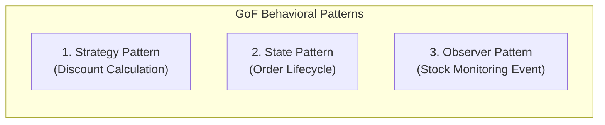
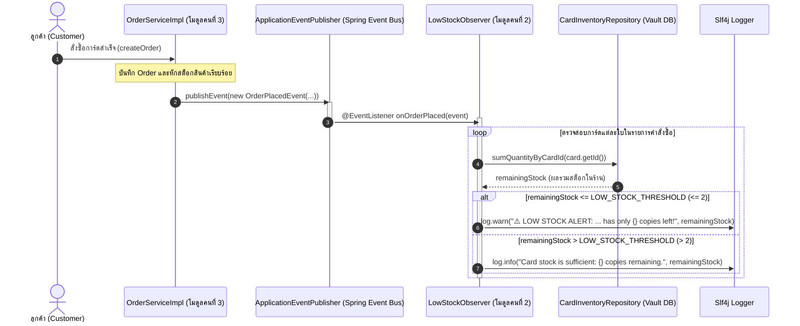

# Gang of Four (GoF) Design Patterns Implementation
## โครงการ: Pokémon TCG Pocket Vault & Chat Commerce Trade Platform
**หลักสูตร**: CP353002 Principles of Software Design and Development (Spring Boot)

---

## สรุปภาพรวมแบบจำลองการออกแบบ (Design Patterns Summary)

ระบบประยุกต์ใช้ GoF Design Patterns 3 รูปแบบหลักในกลุ่ม Behavioral Patterns เพื่อสนับสนุนความยืดหยุ่นและการทดสอบ:


```mermaid
graph LR
    subgraph BehavioralPatterns["GoF Behavioral Patterns"]
        Strategy["1. Strategy Pattern\n(Discount Calculation)"]
        State["2. State Pattern\n(Order Lifecycle)"]
        Observer["3. Observer Pattern\n(Stock Monitoring Event)"]
    end
```

---

## 1. Strategy Pattern: ระบบคำนวณส่วนลดตามระดับสมาชิก (Discount Calculation)

### วัตถุประสงค์ (Intent)
กำหนดกลุ่มของขั้นตอนวิธี (Family of Algorithms) ในการคำนวณส่วนลด แยกแต่ละวิธีออกเป็นคลาสอิสระ และสามารถสลับเปลี่ยนวิธีการคำนวณในขณะรันไทม์ได้

### โครงสร้างคลาส (Class Structure)
- **Strategy Interface**: `com.pokevault.modules.order.strategy.DiscountStrategy`
- **Concrete Strategies**:
  - `RegularDiscountStrategy`: ส่วนลด 0% สำหรับลูกค้าระดับทั่วไป
  - `VipDiscountStrategy`: ส่วนลด 10% สำหรับสมาชิกระดับ VIP
  - `WholesaleDiscountStrategy`: ส่วนลด 20% สำหรับพ่อค้าคนกลาง / ตัวแทนจำหน่าย
- **Context**: `com.pokevault.modules.order.service.DiscountService`

---

## 2. State Pattern: ระบบวงจรชีวิตคำสั่งซื้อ (Order Lifecycle State Machine)

### วัตถุประสงค์ (Intent)
อนุญาตให้วัตถุคำสั่งซื้อ (`Order`) สามารถเปลี่ยนพฤติกรรมเมื่อสถานะภายในเปลี่ยนไป โดยไม่ใช้เงื่อนไข `if-else` หรือ `switch-case` ขนาดยาวที่ดูแลยาก

### โครงสร้างคลาส (Class Structure)
- **State Interface**: `com.pokevault.modules.trade.state.OrderState`
- **Concrete States**:
  - `PendingOrderState`: รอการยืนยันยอด / สลิปโอนเงิน
  - `PaidOrderState`: ตรวจสอบสลิปผ่าน ชำระเงินเรียบร้อย
  - `ShippingOrderState`: อยู่ระหว่างการนัดหมายแลกเปลี่ยนการ์ดในเกม (In-game trade)
  - `CompletedOrderState`: การแลกเปลี่ยนเสร็จสมบูรณ์
  - `CancelledOrderState`: คำสั่งซื้อถูกยกเลิก หรือแลกเปลี่ยนล้มเหลว
- **Context**: `com.pokevault.modules.trade.state.OrderContext`

---

## 3. Observer Pattern: ระบบแจ้งเตือนสต็อกการ์ดใกล้หมด (Stock Alert via Spring Events)

**ผู้รับผิดชอบหลัก**: นายสัพพัญญู คำตุ้ม (673380066-4) — สมาชิกคนที่ 2: Game Account Vault & Inventory Manager  
**แพ็กเกจ**: `com.pokevault.modules.vault.observer`  
**สถานะการพัฒนา**: Implemented & Verified 100% (Unit Tests: 7/7 Passing)

---

### 3.1 วัตถุประสงค์ (Intent & Motivation)
สร้างความสัมพันธ์แบบหนึ่งต่อกลุ่ม (One-to-Many Dependency) ระหว่าง **Order Engine** (Subject/Publisher) และ **Inventory Vault Monitor** (Observer/Subscriber) โดยเมื่อเกิดเหตุการณ์สั่งซื้อการ์ดสำเร็จ (`OrderPlacedEvent`):
- ระบบจะกระจายสัญญาณแจ้งเตือนไปยังผู้สังเกตการณ์ (`LowStockObserver`) โดยอัตโนมัติ
- ผู้สังเกตการณ์จะทำการสแกนระดับสต็อกรวมของการ์ดทุกใบในออเดอร์จากทุกบัญชีร้านค้า
- หากสต็อกรวมลดต่ำลงจนถึงเกณฑ์วิกฤต ($\le 2$ ใบ) ระบบจะส่งสัญญาณเตือน (`log.warn`) ทันทีเพื่อป้องกันปัญหาสต็อกขาดมือ (Stockout Risk)
- **การตัดความผูกมัด (Decoupling)**: โมดูล Order (คนที่ 3) ไม่ต้องรู้จักคลาส `LowStockObserver` และไม่ต้องเขียนโค้ดตรวจสอบสต็อกคลังการ์ดเอง ทำให้ลดปัญหา Tight Coupling ได้อย่างสมบูรณ์

---

### 3.2 โครงสร้างและองค์ประกอบ (Participants & Responsibilities)

| บทบาทตาม GoF Pattern | คลาสในโปรเจกต์ | หน้าที่และความรับผิดชอบ |
| :--- | :--- | :--- |
| **Subject / Publisher** | `org.springframework.context.ApplicationEventPublisher` (เรียกใช้ใน `OrderServiceImpl`) | ทำหน้าที่เป็นตัวกลางกระจายสัญญาณ Event เมื่อคำสั่งซื้อถูกบันทึกสำเร็จ |
| **Event Object (Payload)** | `com.pokevault.modules.order.event.OrderPlacedEvent` | บรรจุข้อมูลคำสั่งซื้อ ได้แก่ `orderId`, `orderCode`, และรายการการ์ด `List<OrderItem>` |
| **Concrete Observer** | `com.pokevault.modules.vault.observer.LowStockObserver` | คลาสผู้สังเกตการณ์ ดักฟังสัญญาณด้วย `@EventListener` เพื่อสแกนและประเมินระดับสต็อก |
| **Data Provider (Helper)** | `com.pokevault.repository.CardInventoryRepository` | เมธอด `sumQuantityByCardId(cardId)` เพื่อรวมยอดสต็อกการ์ดจากทุกไอดีเกมของร้าน |

---

### 3.3 แผนผังการทำงาน (Sequence Diagram: Observer Notification Flow)


```mermaid
sequenceDiagram
    autonumber
    actor Customer as ลูกค้า (Customer)
    participant OrderSvc as OrderServiceImpl (โมดูลคนที่ 3)
    participant Publisher as ApplicationEventPublisher (Spring Event Bus)
    participant Observer as LowStockObserver (โมดูลคนที่ 2)
    participant InvRepo as CardInventoryRepository (Vault DB)
    participant Logger as Slf4j Logger

    Customer->>OrderSvc: สั่งซื้อการ์ดสำเร็จ (createOrder)
    Note over OrderSvc: บันทึก Order และหักสต็อกสินค้าเรียบร้อย
    OrderSvc->>Publisher: publishEvent(new OrderPlacedEvent(...))
    activate Publisher
    Publisher->>Observer: @EventListener onOrderPlaced(event)
    activate Observer
    deactivate Publisher

    loop ตรวจสอบการ์ดแต่ละใบในรายการคำสั่งซื้อ
        Observer->>InvRepo: sumQuantityByCardId(card.getId())
        InvRepo-->>Observer: remainingStock (ผลรวมสต็อกในร้าน)
        alt remainingStock <= LOW_STOCK_THRESHOLD (<= 2)
            Observer->>Logger: log.warn("⚠️ LOW STOCK ALERT: ... has only {} copies left!", remainingStock)
        else remainingStock > LOW_STOCK_THRESHOLD (> 2)
            Observer->>Logger: log.info("Card stock is sufficient: {} copies remaining.", remainingStock)
        end
    end
    deactivate Observer
```

---

### 3.4 รายละเอียดการนำไปใช้งาน (Implementation Details)

#### คลาส: `LowStockObserver.java`
```java
package com.pokevault.modules.vault.observer;

import com.pokevault.domain.entity.Card;
import com.pokevault.domain.entity.CardInventory;
import com.pokevault.domain.entity.OrderItem;
import com.pokevault.modules.order.event.OrderPlacedEvent;
import com.pokevault.repository.CardInventoryRepository;
import lombok.RequiredArgsConstructor;
import lombok.extern.slf4j.Slf4j;
import org.springframework.context.event.EventListener;
import org.springframework.stereotype.Component;

@Slf4j
@Component
@RequiredArgsConstructor
public class LowStockObserver {

    public static final int LOW_STOCK_THRESHOLD = 2;

    private final CardInventoryRepository cardInventoryRepository;

    @EventListener
    public void onOrderPlaced(OrderPlacedEvent event) {
        if (event == null || event.getItems() == null || event.getItems().isEmpty()) {
            return;
        }

        log.info("Received OrderPlacedEvent for order: code={}, checking inventory levels...",
                event.getOrderCode());

        for (OrderItem item : event.getItems()) {
            CardInventory inventory = item.getInventory();
            if (inventory != null && inventory.getCard() != null) {
                Card card = inventory.getCard();
                int remainingStock = cardInventoryRepository.sumQuantityByCardId(card.getId());

                if (remainingStock <= LOW_STOCK_THRESHOLD) {
                    log.warn("⚠️ LOW STOCK ALERT: Card '{}' ({}) has only {} copies left in vault (threshold: {})!",
                            card.getName(), card.getCardNumber(), remainingStock, LOW_STOCK_THRESHOLD);
                } else {
                    log.info("Card '{}' ({}) stock is sufficient: {} copies remaining in vault.",
                            card.getName(), card.getCardNumber(), remainingStock);
                }
            }
        }
    }
}
```

---

### 3.5 การวิเคราะห์หลักการออกแบบ (SOLID Principles Applied)

1. **Single Responsibility Principle (SRP)**:
   - `OrderServiceImpl` มีหน้าที่ดูแลการสร้างคำสั่งซื้อและการคำนวณราคาเท่านั้น
   - `LowStockObserver` มีหน้าที่เฉพาะในการมอนิเตอร์ระดับสต็อกคลังสินค้าและส่งสัญญาณเตือน
2. **Open-Closed Principle (OCP)**:
   - สถาปัตยกรรมเปิดรับการขยายผล (Extension) ได้อย่างสะดวก หากในอนาคตต้องการเพิ่มผู้สังเกตการณ์รายอื่น เช่น `LineNotifyObserver`, `DiscordWebhookObserver`, หรือ `AnalyticsObserver` สามารถสร้างคลาสใหม่ที่ดักฟัง `OrderPlacedEvent` ได้ทันที โดยไม่ต้องแก้ไขโค้ดของ `OrderServiceImpl` หรือ `LowStockObserver` แม้แต่บรรทัดเดียว
3. **Dependency Inversion Principle (DIP)**:
   - โมดูล Order ไม่ได้ขึ้นตรงกับคลาส Concrete ของโมดูล Vault แต่อาศัยตัวกลางคือ Event Abstraction (`OrderPlacedEvent`) และ Spring Application Context

---

### 3.6 การทดสอบและความถูกต้อง (Testing & Verification)
คลาส `LowStockObserverTest.java` ทำการทดสอบผ่าน Mockito ครอบคลุม 7 กรณี:
- กรณีสต็อกเหลือน้อยกว่าเกณฑ์ ($\le 2$)
- กรณีสต็อกเท่ากับเกณฑ์พอดี ($= 2$)
- กรณีสต็อกเพียงพอ ($> 2$)
- กรณีคำสั่งซื้อมีสินค้าหลายรายการ (Batch Items)
- กรณี Guard Conditions ป้องกันข้อมูลว่างเปล่า (null event, null items, incomplete order item)
*(ผลการทดสอบ: 7/7 ผ่าน 100%, รันเทสต์โปรเจกต์ผ่านครบ 47/47 ข้อ)*

