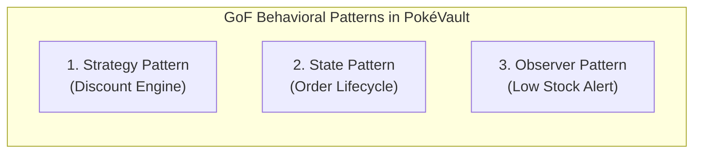
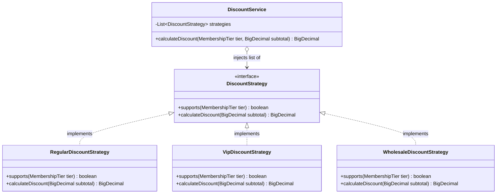
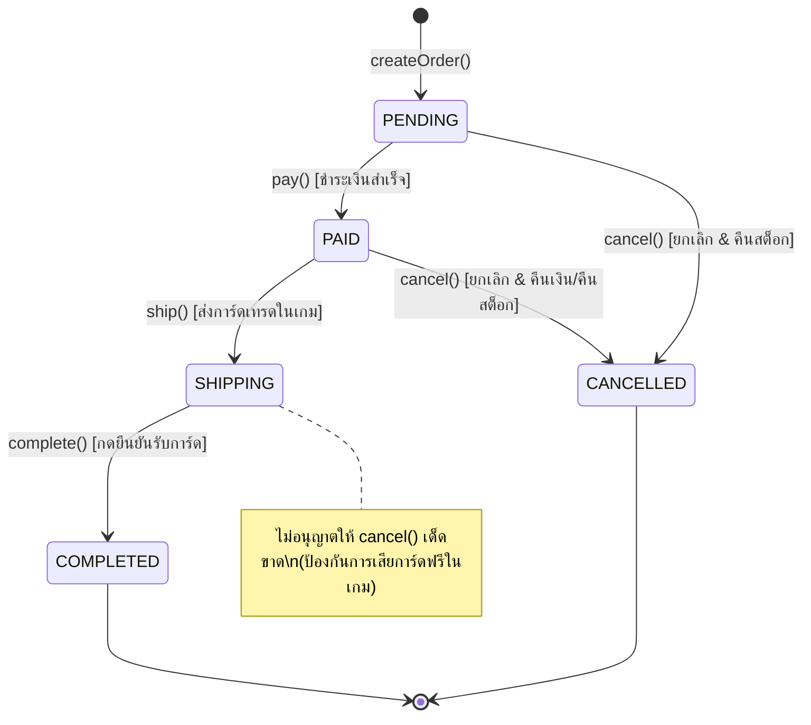
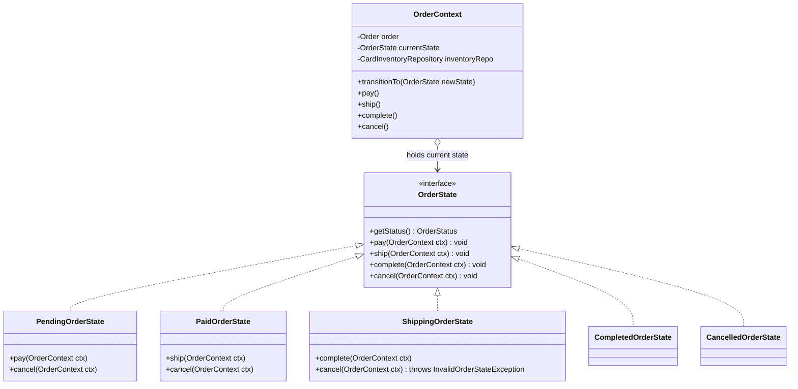
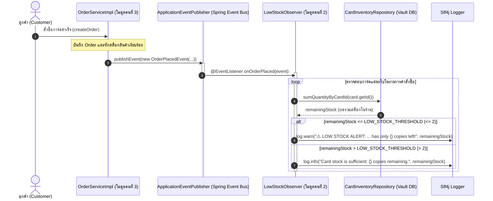

# Enterprise & GoF Design Patterns Implementation
## โครงการ: Pokémon TCG Pocket Vault & Chat Commerce Trade Platform
**หลักสูตร**: CP353002 Principles of Software Design and Development (Spring Boot)  
**กลุ่ม**: PokéVault Commerce  
**ผู้จัดทำ**: ทีมพัฒนาระบบ PokéVault Commerce (สมาชิกคนที่ 1–5)

---

## 1. ตารางสรุปแบบจำลองสถาปัตยกรรมระดับองค์กร (Enterprise / Architectural Patterns Matrix)
*ตามข้อกำหนดหัวข้อ 5.1 ของรายวิชา (บังคับทุกกลุ่ม)*

| แบบจำลอง (Pattern) | ปัญหาที่แก้ไข (Problem Solved) | ไฟล์และคลาสที่ใช้งานจริงในระบบ (Files & Classes) | พฤติกรรมและบทบาทในระบบ (Implementation Role) |
| :--- | :--- | :--- | :--- |
| **1. Layered Architecture** | ป้องกันไม่ให้โค้ดปะปนกัน (Spaghetti Code) และห้ามข้าม Layer เพื่อความง่ายต่อการบำรุงรักษา | • `com.pokevault.modules.*.controller`<br>• `com.pokevault.modules.*.service`<br>• `com.pokevault.repository.*`<br>• `com.pokevault.domain.entity.*` | แยกความรับผิดชอบออกเป็น 4 ชั้นชัดเจน: Presentation Layer $\rightarrow$ Service Layer $\rightarrow$ Repository Layer $\rightarrow$ Domain/Entity Layer โดยแต่ละชั้นเรียกใช้งานเฉพาะชั้นที่อยู่ถัดไปด้านล่างเท่านั้น |
| **2. Model-View-Controller (MVC)** | แยกส่วนแสดงผล UI ออกจากตรรกะประมวลผลและการจัดเตรียมข้อมูล | • [`WebViewController.java`](../src/main/java/com/pokevault/modules/web/controller/WebViewController.java)<br>• `templates/*.html` (Thymeleaf Views)<br>• `org.springframework.ui.Model` | `WebViewController` ทำหน้าที่ Controller รับ HTTP Request แล้วเรียก Service จัดเตรียมข้อมูลใส่ `Model` ก่อนส่งต่อไปเรนเดอร์ใน Thymeleaf HTML Templates |
| **3. Repository Pattern** | ซ่อนความซับซ้อนของ SQL Query และแยกการเข้าถึงฐานข้อมูลออกจาก Business Logic | • [`CardRepository.java`](../src/main/java/com/pokevault/repository/CardRepository.java)<br>• [`OrderRepository.java`](../src/main/repository/OrderRepository.java)<br>• [`GameAccountRepository.java`](../src/main/repository/GameAccountRepository.java)<br>• [`UserRepository.java`](../src/main/repository/UserRepository.java) | ใช้ Spring Data JPA สืบทอด `JpaRepository<T, ID>` ทำหน้าที่เป็นคลังข้อมูลจำลองในหน่วยความจำ พร้อม Custom JPQL Method โดย Service ไม่ต้องเขียนคำสั่ง JDBC ดิบ |
| **4. Service Layer Pattern** | เป็นศูนย์รวมกฎทางธุรกิจ (Business Rules) และการควบคุม Transaction | • [`CardServiceImpl.java`](../src/main/java/com/pokevault/modules/catalog/service/CardServiceImpl.java)<br>• [`OrderServiceImpl.java`](../src/main/java/com/pokevault/modules/order/service/OrderServiceImpl.java)<br>• [`TradeMatchingServiceImpl.java`](../src/main/java/com/pokevault/modules/trade/service/TradeMatchingServiceImpl.java)<br>• [`GameAccountServiceImpl.java`](../src/main/java/com/pokevault/modules/vault/service/GameAccountServiceImpl.java) | รวมขั้นตอนการตรวจสอบ Business Invariants (เช่น สต็อกห้ามติดลบ, การคิดส่วนลด, การจับคู่ไอดีเทรด) ไว้ใน Service ทำให้ Controller ทำหน้าที่รับ-ส่งข้อมูลเท่านั้น |
| **5. DTO Pattern + Mapper** | ป้องกันข้อมูลภายใน Entity รั่วไหล และลดการถ่ายโอนข้อมูลที่ไม่จำเป็น (Over-fetching) | • `PlaceOrderRequest`, `OrderResponse`<br>• `CardRequest`, `CardResponse`<br>• `GameAccountRequest`, `GameAccountResponse`<br>• `AccountCardResponse`, `ApiResponse<T>` | ใช้ Data Transfer Object (DTO) เป็นสัญญา API (Contract) แทน Entity โดยตรง พร้อมฟังก์ชันแปลงข้อมูล เช่น `fromEntity()` หรือ `ApiResponse.ok()` |
| **6. Dependency Injection (DI)** | ลดความผูกมัดแน่น (Loose Coupling) และช่วยให้เขียน Unit Test ด้วย Mock Object ได้ง่าย | • ทุกคลาส Controller และ Service ในระบบ<br>• [`SecurityConfig.java`](../src/main/java/com/pokevault/common/security/SecurityConfig.java)<br>• ใช้ `@RequiredArgsConstructor` (Lombok) | ใช้ **Constructor Injection** เท่านั้น (ห้ามใช้ `@Autowired` บน Private Field) โดยให้ Spring IoC Container เป็นผู้ส่ง Mock หรือ Concrete Beans เข้ามาทางคอนสตรัคเตอร์ |

---

## 2. ตารางสรุปแบบจำลอง GoF Behavioral Patterns (GoF Patterns Matrix)
*ตามข้อกำหนดหัวข้อ 5.2 ของรายวิชา (เลือกกลุ่ม Behavioral Patterns รวม 3 รูปแบบ)*


```mermaid
graph LR
    subgraph BehavioralPatterns["GoF Behavioral Patterns in PokéVault"]
        Strategy["1. Strategy Pattern\n(Discount Engine)"]
        State["2. State Pattern\n(Order Lifecycle)"]
        Observer["3. Observer Pattern\n(Low Stock Alert)"]
    end
```

| แบบจำลอง (Pattern) | ปัญหาที่แก้ไข (Problem Solved) | ไฟล์และคลาสที่ใช้งานจริงในระบบ (Files & Classes) | ผู้รับผิดชอบหลัก |
| :--- | :--- | :--- | :---: |
| **1. Strategy Pattern** | การคำนวณส่วนลดตามระดับสมาชิก (Tier) มีสูตรต่างกัน หากใช้ `if-else` หรือ `switch` จะทำให้โค้ดบวมและแก้ไขยากเมื่อมีโปรโมชันใหม่ | • [`DiscountStrategy.java`](../src/main/java/com/pokevault/modules/order/strategy/DiscountStrategy.java)<br>• [`RegularDiscountStrategy.java`](../src/main/java/com/pokevault/modules/order/strategy/RegularDiscountStrategy.java)<br>• [`VipDiscountStrategy.java`](../src/main/java/com/pokevault/modules/order/strategy/VipDiscountStrategy.java)<br>• [`WholesaleDiscountStrategy.java`](../src/main/java/com/pokevault/modules/order/strategy/WholesaleDiscountStrategy.java)<br>• [`DiscountService.java`](../src/main/java/com/pokevault/modules/order/service/DiscountService.java) | สมาชิกคนที่ 3<br>(ธนภูมิ จันทรา) |
| **2. State Pattern** | คำสั่งซื้อมีวงจรชีวิตซับซ้อน (PENDING $\rightarrow$ PAID $\rightarrow$ SHIPPING $\rightarrow$ COMPLETED / CANCELLED) หากใช้ Flag หรือตรวจสอบสถานะด้วย if-else จะเสี่ยงต่อการเปลี่ยนสถานะข้ามขั้นตอน หรือยกเลิกออเดอร์ผิดจังหวะ | • [`OrderState.java`](../src/main/java/com/pokevault/modules/trade/state/OrderState.java)<br>• [`PendingOrderState.java`](../src/main/java/com/pokevault/modules/trade/state/PendingOrderState.java)<br>• [`PaidOrderState.java`](../src/main/java/com/pokevault/modules/trade/state/PaidOrderState.java)<br>• [`ShippingOrderState.java`](../src/main/java/com/pokevault/modules/trade/state/ShippingOrderState.java)<br>• [`CompletedOrderState.java`](../src/main/java/com/pokevault/modules/trade/state/CompletedOrderState.java)<br>• [`CancelledOrderState.java`](../src/main/java/com/pokevault/modules/trade/state/CancelledOrderState.java)<br>• [`OrderContext.java`](../src/main/java/com/pokevault/modules/trade/state/OrderContext.java) | สมาชิกคนที่ 4<br>(แทนคุณ พันธ์นิกุล) |
| **3. Observer Pattern** | เมื่อลูกค้ากดสั่งซื้อการ์ดสำเร็จ ระบบคลังสินค้าต้องรู้ทันทีเพื่อตรวจสอบว่าการ์ดใบดังกล่าวสต็อกต่ำกว่าเกณฑ์ ($\le 2$) หรือไม่ โดยที่โมดูล Order ต้องไม่ผูกติดแน่น (Decoupled) กับโมดูล Inventory | • `ApplicationEventPublisher` (Spring Subject)<br>• [`OrderPlacedEvent.java`](../src/main/java/com/pokevault/modules/order/event/OrderPlacedEvent.java) (Event Data)<br>• [`LowStockObserver.java`](../src/main/java/com/pokevault/modules/vault/observer/LowStockObserver.java) (Concrete Observer) | สมาชิกคนที่ 2<br>(สัพพัญญู คำตุ้ม) |

---

## 3. รายละเอียดเชิงลึก GoF Pattern ที่ 1: Strategy Pattern

### 3.1 วัตถุประสงค์ (Intent)
กำหนดกลุ่มของขั้นตอนวิธี (Family of Algorithms) ในการคำนวณส่วนลด แยกแต่ละวิธีออกเป็นคลาสอิสระ และเปิดรับการขยายโดยไม่ต้องแก้ไขโค้ดเดิม (Open/Closed Principle)

### 3.2 แผนภาพคลาส (Class Diagram)

```mermaid
classDiagram
    direction TB
    class DiscountStrategy {
        <<interface>>
        +supports(MembershipTier tier) boolean
        +calculateDiscount(BigDecimal subtotal) BigDecimal
    }
    class RegularDiscountStrategy {
        +supports(MembershipTier tier) boolean
        +calculateDiscount(BigDecimal subtotal) BigDecimal
    }
    class VipDiscountStrategy {
        +supports(MembershipTier tier) boolean
        +calculateDiscount(BigDecimal subtotal) BigDecimal
    }
    class WholesaleDiscountStrategy {
        +supports(MembershipTier tier) boolean
        +calculateDiscount(BigDecimal subtotal) BigDecimal
    }
    class DiscountService {
        -List~DiscountStrategy~ strategies
        +calculateDiscount(MembershipTier tier, BigDecimal subtotal) BigDecimal
    }

    DiscountStrategy <|.. RegularDiscountStrategy : implements
    DiscountStrategy <|.. VipDiscountStrategy : implements
    DiscountStrategy <|.. WholesaleDiscountStrategy : implements
    DiscountService o--> DiscountStrategy : injects list of
```

### 3.3 ตรรกะการทำงาน (Logic & Benefits)
- `RegularDiscountStrategy`: ลด 0.00 บาท (สำหรับลูกค้าทั่วไป)
- `VipDiscountStrategy`: ลด 10% ของยอดรวม (สำหรับสมาชิกระดับ VIP)
- `WholesaleDiscountStrategy`: ลด 15% ของยอดรวม (สำหรับพ่อค้าคนกลาง)
- **Spring DI Advantage**: `DiscountService` รับ `List<DiscountStrategy>` ผ่าน Constructor Injection ทำให้หากในอนาคตต้องการเพิ่ม `FlashSaleDiscountStrategy` ก็เพียงสร้างคลาสใหม่ที่ implement `DiscountStrategy` โดยไม่ต้องแตะต้องโค้ด `DiscountService` แม้แต่บรรทัดเดียว

---

## 4. รายละเอียดเชิงลึก GoF Pattern ที่ 2: State Pattern

### 4.1 วัตถุประสงค์ (Intent)
อนุญาตให้วัตถุคำสั่งซื้อ (`Order`) เปลี่ยนพฤติกรรมตามสถานะภายในของตนเอง โดยห้ามไม่ให้เกิดการเปลี่ยนสถานะที่ผิดกฎทางธุรกิจ (เช่น ห้ามกดยกเลิกในขณะที่สถานะเป็น `SHIPPING` เพราะได้ส่งการ์ดเทรดในเกมไปแล้ว)

### 4.2 แผนภาพการเปลี่ยนสถานะ (State Transition Diagram)

```mermaid
stateDiagram-v2
    [*] --> PENDING : createOrder()
    
    PENDING --> PAID : pay() [ชำระเงินสำเร็จ]
    PENDING --> CANCELLED : cancel() [ยกเลิก & คืนสต็อก]
    
    PAID --> SHIPPING : ship() [ส่งการ์ดเทรดในเกม]
    PAID --> CANCELLED : cancel() [ยกเลิก & คืนเงิน/คืนสต็อก]
    
    SHIPPING --> COMPLETED : complete() [กดยืนยันรับการ์ด]
    note right of SHIPPING : ไม่อนุญาตให้ cancel() เด็ดขาด\n(ป้องกันการเสียการ์ดฟรีในเกม)
    
    COMPLETED --> [*]
    CANCELLED --> [*]
```

### 4.3 แผนภาพคลาส (Class Diagram)

```mermaid
classDiagram
    direction TB
    class OrderState {
        <<interface>>
        +getStatus() OrderStatus
        +pay(OrderContext ctx) void
        +ship(OrderContext ctx) void
        +complete(OrderContext ctx) void
        +cancel(OrderContext ctx) void
    }
    class PendingOrderState {
        +pay(OrderContext ctx)
        +cancel(OrderContext ctx)
    }
    class PaidOrderState {
        +ship(OrderContext ctx)
        +cancel(OrderContext ctx)
    }
    class ShippingOrderState {
        +complete(OrderContext ctx)
        +cancel(OrderContext ctx) throws InvalidOrderStateException
    }
    class CompletedOrderState {
    }
    class CancelledOrderState {
    }
    class OrderContext {
        -Order order
        -OrderState currentState
        -CardInventoryRepository inventoryRepo
        +transitionTo(OrderState newState)
        +pay()
        +ship()
        +complete()
        +cancel()
    }

    OrderState <|.. PendingOrderState
    OrderState <|.. PaidOrderState
    OrderState <|.. ShippingOrderState
    OrderState <|.. CompletedOrderState
    OrderState <|.. CancelledOrderState
    OrderContext o--> OrderState : holds current state
```

---

## 5. รายละเอียดเชิงลึก GoF Pattern ที่ 3: Observer Pattern

**ผู้รับผิดชอบหลัก**: นายสัพพัญญู คำตุ้ม (673380066-4) — สมาชิกคนที่ 2: Game Account Vault & Inventory Manager  
**แพ็กเกจ**: `com.pokevault.modules.vault.observer`  
**สถานะการพัฒนา**: Implemented & Verified 100% (Unit Tests: 7/7 Passing)

---

### 5.1 วัตถุประสงค์ (Intent & Motivation)
สร้างความสัมพันธ์แบบหนึ่งต่อกลุ่ม (One-to-Many Dependency) ระหว่าง **Order Engine** (Subject/Publisher) และ **Inventory Vault Monitor** (Observer/Subscriber) โดยเมื่อเกิดเหตุการณ์สั่งซื้อการ์ดสำเร็จ (`OrderPlacedEvent`):
- ระบบจะกระจายสัญญาณแจ้งเตือนไปยังผู้สังเกตการณ์ (`LowStockObserver`) โดยอัตโนมัติ
- ผู้สังเกตการณ์จะทำการสแกนระดับสต็อกรวมของการ์ดทุกใบในออเดอร์จากทุกบัญชีร้านค้า
- หากสต็อกรวมลดต่ำลงจนถึงเกณฑ์วิกฤต ($\le 2$ ใบ) ระบบจะส่งสัญญาณเตือน (`log.warn`) ทันทีเพื่อป้องกันปัญหาสต็อกขาดมือ (Stockout Risk)
- **การตัดความผูกมัด (Decoupling)**: โมดูล Order (คนที่ 3) ไม่ต้องรู้จักคลาส `LowStockObserver` และไม่ต้องเขียนโค้ดตรวจสอบสต็อกคลังการ์ดเอง ทำให้ลดปัญหา Tight Coupling ได้อย่างสมบูรณ์

---

### 5.2 โครงสร้างและองค์ประกอบ (Participants & Responsibilities)

| บทบาทตาม GoF Pattern | คลาสในโปรเจกต์ | หน้าที่และความรับผิดชอบ |
| :--- | :--- | :--- |
| **Subject / Publisher** | `org.springframework.context.ApplicationEventPublisher` (เรียกใช้ใน `OrderServiceImpl`) | ทำหน้าที่เป็นตัวกลางกระจายสัญญาณ Event เมื่อคำสั่งซื้อถูกบันทึกสำเร็จ |
| **Event Object (Payload)** | `com.pokevault.modules.order.event.OrderPlacedEvent` | บรรจุข้อมูลคำสั่งซื้อ ได้แก่ `orderId`, `orderCode`, และรายการการ์ด `List<OrderItem>` |
| **Concrete Observer** | `com.pokevault.modules.vault.observer.LowStockObserver` | คลาสผู้สังเกตการณ์ ดักฟังสัญญาณด้วย `@EventListener` เพื่อสแกนและประเมินระดับสต็อก |
| **Data Provider (Helper)** | `com.pokevault.repository.CardInventoryRepository` | เมธอด `sumQuantityByCardId(cardId)` เพื่อรวมยอดสต็อกการ์ดจากทุกไอดีเกมของร้าน |

---

### 5.3 แผนผังการทำงาน (Sequence Diagram: Observer Notification Flow)


```mermaid
sequenceDiagram
    autonumber
    actor Customer as ลูกค้า (Customer)
    participant OrderSvc as OrderServiceImpl (โมดูลคนที่ 3)
    participant Publisher as ApplicationEventPublisher (Spring Event Bus)
    participant Observer as LowStockObserver (โมดูลคนที่ 2)
    participant InvRepo as CardInventoryRepository (Vault DB)
    participant Logger as Slf4j Logger

    Customer->>OrderSvc: สั่งซื้อการ์ดสำเร็จ (createOrder)
    Note over OrderSvc: บันทึก Order และหักสต็อกสินค้าเรียบร้อย
    OrderSvc->>Publisher: publishEvent(new OrderPlacedEvent(...))
    activate Publisher
    Publisher->>Observer: @EventListener onOrderPlaced(event)
    activate Observer
    deactivate Publisher

    loop ตรวจสอบการ์ดแต่ละใบในรายการคำสั่งซื้อ
        Observer->>InvRepo: sumQuantityByCardId(card.getId())
        InvRepo-->>Observer: remainingStock (ผลรวมสต็อกในร้าน)
        alt remainingStock <= LOW_STOCK_THRESHOLD (<= 2)
            Observer->>Logger: log.warn("⚠️ LOW STOCK ALERT: ... has only {} copies left!", remainingStock)
        else remainingStock > LOW_STOCK_THRESHOLD (> 2)
            Observer->>Logger: log.info("Card stock is sufficient: {} copies remaining.", remainingStock)
        end
    end
    deactivate Observer
```

---

### 5.4 รายละเอียดการนำไปใช้งาน (Implementation Details)

#### คลาส: `LowStockObserver.java`
```java
package com.pokevault.modules.vault.observer;

import com.pokevault.domain.entity.Card;
import com.pokevault.domain.entity.CardInventory;
import com.pokevault.domain.entity.OrderItem;
import com.pokevault.modules.order.event.OrderPlacedEvent;
import com.pokevault.repository.CardInventoryRepository;
import lombok.RequiredArgsConstructor;
import lombok.extern.slf4j.Slf4j;
import org.springframework.context.event.EventListener;
import org.springframework.stereotype.Component;

@Slf4j
@Component
@RequiredArgsConstructor
public class LowStockObserver {

    public static final int LOW_STOCK_THRESHOLD = 2;

    private final CardInventoryRepository cardInventoryRepository;

    @EventListener
    public void onOrderPlaced(OrderPlacedEvent event) {
        if (event == null || event.getItems() == null || event.getItems().isEmpty()) {
            return;
        }

        log.info("Received OrderPlacedEvent for order: code={}, checking inventory levels...",
                event.getOrderCode());

        for (OrderItem item : event.getItems()) {
            CardInventory inventory = item.getInventory();
            if (inventory != null && inventory.getCard() != null) {
                Card card = inventory.getCard();
                int remainingStock = cardInventoryRepository.sumQuantityByCardId(card.getId());

                if (remainingStock <= LOW_STOCK_THRESHOLD) {
                    log.warn("⚠️ LOW STOCK ALERT: Card '{}' ({}) has only {} copies left in vault (threshold: {})!",
                            card.getName(), card.getCardNumber(), remainingStock, LOW_STOCK_THRESHOLD);
                } else {
                    log.info("Card '{}' ({}) stock is sufficient: {} copies remaining in vault.",
                            card.getName(), card.getCardNumber(), remainingStock);
                }
            }
        }
    }
}
```

---

### 5.5 การวิเคราะห์หลักการออกแบบ (SOLID Principles Applied)

1. **Single Responsibility Principle (SRP)**:
   - `OrderServiceImpl` มีหน้าที่ดูแลการสร้างคำสั่งซื้อและการคำนวณราคาเท่านั้น
   - `LowStockObserver` มีหน้าที่เฉพาะในการมอนิเตอร์ระดับสต็อกคลังสินค้าและส่งสัญญาณเตือน
2. **Open-Closed Principle (OCP)**:
   - สถาปัตยกรรมเปิดรับการขยายผล (Extension) ได้อย่างสะดวก หากในอนาคตต้องการเพิ่มผู้สังเกตการณ์รายอื่น เช่น `LineNotifyObserver`, `DiscordWebhookObserver`, หรือ `AnalyticsObserver` สามารถสร้างคลาสใหม่ที่ดักฟัง `OrderPlacedEvent` ได้ทันที โดยไม่ต้องแก้ไขโค้ดของ `OrderServiceImpl` หรือ `LowStockObserver` แม้แต่บรรทัดเดียว
3. **Dependency Inversion Principle (DIP)**:
   - โมดูล Order ไม่ได้ขึ้นตรงกับคลาส Concrete ของโมดูล Vault แต่อาศัยตัวกลางคือ Event Abstraction (`OrderPlacedEvent`) และ Spring Application Context

---

### 5.6 การทดสอบและความถูกต้อง (Testing & Verification)
คลาส `LowStockObserverTest.java` ทำการทดสอบผ่าน Mockito ครอบคลุม 7 กรณี:
- กรณีสต็อกเหลือน้อยกว่าเกณฑ์ ($\le 2$)
- กรณีสต็อกเท่ากับเกณฑ์พอดี ($= 2$)
- กรณีสต็อกเพียงพอ ($> 2$)
- กรณีคำสั่งซื้อมีสินค้าหลายรายการ (Batch Items)
- กรณี Guard Conditions ป้องกันข้อมูลว่างเปล่า (null event, null items, incomplete order item)
*(ผลการทดสอบ: 7/7 ผ่าน 100%, รันเทสต์โปรเจกต์ผ่านครบ 47/47 ข้อ)*

---

## 6. สรุปความสอดคล้องตามเกณฑ์การประเมิน (Checklist Compliance)
- [x] **Enterprise Patterns**: ครบ 6 รูปแบบ (Layered Architecture, MVC, Repository, Service Layer, DTO+Mapper, Dependency Injection)
- [x] **GoF Behavioral Patterns**: ครบ 3 รูปแบบ (Strategy, State, Observer)
- [x] **ตารางเปรียบเทียบ**: ระบุ Pattern, ปัญหาที่แก้, ไฟล์/คลาสที่ใช้ครบถ้วนตามเกณฑ์
- [x] **Class & Sequence Diagrams**: จัดทำด้วย Mermaid Diagrams ชัดเจนทุกหัวข้อ

