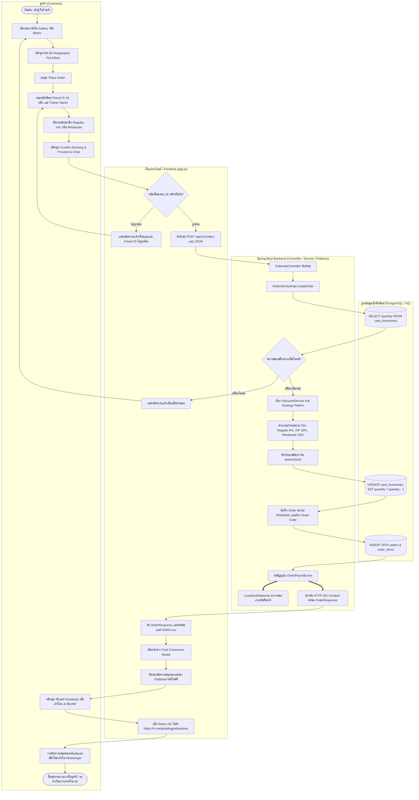

# Activity Diagrams (ขั้นตอนการทำงานเชิงกิจกรรมของระบบแบบ Swimlanes)
## โครงการ: Pokémon TCG Pocket Vault & Chat Commerce Trade Platform
**หลักสูตร**: CP353002 Principles of Software Design and Development (Spring Boot)  
**มาตรฐานแผนภาพ**: UML 2.5 Activity Diagram พร้อม Swimlanes, Decision Diamonds, Fork/Join Concurrency, และ Error Handlers

---

## 1. Activity Diagram 1: การสั่งจองการ์ดบนเว็บและส่งต่อสู่ Chat Commerce
### (Customer Card Booking & Chat Commerce Handshake Activity)

แสดงขั้นตอนแบบแบ่งเลนความรับผิดชอบ (Swimlanes) ตั้งแต่ลูกค้าเลือกการ์ด, ตรวจสอบสต็อก, คำนวณส่วนลดด้วย **Strategy Pattern**, หักสำรองสต็อก, ส่งอีเวนต์ตาม **Observer Pattern**, และเปิดหน้าต่างส่งต่อเข้า **Facebook Messenger**



---

## 2. Activity Diagram 2: การเปิดซองได้การ์ดและบันทึกเข้าไอดีเกม
### (Booster Pack Pull & Game Account Sourcing Activity)

แสดงขั้นตอนที่แอดมินร้านเปิดซองในเกมแล้วนำการ์ดหายากมาบันทึกผูกความเป็นเจ้าของไว้กับไอดีเกมในระบบ เพื่อเป็นคลังสต็อกรอส่งเทรดให้ลูกค้า

```mermaid
flowchart TD
    subgraph AdminLane[" แอดมินร้าน (Store Admin) "]
        P1([เริ่มต้น: เปิดซองการ์ดในเกมได้การ์ดแรร์]) --> P2[เปิดหน้าเว็บระบบ /accounts]
        P2 --> P3{เลือกกิจกรรมที่ต้องการทำ}
        P4[กดปุ่ม 'Register New Account']
        P5[กรอกรหัสไอดี, Trainer Name, Friend Code, ทุนซื้อไอดี]
        P6[กดปุ่ม '+ Add Pull' บนแถวไอดีที่เปิดได้การ์ด]
        P7[เลือกชื่อการ์ดจากแคตตาล็อก, สภาพ MINT, จำนวน, ทุน, ราคาขาย]
        P8[กดปุ่ม 'Record Pull & Add to Vault']
        P13([สิ้นสุด: การ์ดพร้อมสำหรับการจับคู่เทรดให้ลูกค้า])
    end

    subgraph FrontendLane[" ส่วนติดต่อผู้ใช้ (Frontend UI) "]
        F1[แสดงฟอร์มลงทะเบียนไอดีเกม]
        F2[ส่งคำขอ POST /api/v1/accounts]
        F3[แสดง Modal บันทึกผลการเปิดซอง]
        F4[ส่งคำขอ POST /api/v1/accounts/{id}/pulls]
        F5[อัปเดตตัวเลข Stock Cards ของไอดีนั้นบนตารางทันที]
        F6[แสดง Alert: บันทึกการ์ดเข้าไอดีเกมสำเร็จ]
    end

    subgraph ServiceLane[" เซอร์วิสและฐานข้อมูล (Service & DB) "]
        S1[GameAccountService.createAccount]
        S2[(INSERT INTO game_accounts สถานะ READY)]
        S3[GameAccountService.addPulledCard]
        S4[ค้นหา GameAccount และ Card จากฐานข้อมูล]
        S5[(INSERT INTO card_inventories ผูก game_account_id)]
    end

    %% Flow Connections
    P3 -- ลงทะเบียนไอดีใหม่ --> P4
    P4 --> F1
    F1 --> P5
    P5 --> F2
    F2 --> S1
    S1 --> S2
    S2 --> P2

    P3 -- บันทึกการ์ดเปิดซองได้ --> P6
    P6 --> F3
    F3 --> P7
    P7 --> P8
    P8 --> F4
    F4 --> S3
    S3 --> S4
    S4 --> S5
    S5 --> F5
    F5 --> F6
    F6 --> P13
```

---

## 3. Activity Diagram 3: การจับคู่ไอดีเกมอัตโนมัติและการส่งมอบการ์ดเทรดในเกม
### (In-Game Trade Auto-Matching & Multi-Step In-Game Fulfillment Activity)

แสดงกระบวนการที่แอดมินตรวจสลิปโอนเงินจากแชท Facebook แล้วใช้ระบบ **⚡ Auto-Match Best Account** เพื่อค้นหาไอดีเกมที่ถือการ์ดและมีความพร้อม ก่อนส่งคำขอเป็นเพื่อนและส่งการ์ดเทรดในเกมจนจบกระบวนการ

```mermaid
flowchart TD
    subgraph MessengerLane[" แชท Facebook Messenger & ลูกค้า "]
        M1([ลูกค้าส่งสลิปโอนเงินและรหัสออเดอร์ในแชท]) --> M2[ลูกค้ารอรับคำขอเป็นเพื่อนในเกม]
        M6[ลูกค้ายอมรับคำขอเป็นเพื่อนในเกม Pokémon Pocket]
        M8[ลูกค้ายอมรับการ์ดเทรดในเกม]
        M10([การซื้อขายสำเร็จสมบูรณ์ 100%])
    end

    subgraph AdminActionLane[" แอดมินร้านค้า (Store Admin) "]
        T1[เปิดหน้า /orders และค้นหารหัสออเดอร์]
        T2[ตรวจสอบสลิปโอนเงินตรงกับยอดสุทธิ]
        T3[คลิกปุ่ม 'Trade Manager' ที่ออเดอร์]
        T4[ตรวจสอบรายชื่อไอดีที่ถือการ์ด]
        T5[คลิกปุ่ม '⚡ Auto-Match Best Account']
        T6[คลิกปุ่ม 'Pay' ยืนยันการชำระเงิน]
        T7[หยิบโทรศัพท์เครื่องที่มีไอดีที่ระบบจับคู่ให้]
        T8[ส่งคำขอเป็นเพื่อนไปยัง Friend ID ของลูกค้าในเกม]
        T9[คลิกปุ่ม 'Start Trade' action=ship]
        T10[ส่งการ์ดเทรดในเกมให้ลูกค้า]
        T11[คลิกปุ่ม 'Complete Trade' action=complete]
    end

    subgraph SystemLane[" ระบบหลังบ้าน Spring Boot (Matching Engine & State Pattern) "]
        S10[TradeMatchingService ค้นหาไอดีเกมที่ถือการ์ดและสถานะ READY]
        S11{มีไอดีที่พร้อมเทรดหรือไม่?}
        S12[แจ้งเตือน: ไอดีติดคูลดาวน์ รอเวลาหรือเลือกไอดีสำรอง]
        S13[ระบบกำหนด assigned_account_id ให้ OrderItem]
        S14[OrderState.pay เปลี่ยนสถานะออเดอร์เป็น PAID]
        S15[OrderState.ship เปลี่ยนสถานะออเดอร์เป็น SHIPPING]
        S16[OrderState.complete เปลี่ยนสถานะออเดอร์เป็น COMPLETED]
        S17[บันทึกประวัติการเทรดของไอดีเกม tradesUsedToday + 1]
    end

    %% Connections
    M1 --> T1
    T1 --> T2
    T2 --> T3
    T3 --> S10
    S10 --> S11
    S11 -- ไม่มีไอดีพร้อม -- --> S12
    S12 --> T4
    S11 -- มีไอดีพร้อม -- --> T4
    T4 --> T5
    T5 --> S13
    S13 --> T6
    T6 --> S14
    S14 --> T7
    T7 --> T8
    T8 --> M2
    M2 --> M6
    M6 --> T9
    T9 --> S15
    S15 --> T10
    T10 --> M8
    M8 --> T11
    T11 --> S16
    S16 --> S17
    S17 --> M10
```

---

## 4. Activity Diagram 4: การยกเลิกคำสั่งซื้อและการคืนสต็อกการ์ดอัตโนมัติ
### (Order Cancellation & Inventory Stock Rollback Activity)

แสดงการจัดการข้อผิดพลาดเมื่อลูกค้าขอยกเลิกออเดอร์ หรือสลิปไม่ถูกต้อง ระบบจะสั่งคืนสต็อกการ์ดเข้าคลังอัตโนมัติผ่าน State Pattern

```mermaid
flowchart TD
    StartCancel([เริ่มต้น: ลูกค้าขอยกเลิกออเดอร์ในแชท หรือหมดเวลาโอน]) --> ClickCancel[แอดมินคลิกปุ่ม 'Cancel Order' บนหน้าเว็บ /orders]
    ClickCancel --> SendPatch[ส่งคำขอ PATCH /api/v1/orders/{id}/transition?action=cancel]
    SendPatch --> CheckCurrentState{ตรวจสอบสถานะปัจจุบันของออเดอร์}

    CheckCurrentState -- PENDING หรือ PAID --> ExecCancel[OrderState.cancel ดำเนินการยกเลิก]
    CheckCurrentState -- SHIPPING --> ThrowIllegalState[โยน InvalidOrderStateException: ไม่สามารถยกเลิกได้เพราะส่งการ์ดในเกมแล้ว]
    CheckCurrentState -- COMPLETED หรือ CANCELLED --> ThrowTerminal[โยน InvalidOrderStateException: ออเดอร์จบไปแล้ว]

    ExecCancel --> LoopItems[วนลูปรายการ OrderItem ในออเดอร์]
    LoopItems --> RestoreStock[เรียก inventory.restoreStock คืนจำนวนการ์ดเข้าคลัง]
    RestoreStock --> UpdateInventoryDB[(UPDATE card_inventories เพิ่มจำนวนสต็อกกลับ)]
    UpdateInventoryDB --> SetCancelState[กำหนดสถานะออเดอร์เป็น CANCELLED]
    SetCancelState --> UpdateOrderDB[(UPDATE orders SET order_status = 'CANCELLED')]
    UpdateOrderDB --> NotifySuccess[ส่งกลับ HTTP 200 OK และแจ้งเตือนยกเลิกสำเร็จ]
    NotifySuccess --> EndSuccess([สิ้นสุด: ออเดอร์ถูกยกเลิก และสต็อกการ์ดกลับคืนสู่คลัง])

    ThrowIllegalState --> NotifyError[ส่งกลับ HTTP 400 Bad Request และแจ้งเตือนข้อผิดพลาด]
    ThrowTerminal --> NotifyError
    NotifyError --> EndFail([สิ้นสุด: ปฏิเสธการยกเลิก ป้องกันการสูญเสียทรัพย์สินของร้าน])
```
