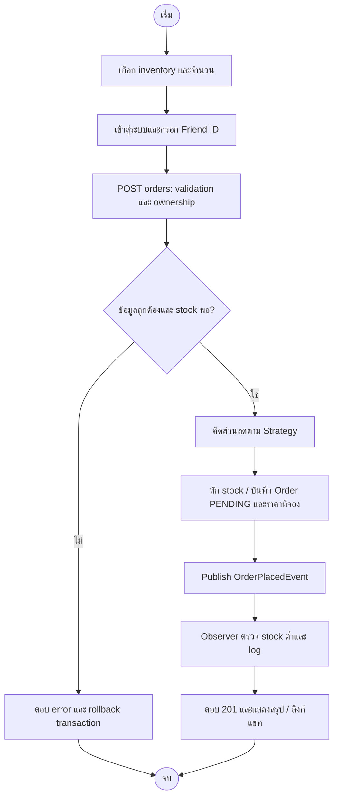
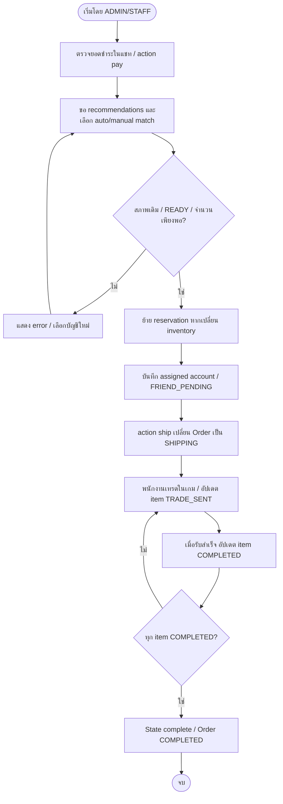
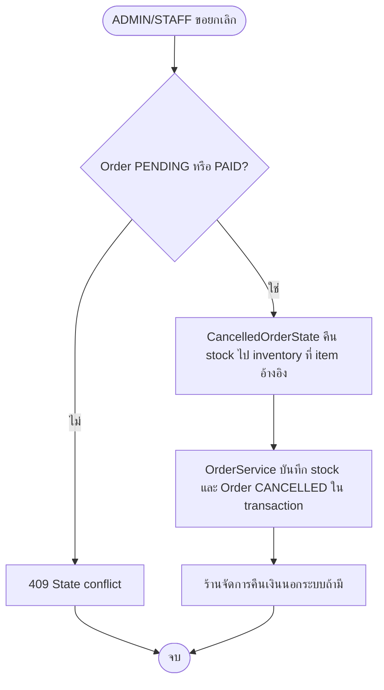
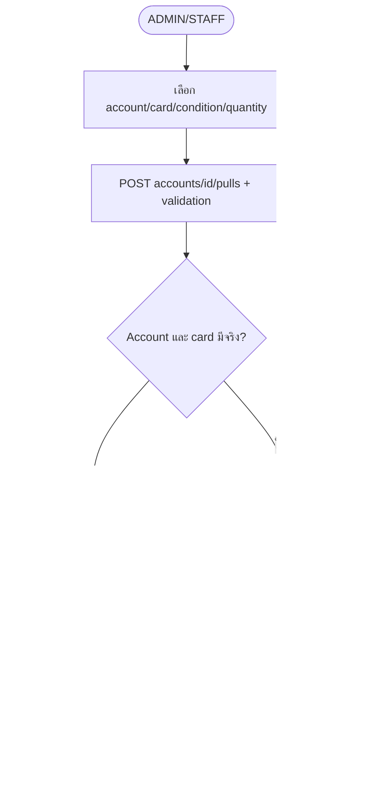

# Activity Diagrams

เทียบ implementation commit `ea2dcd7` วันที่ 9 ตุลาคม 2026

## 1. สั่งจอง

```mermaid
flowchart TD
    A([เริ่ม]) --> B[เลือก inventory และจำนวน]
    B --> C[เข้าสู่ระบบและกรอก Friend ID]
    C --> D[POST orders: validation และ ownership]
    D --> E{ข้อมูลถูกต้องและ stock พอ?}
    E -->|ไม่| F[ตอบ error และ rollback transaction]
    E -->|ใช่| G[คิดส่วนลดตาม Strategy]
    G --> H[หัก stock / บันทึก Order PENDING และราคาที่จอง]
    H --> I[Publish OrderPlacedEvent]
    I --> J[Observer ตรวจ stock ต่ำและ log]
    J --> K[ตอบ 201 และแสดงสรุป / ลิงก์แชท]
    F --> Z([จบ])
    K --> Z
```

## 2. จับคู่และส่งมอบ

```mermaid
flowchart TD
    A([เริ่มโดย ADMIN/STAFF]) --> B[ตรวจยอดชำระในแชท / action pay]
    B --> C[ขอ recommendations และเลือก auto/manual match]
    C --> D{สภาพเดิม / READY / จำนวนเพียงพอ?}
    D -->|ไม่| E[แสดง error / เลือกบัญชีใหม่]
    E --> C
    D -->|ใช่| F[ย้าย reservation หากเปลี่ยน inventory]
    F --> G[บันทึก assigned account / FRIEND_PENDING]
    G --> H[action ship เปลี่ยน Order เป็น SHIPPING]
    H --> I[พนักงานเทรดในเกม / อัปเดต item TRADE_SENT]
    I --> J[เมื่อรับสำเร็จ อัปเดต item COMPLETED]
    J --> K{ทุก item COMPLETED?}
    K -->|ไม่| I
    K -->|ใช่| L[State complete / Order COMPLETED]
    L --> Z([จบ])
```

การรับเงิน, เพิ่มเพื่อน, ส่งการ์ดและคืนเงินทำโดยร้านในแชท/เกม ไม่มี payment/game API และไม่มีตัวนับ quota อัตโนมัติ

## 3. ยกเลิก

```mermaid
flowchart TD
    A([ADMIN/STAFF ขอยกเลิก]) --> B{Order PENDING หรือ PAID?}
    B -->|ไม่| C[409 State conflict]
    B -->|ใช่| D[CancelledOrderState คืน stock ไป inventory ที่ item อ้างอิง]
    D --> E[OrderService บันทึก stock และ Order CANCELLED ใน transaction]
    E --> F[ร้านจัดการคืนเงินนอกระบบถ้ามี]
    C --> Z([จบ])
    F --> Z
```

## 4. บันทึกเปิดซอง

```mermaid
flowchart TD
    A([ADMIN/STAFF]) --> B[เลือก account/card/condition/quantity]
    B --> C[POST accounts/id/pulls + validation]
    C --> D{Account และ card มีจริง?}
    D -->|ไม่| E[404 / invalid payload 400]
    D -->|ใช่| F[หา inventory ของ account/card/condition]
    F --> G[เพิ่มจำนวนในแถวเดิม หรือสร้างแถวใหม่]
    G --> H[บันทึกแล้วตอบ 201]
    E --> Z([จบ])
    H --> Z
```
