# Detailed Class Diagram (พร้อมแสดงตำแหน่ง Design Patterns)
## โครงการ: Pokémon TCG Pocket Vault & Chat Commerce Trade Platform
**หลักสูตร**: CP353002 Principles of Software Design and Development (Spring Boot)  
**สถาปัตยกรรม**: 4-Tier Layered Architecture (Presentation, Service, Domain, Persistence)  
**GoF Design Patterns**: Strategy Pattern, State Pattern, Observer Pattern

---

## 1. Class Diagram รวมทั้ง 4 เลเยอร์และ Design Patterns

แผนภาพคลาสแสดงความสัมพันธ์ระหว่าง Controller, Service, Repository, Entity, DTO, และคลาสที่เกี่ยวข้องกับ Design Patterns ทั้งหมดในระบบ:

```mermaid
classDiagram
    direction TB

    %% ==========================================
    %% 1. PRESENTATION LAYER (Web & REST Controllers)
    %% ==========================================
    class OrderApiController {
            -OrderService orderService
            -TradeMatchingService tradeMatchingService
            +createOrder(PlaceOrderRequest request) ResponseEntity~ApiResponse~
            +getOrder(Long id) ResponseEntity~ApiResponse~
            +transitionOrder(Long id, String action) ResponseEntity~ApiResponse~
            +getTradeRecommendations(Long id) ResponseEntity~ApiResponse~
            +assignTradeAccount(Long id, AssignTradeAccountRequest request) ResponseEntity~ApiResponse~
            +autoMatchTradeAccount(Long id) ResponseEntity~ApiResponse~
        }

        class GameAccountApiController {
            -GameAccountService gameAccountService
            +createAccount(GameAccountRequest request) ResponseEntity~ApiResponse~
            +getAllAccounts() ResponseEntity~ApiResponse~
            +getAccount(Long id) ResponseEntity~ApiResponse~
            +addPulledCard(Long id, AddPulledCardRequest request) ResponseEntity~ApiResponse~
            +getAccountCards(Long id) ResponseEntity~ApiResponse~
        }

        class CardApiController {
            -CardService cardService
            +getAllCards(String expansion, String rarity) ResponseEntity~ApiResponse~
            +getCard(Long id) ResponseEntity~ApiResponse~
        }

        class WebViewController {
            -CardService cardService
            -OrderService orderService
            -GameAccountService gameAccountService
            +dashboardView(Model model) String
            +cardsGalleryView(Model model) String
            +inventoryMatrixView(Model model) String
            +ordersView(Model model) String
            +accountsVaultView(Model model) String
        }

        class GlobalExceptionHandler {
            +handleResourceNotFound(ResourceNotFoundException ex) ResponseEntity~ApiResponse~
            +handleInsufficientStock(InsufficientStockException ex) ResponseEntity~ApiResponse~
            +handleInvalidOrderState(InvalidOrderStateException ex) ResponseEntity~ApiResponse~
            +handleGenericException(Exception ex) ResponseEntity~ApiResponse~
        }

    %% ==========================================
    %% 2. APPLICATION / SERVICE LAYER (Business Logic & Orchestration)
    %% ==========================================
    class OrderService {
            <<interface>>
            +createOrder(PlaceOrderRequest request) OrderResponse
            +transitionOrder(Long id, String action) OrderResponse
            +getOrderById(Long id) OrderResponse
            +getAllOrders() List~OrderResponse~
        }

        class OrderServiceImpl {
            -OrderRepository orderRepo
            -CardInventoryRepository invRepo
            -DiscountService discountService
            -ApplicationEventPublisher eventPublisher
            +createOrder(PlaceOrderRequest request) OrderResponse
            +transitionOrder(Long id, String action) OrderResponse
            +getOrderById(Long id) OrderResponse
            +getAllOrders() List~OrderResponse~
        }

        class TradeMatchingService {
            <<interface>>
            +getRecommendations(Long orderId) TradeRecommendationResponse
            +assignAccount(Long orderId, Long itemId, Long accountId, TradeFulfillmentStatus status) OrderResponse
            +autoMatchBestAccount(Long orderId) OrderResponse
        }

        class TradeMatchingServiceImpl {
            -OrderRepository orderRepo
            -GameAccountRepository accountRepo
            -OrderItemRepository itemRepo
            -CardInventoryRepository invRepo
            +getRecommendations(Long orderId) TradeRecommendationResponse
            +assignAccount(Long orderId, Long itemId, Long accountId, TradeFulfillmentStatus status) OrderResponse
            +autoMatchBestAccount(Long orderId) OrderResponse
        }

        class GameAccountService {
            <<interface>>
            +createAccount(GameAccountRequest request) GameAccountResponse
            +getAllAccounts() List~GameAccountResponse~
            +getAccountById(Long id) GameAccountResponse
            +addPulledCard(Long id, AddPulledCardRequest request) AccountCardResponse
            +getAccountCards(Long id) List~AccountCardResponse~
        }

        class GameAccountServiceImpl {
            -GameAccountRepository accountRepo
            -CardInventoryRepository invRepo
            -CardRepository cardRepo
            +createAccount(GameAccountRequest request) GameAccountResponse
            +getAllAccounts() List~GameAccountResponse~
            +getAccountById(Long id) GameAccountResponse
            +addPulledCard(Long id, AddPulledCardRequest request) AccountCardResponse
            +getAccountCards(Long id) List~AccountCardResponse~
        }

        class CardService {
            <<interface>>
            +getAllCards(String expansion, String rarity) List~CardResponse~
            +getCardById(Long id) CardResponse
            +searchCards(String query) List~CardResponse~
        }

        class CardServiceImpl {
            -CardRepository cardRepo
            -CardExpansionRepository expansionRepo
            +getAllCards(String expansion, String rarity) List~CardResponse~
            +getCardById(Long id) CardResponse
            +searchCards(String query) List~CardResponse~
        }

    %% ==========================================
    %% 3. GOF DESIGN PATTERN: STRATEGY (Discount Calculation)
    %% ==========================================
    class DiscountService {
            -List~DiscountStrategy~ strategies
            +calculateDiscount(MembershipTier tier, BigDecimal subtotal) BigDecimal
            +getApplicableStrategy(MembershipTier tier) DiscountStrategy
        }

        class DiscountStrategy {
            <<interface>>
            +calculate(BigDecimal subtotal) BigDecimal
            +supports(MembershipTier tier) boolean
            +getDiscountPercentage() BigDecimal
        }

        class RegularDiscountStrategy {
            +calculate(BigDecimal subtotal) BigDecimal
            +supports(MembershipTier tier) boolean
            +getDiscountPercentage() BigDecimal
        }

        class VipDiscountStrategy {
            +calculate(BigDecimal subtotal) BigDecimal
            +supports(MembershipTier tier) boolean
            +getDiscountPercentage() BigDecimal
        }

        class WholesaleDiscountStrategy {
            +calculate(BigDecimal subtotal) BigDecimal
            +supports(MembershipTier tier) boolean
            +getDiscountPercentage() BigDecimal
        }

    %% ==========================================
    %% 4. GOF DESIGN PATTERN: STATE (Order State Machine)
    %% ==========================================
    class OrderState {
            <<interface>>
            +pay(OrderContext context) void
            +ship(OrderContext context) void
            +complete(OrderContext context) void
            +cancel(OrderContext context) void
            +getStatus() OrderStatus
        }

        class OrderContext {
            -Order order
            -OrderState currentState
            -OrderRepository orderRepo
            -CardInventoryRepository invRepo
            +setState(OrderState newState) void
            +pay() void
            +ship() void
            +complete() void
            +cancel() void
            +getOrder() Order
        }

        class PendingOrderState {
            +pay(OrderContext context) void
            +ship(OrderContext context) void
            +complete(OrderContext context) void
            +cancel(OrderContext context) void
            +getStatus() OrderStatus
        }

        class PaidOrderState {
            +pay(OrderContext context) void
            +ship(OrderContext context) void
            +complete(OrderContext context) void
            +cancel(OrderContext context) void
            +getStatus() OrderStatus
        }

        class ShippingOrderState {
            +pay(OrderContext context) void
            +ship(OrderContext context) void
            +complete(OrderContext context) void
            +cancel(OrderContext context) void
            +getStatus() OrderStatus
        }

        class CompletedOrderState {
            +pay(OrderContext context) void
            +ship(OrderContext context) void
            +complete(OrderContext context) void
            +cancel(OrderContext context) void
            +getStatus() OrderStatus
        }

        class CancelledOrderState {
            +pay(OrderContext context) void
            +ship(OrderContext context) void
            +complete(OrderContext context) void
            +cancel(OrderContext context) void
            +getStatus() OrderStatus
        }

    %% ==========================================
    %% 5. GOF DESIGN PATTERN: OBSERVER (Inventory Alert)
    %% ==========================================
    class ApplicationEventPublisher {
            <<interface>>
            +publishEvent(Object event) void
        }

        class OrderPlacedEvent {
            -Long orderId
            -String orderCode
            -List~OrderItem~ items
            -LocalDateTime timestamp
            +getOrderId() Long
            +getOrderCode() String
            +getItems() List~OrderItem~
        }

        class LowStockObserver {
            -CardInventoryRepository invRepo
            -int LOW_STOCK_THRESHOLD
            +onOrderPlaced(OrderPlacedEvent event) void
        }

    %% ==========================================
    %% 6. DOMAIN LAYER (JPA Entities)
    %% ==========================================
    class User {
            -Long id
            -String username
            -String email
            -String password
            -UserRole role
            -UserProfile userProfile
            -List~Order~ orders
        }

        class UserProfile {
            -Long id
            -User user
            -String fullName
            -String phoneNumber
            -String shippingAddress
            -MembershipTier membershipTier
            -Integer rewardPoints
        }

        class CardExpansion {
            -Long id
            -String code
            -String name
            -String series
            -LocalDate releaseDate
            -Integer totalCards
            -List~Card~ cards
        }

        class Card {
            -Long id
            -CardExpansion expansion
            -String cardNumber
            -String name
            -CardType cardType
            -Rarity rarity
            -ElementType elementType
            -Integer hp
            -Integer retreatCost
            -String imageUrl
        }

        class GameAccount {
            -Long id
            -String accountCode
            -String inGameName
            -String friendId
            -AccountTradeStatus tradeStatus
            -BigDecimal buyInCost
            -String notes
            -List~CardInventory~ inventories
            +addInventory(CardInventory inv) void
            +getTotalCardsCount() int
        }

        class CardInventory {
            -Long id
            -Card card
            -GameAccount gameAccount
            -CardCondition condition
            -Integer quantity
            -BigDecimal buyInPrice
            -BigDecimal sellingPrice
            -String storageSlot
            +hasSufficientStock(int qty) boolean
            +deductStock(int count) void
            +restoreStock(int count) void
        }

        class Order {
            -Long id
            -String orderCode
            -User user
            -String customerFriendId
            -String customerInGameName
            -OrderStatus orderStatus
            -BigDecimal totalAmount
            -BigDecimal discountAmount
            -BigDecimal finalAmount
            -String notes
            -List~OrderItem~ items
            +addItem(OrderItem item) void
        }

        class OrderItem {
            -Long id
            -Order order
            -CardInventory inventory
            -GameAccount assignedAccount
            -TradeFulfillmentStatus tradeStatus
            -Integer quantity
            -BigDecimal unitPrice
            -BigDecimal subtotal
        }

    %% ==========================================
    %% 7. PERSISTENCE LAYER (Spring Data JPA Repositories)
    %% ==========================================
    class OrderRepository {
            <<interface>>
            +findByOrderCode(String code) Optional~Order~
            +findByUserId(Long userId) List~Order~
        }

        class CardInventoryRepository {
            <<interface>>
            +findByCardId(Long cardId) List~CardInventory~
            +findByGameAccountId(Long accountId) List~CardInventory~
        }

        class GameAccountRepository {
            <<interface>>
            +findByAccountCode(String code) Optional~GameAccount~
            +findByTradeStatus(AccountTradeStatus status) List~GameAccount~
        }

        class CardRepository {
            <<interface>>
            +findByNameContainingIgnoreCase(String name) List~Card~
            +findByRarity(Rarity rarity) List~Card~
        }

        class CardExpansionRepository {
            <<interface>>
            +findByCode(String code) Optional~CardExpansion~
        }

        class OrderItemRepository {
            <<interface>>
            +findByOrderId(Long orderId) List~OrderItem~
            +findByAssignedAccountId(Long accountId) List~OrderItem~
        }

    %% ==========================================
    %% RELATIONSHIPS & REALIZATIONS
    %% ==========================================
    OrderApiController --> OrderService
    OrderApiController --> TradeMatchingService
    GameAccountApiController --> GameAccountService
    CardApiController --> CardService
    WebViewController --> CardService
    WebViewController --> OrderService
    WebViewController --> GameAccountService

    OrderServiceImpl ..|> OrderService
    TradeMatchingServiceImpl ..|> TradeMatchingService
    GameAccountServiceImpl ..|> GameAccountService
    CardServiceImpl ..|> CardService

    OrderServiceImpl --> DiscountService
    OrderServiceImpl --> ApplicationEventPublisher
    OrderServiceImpl --> OrderContext
    OrderServiceImpl --> OrderRepository
    OrderServiceImpl --> CardInventoryRepository

    TradeMatchingServiceImpl --> OrderRepository
    TradeMatchingServiceImpl --> GameAccountRepository
    TradeMatchingServiceImpl --> OrderItemRepository
    TradeMatchingServiceImpl --> CardInventoryRepository

    GameAccountServiceImpl --> GameAccountRepository
    GameAccountServiceImpl --> CardInventoryRepository
    GameAccountServiceImpl --> CardRepository

    CardServiceImpl --> CardRepository
    CardServiceImpl --> CardExpansionRepository

    %% Strategy Pattern Realization
    RegularDiscountStrategy ..|> DiscountStrategy
    VipDiscountStrategy ..|> DiscountStrategy
    WholesaleDiscountStrategy ..|> DiscountStrategy
    DiscountService o-- DiscountStrategy

    %% State Pattern Realization
    PendingOrderState ..|> OrderState
    PaidOrderState ..|> OrderState
    ShippingOrderState ..|> OrderState
    CompletedOrderState ..|> OrderState
    CancelledOrderState ..|> OrderState
    OrderContext o-- OrderState

    %% Observer Pattern Realization
    OrderServiceImpl ..> OrderPlacedEvent : publishes
    LowStockObserver ..> OrderPlacedEvent : listens via @EventListener
    LowStockObserver --> CardInventoryRepository

    %% Domain Relationships
    User "1" *-- "1" UserProfile
    User "1" o-- "0..*" Order
    Order "1" *-- "1..*" OrderItem
    CardExpansion "1" o-- "1..*" Card
    Card "1" <-- "0..*" CardInventory
    GameAccount "1" o-- "0..*" CardInventory
    GameAccount "1" <-- "0..*" OrderItem
    CardInventory "1" <-- "0..*" OrderItem
```

---

## 2. การวิเคราะห์ตำแหน่งและการทำงานของ Design Patterns (GoF Design Patterns Analysis)

### 2.1 Strategy Pattern (คำนวณส่วนลดตามระดับลูกค้า)
* **ปัญหาที่แก้ไข**: เดิมทีการคำนวณส่วนลดมักเขียนด้วยโครงสร้าง `if-else` หรือ `switch-case` ซ้อนกันหลายชั้น ซึ่งหากในอนาคตมีโปรโมชั่นใหม่ (เช่น Black Friday หรือ Influencer Tier) จะต้องกลับมาแก้โค้ดเดิม ส่งผลให้เสี่ยงต่อการเกิด Regression Bug
* **การนำไปใช้งานในโปรเจกต์**:
  1. **Strategy Interface**: คลาสอินเทอร์เฟซ `DiscountStrategy` กำหนดฟังก์ชัน `calculate(BigDecimal subtotal)` และ `supports(MembershipTier tier)`
  2. **Concrete Strategies**:
     * `RegularDiscountStrategy`: คืนค่าส่วนลด `0%`
     * `VipDiscountStrategy`: คืนค่าส่วนลด `10%` (`subtotal * 0.10`)
     * `WholesaleDiscountStrategy`: คืนค่าส่วนลด `15%` สำหรับลูกค้ารับไปขายต่อ
  3. **Context / Manager**: คลาส `DiscountService` ทำการรวบรวม Strategy Beans ทั้งหมดผ่าน Spring Dependency Injection (`List<DiscountStrategy>`) และเลือกใช้กลยุทธ์ที่ตรงกับระดับสมาชิกของลูกค้าอย่างยืดหยุ่น
* **ความสอดคล้องกับหลักการ SOLID**:
  * **Open/Closed Principle (OCP)**: เปิดให้ขยายได้ด้วยการเพิ่มคลาส Strategy ใหม่ แต่ปิดการแก้ไขโค้ดเดิมใน `DiscountService`

---

### 2.2 State Pattern (จัดการวงจรชีวิตสถานะคำสั่งซื้อ)
* **ปัญหาที่แก้ไข**: คำสั่งซื้อมีการเปลี่ยนสถานะตามขั้นตอนที่เข้มงวด หากใช้เพียงการแก้ฟิลด์สตริง `status = "PAID"` ผู้ใช้อาจกดข้ามขั้นตอน หรือกดยกเลิกออเดอร์ในขณะที่ส่งการ์ดเข้าไปในเกมแล้ว ทำให้ร้านเสียการ์ดไปฟรี
* **การนำไปใช้งานในโปรเจกต์**:
  1. **State Interface**: `OrderState` กำหนดเมธอด `pay()`, `ship()`, `complete()`, `cancel()`
  2. **Concrete States**:
     * `PendingOrderState`: อนุญาตให้ `pay()` หรือ `cancel()` เท่านั้น ไม่อนุญาตให้ `ship()` หรือ `complete()`
     * `PaidOrderState`: ปลดล็อกปุ่มเริ่มเทรดในเกม และอนุญาตให้ `ship()` หรือ `cancel()` (คืนเงิน)
     * `ShippingOrderState`: การ์ดถูกส่งเข้าไปในเกมแล้ว **ไม่อนุญาตให้ `cancel()`** เพื่อความปลอดภัยของร้าน และอนุญาตให้ `complete()` เท่านั้น
     * `CompletedOrderState` & `CancelledOrderState`: เป็นสถานะสิ้นสุด (Terminal State) ปฏิเสธทุก Action
  3. **Automatic Side Effects**: ในเมธอด `cancel()` ของสถานะที่อนุญาต ระบบจะสั่ง `inventory.restoreStock()` คืนสต็อกการ์ดกลับเข้าคลังอัตโนมัติ
* **ความสอดคล้องกับหลักการ SOLID**:
  * **Single Responsibility Principle (SRP)**: กฎเกณฑ์และข้อยกเว้นของแต่ละสถานะถูกแยกเก็บในคลาสเฉพาะของตนเอง ไม่ปะปนกัน

---

### 2.3 Observer Pattern (การตรวจจับและแจ้งเตือนสต็อกสินค้าต่ำ)
* **ปัญหาที่แก้ไข**: ต้องการให้ระบบแจ้งเตือนแอดมินทันทีเมื่อมีการ์ดในคลังลดลงจนใกล้หมด โดยไม่ต้องการให้เซอร์วิสสั่งซื้อ (`OrderServiceImpl`) ต้องไปผูกติดแน่น (Tight Coupling) กับระบบแจ้งเตือนสต็อก
* **การนำไปใช้งานในโปรเจกต์**:
  1. **Event Object**: `OrderPlacedEvent` บันทึกข้อมูลรหัสคำสั่งซื้อและรายการการ์ดที่ถูกจอง
  2. **Subject / Publisher**: `OrderServiceImpl` ใช้ Spring Framework `ApplicationEventPublisher.publishEvent(new OrderPlacedEvent(...))` เมื่อคำสั่งซื้อถูกบันทึกสำเร็จ
  3. **Observer / Listener**: คลาส `LowStockObserver` ดักฟังสัญญาณด้วย `@EventListener` เมื่อได้รับอีเวนต์จะเข้าไปสแกนระดับสต็อกคงเหลือ หากต่ำกว่าเกณฑ์ (`quantity <= 2`) จะทำการบันทึก Log หรือส่งสัญญาณเตือน
* **ความสอดคล้องกับหลักการ SOLID**:
  * **Dependency Inversion Principle (DIP)**: `OrderServiceImpl` พึ่งพาเพียง Abstraction ของ Event Publisher โดยไม่ต้องรู้จักคลาส `LowStockObserver` แต่อย่างใด
