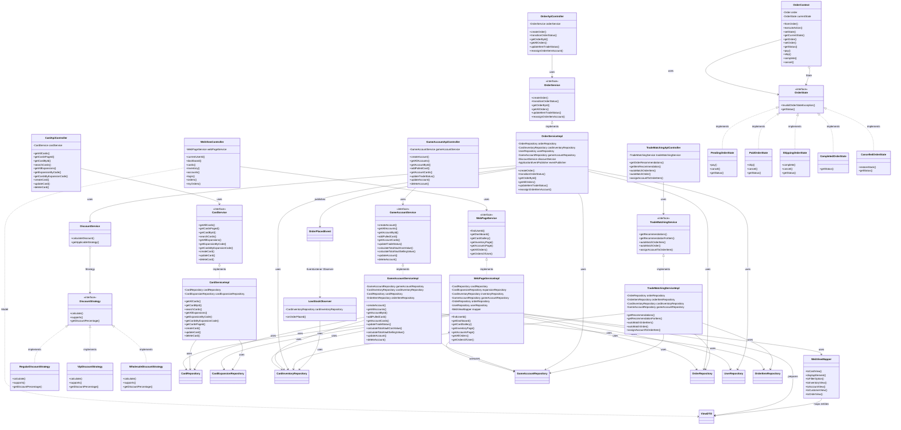

# Class Diagram

ตรวจเทียบโค้ด commit `ea2dcd7` วันที่ 9 ตุลาคม 2026; รอบนี้แก้เอกสาร ไม่ได้รันทดสอบใหม่

แสดง dependency และชื่อเมธอดที่ประกาศจริง โดยย่อ parameter/return type เพื่อให้อ่านแผนภาพได้; getter/setter ที่ Lombok สร้างไม่แสดง
Entity และ cardinality ดู [Domain Model](domain-model.md) / [ER](er-diagram.md)

```mermaid
classDiagram
    direction TB
    class WebViewController {
        -WebPageService webPageService
        +currentUserId()
        +dashboard()
        +cards()
        +inventory()
        +accounts()
        +login()
        +orders()
        +myOrders()
    }
    class WebPageService {
        <<interface>>
        +findUserId()
        +getDashboard()
        +getCardGallery()
        +getInventoryPage()
        +getAccountsPage()
        +getAllOrders()
        +getOrdersOfUser()
    }
    class WebPageServiceImpl {
        -CardRepository cardRepository
        -CardExpansionRepository expansionRepository
        -CardInventoryRepository inventoryRepository
        -GameAccountRepository gameAccountRepository
        -OrderRepository orderRepository
        -UserRepository userRepository
        -WebViewMapper mapper
        +findUserId()
        +getDashboard()
        +getCardGallery()
        +getInventoryPage()
        +getAccountsPage()
        +getAllOrders()
        +getOrdersOfUser()
    }
    class WebViewMapper {
        +toCardView()
        +displayElement()
        +toFilterOption()
        +toInventoryView()
        +toAccountView()
        +toCustomerView()
        +toOrderView()
    }
    class CardApiController {
        -CardService cardService
        +getAllCards()
        +getCardsPaged()
        +getCardById()
        +searchCards()
        +getAllExpansions()
        +getExpansionByCode()
        +getCardsByExpansionCode()
        +createCard()
        +updateCard()
        +deleteCard()
    }
    class CardService {
        <<interface>>
        +getAllCards()
        +getCardsPaged()
        +getCardById()
        +searchCards()
        +getAllExpansions()
        +getExpansionByCode()
        +getCardsByExpansionCode()
        +createCard()
        +updateCard()
        +deleteCard()
    }
    class CardServiceImpl {
        -CardRepository cardRepository
        -CardExpansionRepository cardExpansionRepository
        +getAllCards()
        +getCardById()
        +searchCards()
        +getAllExpansions()
        +getExpansionByCode()
        +getCardsByExpansionCode()
        +getCardsPaged()
        +createCard()
        +updateCard()
        +deleteCard()
    }
    class GameAccountApiController {
        -GameAccountService gameAccountService
        +createAccount()
        +getAllAccounts()
        +getAccountById()
        +addPulledCard()
        +getAccountCards()
        +updateTradeStatus()
        +updateAccount()
        +deleteAccount()
    }
    class GameAccountService {
        <<interface>>
        +createAccount()
        +getAllAccounts()
        +getAccountById()
        +addPulledCard()
        +getAccountCards()
        +updateTradeStatus()
        +calculateTotalVaultCostValue()
        +calculateTotalVaultSellingValue()
        +updateAccount()
        +deleteAccount()
    }
    class GameAccountServiceImpl {
        -GameAccountRepository gameAccountRepository
        -CardInventoryRepository cardInventoryRepository
        -CardRepository cardRepository
        -OrderItemRepository orderItemRepository
        +createAccount()
        +getAllAccounts()
        +getAccountById()
        +addPulledCard()
        +getAccountCards()
        +updateTradeStatus()
        +calculateTotalVaultCostValue()
        +calculateTotalVaultSellingValue()
        +updateAccount()
        +deleteAccount()
    }
    class OrderApiController {
        -OrderService orderService
        +createOrder()
        +transitionOrderStatus()
        +getOrderById()
        +getAllOrders()
        +updateItemTradeStatus()
        +reassignOrderItemAccount()
    }
    class OrderService {
        <<interface>>
        +createOrder()
        +transitionOrderStatus()
        +getOrderById()
        +getAllOrders()
        +updateItemTradeStatus()
        +reassignOrderItemAccount()
    }
    class OrderServiceImpl {
        -OrderRepository orderRepository
        -CardInventoryRepository cardInventoryRepository
        -UserRepository userRepository
        -GameAccountRepository gameAccountRepository
        -DiscountService discountService
        -ApplicationEventPublisher eventPublisher
        +createOrder()
        +transitionOrderStatus()
        +getOrderById()
        +getAllOrders()
        +updateItemTradeStatus()
        +reassignOrderItemAccount()
    }
    class TradeMatchingApiController {
        -TradeMatchingService tradeMatchingService
        +getOrderRecommendations()
        +getItemRecommendation()
        +autoMatchOrderItem()
        +autoMatchOrder()
        +assignAccountToOrderItem()
    }
    class TradeMatchingService {
        <<interface>>
        +getRecommendations()
        +getRecommendationForItem()
        +autoMatchOrderItem()
        +autoMatchOrder()
        +assignAccountToOrderItem()
    }
    class TradeMatchingServiceImpl {
        -OrderRepository orderRepository
        -OrderItemRepository orderItemRepository
        -CardInventoryRepository cardInventoryRepository
        -GameAccountRepository gameAccountRepository
        +getRecommendations()
        +getRecommendationForItem()
        +autoMatchOrderItem()
        +autoMatchOrder()
        +assignAccountToOrderItem()
    }
    class DiscountService {
        +calculateDiscount()
        +getApplicableStrategy()
    }
    class DiscountStrategy {
        <<interface>>
        +calculate()
        +supports()
        +getDiscountPercentage()
    }
    class RegularDiscountStrategy {
        +calculate()
        +supports()
        +getDiscountPercentage()
    }
    class VipDiscountStrategy {
        +calculate()
        +supports()
        +getDiscountPercentage()
    }
    class WholesaleDiscountStrategy {
        +calculate()
        +supports()
        +getDiscountPercentage()
    }
    class OrderContext {
        -Order order
        -OrderState currentState
        +fromOrder()
        +executeAction()
        +setState()
        +getCurrentState()
        +getOrder()
        +setOrder()
        +getStatus()
        +pay()
        +ship()
        +complete()
        +cancel()
    }
    class OrderState {
        <<interface>>
        +InvalidOrderStateException()
        +getStatus()
    }
    class PendingOrderState {
        +pay()
        +cancel()
        +getStatus()
    }
    class PaidOrderState {
        +ship()
        +cancel()
        +getStatus()
    }
    class ShippingOrderState {
        +complete()
        +cancel()
        +getStatus()
    }
    class CompletedOrderState {
        +getStatus()
    }
    class CancelledOrderState {
        +restoreStock()
        +getStatus()
    }
    class OrderPlacedEvent {
    }
    class LowStockObserver {
        -CardInventoryRepository cardInventoryRepository
        +onOrderPlaced()
    }
    WebViewController --> WebPageService : uses
    WebPageServiceImpl --> CardRepository : uses
    WebPageServiceImpl --> CardExpansionRepository : uses
    WebPageServiceImpl --> CardInventoryRepository : uses
    WebPageServiceImpl --> GameAccountRepository : uses
    WebPageServiceImpl --> OrderRepository : uses
    WebPageServiceImpl --> UserRepository : uses
    WebPageServiceImpl --> WebViewMapper : uses
    CardApiController --> CardService : uses
    CardServiceImpl --> CardRepository : uses
    CardServiceImpl --> CardExpansionRepository : uses
    GameAccountApiController --> GameAccountService : uses
    GameAccountServiceImpl --> GameAccountRepository : uses
    GameAccountServiceImpl --> CardInventoryRepository : uses
    GameAccountServiceImpl --> CardRepository : uses
    GameAccountServiceImpl --> OrderItemRepository : uses
    OrderApiController --> OrderService : uses
    OrderServiceImpl --> OrderRepository : uses
    OrderServiceImpl --> CardInventoryRepository : uses
    OrderServiceImpl --> UserRepository : uses
    OrderServiceImpl --> GameAccountRepository : uses
    OrderServiceImpl --> DiscountService : uses
    TradeMatchingApiController --> TradeMatchingService : uses
    TradeMatchingServiceImpl --> OrderRepository : uses
    TradeMatchingServiceImpl --> OrderItemRepository : uses
    TradeMatchingServiceImpl --> CardInventoryRepository : uses
    TradeMatchingServiceImpl --> GameAccountRepository : uses
    OrderContext --> OrderState : uses
    LowStockObserver --> CardInventoryRepository : uses
    WebPageService <|.. WebPageServiceImpl : implements
    CardService <|.. CardServiceImpl : implements
    GameAccountService <|.. GameAccountServiceImpl : implements
    OrderService <|.. OrderServiceImpl : implements
    TradeMatchingService <|.. TradeMatchingServiceImpl : implements
    DiscountStrategy <|.. RegularDiscountStrategy : implements
    DiscountStrategy <|.. VipDiscountStrategy : implements
    DiscountStrategy <|.. WholesaleDiscountStrategy : implements
    OrderState <|.. PendingOrderState : implements
    OrderState <|.. PaidOrderState : implements
    OrderState <|.. ShippingOrderState : implements
    OrderState <|.. CompletedOrderState : implements
    OrderState <|.. CancelledOrderState : implements
    DiscountService o--> DiscountStrategy : Strategy
    OrderContext o--> OrderState : State
    OrderServiceImpl --> OrderPlacedEvent : publishes
    OrderPlacedEvent ..> LowStockObserver : EventListener Observer
    WebViewController ..> ViewDTO : Model
    WebPageServiceImpl --> ViewDTO : prepares
    WebViewMapper --> ViewDTO : maps entities
```

| Pattern | ตำแหน่ง |
|---|---|
| Strategy | DiscountService → DiscountStrategy → implementations |
| State | OrderContext → OrderState → 5 states |
| Observer | OrderServiceImpl → OrderPlacedEvent → LowStockObserver |
| MVC / DTO / Mapper | WebViewController → WebPageService → ViewDTO / WebViewMapper → Thymeleaf |
| Repository / Service / DI | Controller → service interface → implementation → repository interface; constructor injection |
