# Component Diagram & Deployment Diagram
## โครงการ: Pokémon TCG Pocket Vault & Chat Commerce Trade Platform
**หลักสูตร**: CP353002 Principles of Software Design and Development (Spring Boot)  
**มาตรฐานแผนภาพ**: UML 2.5 Component & Deployment Architecture Specifications

---

## 1. Component Diagram (แผนภาพแสดงองค์ประกอบและสถาปัตยกรรมภายใน)

Component Diagram แสดงส่วนประกอบซอฟต์แวร์ (Software Components), อินเทอร์เฟซที่ให้บริการ (Provided Interfaces), อินเทอร์เฟซที่เรียกใช้ (Required Interfaces), และการพึ่งพาภายในเลเยอร์ต่างๆ ของ Spring Boot Framework

```mermaid
flowchart TB
    %% ==========================================
    %% CLIENT TIER
    %% ==========================================
    subgraph ClientTier[" Client Tier (Web Browser Environment) "]
        subgraph UI_Components[" Web Presentation Components "]
            ThymeleafView["Thymeleaf HTML5 Templates\n(cards.html, inventory.html, orders.html)"]
            HoloShaders["3D Holographic CSS Shaders Engine\n(pokemon-cards-holo.css)"]
            AppController["Vanilla JS Application Controller\n(app.js)"]
            AudioFX["Web Audio SFX Engine\n(audio.js)"]
        end
    end

    %% ==========================================
    %% APPLICATION TIER (SPRING BOOT)
    %% ==========================================
    subgraph AppTier[" Application Tier (Spring Boot 3.4.x Container) "]
        
        %% Presentation Layer Components
        subgraph WebLayer[" 1. Presentation Layer Components "]
            OrderAPI["OrderApiController\n(@RestController)"]
            GameAccAPI["GameAccountApiController\n(@RestController)"]
            CardAPI["CardApiController\n(@RestController)"]
            WebPageCtrl["WebViewController\n(@Controller)"]
            ExAdvice["GlobalExceptionHandler\n(@RestControllerAdvice)"]
            OpenAPI["SpringDoc OpenAPI / Swagger\n(API Documentation)"]
        end

        %% Service Layer Components
        subgraph SvcLayer[" 2. Service Layer Components (Business Logic & Patterns) "]
            OrderServiceComp["OrderService & OrderServiceImpl\n(Order Management & Orchestration)"]
            TradeMatchComp["TradeMatchingService & Impl\n(In-Game Trade Auto-Matching Engine)"]
            GameAccServiceComp["GameAccountService & Impl\n(Vault & Pack Pull Management)"]
            
            subgraph StrategyPatternComp[" Strategy Pattern (Discount) "]
                DiscountServiceComp["DiscountService"]
                Strategies["RegularDiscountStrategy\nVipDiscountStrategy\nWholesaleDiscountStrategy"]
            end

            subgraph StatePatternComp[" State Pattern (Order Lifecycle) "]
                OrderContextComp["OrderContext"]
                OrderStates["PendingOrderState\nPaidOrderState\nShippingOrderState\nCompletedOrderState\nCancelledOrderState"]
            end

            subgraph ObserverPatternComp[" Observer Pattern (Event Bus) "]
                SpringEventBus["ApplicationEventPublisher\n(Spring Core Event Bus)"]
                StockObserver["LowStockObserver\n(@EventListener Stock Monitoring)"]
            end
        end

        %% Persistence Layer Components
        subgraph DataLayer[" 3. Persistence Layer Components (Spring Data JPA) "]
            OrderRepoComp["OrderRepository & OrderItemRepository"]
            AccountRepoComp["GameAccountRepository"]
            InventoryRepoComp["CardInventoryRepository"]
            CardRepoComp["CardRepository & CardExpansionRepository"]
            HibernateORM["Hibernate 6.x ORM & JPA Entities"]
            HikariCP["HikariCP Database Connection Pool"]
        end
    end

    %% ==========================================
    %% EXTERNAL SERVICES TIER
    %% ==========================================
    subgraph ExternalTier[" External Services Tier "]
        FBMessengerGateway["Facebook Messenger Platform\n(https://m.me/poketcgpocketstore)"]
    end

    %% ==========================================
    %% DATABASE TIER
    %% ==========================================
    subgraph DatabaseTier[" Database Tier "]
        RDBMS[("Relational SQL Database\nPostgreSQL 16 / H2 In-Memory")]
    end

    %% ==========================================
    %% CONNECTIONS & INTERFACES
    %% ==========================================
    %% Client to Presentation
    AppController -->|HTTP JSON / REST API| OrderAPI
    AppController -->|HTTP JSON / REST API| GameAccAPI
    AppController -->|HTTP JSON / REST API| CardAPI
    ThymeleafView -->|HTTP GET Page Requests| WebPageCtrl
    AppController -->|Prefilled Chat Handshake| FBMessengerGateway

    %% Presentation to Service
    OrderAPI --> OrderServiceComp
    OrderAPI --> TradeMatchComp
    GameAccAPI --> GameAccServiceComp
    WebPageCtrl --> OrderServiceComp
    WebPageCtrl --> GameAccServiceComp
    OrderAPI -.-> ExAdvice
    GameAccAPI -.-> ExAdvice

    %% Service to Patterns & Repositories
    OrderServiceComp --> DiscountServiceComp
    DiscountServiceComp --> Strategies
    OrderServiceComp --> OrderContextComp
    OrderContextComp --> OrderStates
    OrderServiceComp --> SpringEventBus
    SpringEventBus --> StockObserver
    StockObserver --> InventoryRepoComp

    OrderServiceComp --> OrderRepoComp
    OrderServiceComp --> InventoryRepoComp
    TradeMatchComp --> AccountRepoComp
    TradeMatchComp --> OrderRepoComp
    GameAccServiceComp --> AccountRepoComp
    GameAccServiceComp --> InventoryRepoComp
    GameAccServiceComp --> CardRepoComp

    %% Persistence to Database
    OrderRepoComp --> HibernateORM
    AccountRepoComp --> HibernateORM
    InventoryRepoComp --> HibernateORM
    CardRepoComp --> HibernateORM
    HibernateORM --> HikariCP
    HikariCP -->|Encrypted JDBC Connection TCP 5432| RDBMS
```



---

## 2. Deployment Diagram (แผนภาพการติดตั้งระบบขึ้นใช้งานจริง)

Deployment Diagram แสดงโครงสร้างทางกายภาพของฮาร์ดแวร์ (Physical Nodes), คอนเทนเนอร์ (Docker Containers), เครือข่าย (Networks), พอร์ต (Ports), โปรโตคอลการสื่อสาร (Protocols), และสภาพแวดล้อมระบบคลาวด์จริง

```mermaid
flowchart LR
    %% ==========================================
    %% USER TIER
    %% ==========================================
    subgraph UserTier[" Client Node (End User Device) "]
        Desktop["Desktop PC / Laptop\n(Windows / macOS / Linux)"]
        Mobile["Mobile Smartphone\n(iOS / Android)"]
        Browser["Modern Web Browser\n(Chrome, Safari, Edge, Firefox)\nWeb Components + WebGL"]
    end

    %% ==========================================
    %% CLOUD APPLICATION SERVER
    %% ==========================================
    subgraph CloudServer[" Cloud Application Server (Render / Railway / AWS VPS) "]
        ReverseProxy["Cloud Reverse Proxy (Nginx / Caddy)\nSSL/TLS Termination\nPort 443 / 80"]
        
        subgraph DockerLinux[" Docker Container (Alpine Linux 3.19) "]
            JDK["Eclipse Temurin OpenJDK 17 LTS Runtime"]
            Tomcat["Embedded Apache Tomcat 10.1.x\nPort 8080 (Internal HTTP)"]
            AppJar["tcg-pocket-inventory-0.0.1-SNAPSHOT.jar\nSpring Boot Production Profile"]
        end
    end

    %% ==========================================
    %% MANAGED CLOUD DATABASE
    %% ==========================================
    subgraph CloudDB[" Managed Cloud Database Tier (Neon Serverless PostgreSQL) "]
        PostgreSQL["PostgreSQL 16 Engine\nPort 5432\nAuto-scaling Storage & Automated Backup"]
    end

    %% ==========================================
    %% EXTERNAL SOCIAL PLATFORM
    %% ==========================================
    subgraph SocialCloud[" Meta Cloud Infrastructure "]
        MessengerPlatform["Facebook Messenger App / Web\nEndpoint: https://m.me/poketcgpocketstore"]
    end

    %% ==========================================
    %% HARDWARE / NETWORK CONNECTIONS
    %% ==========================================
    Desktop --> Browser
    Mobile --> Browser

    Browser -->|HTTPS : 443 / TLS 1.3 Encrypted\nREST API JSON & HTML Payloads| ReverseProxy
    ReverseProxy -->|Internal Proxy HTTP : 8080| Tomcat
    Tomcat --> AppJar
    AppJar --> JDK

    AppJar -->|Encrypted JDBC / TCP : 5432\nSSL Mode = require| PostgreSQL
    Browser -.->|Chat Handshake URL Redirect\n(Pre-filled order summary)| MessengerPlatform
```

---

## 3. ตารางคุณลักษณะระบบเครือข่ายและการเชื่อมต่อ (Network & Protocols Matrix)

| ต้นทาง (Source) | ปลายทาง (Destination) | โพรโทคอล (Protocol) | พอร์ต (Port) | ความปลอดภัย (Security / Encryption) | วัตถุประสงค์ (Purpose) |
| :--- | :--- | :---: | :---: | :--- | :--- |
| **Client Browser** | **Cloud Reverse Proxy** | **HTTPS** (HTTP/2, HTTP/3) | `443` | TLS 1.3 Encryption, Let's Encrypt SSL Certificate | ลูกค้าและแอดมินเข้าใช้งานหน้าเว็บ และเรียกใช้งาน REST APIs |
| **Reverse Proxy** | **Embedded Tomcat** | **HTTP** | `8080` | Internal Container Network (Isolated) | ส่งต่อคำขอภายในเซิร์ฟเวอร์ไปยัง Spring Boot Application |
| **Spring Boot App** | **Managed PostgreSQL** | **JDBC over TCP** | `5432` | SSL/TLS Mode (`sslmode=require`), Username/Password Auth | ส่งคำสั่ง SQL และอ่าน/เขียนข้อมูลสต็อกและคำสั่งซื้อ |
| **Client Browser** | **Facebook Messenger** | **HTTPS Deep Link** | `443` | Meta Standard OAuth / App Link URL | เปิดหน้าต่างแชท Facebook เพื่อส่งสลิปโอนเงินตาม Chat Commerce Flow |

---

## 4. ข้อกำหนดทรัพยากรระบบสำหรับการขึ้นใช้งานจริง (System Specifications)

| ส่วนประกอบ (Component) | สเปกขั้นต่ำ (Minimum Sizing) | สเปกที่แนะนำสำหรับ Production (Recommended Sizing) | เทคโนโลยี / ผู้ให้บริการ (Provider / Technology) |
| :--- | :--- | :--- | :--- |
| **Application Runtime** | 1 vCPU, 512 MB RAM | 2 vCPU, 1 GB RAM (Heap Limit: -Xmx768m) | Docker, Alpine Linux, Eclipse Temurin OpenJDK 17 |
| **Database Server** | Shared Compute, 500 MB Storage | 0.5 CU (Compute Unit), 10 GB SSD Storage | Neon PostgreSQL / AWS RDS / Supabase |
| **Container Engine** | Docker Engine 24.x | Docker Compose v2 / Kubernetes Pod | Render Web Service / Railway App |
| **Client Support** | อุปกรณ์ที่รองรับ CSS 3D Transforms | รองรับ WebGL และ CSS Hardware Acceleration | Chrome 90+, Safari 14+, Edge 90+, Firefox 88+ |
