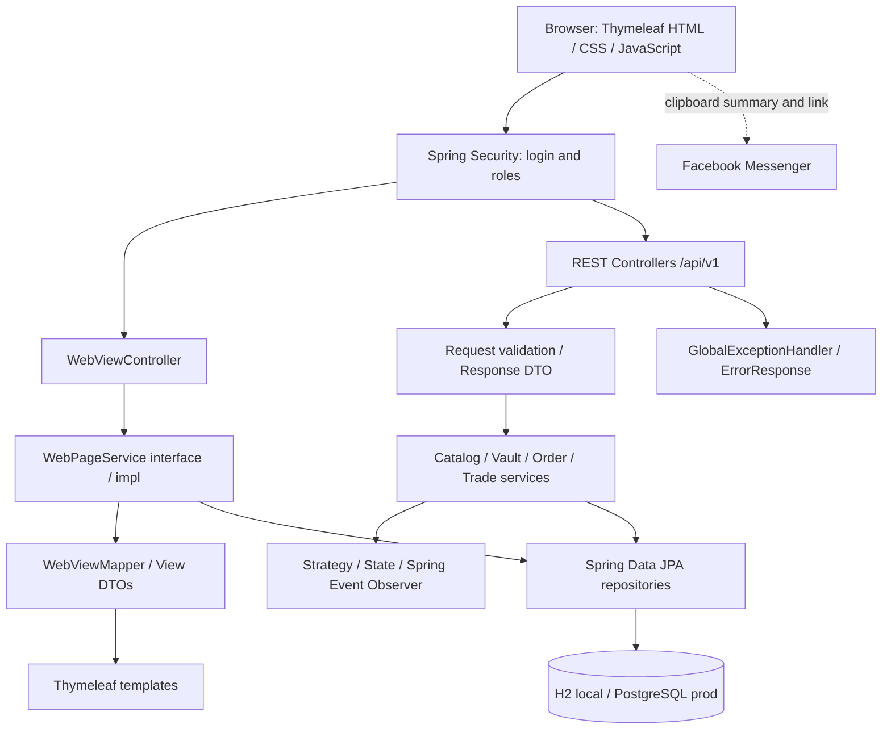
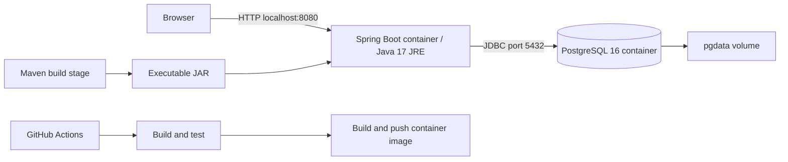

# Component & Deployment Diagrams

ตรวจเทียบโค้ด commit `ea2dcd7` วันที่ 9 ตุลาคม 2026; รอบนี้แก้เอกสาร ไม่ได้รันทดสอบใหม่

## Component: implementation ปัจจุบัน

```mermaid
flowchart TB
    Browser[Browser: Thymeleaf HTML / CSS / JavaScript] --> Security[Spring Security: login and roles]
    Security --> Web[WebViewController]
    Security --> REST[REST Controllers /api/v1]
    Web --> Page[WebPageService interface / impl]
    Page --> Mapper[WebViewMapper / View DTOs]
    Mapper --> Views[Thymeleaf templates]
    REST --> DTO[Request validation / Response DTO]
    DTO --> Services[Catalog / Vault / Order / Trade services]
    Services --> Patterns[Strategy / State / Spring Event Observer]
    Services --> Repo[Spring Data JPA repositories]
    Page --> Repo
    Repo --> DB[(H2 local / PostgreSQL prod)]
    REST --> Errors[GlobalExceptionHandler / ErrorResponse]
    Browser -. clipboard summary and link .-> Messenger[Facebook Messenger]
```

Controller ไม่เรียก Repository ตรง; Mapper ใช้กับ view DTO และ REST DTO ใช้ fromEntity/การแมปภายใน service ตามแต่ละ module
Messenger เป็นลิงก์เปิดแชทและข้อความที่ผู้ใช้คัดลอก ไม่ใช่ integration ส่งข้อความอัตโนมัติผ่าน Meta API

## Deployment: Docker Compose ที่กำหนดไว้ใน repository

```mermaid
flowchart LR
    Browser[Browser] -->|HTTP localhost:8080| App[Spring Boot container / Java 17 JRE]
    App -->|JDBC port 5432| PG[(PostgreSQL 16 container)]
    PG --> Volume[pgdata volume]
    Build[Maven build stage] --> Jar[Executable JAR]
    Jar --> App
    CI[GitHub Actions] --> Verify[Build and test]
    Verify --> Image[Build and push container image]
```

ดู [Dockerfile](../../code/Dockerfile), [Compose](../../code/docker-compose.yml), [CI](../../.github/workflows/ci-cd.yml)
Docker build ใช้ -DskipTests; test เป็นขั้นตอนแยกใน CI ไม่อ้างว่า Dockerfile รันทดสอบ

## Cloud deployment ที่ยังต้องส่งมอบ

ยังไม่มี public Production URL ใน README จึงยังไม่ยืนยันว่า deploy สำเร็จ
เมื่อ deploy ต้องตั้ง profile prod, JDBC URL, username/password และ PORT ตาม README แล้วตรวจหน้าเว็บ, Swagger และ health ผ่าน URL สาธารณะ
HTTPS reverse proxy, DB TLS และ host/resource size ต้องระบุตามค่าที่ provider ใช้จริง ไม่ถือว่าได้ตั้งค่าจากการมี diagram นี้
