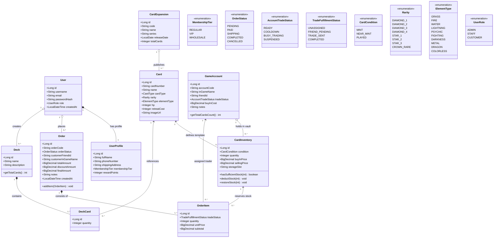

# Domain Model / Conceptual Class Diagram
## โครงการ: Pokémon TCG Pocket Vault & Chat Commerce Trade Platform
**หลักสูตร**: CP353002 Principles of Software Design and Development (Spring Boot)  
**ระเบียบวิธี**: Domain-Driven Design (DDD) Tactical Modeling & Ubiquitous Language

---

## 1. Domain Model Overview (ภาพรวมแบบจำลองโดเมน)

Domain Model แสดงแนวคิดเชิงธุรกิจ (Business Concepts), เอนทิตีหลัก (Entities), อ็อบเจกต์ค่า (Value Objects), ความสัมพันธ์และจำนวนนับ (Multiplicities) รวมถึงกฎความคงสภาพทางธุรกิจ (Domain Invariants) ของแพลตฟอร์มบริหารคลังการ์ดและการซื้อขายผ่าน Chat Commerce

---

## 2. กฎความคงสภาพของแบบจำลองโดเมน (Domain Invariants & Business Rules)

ในสถาปัตยกรรมการออกแบบเชิงวัตถุ กฎธุรกิจ (Business Invariants) จะต้องได้รับการตรวจสอบและควบคุมอย่างเข้มงวดภายในโดเมนโมเดล:

### 2.1 โมเดลบัญชีเกมคลังการ์ด (Game Account Vault & Card Inventory)
* **Invariant 1 (Account-Inventory Association)**: การ์ดแต่ละใบในสต็อกที่เปิดได้จากซอง (`CardInventory`) จะต้องถูกผูกเข้ากับ `GameAccount` เสมอ เพื่อให้ระบบทราบอย่างชัดเจนว่าการ์ดใบนี้อยู่ในกระเป๋าของไอดีใดในเกม
* **Invariant 2 (Non-negative Stock Quantity)**: จำนวนการ์ดในสต็อกจะต้องเป็นศูนย์หรือมากกว่าเสมอ (`quantity >= 0`) หากมีการสั่งซื้อและตัดสต็อก ระบบจะป้องกันไม่ให้สต็อกติดลบ (`deductStock() throws InsufficientStockException`)
* **Invariant 3 (Cost & Price Integrity)**: ราคาซื้อเข้า (`buyInPrice`) และราคาขายหน้าร้าน (`sellingPrice`) ต้องไม่ติดลบ เพื่อให้รายงานกำไรขั้นต้นมีความถูกต้อง

### 2.2 โมเดลคำสั่งซื้อ Chat Commerce (Order & Chat Commerce Handshake)
* **Invariant 4 (Frozen Historical Price)**: เมื่อลูกค้าทำการจองการ์ด ราคาต่อหน่วย (`unitPrice`) ในแถวรายการ `OrderItem` จะต้องถูกบันทึกคัดลอกมาจากราคาขายในสต็อก ณ วินาทีนั้น และจะไม่มีการเปลี่ยนแปลงตามราคาคลังในอนาคต
* **Invariant 5 (Discount Strategy Invariant)**: ส่วนลดของคำสั่งซื้อจะต้องคำนวณผ่าน **Strategy Pattern** โดยพิจารณาจาก `MembershipTier` ของลูกค้า:
  * `REGULAR`: ส่วนลด 0%
  * `VIP`: ส่วนลด 10%
  * `WHOLESALE`: ส่วนลด 15%
* **Invariant 6 (Order Balance Calculation)**: ยอดเงินสุทธิจะต้องมีค่าตรงตามสมการเสมอ:
  $$\text{finalAmount} = \text{totalAmount} - \text{discountAmount}$$
* **Invariant 7 (In-Game Trade Identifiers)**: เมื่อสร้างออเดอร์ ลูกค้าต้องระบุ `customerFriendId` (รหัสเพื่อน 16 หลัก) เพื่อใช้เป็นพิกัดสำหรับให้ไอดีร้านส่งคำขอเป็นเพื่อนในเกม

### 2.3 โมเดลการจับคู่เทรดในเกม (In-Game Trade Matching)
* **Invariant 8 (Single Active Trader Assignment)**: แต่ละรายการการ์ด `OrderItem` จะต้องถูกมอบหมายให้กับ `GameAccount` เพียงไอดีเดียวเท่านั้นที่เป็นเจ้าของสต็อกการ์ดใบนั้น
* **Invariant 9 (Account Trade Readiness)**: ไอดีเกมที่จะได้รับคัดเลือกให้เป็นผู้ส่งการ์ดเทรด ต้องมีสถานะเป็น `READY` เท่านั้น (ไม่ติด `COOLDOWN`, ไม่ติด `BUSY_TRADING`, และไม่ติด `SUSPENDED`)

### 2.4 โมเดลการจัดเด็ค (Deck & DeckCard Constraints)
* **Invariant 10 (Card Copy Limit)**: ตามกฎสากลของเกม Pokémon TCG Pocket เด็คหนึ่งจะใส่การ์ดที่มีชื่อและเลขชุดเดียวกันได้ไม่เกิน **2 ใบ** (`quantity BETWEEN 1 AND 2`)

---

## 3. พจนานุกรมภาษาเฉพาะโดเมน (Ubiquitous Language Dictionary)

เพื่อให้การสื่อสารระหว่างทีมพัฒนา ซอฟต์แวร์ และผู้ใช้งานเป็นไปในทิศทางเดียวกัน จึงกำหนดศัพท์เฉพาะทางโดเมนไว้ดังนี้:

| คำศัพท์โดเมน (Term) | บริบททางธุรกิจ (Business Context) | ความหมายในระบบซอฟต์แวร์ (Software Meaning) |
| :--- | :--- | :--- |
| **Booster Pack Pull** | การเปิดซองการ์ดในเกมแล้วได้การ์ดหายาก | การสร้างเรคคอร์ด `CardInventory` ผูกเข้ากับ `GameAccount` ผ่านคำสั่ง `+ Add Pull` |
| **Game Account Vault** | ไอดีเกมของร้านที่ใช้เก็บสะสมการ์ด | เอนทิตี `GameAccount` ที่มีรหัสเพื่อนในเกม (Friend ID) และสถานะความพร้อมในการเทรด |
| **Chat Commerce Flow** | การกดจองบนเว็บแล้วเด้งไปคุยในแชท | โฟลว์การทำงานที่เว็บสร้าง Order Code จริง และเปิดปุ่ม Deep Link ส่งต่อไปยัง Facebook Messenger พร้อมข้อความสรุปออเดอร์ |
| **In-Game Trade Matching**| การจับคู่ไอดีเกมที่ถือการ์ดให้ออเดอร์ | กระบวนการใน `TradeMatchingService` ที่จับคู่ `assigned_account_id` ให้กับ `OrderItem` |
| **Trade Quota & Cooldown**| ข้อจำกัดการเทรดในเกมต่อวัน | การติดตามสถานะ `trade_status` ของบัญชีเกม เพื่อป้องกันการส่งคำขอเพื่อนหรือเทรดเกินขีดจำกัด |
| **Frozen Price** | การคงราคาขาย ณ วันที่สั่งซื้อ | การบันทึก `unit_price` ใน `order_items` ให้เป็นอิสระจากราคาใน `card_inventories` |
| **Holographic Shader** | เอฟเฟกต์โฮโลแกรม 3 มิติสะท้อนแสง | ระบบ CSS3 3D Transform & Shader Math บนหน้า Frontend ที่คำนวณการเอียงตามตำแหน่งเมาส์ |
