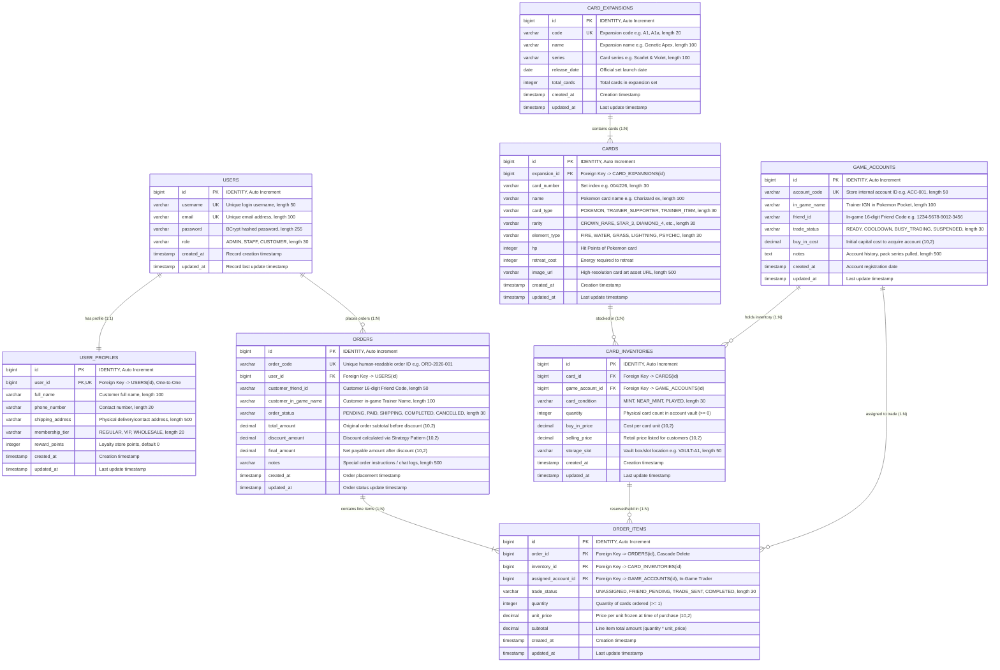

# Entity Relationship Diagram (ER Diagram) & Database Schema
## โครงการ: Pokémon TCG Pocket Vault & Chat Commerce Trade Platform
**หลักสูตร**: CP353002 Principles of Software Design and Development (Spring Boot)  
**สถาปัตยกรรมฐานข้อมูล**: Relational Database Schema (PostgreSQL / H2)  
**มาตรฐานการออกแบบ**: Third Normal Form (3NF) & Boyce-Codd Normal Form (BCNF)

---

## 1. Entity Relationship Diagram (Crow's Foot Notation)

แผนภาพแสดงความสัมพันธ์เชิงโครงสร้างของข้อมูลทั้ง 8 ตารางในระบบ ครอบคลุมคลังการ์ด, บัญชีเกมที่ใช้เปิดซองสะสม, และระบบคำสั่งซื้อ Chat Commerce Trade Platform



---

## 2. พจนานุกรมข้อมูลฉบับสมบูรณ์ (Comprehensive Data Dictionary)

### 2.1 ตาราง `users` (ตารางหลักสำหรับบัญชีผู้ใช้งานระบบ)
* **คำอธิบาย**: บันทึกข้อมูลบัญชีผู้ใช้งาน ทั้งลูกค้าทั่วไป (Customer), พนักงานร้าน (Staff), และผู้ดูแลระบบ (Admin)

| ชื่อคอลัมน์ (Column Name) | ชนิดข้อมูล (Data Type) | Nullable | คีย์ / ข้อจำกัด (Constraints) | ค่าเริ่มต้น (Default) | คำอธิบายและความหมายทางธุรกิจ (Description & Business Rules) |
| :--- | :--- | :---: | :--- | :---: | :--- |
| `id` | `BIGINT` | NO | **PK**, `IDENTITY`, Auto-Increment | - | รหัสอ้างอิงหลักประจำตัวผู้ใช้งาน |
| `username` | `VARCHAR(50)` | NO | **UK**, Unique Index (`idx_user_username`) | - | ชื่อผู้ใช้งานสำหรับเข้าสู่ระบบ (ห้ามซ้ำ) |
| `email` | `VARCHAR(100)` | NO | **UK**, Unique Index (`idx_user_email`) | - | อีเมลสำหรับรับการแจ้งเตือนและการกู้คืนรหัสผ่าน (ห้ามซ้ำ) |
| `password` | `VARCHAR(255)` | NO | `NOT NULL` | - | รหัสผ่านที่ผ่านการแฮชด้วยอัลกอริทึม BCrypt (ความปลอดภัยสูง) |
| `role` | `VARCHAR(30)` | NO | `NOT NULL`, Enum (`UserRole`) | - | บทบาทผู้ใช้งาน: `ADMIN`, `STAFF`, `CUSTOMER` |
| `created_at` | `TIMESTAMP` | NO | `NOT NULL`, Updatable = `false` | `NOW()` | วันที่และเวลาที่สร้างเรคคอร์ด (จาก `BaseEntity`) |
| `updated_at` | `TIMESTAMP` | YES | - | `NOW()` | วันที่และเวลาที่มีการแก้ไขเรคคอร์ดล่าสุด (จาก `BaseEntity`) |

---

### 2.2 ตาราง `user_profiles` (ข้อมูลส่วนบุคคลและสถานะสมาชิก)
* **คำอธิบาย**: จัดเก็บข้อมูลโปรไฟล์เพิ่มเติมของลูกค้า แยกออกจากตาราง `users` ตามหลัก Single Responsibility Principle (SRP)
* **ความสัมพันธ์**: เชื่อมโยงกับ `users` แบบ **One-to-One (1:1)**

| ชื่อคอลัมน์ (Column Name) | ชนิดข้อมูล (Data Type) | Nullable | คีย์ / ข้อจำกัด (Constraints) | ค่าเริ่มต้น (Default) | คำอธิบายและความหมายทางธุรกิจ (Description & Business Rules) |
| :--- | :--- | :---: | :--- | :---: | :--- |
| `id` | `BIGINT` | NO | **PK**, `IDENTITY`, Auto-Increment | - | รหัสอ้างอิงหลักประจำโปรไฟล์ |
| `user_id` | `BIGINT` | NO | **FK**, **UK** $\rightarrow$ `users(id)`, Unique | - | รหัสผู้ใช้งานที่ผูกกับโปรไฟล์นี้ (1 ผู้ใช้งานมีได้เพียง 1 โปรไฟล์) |
| `full_name` | `VARCHAR(100)` | NO | `NOT NULL` | - | ชื่อ-นามสกุลจริงของลูกค้า |
| `phone_number` | `VARCHAR(20)` | YES | - | `NULL` | หมายเลขโทรศัพท์ติดต่อสำหรับส่งพัสดุหรือประสานงาน |
| `shipping_address` | `VARCHAR(500)` | YES | - | `NULL` | ที่อยู่จัดส่งกรณีมีการซื้อสินค้าที่เป็นการ์ดจริงหรือของสะสม |
| `membership_tier` | `VARCHAR(20)` | NO | `NOT NULL`, Enum (`MembershipTier`) | `'REGULAR'` | ระดับสมาชิกสำหรับใช้ใน **Strategy Pattern**: `REGULAR`, `VIP`, `WHOLESALE` |
| `reward_points` | `INTEGER` | NO | `NOT NULL`, `CHECK(reward_points >= 0)` | `0` | คะแนนสะสมจากการซื้อสินค้า เพื่อใช้แลกสิทธิ์หรือส่วนลด |
| `created_at` | `TIMESTAMP` | NO | `NOT NULL` | `NOW()` | วันที่สร้างโปรไฟล์ |
| `updated_at` | `TIMESTAMP` | YES | - | `NOW()` | วันที่อัปเดตโปรไฟล์ล่าสุด |

---

### 2.3 ตาราง `card_expansions` (ชุดซีรีส์ซองการ์ด / Expansions)
* **คำอธิบาย**: บันทึกชุดซองการ์ดโปเกมอน (Booster Pack Series) ของเกม Pokémon TCG Pocket

| ชื่อคอลัมน์ (Column Name) | ชนิดข้อมูล (Data Type) | Nullable | คีย์ / ข้อจำกัด (Constraints) | ค่าเริ่มต้น (Default) | คำอธิบายและความหมายทางธุรกิจ (Description & Business Rules) |
| :--- | :--- | :---: | :--- | :---: | :--- |
| `id` | `BIGINT` | NO | **PK**, `IDENTITY`, Auto-Increment | - | รหัสอ้างอิงชุดซองการ์ด |
| `code` | `VARCHAR(20)` | NO | **UK**, Unique Index (`idx_expansion_code`) | - | รหัสย่อของชุด เช่น `A1` (Genetic Apex), `A1a` (Mythical Island) |
| `name` | `VARCHAR(100)` | NO | `NOT NULL` | - | ชื่อเต็มของชุดซอง เช่น "Genetic Apex" |
| `series` | `VARCHAR(100)` | YES | - | `NULL` | ชื่อซีรีส์หลัก เช่น "Scarlet & Violet" |
| `release_date` | `DATE` | YES | - | `NULL` | วันที่เปิดตัวชุดซองอย่างเป็นทางการในเกม |
| `total_cards` | `INTEGER` | YES | `CHECK(total_cards > 0)` | `NULL` | จำนวนการ์ดทั้งหมดในชุด (ไม่รวมการ์ดลับ Secret Rare) |
| `created_at` | `TIMESTAMP` | NO | `NOT NULL` | `NOW()` | วันที่เพิ่มชุดซองเข้าระบบ |
| `updated_at` | `TIMESTAMP` | YES | - | `NOW()` | วันที่แก้ไขชุดซอง |

---

### 2.4 ตาราง `cards` (แคตตาล็อกการ์ดโปเกมอนต้นแบบ)
* **คำอธิบาย**: แคตตาล็อกข้อมูลการ์ดโปเกมอนทั้งหมด (Master Data) โดย 1 ใบการ์ดจะมีสต็อกเก็บอยู่ในคลังได้หลายแห่ง
* **ความสัมพันธ์**: เชื่อมโยงกับ `card_expansions` แบบ **Many-to-One (N:1)**

| ชื่อคอลัมน์ (Column Name) | ชนิดข้อมูล (Data Type) | Nullable | คีย์ / ข้อจำกัด (Constraints) | ค่าเริ่มต้น (Default) | คำอธิบายและความหมายทางธุรกิจ (Description & Business Rules) |
| :--- | :--- | :---: | :--- | :---: | :--- |
| `id` | `BIGINT` | NO | **PK**, `IDENTITY`, Auto-Increment | - | รหัสอ้างอิงแม่แบบการ์ด |
| `expansion_id` | `BIGINT` | NO | **FK** $\rightarrow$ `card_expansions(id)` | - | ชุดซองที่การ์ดนี้สังกัด |
| `card_number` | `VARCHAR(30)` | NO | Composite Unique (`expansion_id, card_number`) | - | ลำดับการ์ดในชุด เช่น "004/226", "280/226" |
| `name` | `VARCHAR(100)` | NO | `NOT NULL`, Index (`idx_card_name`) | - | ชื่อการ์ด เช่น "Charizard ex", "Mewtwo ex", "Pikachu" |
| `card_type` | `VARCHAR(30)` | NO | `NOT NULL`, Enum (`CardType`) | - | ประเภทการ์ด: `POKEMON`, `TRAINER_SUPPORTER`, `TRAINER_ITEM` |
| `rarity` | `VARCHAR(30)` | NO | `NOT NULL`, Index (`idx_card_rarity`) | - | ระดับความหายาก: `DIAMOND_1` ถึง `4`, `STAR_1` ถึง `3`, `CROWN_RARE` |
| `element_type` | `VARCHAR(30)` | NO | `NOT NULL`, Enum (`ElementType`) | - | ธาตุของการ์ด: `FIRE`, `WATER`, `GRASS`, `LIGHTNING`, `PSYCHIC` ฯลฯ |
| `hp` | `INTEGER` | YES | `CHECK(hp >= 0)` | `NULL` | พลังชีวิตของการ์ด (มีเฉพาะการ์ดโปเกมอน) |
| `retreat_cost` | `INTEGER` | YES | `CHECK(retreat_cost >= 0)` | `NULL` | จำนวนพลังงานที่ต้องจ่ายเพื่อหนี (Retreat Cost) |
| `image_url` | `VARCHAR(500)` | YES | - | `NULL` | ที่อยู่รูปภาพการ์ดแบบความละเอียดสูงสำหรับแสดงผล 3D Shaders |
| `created_at` | `TIMESTAMP` | NO | `NOT NULL` | `NOW()` | วันที่บันทึกการ์ดเข้าระบบ |
| `updated_at` | `TIMESTAMP` | YES | - | `NOW()` | วันที่แก้ไขข้อมูลการ์ด |

---

### 2.5 ตาราง `game_accounts` (บัญชีเกม Pokémon Pocket ที่ร้านถือครอง)
* **คำอธิบาย**: หัวใจหลักของโมเดลธุรกิจ! ร้านค้าซื้อไอดีเกมมาเปิดซองสะสมการ์ด ไอดีเกมแต่ละบัญชีจะมีรหัสเพื่อน (Friend Code) เพื่อใช้ล็อกอินเข้าไปกดส่งคำขอเป็นเพื่อนและส่งการ์ดเทรดในเกมให้ลูกค้า

| ชื่อคอลัมน์ (Column Name) | ชนิดข้อมูล (Data Type) | Nullable | คีย์ / ข้อจำกัด (Constraints) | ค่าเริ่มต้น (Default) | คำอธิบายและความหมายทางธุรกิจ (Description & Business Rules) |
| :--- | :--- | :---: | :--- | :---: | :--- |
| `id` | `BIGINT` | NO | **PK**, `IDENTITY`, Auto-Increment | - | รหัสอ้างอิงไอดีเกม |
| `account_code` | `VARCHAR(50)` | NO | **UK**, Unique Index (`idx_account_code`) | - | รหัสกำกับไอดีภายในร้าน เช่น `ACC-001`, `ACC-KANTO-02` |
| `in_game_name` | `VARCHAR(100)` | NO | `NOT NULL` | - | ชื่อเทรนเนอร์ (Trainer IGN) ของไอดีในเกม Pokémon Pocket |
| `friend_id` | `VARCHAR(50)` | NO | `NOT NULL`, Index (`idx_account_friend_id`) | - | รหัสเพื่อนในเกม 16 หลัก เช่น "1234-5678-9012-3456" |
| `trade_status` | `VARCHAR(30)` | NO | `NOT NULL`, Index (`idx_account_trade_status`) | `'READY'` | สถานะไอดี: `READY` (พร้อมเทรด), `COOLDOWN` (ติดรอเวลา), `BUSY_TRADING` (กำลังเทรด), `SUSPENDED` (ระงับชั่วคราว) |
| `buy_in_cost` | `DECIMAL(10,2)`| YES | `CHECK(buy_in_cost >= 0)` | `0.00` | ต้นทุนเงินจริงที่ร้านใช้ซื้อบัญชีนี้มา หรือต้นทุนเปิดซอง |
| `notes` | `VARCHAR(500)` | YES | - | `NULL` | บันทึกประวัติ เช่น "ไอดีนี้เปิดเฉพาะซอง Charizard Pack ชุด A1" |
| `created_at` | `TIMESTAMP` | NO | `NOT NULL` | `NOW()` | วันที่ลงทะเบียนไอดีเกม |
| `updated_at` | `TIMESTAMP` | YES | - | `NOW()` | วันที่อัปเดตข้อมูลไอดี |

---

### 2.6 ตาราง `card_inventories` (สต็อกการ์ดที่ถูกเก็บอยู่ในไอดีเกมแต่ละบัญชี)
* **คำอธิบาย**: บันทึกรายการการ์ดที่มีอยู่จริงในแต่ละไอดีเกม รวมถึงราคาต้นทุนและราคาขาย
* **ความสัมพันธ์**: `CARDS` (1) ➔ `CARD_INVENTORIES` (N) และ `GAME_ACCOUNTS` (1) ➔ `CARD_INVENTORIES` (N)

| ชื่อคอลัมน์ (Column Name) | ชนิดข้อมูล (Data Type) | Nullable | คีย์ / ข้อจำกัด (Constraints) | ค่าเริ่มต้น (Default) | คำอธิบายและความหมายทางธุรกิจ (Description & Business Rules) |
| :--- | :--- | :---: | :--- | :---: | :--- |
| `id` | `BIGINT` | NO | **PK**, `IDENTITY`, Auto-Increment | - | รหัสอ้างอิงเรคคอร์ดสต็อกในคลัง |
| `card_id` | `BIGINT` | NO | **FK** $\rightarrow$ `cards(id)`, Index | - | รหัสการ์ดใบที่เก็บอยู่ในสต็อกนี้ |
| `game_account_id` | `BIGINT` | YES | **FK** $\rightarrow$ `game_accounts(id)`, Index | `NULL` | รหัสไอดีเกมที่เป็นเจ้าของถือครองการ์ดใบนี้ (สำคัญมากต่อการจับคู่เทรด) |
| `card_condition` | `VARCHAR(30)` | NO | `NOT NULL`, Enum (`CardCondition`) | - | สภาพการ์ด: `MINT` (เปิดได้ใหม่ 100%), `NEAR_MINT`, `PLAYED` |
| `quantity` | `INTEGER` | NO | `NOT NULL`, `CHECK(quantity >= 0)` | `0` | จำนวนใบที่พร้อมจำหน่ายในไอดีนี้ (ห้ามติดลบ) |
| `buy_in_price` | `DECIMAL(10,2)`| NO | `NOT NULL`, `CHECK(buy_in_price >= 0)` | `0.00` | ต้นทุนเฉลี่ยต่อใบ (สำหรับคำนวณกำไร-ขาดทุน) |
| `selling_price` | `DECIMAL(10,2)`| NO | `NOT NULL`, `CHECK(selling_price >= 0)`| `0.00` | ราคาขายหน้าร้านที่ลูกค้าต้องชำระก่อนหักส่วนลด |
| `storage_slot` | `VARCHAR(50)` | YES | - | `NULL` | ตำแหน่งจัดเก็บ เช่น "VAULT-A1", "VAULT-B2" |
| `created_at` | `TIMESTAMP` | NO | `NOT NULL` | `NOW()` | วันที่นำการ์ดเข้าสต็อก |
| `updated_at` | `TIMESTAMP` | YES | - | `NOW()` | วันที่มีการตัดสต็อกหรือปรับราคาล่าสุด |

---

### 2.7 ตาราง `orders` (คำสั่งซื้อการ์ดผ่านระบบ Chat Commerce)
* **คำอธิบาย**: บันทึกคำสั่งซื้อที่ลูกค้ากดสั่งจองจากหน้าเว็บ จัดเก็บพิกัดในเกมของลูกค้า และยอดเงินที่คำนวณผ่าน **Strategy Pattern**
* **ความสัมพันธ์**: `USERS` (1) ➔ `ORDERS` (N)

| ชื่อคอลัมน์ (Column Name) | ชนิดข้อมูล (Data Type) | Nullable | คีย์ / ข้อจำกัด (Constraints) | ค่าเริ่มต้น (Default) | คำอธิบายและความหมายทางธุรกิจ (Description & Business Rules) |
| :--- | :--- | :---: | :--- | :---: | :--- |
| `id` | `BIGINT` | NO | **PK**, `IDENTITY`, Auto-Increment | - | รหัสอ้างอิงคำสั่งซื้อ |
| `order_code` | `VARCHAR(50)` | NO | **UK**, Unique Index (`idx_order_code`) | - | รหัสคำสั่งซื้อที่ไม่ซ้ำกันสำหรับใช้อ้างอิงในแชท เช่น `ORD-2026-001` |
| `user_id` | `BIGINT` | NO | **FK** $\rightarrow$ `users(id)`, Index | - | ผู้ใช้งานที่ทำการสั่งซื้อ |
| `customer_friend_id` | `VARCHAR(50)` | YES | - | `NULL` | รหัสเพื่อนในเกม 16 หลักของลูกค้าที่ใช้รับการ์ดเทรด |
| `customer_in_game_name` | `VARCHAR(100)` | YES | - | `NULL` | ชื่อเทรนเนอร์ในเกมของลูกค้า ป้องกันการส่งเทรดผิดคน |
| `order_status` | `VARCHAR(30)` | NO | `NOT NULL`, Index (`idx_order_status`) | `'PENDING'` | สถานะคำสั่งซื้อตาม **State Pattern**: `PENDING`, `PAID`, `SHIPPING`, `COMPLETED`, `CANCELLED` |
| `total_amount` | `DECIMAL(10,2)`| NO | `NOT NULL`, `CHECK(total_amount >= 0)` | `0.00` | ยอดรวมก่อนหักส่วนลด (Subtotal) |
| `discount_amount` | `DECIMAL(10,2)`| NO | `NOT NULL`, `CHECK(discount_amount >= 0)`| `0.00` | ยอดส่วนลดที่ได้รับจาก **DiscountStrategy** (0%, 10%, 15%) |
| `final_amount` | `DECIMAL(10,2)`| NO | `NOT NULL`, `CHECK(final_amount >= 0)` | `0.00` | ยอดสุทธิที่ลูกค้าต้องโอนเงินจริง (`total_amount - discount_amount`) |
| `notes` | `VARCHAR(500)` | YES | - | `NULL` | ข้อความเพิ่มเติม เช่น เวลาที่สะดวกรับเทรดในเกม |
| `created_at` | `TIMESTAMP` | NO | `NOT NULL` | `NOW()` | วันที่และเวลากดสั่งจองบนเว็บ |
| `updated_at` | `TIMESTAMP` | YES | - | `NOW()` | วันที่และเวลาที่มีการเปลี่ยนสถานะคำสั่งซื้อ |

---

### 2.8 ตาราง `order_items` (รายการการ์ดในคำสั่งซื้อและการจับคู่ไอดีเทรด)
* **คำอธิบาย**: แต่ละแถวแทนรายการการ์ดที่สั่งซื้อ พร้อมบันทึกว่า **ถูกจับคู่ให้ไอดีเกมใดของร้าน (`assigned_account_id`) เป็นผู้ส่งการ์ดเทรดให้ลูกค้า**
* **ความสัมพันธ์**: `ORDERS` (1) ➔ `ORDER_ITEMS` (N) และ `GAME_ACCOUNTS` (1) ➔ `ORDER_ITEMS` (N)

| ชื่อคอลัมน์ (Column Name) | ชนิดข้อมูล (Data Type) | Nullable | คีย์ / ข้อจำกัด (Constraints) | ค่าเริ่มต้น (Default) | คำอธิบายและความหมายทางธุรกิจ (Description & Business Rules) |
| :--- | :--- | :---: | :--- | :---: | :--- |
| `id` | `BIGINT` | NO | **PK**, `IDENTITY`, Auto-Increment | - | รหัสอ้างอิงรายการสินค้าในออเดอร์ |
| `order_id` | `BIGINT` | NO | **FK** $\rightarrow$ `orders(id)`, Cascade Delete | - | คำสั่งซื้อที่รายการนี้สังกัดอยู่ |
| `inventory_id` | `BIGINT` | NO | **FK** $\rightarrow$ `card_inventories(id)` | - | การ์ดในคลังที่ถูกสั่งซื้อและหักสำรองไว้ |
| `assigned_account_id` | `BIGINT` | YES | **FK** $\rightarrow$ `game_accounts(id)` | `NULL` | ไอดีเกมของร้านที่ได้รับมอบหมายให้เป็นผู้ล็อกอินเข้าไปกดส่งการ์ดเทรด |
| `trade_status` | `VARCHAR(30)` | YES | Enum (`TradeFulfillmentStatus`) | `'UNASSIGNED'` | สถานะการเทรดในเกม: `UNASSIGNED`, `FRIEND_PENDING`, `TRADE_SENT`, `COMPLETED` |
| `quantity` | `INTEGER` | NO | `NOT NULL`, `CHECK(quantity >= 1)` | `1` | จำนวนใบที่สั่งซื้อในรายการนี้ |
| `unit_price` | `DECIMAL(10,2)`| NO | `NOT NULL`, `CHECK(unit_price >= 0)` | `0.00` | ราคาต่อหน่วยที่ถูกฟรีซไว้ ณ วินาทีที่สั่งซื้อ (ป้องกันราคาเปลี่ยนภายหลัง) |
| `subtotal` | `DECIMAL(10,2)`| NO | `NOT NULL`, `CHECK(subtotal >= 0)` | `0.00` | ราคารวมของรายการนี้ (`quantity * unit_price`) |
| `created_at` | `TIMESTAMP` | NO | `NOT NULL` | `NOW()` | วันที่สร้างรายการ |
| `updated_at` | `TIMESTAMP` | YES | - | `NOW()` | วันที่อัปเดตสถานะการเทรด |

---

## 3. การวิเคราะห์ความสัมพันธ์และ Cardinality (JPA Mapping Analysis)

| ตารางหลัก (Parent Entity) | ตารางลูก (Child Entity) | ความสัมพันธ์ (Cardinality) | Foreign Key Column | การตั้งค่า JPA Annotations | พฤติกรรมเมื่อลบข้อมูล (Cascade / Orphan Behavior) |
| :--- | :--- | :---: | :--- | :--- | :--- |
| **`users`** | **`user_profiles`** | **1 : 1** (One-to-One) | `user_profiles.user_id` | `@OneToOne(cascade = CascadeType.ALL, fetch = FetchType.LAZY, orphanRemoval = true)` | เมื่อลบ `User`, โปรไฟล์ของ User นั้นจะถูกลบทิ้งอัตโนมัติ |
| **`users`** | **`orders`** | **1 : N** (One-to-Many) | `orders.user_id` | `@OneToMany(mappedBy = "user", cascade = CascadeType.ALL, fetch = FetchType.LAZY)` | User 1 คนสามารถมีประวัติคำสั่งซื้อได้หลายออเดอร์ |
| **`orders`** | **`order_items`** | **1 : N** (One-to-Many) | `order_items.order_id` | `@OneToMany(mappedBy = "order", cascade = CascadeType.ALL, orphanRemoval = true)` | เมื่อลบ Order รายการสินค้าทั้งหมดในออเดอร์นั้นจะถูกลบตามทันที (Cascade Delete) |
| **`card_expansions`** | **`cards`** | **1 : N** (One-to-Many) | `cards.expansion_id` | `@OneToMany(mappedBy = "expansion", fetch = FetchType.LAZY)` | 1 ชุดซองประกอบด้วยการ์ดหลายใบ |
| **`cards`** | **`card_inventories`** | **1 : N** (One-to-Many) | `card_inventories.card_id` | `@ManyToOne(fetch = FetchType.LAZY)` ฝั่งลูก | การ์ด 1 ใบสามารถกระจายเก็บอยู่ในคลังหรือไอดีเกมหลายบัญชีได้ |
| **`game_accounts`** | **`card_inventories`** | **1 : N** (One-to-Many) | `card_inventories.game_account_id` | `@OneToMany(mappedBy = "gameAccount", cascade = CascadeType.ALL, fetch = FetchType.LAZY)` | ไอดีเกม 1 ไอดีถือครองการ์ดในคลังได้หลายใบ และเมื่อบันทึกการเปิดซอง (`+ Add Pull`) จะผูกเข้ากับไอดีนี้ |
| **`game_accounts`** | **`order_items`** | **1 : N** (One-to-Many) | `order_items.assigned_account_id` | `@ManyToOne(fetch = FetchType.LAZY)` ฝั่งลูก | ไอดีเกม 1 บัญชีสามารถรับมอบหมายให้ทำหน้าที่ส่งเทรดการ์ดในหลายๆ ออเดอร์ได้ |

---

## 4. การพิสูจน์มาตรฐานการออกแบบฐานข้อมูล (Database Normalization Proof)

โครงสร้างฐานข้อมูลของระบบได้รับการออกแบบตามหลักเกณฑ์การทำให้เป็นบรรทัดฐาน (Normalization) อย่างเคร่งครัด เพื่อป้องกันความซ้ำซ้อน (Redundancy) และข้อผิดพลาดในการจัดการข้อมูล (Anomalies):

1. **First Normal Form (1NF) - Atomic Values**:
   - ทุกคอลัมน์ในทุกตารางเก็บข้อมูลที่เป็นหน่วยย่อยที่สุด (Atomic Value) ไม่มีการเก็บลิสต์ของข้อมูลรวมในฟิลด์เดียว (เช่น รายการการ์ดในออเดอร์ถูกแยกเป็นตาราง `order_items` แทนที่จะเก็บเป็นสตริงคั่นด้วยเครื่องหมายจุลภาคในตาราง `orders`)
   - ทุกตารางมี Primary Key กำกับชัดเจน
2. **Second Normal Form (2NF) - Full Functional Dependency**:
   - ทุกตารางมี Primary Key เป็น Single Column Identity (`id`) และฟิลด์ทุกฟิลด์ขึ้นตรงกับ Primary Key ทั้งหมดอย่างสมบูรณ์ สำหรับตารางความสัมพันธ์อย่าง `card_inventories` และ `order_items` ข้อมูล attribute ทุกตัวขึ้นตรงกับ Surrogate Key และ FK อย่างสมบูรณ์ ไม่มีการขึ้นตรงกับเพียงบางส่วนของคีย์ (No Partial Dependency)
3. **Third Normal Form (3NF) - No Transitive Dependency**:
   - ข้อมูลทุกคอลัมน์ขึ้นตรงกับ Primary Key โดยตรง ไม่มีการขึ้นต่อกันเป็นทอดๆ เช่น ในตาราง `orders` จะไม่เก็บชื่อจริง ที่อยู่ หรือระดับสมาชิกของลูกค้าไว้ แต่จะเก็บเฉพาะ `user_id` เท่านั้น เพื่อให้ดึงข้อมูลจาก `users` และ `user_profiles` เมื่อจำเป็น (ป้องกันปัญหา Update Anomaly)
   - ในตาราง `order_items` มีการจัดเก็บ `unit_price` และ `subtotal` แยกไว้เฉพาะเจาะจง เพราะเป็นราคาประวัติศาสตร์ (Historical Snapshot) ณ วินาทีที่มีการสั่งซื้อจริง เพื่อป้องกันผลกระทบเมื่อราคาขายของการ์ดในคลัง (`card_inventories.selling_price`) มีการปรับขึ้นหรือลงในอนาคต

---

## 5. สคริปต์สร้างฐานข้อมูลมาตรฐาน (Production DDL Script)

สคริปต์ SQL ด้านล่างสามารถนำไปรันบนระบบจัดการฐานข้อมูล PostgreSQL หรือ H2 Database ได้ทันที:

```sql
-- ====================================================================
-- Pokémon TCG Pocket Vault & Chat Commerce Schema Definition (DDL)
-- Course: CP353002 Principles of Software Design and Development
-- ====================================================================

-- 1. Table: users
CREATE TABLE users (
    id BIGSERIAL PRIMARY KEY,
    username VARCHAR(50) NOT NULL,
    email VARCHAR(100) NOT NULL,
    password VARCHAR(255) NOT NULL,
    role VARCHAR(30) NOT NULL,
    created_at TIMESTAMP NOT NULL DEFAULT CURRENT_TIMESTAMP,
    updated_at TIMESTAMP DEFAULT CURRENT_TIMESTAMP,
    CONSTRAINT uk_user_username UNIQUE (username),
    CONSTRAINT uk_user_email UNIQUE (email)
);
CREATE INDEX idx_user_username ON users(username);
CREATE INDEX idx_user_email ON users(email);

-- 2. Table: user_profiles
CREATE TABLE user_profiles (
    id BIGSERIAL PRIMARY KEY,
    user_id BIGINT NOT NULL,
    full_name VARCHAR(100) NOT NULL,
    phone_number VARCHAR(20),
    shipping_address VARCHAR(500),
    membership_tier VARCHAR(20) NOT NULL DEFAULT 'REGULAR',
    reward_points INTEGER NOT NULL DEFAULT 0,
    created_at TIMESTAMP NOT NULL DEFAULT CURRENT_TIMESTAMP,
    updated_at TIMESTAMP DEFAULT CURRENT_TIMESTAMP,
    CONSTRAINT uk_profile_user UNIQUE (user_id),
    CONSTRAINT fk_profile_user FOREIGN KEY (user_id) REFERENCES users(id) ON DELETE CASCADE,
    CONSTRAINT chk_profile_reward_points CHECK (reward_points >= 0)
);

-- 3. Table: card_expansions
CREATE TABLE card_expansions (
    id BIGSERIAL PRIMARY KEY,
    code VARCHAR(20) NOT NULL,
    name VARCHAR(100) NOT NULL,
    series VARCHAR(100),
    release_date DATE,
    total_cards INTEGER,
    created_at TIMESTAMP NOT NULL DEFAULT CURRENT_TIMESTAMP,
    updated_at TIMESTAMP DEFAULT CURRENT_TIMESTAMP,
    CONSTRAINT uk_expansion_code UNIQUE (code),
    CONSTRAINT chk_expansion_total CHECK (total_cards > 0)
);
CREATE INDEX idx_expansion_code ON card_expansions(code);

-- 4. Table: cards
CREATE TABLE cards (
    id BIGSERIAL PRIMARY KEY,
    expansion_id BIGINT NOT NULL,
    card_number VARCHAR(30) NOT NULL,
    name VARCHAR(100) NOT NULL,
    card_type VARCHAR(30) NOT NULL,
    rarity VARCHAR(30) NOT NULL,
    element_type VARCHAR(30) NOT NULL,
    hp INTEGER,
    retreat_cost INTEGER,
    image_url VARCHAR(500),
    created_at TIMESTAMP NOT NULL DEFAULT CURRENT_TIMESTAMP,
    updated_at TIMESTAMP DEFAULT CURRENT_TIMESTAMP,
    CONSTRAINT fk_card_expansion FOREIGN KEY (expansion_id) REFERENCES card_expansions(id) ON DELETE RESTRICT,
    CONSTRAINT uk_card_expansion_number UNIQUE (expansion_id, card_number),
    CONSTRAINT chk_card_hp CHECK (hp >= 0),
    CONSTRAINT chk_card_retreat CHECK (retreat_cost >= 0)
);
CREATE INDEX idx_card_name ON cards(name);
CREATE INDEX idx_card_rarity ON cards(rarity);

-- 5. Table: game_accounts
CREATE TABLE game_accounts (
    id BIGSERIAL PRIMARY KEY,
    account_code VARCHAR(50) NOT NULL,
    in_game_name VARCHAR(100) NOT NULL,
    friend_id VARCHAR(50) NOT NULL,
    trade_status VARCHAR(30) NOT NULL DEFAULT 'READY',
    buy_in_cost DECIMAL(10,2) DEFAULT 0.00,
    notes VARCHAR(500),
    created_at TIMESTAMP NOT NULL DEFAULT CURRENT_TIMESTAMP,
    updated_at TIMESTAMP DEFAULT CURRENT_TIMESTAMP,
    CONSTRAINT uk_account_code UNIQUE (account_code),
    CONSTRAINT chk_account_buy_in CHECK (buy_in_cost >= 0.00)
);
CREATE INDEX idx_account_code ON game_accounts(account_code);
CREATE INDEX idx_account_friend_id ON game_accounts(friend_id);
CREATE INDEX idx_account_trade_status ON game_accounts(trade_status);

-- 6. Table: card_inventories
CREATE TABLE card_inventories (
    id BIGSERIAL PRIMARY KEY,
    card_id BIGINT NOT NULL,
    game_account_id BIGINT,
    card_condition VARCHAR(30) NOT NULL,
    quantity INTEGER NOT NULL DEFAULT 0,
    buy_in_price DECIMAL(10,2) NOT NULL DEFAULT 0.00,
    selling_price DECIMAL(10,2) NOT NULL DEFAULT 0.00,
    storage_slot VARCHAR(50),
    created_at TIMESTAMP NOT NULL DEFAULT CURRENT_TIMESTAMP,
    updated_at TIMESTAMP DEFAULT CURRENT_TIMESTAMP,
    CONSTRAINT fk_inventory_card FOREIGN KEY (card_id) REFERENCES cards(id) ON DELETE RESTRICT,
    CONSTRAINT fk_inventory_game_account FOREIGN KEY (game_account_id) REFERENCES game_accounts(id) ON DELETE SET NULL,
    CONSTRAINT chk_inventory_qty CHECK (quantity >= 0),
    CONSTRAINT chk_inventory_buy_price CHECK (buy_in_price >= 0.00),
    CONSTRAINT chk_inventory_sell_price CHECK (selling_price >= 0.00)
);
CREATE INDEX idx_inventory_card_id ON card_inventories(card_id);
CREATE INDEX idx_inventory_account_id ON card_inventories(game_account_id);
CREATE INDEX idx_inventory_card_account ON card_inventories(card_id, game_account_id, card_condition);

-- 7. Table: orders
CREATE TABLE orders (
    id BIGSERIAL PRIMARY KEY,
    order_code VARCHAR(50) NOT NULL,
    user_id BIGINT NOT NULL,
    customer_friend_id VARCHAR(50),
    customer_in_game_name VARCHAR(100),
    order_status VARCHAR(30) NOT NULL DEFAULT 'PENDING',
    total_amount DECIMAL(10,2) NOT NULL DEFAULT 0.00,
    discount_amount DECIMAL(10,2) NOT NULL DEFAULT 0.00,
    final_amount DECIMAL(10,2) NOT NULL DEFAULT 0.00,
    notes VARCHAR(500),
    created_at TIMESTAMP NOT NULL DEFAULT CURRENT_TIMESTAMP,
    updated_at TIMESTAMP DEFAULT CURRENT_TIMESTAMP,
    CONSTRAINT uk_order_code UNIQUE (order_code),
    CONSTRAINT fk_order_user FOREIGN KEY (user_id) REFERENCES users(id) ON DELETE RESTRICT,
    CONSTRAINT chk_order_total CHECK (total_amount >= 0.00),
    CONSTRAINT chk_order_discount CHECK (discount_amount >= 0.00),
    CONSTRAINT chk_order_final CHECK (final_amount >= 0.00)
);
CREATE INDEX idx_order_code ON orders(order_code);
CREATE INDEX idx_order_user_id ON orders(user_id);
CREATE INDEX idx_order_status ON orders(order_status);

-- 8. Table: order_items
CREATE TABLE order_items (
    id BIGSERIAL PRIMARY KEY,
    order_id BIGINT NOT NULL,
    inventory_id BIGINT NOT NULL,
    assigned_account_id BIGINT,
    trade_status VARCHAR(30) DEFAULT 'UNASSIGNED',
    quantity INTEGER NOT NULL DEFAULT 1,
    unit_price DECIMAL(10,2) NOT NULL DEFAULT 0.00,
    subtotal DECIMAL(10,2) NOT NULL DEFAULT 0.00,
    created_at TIMESTAMP NOT NULL DEFAULT CURRENT_TIMESTAMP,
    updated_at TIMESTAMP DEFAULT CURRENT_TIMESTAMP,
    CONSTRAINT fk_item_order FOREIGN KEY (order_id) REFERENCES orders(id) ON DELETE CASCADE,
    CONSTRAINT fk_item_inventory FOREIGN KEY (inventory_id) REFERENCES card_inventories(id) ON DELETE RESTRICT,
    CONSTRAINT fk_item_assigned_account FOREIGN KEY (assigned_account_id) REFERENCES game_accounts(id) ON DELETE SET NULL,
    CONSTRAINT chk_item_quantity CHECK (quantity >= 1),
    CONSTRAINT chk_item_unit_price CHECK (unit_price >= 0.00),
    CONSTRAINT chk_item_subtotal CHECK (subtotal >= 0.00)
);
CREATE INDEX idx_item_order_id ON order_items(order_id);
CREATE INDEX idx_item_inventory_id ON order_items(inventory_id);
CREATE INDEX idx_item_assigned_account_id ON order_items(assigned_account_id);
```
