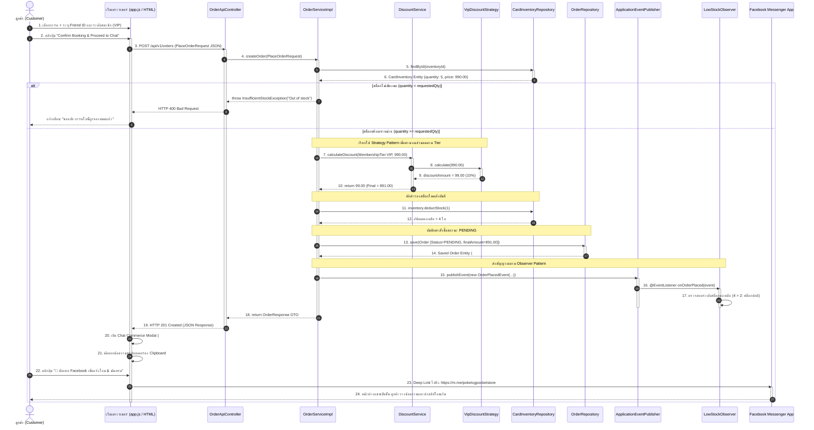
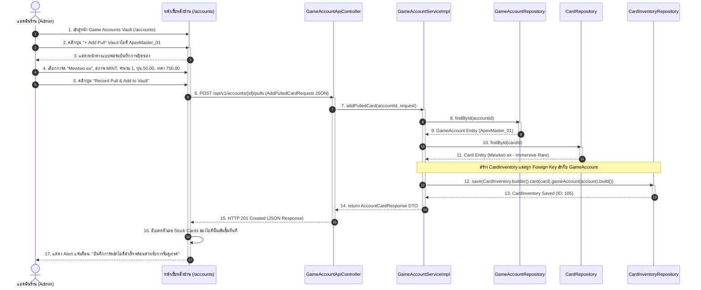
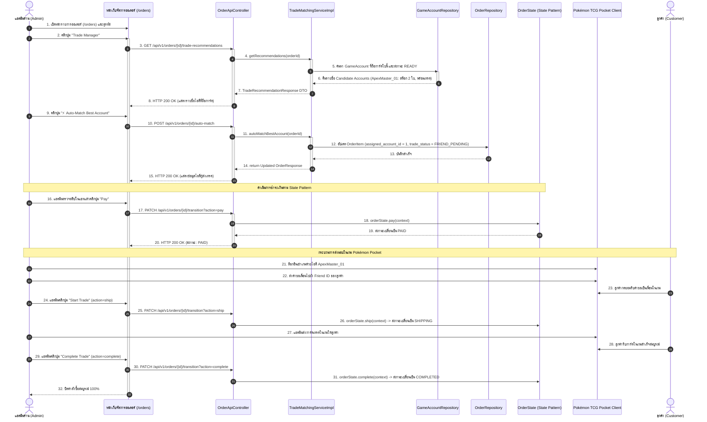
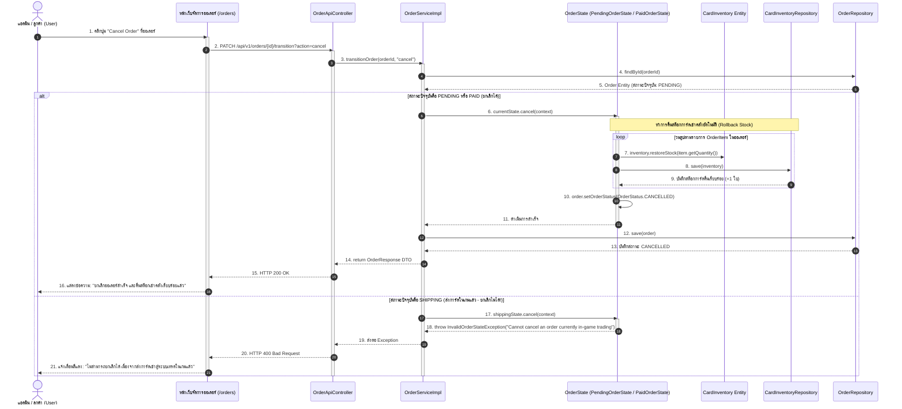

# Sequence Diagrams (4 Scenarios หลักแบบละเอียด)
## โครงการ: Pokémon TCG Pocket Vault & Chat Commerce Trade Platform
**หลักสูตร**: CP353002 Principles of Software Design and Development (Spring Boot)  
**รูปแบบแผนภาพ**: UML 2.5 Sequence Diagram พร้อม Activation Lifelines, Alt/Opt Guards, และ Data Payloads

---

## Scenario 1: การสั่งจองการ์ดบนเว็บและส่งต่อเข้า Chat Commerce
### (Customer Card Booking & Chat Commerce Handshake Workflow)

แสดงการทำงานตั้งแต่ลูกค้าเลือกการ์ด, กรอกรหัสเพื่อนในเกม, ระบบคำนวณส่วนลดตาม **Strategy Pattern**, หักสำรองสต็อกการ์ด, ส่งสัญญาณแจ้งเตือนตาม **Observer Pattern**, และแสดงปุ่มเด้งเข้าสู่ **Facebook Messenger** พร้อมข้อความสรุปออเดอร์อัตโนมัติ

---

## Scenario 2: การเปิดซองได้การ์ดและบันทึกเข้าไอดีเกม
### (Booster Pack Pull & Game Account Sourcing Workflow)

แสดงขั้นตอนที่แอดมินร้านเปิดซองในเกมมือถือ Pokémon TCG Pocket แล้วนำการ์ดหายากที่เปิดได้มาบันทึกผูกความเป็นเจ้าของไว้กับไอดีเกมในระบบ เพื่อเป็นคลังสต็อกรอส่งเทรดให้ลูกค้า

---

## Scenario 3: การจับคู่ไอดีเกมอัตโนมัติและดำเนินวงจรการเทรดในเกม
### (In-Game Trade Auto-Matching & Multi-Account Assignment Workflow)

แสดงขั้นตอนที่แอดมินเปิดระบบหลังบ้านขึ้นมาดูออเดอร์ของลูกค้าที่ทักแชท Facebook มา แล้วใช้ระบบ **⚡ Auto-Match Best Account** เพื่อค้นหาไอดีเกมที่ถือการ์ดและมีความพร้อม ก่อนดำเนินขั้นตอนส่งคำขอเป็นเพื่อนและส่งการ์ดเทรดในเกม

---

## Scenario 4: การยกเลิกคำสั่งซื้อและการคืนสต็อกการ์ดอัตโนมัติ
### (Order Cancellation & Inventory Stock Rollback via State Pattern)

แสดงขั้นตอนเมื่อลูกค้าเปลี่ยนใจขอยกเลิกออเดอร์ในแชท หรือไม่โอนเงินตามกำหนด ระบบจะสั่งคืนสต็อกการ์ดเข้าคลังอัตโนมัติผ่าน State Pattern และปฏิเสธการยกเลิกหากออเดอร์เข้าสู่ขั้นตอนส่งการ์ดในเกมแล้ว

