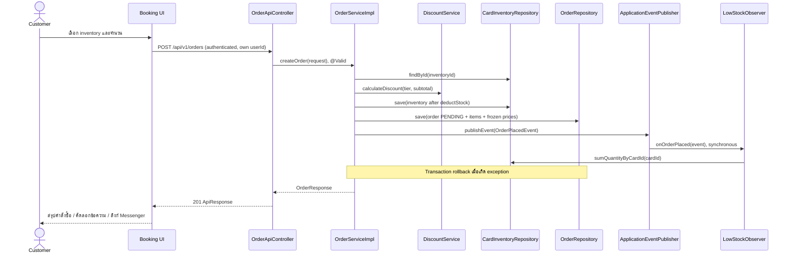
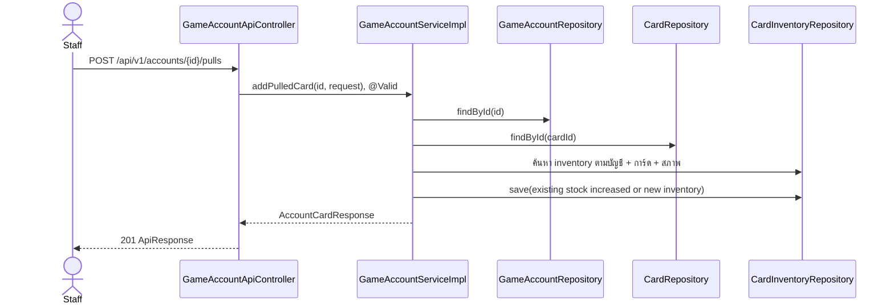

# Sequence Diagrams (5 Scenarios)

ตรวจเทียบโค้ด commit `ea2dcd7` วันที่ 9 ตุลาคม 2026; รอบนี้แก้เอกสาร ไม่ได้รันทดสอบใหม่

## 1. สั่งจองการ์ดและส่งต่อแชท

```mermaid
sequenceDiagram
    actor Customer
    participant UI as Booking UI
    participant API as OrderApiController
    participant Service as OrderServiceImpl
    participant Discount as DiscountService
    participant Inventory as CardInventoryRepository
    participant Orders as OrderRepository
    participant Events as ApplicationEventPublisher
    participant Observer as LowStockObserver
    Customer->>UI: เลือก inventory และจำนวน
    UI->>API: POST /api/v1/orders (authenticated, own userId)
    API->>Service: createOrder(request), @Valid
    Service->>Inventory: findById(inventoryId)
    Service->>Discount: calculateDiscount(tier, subtotal)
    Service->>Inventory: save(inventory after deductStock)
    Service->>Orders: save(order PENDING + items + frozen prices)
    Service->>Events: publishEvent(OrderPlacedEvent)
    Events->>Observer: onOrderPlaced(event), synchronous
    Observer->>Inventory: sumQuantityByCardId(cardId)
    Note over Service,Orders: Transaction rollback เมื่อเกิด exception
    Service-->>API: OrderResponse
    API-->>UI: 201 ApiResponse
    UI-->>Customer: สรุปคำสั่งซื้อ / คัดลอกข้อความ / ลิงก์ Messenger
```

## 2. บันทึกการเปิดซอง

```mermaid
sequenceDiagram
    actor Staff
    participant API as GameAccountApiController
    participant Service as GameAccountServiceImpl
    participant Accounts as GameAccountRepository
    participant Cards as CardRepository
    participant Stock as CardInventoryRepository
    Staff->>API: POST /api/v1/accounts/{id}/pulls
    API->>Service: addPulledCard(id, request), @Valid
    Service->>Accounts: findById(id)
    Service->>Cards: findById(cardId)
    Service->>Stock: ค้นหา inventory ตามบัญชี + การ์ด + สภาพ
    Service->>Stock: save(existing stock increased or new inventory)
    Service-->>API: AccountCardResponse
    API-->>Staff: 201 ApiResponse
```

## 3. จับคู่และเทรดจนเสร็จ

```mermaid
sequenceDiagram
    actor Staff
    participant TradeAPI as TradeMatchingApiController
    participant Matching as TradeMatchingServiceImpl
    participant Stock as CardInventoryRepository
    participant Items as OrderItemRepository
    participant OrderAPI as OrderApiController
    participant OrderSvc as OrderServiceImpl
    participant State as OrderContext / OrderState
    Staff->>OrderAPI: PATCH /api/v1/orders/{id}/status?action=pay
    OrderAPI->>OrderSvc: transitionOrderStatus(id, pay)
    OrderSvc->>State: executeAction(pay)
    Staff->>TradeAPI: GET /api/v1/trades/orders/{id}/recommendations
    TradeAPI->>Matching: getRecommendations(id)
    Matching->>Stock: findByCardId(cardId)
    Note over Matching,Stock: เฉพาะสภาพเดิม, READY และจำนวนพอ; reservation อ้าง inventory id
    Matching-->>Staff: รายการคำแนะนำผ่าน API
    Staff->>TradeAPI: POST /api/v1/trades/orders/{id}/auto-match
    TradeAPI->>Matching: autoMatchOrder(id)
    Matching->>Stock: ย้าย reservation หากเลือก inventory ใหม่
    Matching->>Items: save(inventory, assignedAccount, FRIEND_PENDING)
    Staff->>OrderAPI: PATCH /api/v1/orders/{id}/status?action=ship
    OrderAPI->>OrderSvc: transitionOrderStatus(id, ship)
    OrderSvc->>State: executeAction(ship)
    Note over Staff,State: การเพิ่มเพื่อนและส่งการ์ดทำในเกมโดยพนักงาน
    loop แต่ละ item
        Staff->>OrderAPI: PATCH /api/v1/orders/{id}/items/{itemId}/trade-status?status=TRADE_SENT
        OrderAPI->>OrderSvc: updateItemTradeStatus(...)
        Staff->>OrderAPI: PATCH /api/v1/orders/{id}/items/{itemId}/trade-status?status=COMPLETED
        OrderAPI->>OrderSvc: updateItemTradeStatus(...)
    end
    OrderSvc->>State: complete เมื่อทุก item เป็น COMPLETED
    Note over OrderSvc,State: ปิดด้วย action=complete ได้เมื่อผ่าน guard เดียวกัน
```

## 4. ยกเลิกและคืนสต็อก

```mermaid
sequenceDiagram
    actor Staff
    participant API as OrderApiController
    participant Service as OrderServiceImpl
    participant Context as OrderContext
    participant State as Pending/PaidOrderState
    participant Cancelled as CancelledOrderState
    participant Stock as CardInventoryRepository
    participant Orders as OrderRepository
    Staff->>API: PATCH /api/v1/orders/{id}/status?action=cancel
    API->>Service: transitionOrderStatus(id, cancel)
    Service->>Orders: findById(id)
    Service->>Context: executeAction(cancel)
    Context->>State: cancel(context)
    State->>Cancelled: restoreStock(context)
    Note over Cancelled,Stock: คืนให้ inventory ที่ item อ้างอิงปัจจุบัน
    Service->>Stock: save(each restored inventory)
    Service->>Orders: save(order CANCELLED)
    API-->>Staff: 200; SHIPPING/terminal ปฏิเสธ 409
```

การคืนเงินต้องดำเนินการโดยร้านนอกระบบ ไม่มี payment/refund API

## 5. เปลี่ยนบัญชีส่งมอบด้วยตนเอง

```mermaid
sequenceDiagram
    actor Staff
    participant API as TradeMatchingApiController
    participant Service as TradeMatchingServiceImpl
    participant Items as OrderItemRepository
    participant Accounts as GameAccountRepository
    participant Stock as CardInventoryRepository
    Staff->>API: POST /api/v1/trades/items/{itemId}/assign?accountId={id}
    API->>Service: assignAccountToOrderItem(itemId, accountId)
    Service->>Items: findById(itemId)
    Service->>Accounts: findById(accountId)
    Service->>Stock: findByCardId(cardId)
    Note over Service,Stock: ตรวจ READY, สภาพเดิม, จำนวนพอ และ item ยังไม่ TRADE_SENT/COMPLETED
    alt เลือก inventory ใหม่
        Service->>Stock: save(old after restoreStock)
        Service->>Stock: save(new after deductStock)
    end
    Service->>Items: save(new inventory + assignedAccount + FRIEND_PENDING)
    Note over Service,Items: ราคาที่ order item บันทึกไว้ไม่เปลี่ยน; transaction rollback เมื่อผิดพลาด
    API-->>Staff: 200 TradeRecommendationResponse in ApiResponse
```
