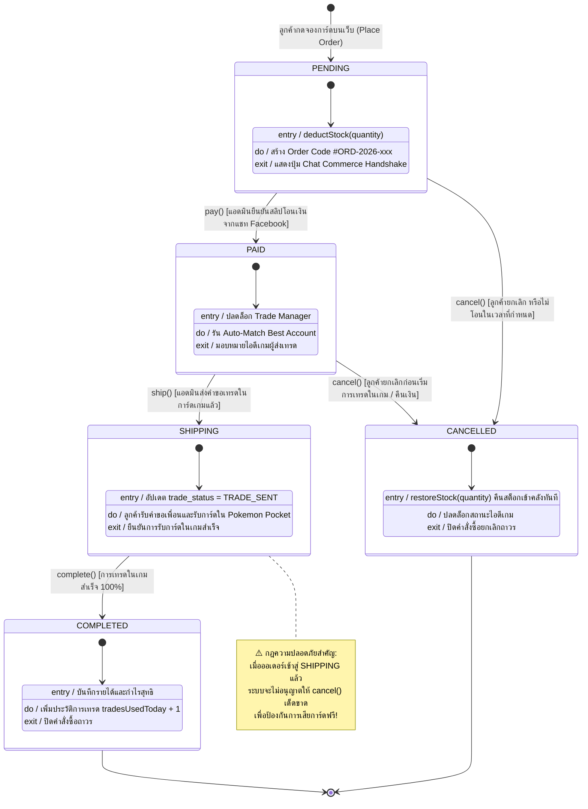
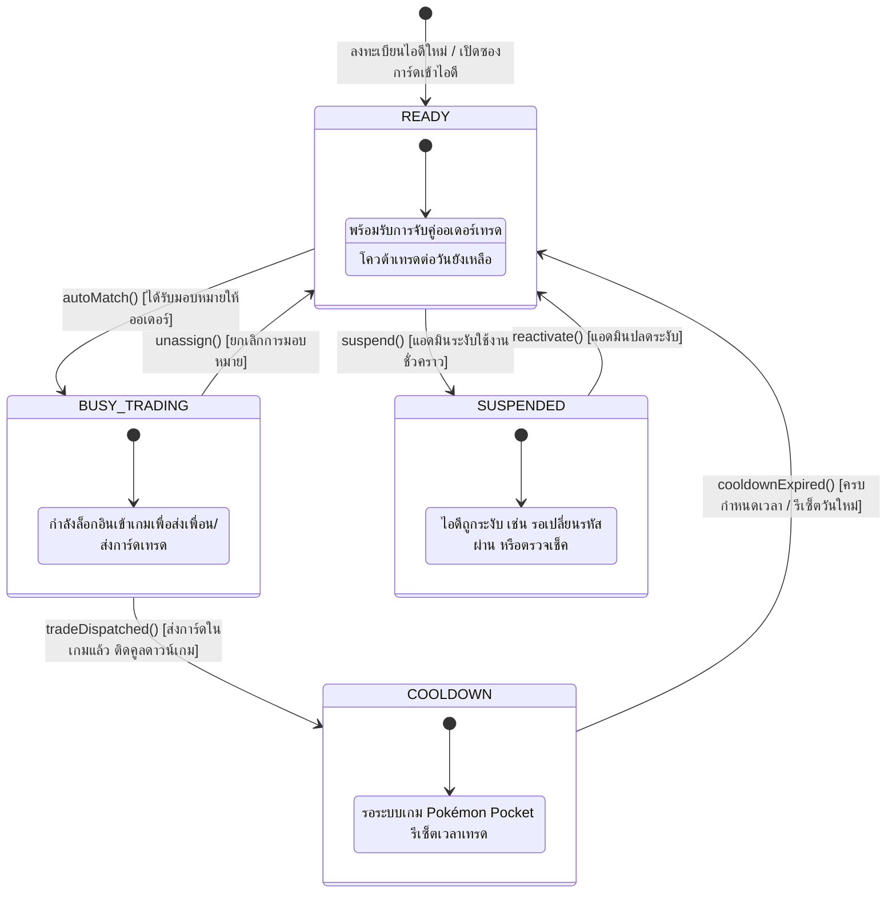
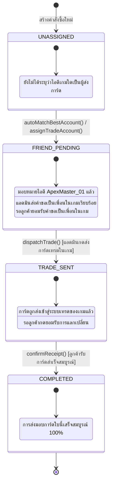

# State Machine Diagrams (แผนภาพแสดงสถานะของระบบทั้ง 3 ด้าน)
## โครงการ: Pokémon TCG Pocket Vault & Chat Commerce Trade Platform
**หลักสูตร**: CP353002 Principles of Software Design and Development (Spring Boot)  
**มาตรฐานแผนภาพ**: UML 2.5 State Machine Diagram พร้อม Actions, Guards, และ State Pattern Mapping

---

## 1. State Machine 1: Order State Machine (วงจรชีวิตคำสั่งซื้อตาม State Pattern)

แผนภาพแสดงการเปลี่ยนสถานะของคำสั่งซื้อตั้งแต่ลูกค้ากดจองการ์ดบนเว็บ, ตรวจสอบสลิปในแชท, ดำเนินการเทรดในเกม, จนถึงปิดคำสั่งซื้อสมบูรณ์ หรือยกเลิกคำสั่งซื้อพร้อมคืนสต็อกเข้าคลังอัตโนมัติ

---

## 2. State Machine 2: Game Account Trade Availability (สถานะความพร้อมของไอดีเกม)

แผนภาพแสดงสถานะของไอดีเกมที่ร้านค้าถือครอง (`GameAccount`) ซึ่งมีผลต่อการทำงานของอัลกอริทึม **Auto-Match Best Account**

---

## 3. State Machine 3: Order Item Trade Fulfillment (สถานะการส่งมอบการ์ดแต่ละใบ)

แผนภาพแสดงสถานะการส่งมอบการ์ดแต่ละรายการในออเดอร์ (`OrderItem.trade_status`) เพื่อให้แอดมินและลูกค้าตรวจสอบความคืบหน้าได้แบบเรียลไทม์

---

## 4. ตารางกฎการเปลี่ยนสถานะและการจัดการข้อผิดพลาด (State Transition Rules Table)

ตารางแสดงความสัมพันธ์ของ Action, เงื่อนไข Guard, สถานะถัดไป, และข้อยกเว้นที่จะเกิดขึ้นหากละเมิดกฎ:

| สถานะปัจจุบัน (Current State) | การกระทำ (Trigger Action) | เงื่อนไขตรวจสอบ (Guard Condition) | สถานะถัดไป (Next State) | ผลกระทบข้างเคียงต่อระบบ (Side Effects) | การจัดการเมื่อเรียกผิดกฎ (Illegal Transition Handling) |
| :--- | :--- | :--- | :---: | :--- | :--- |
| **`PENDING`** | `pay()` | แอดมินตรวจสลิปในแชทแล้วยอดเงินถูกต้อง | **`PAID`** | ปลดล็อกปุ่ม Trade Manager เพื่อให้จับคู่ไอดีเกม | โยน `InvalidOrderStateException` หากสถานะปัจจุบันไม่ใช่ `PENDING` |
| **`PENDING`** | `cancel()` | ลูกค้าขอยกเลิก หรือสลิปไม่ถูกต้อง | **`CANCELLED`** | **สั่งคืนสต็อกการ์ดเข้าคลังทันที** (`inventory.restoreStock()`) | - |
| **`PAID`** | `ship()` | มีการมอบหมายไอดีเกมแล้ว (`assignedAccount != null`) | **`SHIPPING`** | เปลี่ยนสถานะการเทรดเป็น `TRADE_SENT` | โยน `InvalidOrderStateException` หากออเดอร์ยังไม่ได้รับชำระเงิน |
| **`PAID`** | `cancel()` | ลูกค้าขอยกเลิกก่อนเริ่มส่งการ์ดในเกม | **`CANCELLED`** | คืนเงินให้ลูกค้า และ**คืนสต็อกการ์ดเข้าคลัง** | - |
| **`SHIPPING`** | `complete()`| ลูกค้ากดยอมรับการ์ดในเกม Pokémon Pocket เรียบร้อย | **`COMPLETED`** | ปิดออเดอร์สมบูรณ์, บันทึกประวัติไอดีเกม `tradesUsedToday + 1` | โยน `InvalidOrderStateException` หากยังไม่มีการส่งการ์ดในเกม |
| **`SHIPPING`** | `cancel()` | ❌ *ไม่อนุญาตเด็ดขาด* | - | ไม่อนุญาตให้ยกเลิกเนื่องจากส่งการ์ดเข้าไปในเกมแล้ว | โยน `InvalidOrderStateException("Cannot cancel an order currently in-game trading")` |
| **`COMPLETED`**| *Any Action* | ❌ *Terminal State* | - | สถานะสิ้นสุด ไม่สามารถเปลี่ยนแปลงได้อีก | โยน `InvalidOrderStateException("Order is already completed")` |
| **`CANCELLED`**| *Any Action* | ❌ *Terminal State* | - | สถานะสิ้นสุด ไม่สามารถนำกลับมาใช้ใหม่ได้ | โยน `InvalidOrderStateException("Order is already cancelled")` |

---

## 5. การประยุกต์ใช้หลักการ Object-Oriented Design และ Clean Architecture

1. **การกำจัดปัญหา Code Smells (Replace Conditional with Polymorphism)**:
   - ในระบบเดิมทั่วไป การเปลี่ยนสถานะมักใช้ `switch(status)` ขนาดยาว ซึ่งดูแลรักษายากและเสี่ยงต่อการลืมใส่เงื่อนไขคืนสต็อก
   - การประยุกต์ใช้ **State Pattern** ช่วยให้แต่ละสถานะรับผิดชอบเฉพาะพฤติกรรมของตนเอง เช่น `PendingOrderState.java` รับผิดชอบเฉพาะการ `pay()` และ `cancel()` พร้อมคำสั่งคืนสต็อกอัตโนมัติ
2. **Open/Closed Principle (OCP)**:
   - หากในอนาคตต้องการเพิ่มสถานะใหม่ เช่น `REFUNDED` หรือ `DISPUTED` สามารถสร้างคลาสใหม่ที่ `implements OrderState` ได้ทันที โดยไม่ต้องแก้ไขโค้ดของคลาสสถานะเดิมแม้แต่บรรทัดเดียว
3. **Fail-Fast & Exception Handling Architecture**:
   - ทุกครั้งที่มีการเรียก Transition ที่ผิดกฎ ระบบจะโยน `InvalidOrderStateException` ทันที ซึ่งจะถูกดักจับโดย `@RestControllerAdvice` ในคลาส `GlobalExceptionHandler` และแปลงเป็นข้อความ JSON แจ้งเตือนลูกค้าพร้อมรหัส HTTP 400 Bad Request อย่างเป็นมืออาชีพ
