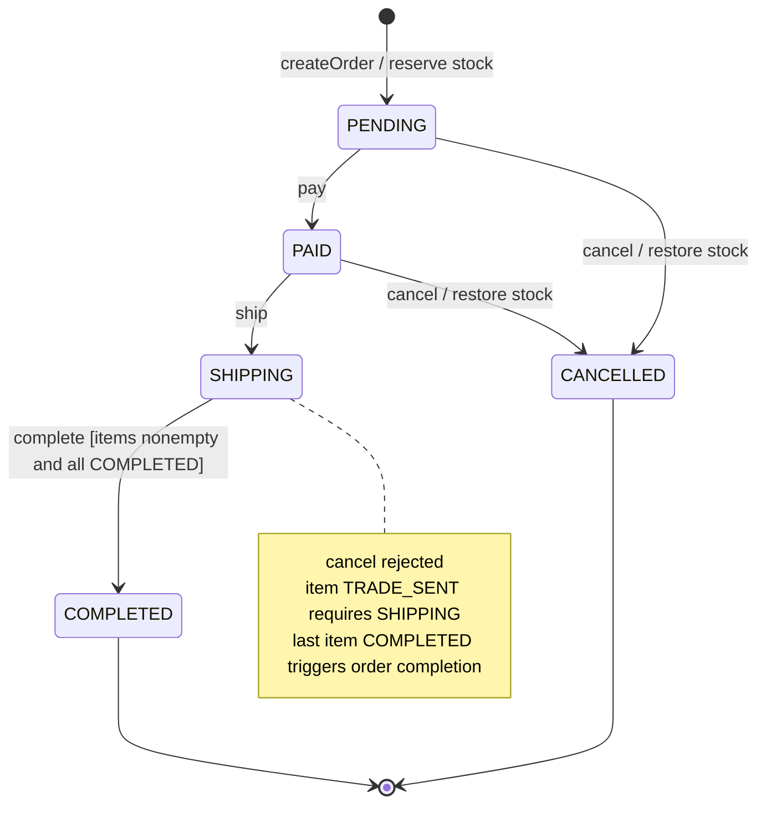
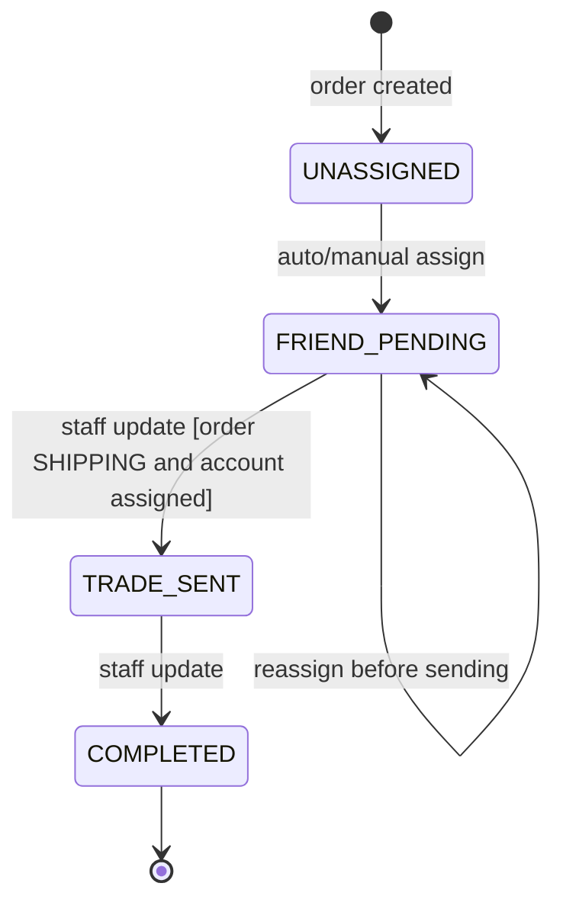
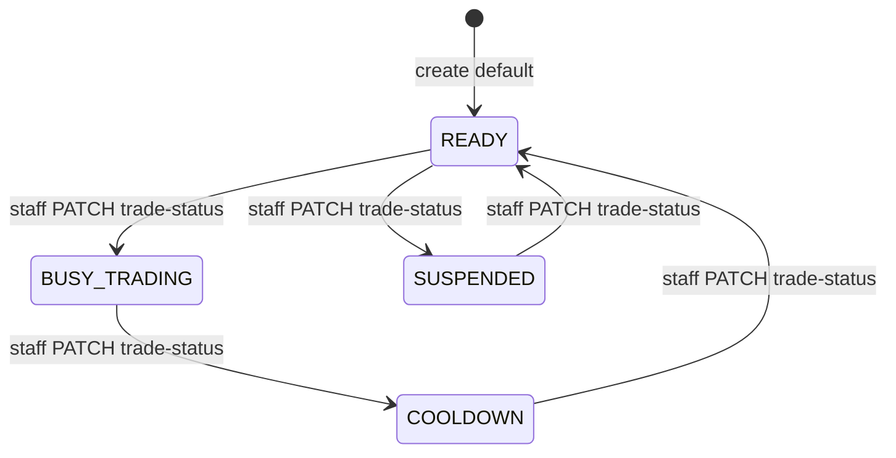

# State Diagrams

ตรวจเทียบโค้ด commit `ea2dcd7` วันที่ 9 ตุลาคม 2026; รอบนี้แก้เอกสาร ไม่ได้รันทดสอบใหม่

## Order (State Pattern)

```mermaid
stateDiagram-v2
    [*] --> PENDING : createOrder / reserve stock
    PENDING --> PAID : pay
    PENDING --> CANCELLED : cancel / restore stock
    PAID --> SHIPPING : ship
    PAID --> CANCELLED : cancel / restore stock
    SHIPPING --> COMPLETED : complete [items nonempty and all COMPLETED]
    COMPLETED --> [*]
    CANCELLED --> [*]
    note right of SHIPPING
        cancel rejected
        item TRADE_SENT requires SHIPPING
        last item COMPLETED triggers order completion
    end note
```

OrderContext เลือก concrete state ตาม OrderStatus; default action ที่ไม่อนุญาตโยน InvalidOrderStateException (409)
CancelledOrderState คืน stock ใน entity และ OrderServiceImpl บันทึกใน transaction ไม่มีการคืนเงินหรือคำนวณกำไรอัตโนมัติ

## OrderItem (Trade Fulfillment)

```mermaid
stateDiagram-v2
    [*] --> UNASSIGNED : order created
    UNASSIGNED --> FRIEND_PENDING : auto/manual assign
    FRIEND_PENDING --> FRIEND_PENDING : reassign before sending
    FRIEND_PENDING --> TRADE_SENT : staff update [order SHIPPING and account assigned]
    TRADE_SENT --> COMPLETED : staff update
    COMPLETED --> [*]
```

การส่งสถานะเดิมซ้ำเป็น idempotent; order terminal ไม่อนุญาตเปลี่ยน trade status ใหม่ และหลัง TRADE_SENT ห้าม reassign

## GameAccount availability

```mermaid
stateDiagram-v2
    [*] --> READY : create default
    READY --> BUSY_TRADING : staff PATCH trade-status
    BUSY_TRADING --> COOLDOWN : staff PATCH trade-status
    COOLDOWN --> READY : staff PATCH trade-status
    READY --> SUSPENDED : staff PATCH trade-status
    SUSPENDED --> READY : staff PATCH trade-status
```

เส้นทางนี้เป็นตัวอย่างการตั้งสถานะโดยพนักงานผ่าน PATCH /api/v1/accounts/{id}/trade-status ไม่ใช่ state machine ที่บังคับลำดับหรือ scheduler อัตโนมัติ
Matching ตรวจเฉพาะสถานะ READY; ไม่มีตัวนับ quota ต่อวันหรือ timer ปลด cooldown ใน implementation ปัจจุบัน
