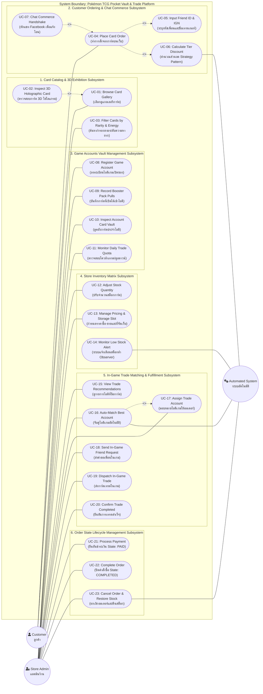

# Use Case Diagram & Comprehensive Use Case Descriptions
## โครงการ: Pokémon TCG Pocket Vault & Chat Commerce Trade Platform
**หลักสูตร**: CP353002 Principles of Software Design and Development (Spring Boot)  
**มาตรฐานเอกสาร**: UML 2.5 Specification & Cockburn / IEEE 830 Standard Format

---

## 1. Use Case Diagram (UML 2.5 Specification)

แผนภาพแสดงขอบเขตของระบบ (System Boundary), กลุ่มระบบย่อย (Subsystems), ผู้มีส่วนได้ส่วนเสีย (Actors), และ Use Cases ทั้งหมด พร้อมระบุความสัมพันธ์แบบ `<<include>>` และ `<<extend>>` อย่างเป็นระเบียบ



---

## 2. รายละเอียดตัวละครและผู้มีส่วนได้ส่วนเสีย (Actor Profiles)

| ชื่อ Actor | ประเภท (Type) | คำอธิบายและบทบาทหน้าที่ในระบบ (Role & Responsibilities) |
| :--- | :---: | :--- |
| **Customer** (ลูกค้า) | Primary / Human | ผู้สนใจซื้อการ์ดโปเกมอน เข้าชมแกลเลอรี 3D, ตรวจสอบรายละเอียดและความหายาก, ทำการกดจองการ์ดบนเว็บ, ระบุรหัสเพื่อนในเกม และคลิกลิงก์ส่งต่อไปยัง Facebook Messenger เพื่อส่งสลิปโอนเงิน |
| **Store Admin** (แอดมินร้านค้า) | Primary / Human | เจ้าของร้านหรือพนักงานผู้ดูแลระบบ มีสิทธิ์ลงทะเบียนไอดีเกม (`GameAccount`), บันทึกการ์ดที่เปิดได้จากซอง (`+ Add Pull`), บริหารจัดการสต็อกและราคา, ตรวจสอบสลิปโอนเงิน, และใช้งานระบบ Auto-Match เพื่อสั่งส่งการ์ดเทรดในเกม |
| **Automated System** (ระบบอัตโนมัติ) | Secondary / System | โมดูลอัตโนมัติภายใน Spring Boot Application เช่น การประมวลผลส่วนลดตาม **Strategy Pattern**, การดักฟังสัญญาณสต็อกสินค้าต่ำด้วย **Observer Pattern**, อัลกอริทึมค้นหาไอดีเกมที่เหมาะสมที่สุด และระบบคืนสต็อกอัตโนมัติเมื่อคำสั่งซื้อถูกยกเลิก |

---

## 3. เอกสารอธิบาย Use Case แบบละเอียด (Use Case Descriptions - Cockburn Standard)

### UC-04: Place Card Order (ทำการสั่งจองการ์ดบนเว็บไซต์)
* **รหัส Use Case**: `UC-04`
* **ระดับ (Level)**: User-Goal Level
* **Primary Actor**: Customer (ลูกค้า)
* **Secondary Actor**: Automated System
* **Stakeholders & Interests**:
  * *Customer*: ต้องการจองการ์ดที่ต้องการก่อนสินค้าหมด และได้รับสรุปยอดเงินพร้อมส่วนลดที่ถูกต้อง
  * *Store Admin*: ต้องการหลักประกันว่าสต็อกการ์ดจะไม่ถูกขายซ้อน (Double Selling) และมีข้อมูลพิกัดในเกมของลูกค้าครบถ้วน
* **Pre-conditions**:
  1. การ์ดที่ลูกค้าเลือกต้องมีจำนวนคงเหลือในคลัง (`quantity > 0`)
  2. ระบบพร้อมรับคำสั่งซื้อผ่าน REST API (`POST /api/v1/orders`)
* **Post-conditions (Success Guarantee)**:
  1. บันทึกคำสั่งซื้อใหม่ลงในตาราง `orders` พร้อมสถานะ `PENDING`
  2. สต็อกของการ์ดในตาราง `card_inventories` ถูกหักสำรองลดลงตามจำนวนที่สั่งซื้อทันที
  3. ระบบสร้างรหัสคำสั่งซื้อที่ไม่ซ้ำกัน (Order Code e.g. `ORD-2026-001`)
  4. เรียกใช้ Observer แจ้งเตือนหากสต็อกลดลงจนถึงเกณฑ์ขั้นต่ำ
* **Post-conditions (Minimal Guarantee)**: หากการจองล้มเหลว สต็อกสินค้าจะไม่ถูกเปลี่ยนแปลง และระบบแจ้งข้อผิดพลาดให้ลูกค้าทราบ
* **Trigger**: ลูกค้าคลิกปุ่ม **"Place Order"** บนหน้าแกลเลอรีหรือตาราง Matrix

#### Main Success Scenario (ลำดับขั้นตอนการทำงานปกติ)
1. ลูกค้าเลือกการ์ดที่ต้องการซื้อ และกดปุ่ม "Place Order"
2. หน้าจอแสดงหน้าต่างแบบฟอร์มการสั่งจอง
3. ลูกค้าระบุข้อมูลพิกัดในเกม ได้แก่ **In-Game Friend ID** (16 หลัก) และ **In-Game Trainer Name** (`<<include>> UC-05`)
4. ลูกค้าเลือกระดับสมาชิกของตนเอง (Regular, VIP, หรือ Wholesale)
5. ระบบเรียกใช้ **Strategy Pattern** (`DiscountStrategy`) เพื่อคำนวณส่วนลดแบบ Real-time (`<<include>> UC-06`)
6. ลูกค้าตรวจสอบยอดเงินสุทธิและกดยืนยันคำสั่งซื้อ
7. JavaScript Frontend ส่งคำขอแบบ JSON ไปยัง `POST /api/v1/orders`
8. `OrderApiController` รับคำขอและส่งต่อให้ `OrderServiceImpl.createOrder()`
9. ระบบตรวจสอบสต็อกในฐานข้อมูลผ่าน `CardInventoryRepository`
10. ระบบหักสำรองสต็อกการ์ด (`inventory.deductStock()`)
11. ระบบบันทึก `Order` และ `OrderItem` สถานะ `PENDING` ลงสู่ฐานข้อมูล
12. ระบบส่งสัญญาณ `OrderPlacedEvent` ผ่าน Spring `ApplicationEventPublisher` (`<<include>> UC-14`)
13. คืนค่า HTTP 201 Created พร้อม `OrderResponse` ที่มีรหัสออเดอร์และยอดเงินสุทธิ
14. หน้าเว็บเปิดหน้าต่าง Chat Commerce Confirmation Modal ให้ลูกค้าอัตโนมัติ (`<<extend>> UC-07`)

#### Extensions / Alternative Flows (กรณีเกิดข้อผิดพลาดหรือทางเลือก)
* **3a. ลูกค้าระบุ Friend ID ไม่ครบ 16 หลัก หรือรูปแบบไม่ถูกต้อง**:
  * 3a1. ระบบฝั่ง Frontend ตรวจสอบ Regular Expression แล้วพบว่าไม่ตรงตามรูปแบบ
  * 3a2. ระบบแจ้งเตือน "กรุณาระบุรหัสเพื่อนให้ครบถ้วน 16 หลัก เช่น 1234-5678-9012-3456" และไม่อนุญาตให้กดยืนยัน
* **9a. สต็อกการ์ดถูกผู้ใช้อื่นซื้อตัดหน้าไปก่อน (Race Condition / Out of Stock)**:
  * 9a1. ระบบฝั่ง Backend ตรวจสอบพบว่า `quantity < requestedQty`
  * 9a2. ระบบโยนข้อผิดพลาด `InsufficientStockException`
  * 9a3. `GlobalExceptionHandler` ส่งกลับ HTTP 400 Bad Request พร้อมข้อความ "ขออภัย การ์ดใบนี้สต็อกไม่เพียงพอแล้ว"
  * 9a4. หน้าเว็บแสดง Alert แจ้งเตือน และรีเฟรชตัวเลขสต็อกล่าสุดให้ลูกค้า

---

### UC-07: Chat Commerce Handshake (ทักแชท Facebook เพื่อแจ้งโอน & นัดเทรด)
* **รหัส Use Case**: `UC-07`
* **ระดับ (Level)**: Subfunction / Extension of `UC-04`
* **Primary Actor**: Customer (ลูกค้า)
* **Secondary Actor**: Facebook Messenger Platform
* **Pre-conditions**: คำสั่งซื้อถูกสร้างลงฐานข้อมูลสำเร็จในสถานะ `PENDING` (ผ่าน `UC-04` เรียบร้อยแล้ว)
* **Post-conditions**: ลิงก์ห้องสนทนา Facebook Messenger ของร้านค้าถูกเปิดขึ้น พร้อมข้อความสรุปออเดอร์ที่คัดลอก/กรอกไว้ล่วงหน้า
* **Trigger**: ลูกค้าคลิกปุ่ม **"💬 ทักแชท Facebook เพื่อแจ้งโอน & นัดเทรด"**

#### Main Success Scenario
1. ระบบ Frontend รับรหัสคำสั่งซื้อ เช่น `ORD-2026-001`, ยอดเงินสุทธิ, และข้อมูล Friend ID จากผลลัพธ์ของ `UC-04`
2. ระบบสร้างข้อความเทมเพลตมาตรฐานล่วงหน้า เช่น:
   ```text
   สวัสดีครับ ต้องการแจ้งชำระเงินสำหรับคำสั่งซื้อ: #ORD-2026-001
   รายการ: Charizard ex (Special Art Rare)
   ยอดโอนสุทธิ: 891.00 บาท
   รหัสเพื่อนในเกม (Friend ID): 1234-5678-9012-3456
   ชื่อในเกม (Trainer Name): AshKetchum
   (แนบสลิปการโอนเงินด้านล่างได้เลยครับ)
   ```
3. ระบบคัดลอกข้อความดังกล่าวลงสู่ Clipboard ของอุปกรณ์ลูกค้าอัตโนมัติ
4. ระบบเปิดแท็บเบราว์เซอร์ใหม่เชื่อมต่อไปยัง URL: `https://m.me/poketcgpocketstore`
5. ลูกค้านำสลิปโอนเงินและข้อความส่งให้แอดมินร้านในแชท

---

### UC-08 & UC-09: Register Game Account & Record Booster Pack Pulls
* **รหัส Use Case**: `UC-08` & `UC-09`
* **ระดับ (Level)**: User-Goal Level
* **Primary Actor**: Store Admin (แอดมินร้านค้า)
* **Stakeholders & Interests**:
  * *Store Admin*: ต้องการกระจายการถือครองการ์ดลงในหลายๆ ไอดี เพื่อให้เปิดซองได้คุ้มค่า และมีโควต้าเทรดกระจายกัน ไม่ติดขัดคูลดาวน์
* **Pre-conditions**: แอดมินเข้าสู่ระบบหลังบ้านหน้า `/accounts` (Game Accounts Vault)
* **Post-conditions**:
  1. มี Record ของไอดีเกมในตาราง `game_accounts` ในสถานะ `READY`
  2. การ์ดที่เปิดได้จากซองถูกบันทึกเป็น `CardInventory` ที่ผูกกับ `game_account_id` นั้นโดยตรง
* **Trigger**: แอดมินซื้อไอดีเกมใหม่เข้ามา หรือเปิดซองการ์ดในเกมแล้วได้การ์ดใบใหม่

#### Main Success Scenario (การบันทึกการ์ดที่เปิดได้: `+ Add Pull`)
1. แอดมินล็อกอินเข้าเกมมือถือและเปิดซอง Booster Pack (เช่น Genetic Apex) ได้การ์ดหายาก
2. แอดมินเปิดหน้าเว็บ `/accounts` ของระบบ
3. ค้นหาแถวของไอดีเกมที่ใช้เปิดซองนั้น (เช่น `ACC-001 - ApexMaster_01`)
4. คลิกปุ่ม **"+ Add Pull"**
5. หน้าต่างบันทึกผลการเปิดซองปรากฏขึ้น
6. แอดมินเลือกการ์ดจากรายชื่อแคตตาล็อก (เช่น "Mewtwo ex - Immersive Rare")
7. ระบุสภาพการ์ด (MINT), จำนวนใบที่เปิดได้, ต้นทุนเฉลี่ยต่อซอง, และราคาขายหน้าร้าน
8. แอดมินกดปุ่ม "Record Pull & Add to Vault"
9. JavaScript ส่งข้อมูลแบบ JSON ไปยัง `POST /api/v1/accounts/{id}/pulls`
10. `GameAccountServiceImpl.addPulledCard()` บันทึกการ์ดลงสู่ตาราง `card_inventories` โดยตั้งค่า `game_account_id` เท่ากับไอดีดังกล่าว
11. ตารางในหน้าจออัปเดตจำนวนการ์ดที่ไอดีนั้นถือครอง (`Stock Cards`) เพิ่มขึ้นทันที

---

### UC-16 & UC-17: Auto-Match Best Trade Account & Order Item Assignment
* **รหัส Use Case**: `UC-16` & `UC-17`
* **ระดับ (Level)**: Core Business Rule Level
* **Primary Actor**: Store Admin / Automated System
* **Pre-conditions**:
  1. มีคำสั่งซื้อในสถานะ `PAID` หรือ `PENDING` ที่ลูกค้าแจ้งโอนเงินมาในแชทแล้ว
  2. รายการการ์ดในคำสั่งซื้อยังมีสถานะการเทรดเป็น `UNASSIGNED`
* **Post-conditions**:
  1. รายการสินค้า `OrderItem` ได้รับการกำหนด `assigned_account_id` ที่ถือการ์ดใบนั้นจริง
  2. สถานะการเทรดของรายการเปลี่ยนเป็น `FRIEND_PENDING`
* **Trigger**: แอดมินกดปุ่ม **"⚡ Auto-Match Best Account"** ในหน้าต่าง Trade Manager

#### Main Success Scenario
1. แอดมินเปิดหน้าจอ `/orders` และตรวจสอบหมายเลขคำสั่งซื้อที่ลูกค้าแจ้งในแชท Facebook
2. แอดมินคลิกปุ่ม "Trade Manager" ประจำออเดอร์นั้น
3. หน้าต่าง Trade Management Modal เปิดขึ้น ระบบส่งคำขอไปยัง `GET /api/v1/orders/{id}/trade-recommendations`
4. `TradeMatchingServiceImpl` ดำเนินการค้นหาในฐานข้อมูล:
   * ค้นหา `CardInventory` ที่ตรงกับ `card_id` ในออเดอร์ และมี `quantity > 0`
   * ตรวจสอบสถานะของ `GameAccount` ที่เป็นเจ้าของสต็อกการ์ดใบนั้น ต้องเป็น `tradeStatus == READY`
5. ระบบแสดงรายชื่อไอดีเกมที่เป็น Candidate ทั้งหมด พร้อมแสดงความพร้อม
6. แอดมินกดปุ่ม **"⚡ Auto-Match Best Account"**
7. ระบบเลือกไอดีเกมที่มีความพร้อมสูงสุด และบันทึก `assigned_account_id` ลงในตาราง `order_items`
8. ระบบอัปเดต `trade_status` ของรายการเป็น `FRIEND_PENDING`
9. หน้าจอแสดง Trainer Name และ Friend ID ของไอดีเกมที่ต้องใช้ส่งการ์ดเทรด เพื่อให้แอดมินหยิบโทรศัพท์เครื่องนั้นมาดำเนินการในเกม

---

### UC-21 to UC-23: Order State Transitions (State Pattern Execution)
* **รหัส Use Case**: `UC-21`, `UC-22`, `UC-23`
* **ระดับ (Level)**: System Lifecycle Level
* **Primary Actor**: Store Admin / Automated System
* **Pre-conditions**: มีคำสั่งซื้อในระบบ
* **Post-conditions**: สถานะของออเดอร์เปลี่ยนไปตาม State Pattern อย่างถูกต้องและปลอดภัย

#### Main Success Scenario (วงจรสถานะสมบูรณ์: Happy Path)
1. **การชำระเงิน (UC-21: Process Payment)**:
   * แอดมินตรวจสอบสลิปในแชทว่ายอดเงินตรงกับ `final_amount`
   * แอดมินกดปุ่ม "Pay" ที่ออเดอร์นั้น
   * ระบบเรียก `OrderState.pay()` เปลี่ยนสถานะจาก `PENDING` $\rightarrow$ `PAID`
2. **การเริ่มส่งการ์ดในเกม**:
   * แอดมินล็อกอินเข้าไอดีเกมที่ระบบจับคู่ให้ ส่งคำขอเป็นเพื่อนและส่งการ์ดเทรดให้ลูกค้า
   * แอดมินกดปุ่ม "Start Trade" (action=ship)
   * ระบบเรียก `OrderState.ship()` เปลี่ยนสถานะจาก `PAID` $\rightarrow$ `SHIPPING`
3. **การปิดออเดอร์สมบูรณ์ (UC-22: Complete Order)**:
   * ลูกค้ากดยืนยันรับการ์ดในเกม Pokémon Pocket เรียบร้อย
   * แอดมินกดปุ่ม "Complete Trade" (action=complete)
   * ระบบเรียก `OrderState.complete()` เปลี่ยนสถานะจาก `SHIPPING` $\rightarrow$ `COMPLETED`
   * ระบบบันทึกเพิ่มจำนวนประวัติการเทรดของไอดีเกมนั้น

#### Exception Scenario (การยกเลิกออเดอร์และคืนสต็อก: UC-23)
* หากลูกค้าขอยกเลิกออเดอร์ หรือไม่โอนเงินภายในเวลาที่กำหนด:
  1. แอดมินกดปุ่ม "Cancel"
  2. ระบบเรียก `OrderState.cancel()` ซึ่งทำงานได้เฉพาะเมื่อออเดอร์ยังอยู่ในสถานะ `PENDING` หรือ `PAID`
  3. ระบบวนลูปคืนจำนวนสต็อกการ์ดกลับเข้าคลัง `inventory.restoreStock(item.getQuantity())`
  4. สถานะออเดอร์เปลี่ยนเป็น `CANCELLED`
  5. หากออเดอร์อยู่ในสถานะ `SHIPPING` (ส่งการ์ดเข้าไปในเกมแล้ว) ระบบจะปฏิเสธการยกเลิก และโยน `InvalidOrderStateException` ทันที ป้องกันการสูญเสียทรัพย์สินของร้าน
