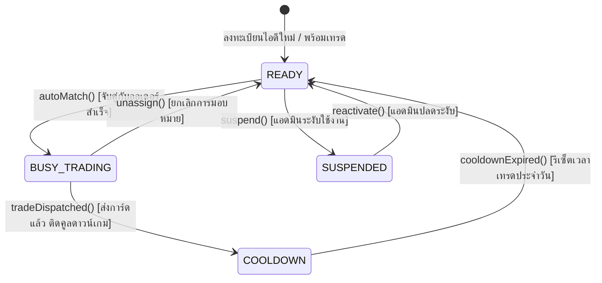

# 📘 Knowledge 01: การสร้าง GameAccount Entity และ AccountTradeStatus Enum

> **Commit Reference**: `feat: create GameAccount entity and AccountTradeStatus enum` (`d1103f1`)  
> **ผู้รับผิดชอบ**: นายสัพพัญญู คำตุ้ม (673380066-4) — สมาชิกคนที่ 2: Game Account Vault & Inventory Manager  
> **โมดูล**: Domain Layer (`com.pokevault.domain.entity`, `com.pokevault.domain.enums`)

---

## 1. 🎯 วัตถุประสงค์และภาพรวม (Overview & Objective)

ในโปรเจกต์ **PokéVault Commerce** ร้านค้าจำเป็นต้องมีระบบคลังไอดีเกม Pokémon Trading Card Game Pocket สำหรับเป็น **"ตู้เซฟกลาง (Vault)"** ในการ:
1. เก็บไอดีเกมของร้านสำหรับเปิดซองสุ่มการ์ด (`+ Add Pull`)
2. กักเก็บสต็อกการ์ดสะสม (`CardInventory`) แยกตามแต่ละไอดีในเกม
3. เป็นไอดีส่งมอบของ (Trader) เมื่อจับคู่ออเดอร์เทรดกับลูกค้า (`Trade Matching Engine`)

Commit แรกของสมาชิกคนที่ 2 จึงเป็นการวางโครงสร้าง **Domain Entity** หลัก ได้แก่:
- `AccountTradeStatus.java` (Enum ระบุสถานะความพร้อมในการเทรดของไอดี)
- `GameAccount.java` (JPA Entity ตัวแทนไอดีเกมของร้านค้า)

---

## 2. 🧩 สถาปัตยกรรมและความสัมพันธ์ (Architecture & Context)

### 2.1 แผนภาพสถานะความพร้อมของไอดีเกม (Trade Availability State Diagram)
ตามที่ระบุไว้ใน `doc/diagrams/state-diagram.md`:



### 2.2 โครงสร้างตารางฐานข้อมูลที่รองรับ (`schema.sql`)
เอนทิตี `GameAccount` ถูกออกแบบให้ตรงกับตาราง `game_accounts` ใน `schema.sql`:

```sql
CREATE TABLE IF NOT EXISTS game_accounts (
    id BIGSERIAL PRIMARY KEY,
    account_code VARCHAR(50) NOT NULL,
    in_game_name VARCHAR(100) NOT NULL,
    friend_id VARCHAR(50) NOT NULL,
    trade_status VARCHAR(30) NOT NULL DEFAULT 'READY',
    buy_in_cost DECIMAL(10,2) DEFAULT 0.00,
    notes VARCHAR(500),
    created_at TIMESTAMP NOT NULL DEFAULT CURRENT_TIMESTAMP,
    updated_at TIMESTAMP DEFAULT CURRENT_TIMESTAMP,
    CONSTRAINT uk_account_code UNIQUE (account_code),
    CONSTRAINT chk_account_buy_in CHECK (buy_in_cost >= 0.00)
);
```

---

## 3. 🔍 การทำงานและคำอธิบายโค้ดอย่างละเอียด (Deep-Dive Code Explanation)

### 3.1 `AccountTradeStatus.java`
ไฟล์: `src/main/java/com/pokevault/domain/enums/AccountTradeStatus.java`

```java
package com.pokevault.domain.enums;

/**
 * Enumeration representing the trade availability and lifecycle state
 * of a PokéVault store game account (GameAccount).
 */
public enum AccountTradeStatus {
    /**
     * Account is available and ready to be matched for fulfilling trade orders.
     */
    READY,

    /**
     * Account is currently in an active trade session with a customer.
     */
    BUSY_TRADING,

    /**
     * Account is on cooldown waiting for Pokémon Pocket trade restrictions/timers to reset.
     */
    COOLDOWN,

    /**
     * Account is temporarily suspended by store admin for maintenance or verification.
     */
    SUSPENDED
}
```

#### 📌 คำอธิบายแต่ละสถานะ (Status Explanations):
1. **`READY`**: สถานะเริ่มต้น ไอดีเกมพร้อมให้บริการ อัลกอริทึม Auto-Match จะมองหาไอดีที่มีสถานะนี้เท่านั้น
2. **`BUSY_TRADING`**: ไอดีกำลังอยู่ในกระบวนการเทรด (เช่น กำลังแอดเพื่อนในเกม หรือรอส่งการ์ดตามคำสั่งซื้อ) เพื่อป้องกันไม่ให้ไอดีเดียวกันถูกนำไปจับคู่ซ้ำซ้อน
3. **`COOLDOWN`**: ส่งการ์ดสำเร็จแล้วในเกม แต่เกม Pokémon TCG Pocket มีขีดจำกัดการเทรดต่อวัน (Daily Limit) จึงต้องเข้าสู่สถานะคูลดาวน์รอรีเซ็ต
4. **`SUSPENDED`**: แอดมินสั่งระงับการใช้งานชั่วคราว (เช่น กำลังเปลี่ยนรหัสผ่าน, ซิงค์ข้อมูล, หรือตรวจเช็คความปลอดภัย)

---

### 3.2 `GameAccount.java`
ไฟล์: `src/main/java/com/pokevault/domain/entity/GameAccount.java`

#### ก. คลาสและ Annotation ระดับคลาส
```java
@Entity
@Table(name = "game_accounts", uniqueConstraints = {
        @UniqueConstraint(name = "uk_account_code", columnNames = {"account_code"})
})
@Getter
@Setter
@NoArgsConstructor
@AllArgsConstructor
@Builder
public class GameAccount extends BaseEntity {
```
- **`@Entity`**: ประกาศว่าเป็น JPA Entity สำหรับจัดเก็บลงฐานข้อมูลเชิงสัมพันธ์ (RDBMS)
- **`@Table(...)`**: แมปกับตารางชื่อ `game_accounts` พร้อมกำหนด Unique Constraint บนคอลัมน์ `account_code` ให้ตรงกับ Database Schema
- **`@Getter`, `@Setter`**: สร้าง Getter และ Setter อัตโนมัติด้วย Project Lombok
- **`@NoArgsConstructor`, `@AllArgsConstructor`**: สร้าง Constructor ว่าง (จำเป็นสำหรับ JPA Specification) และ Constructor ครบทุกฟิลด์ (จำเป็นสำหรับ Builder Pattern)
- **`@Builder`**: ให้สามารถสร้างอ็อบเจกต์ด้วย Fluent Builder Pattern เช่น `GameAccount.builder().accountCode("VAULT-01").build()`
- **`extends BaseEntity`**: สืบทอดคลาสแม่ร่วมกันในระบบ ได้ฟิลด์ `createdAt` และ `updatedAt` อัตโนมัติผ่าน Spring Data JPA Auditing

#### ข. ฟิลด์ข้อมูลและ Mapping
```java
    @Id
    @GeneratedValue(strategy = GenerationType.IDENTITY)
    private Long id;

    @Column(name = "account_code", nullable = false, length = 50, unique = true)
    private String accountCode;

    @Column(name = "in_game_name", nullable = false, length = 100)
    private String inGameName;

    @Column(name = "friend_id", nullable = false, length = 50)
    private String friendId;

    @Enumerated(EnumType.STRING)
    @Column(name = "trade_status", nullable = false, length = 30)
    @Builder.Default
    private AccountTradeStatus tradeStatus = AccountTradeStatus.READY;

    @Column(name = "buy_in_cost", precision = 10, scale = 2)
    @Builder.Default
    private BigDecimal buyInCost = BigDecimal.ZERO;

    @Column(name = "notes", length = 500)
    private String notes;
```
- **`id`**: Primary Key ของตาราง ใช้กลยุทธ์ `IDENTITY` เพื่อให้ฐานข้อมูล (PostgreSQL / H2) เป็นตัวรัน auto-increment
- **`accountCode`**: รหัสอ้างอิงประจำไอดีของทางร้าน (เช่น `VAULT-01`, `APEX-PULLER-02`) เป็นค่าเฉพาะห้ามซ้ำ (`unique = true`)
- **`inGameName`**: ชื่อ Trainer ในเกม Pokémon TCG Pocket (IGN)
- **`friendId`**: รหัสเพื่อนในเกม (เช่น `1234-5678-9012-3456`) ที่ลูกค้าต้องใช้แอดเป็นเพื่อนเพื่อทำการเทรด
- **`tradeStatus`**: บันทึกสถานะโดยแปลง Enum เป็นข้อความสตริงลงฐานข้อมูลด้วย `@Enumerated(EnumType.STRING)` (ค่าเริ่มต้นคือ `READY`)
- **`buyInCost`**: ต้นทุนที่ใช้ซื้อหรือปั้นไอดีนี้มา ใช้ประเภทข้อมูล `BigDecimal` เพื่อความแม่นยำด้านการเงิน ป้องกันปัญหา Floating-point precision
- **`notes`**: บันทึกช่วยจำเพิ่มเติม เช่น ข้อมูลซองที่เหลือ หรือหมายเหตุการระงับใช้งาน

#### ค. พฤติกรรมระดับ Domain Logic (Rich Domain Model)
แทนที่จะปล่อยให้เป็น Anemic Domain Model (มีแค่ Getter/Setter) คลาส `GameAccount` ได้รวบรวม Business Logic ที่เกี่ยวข้องกับสถานะของตัวเองไว้โดยตรง (Encapsulation):

```java
    /**
     * ตรวจสอบว่าไอดีเกมนี้พร้อมสำหรับจับคู่เทรดออเดอร์หรือไม่
     */
    public boolean isAvailableForTrade() {
        return this.tradeStatus == AccountTradeStatus.READY;
    }

    /**
     * เปลี่ยนสถานะเป็น BUSY_TRADING เมื่อถูกจับคู่กับออเดอร์
     */
    public void markBusyTrading() {
        this.tradeStatus = AccountTradeStatus.BUSY_TRADING;
    }

    /**
     * เปลี่ยนสถานะเป็น COOLDOWN หลังทำรายการเทรดเสร็จสิ้น
     */
    public void markCooldown() {
        this.tradeStatus = AccountTradeStatus.COOLDOWN;
    }

    /**
     * ปลดล็อกสถานะกลับเป็น READY พร้อมรับงานใหม่
     */
    public void markReady() {
        this.tradeStatus = AccountTradeStatus.READY;
    }

    /**
     * สั่งระงับไอดีชั่วคราว พร้อมระบุเหตุผลลงในบันทึก (Notes)
     */
    public void suspend(String reason) {
        this.tradeStatus = AccountTradeStatus.SUSPENDED;
        if (reason != null && !reason.isBlank()) {
            this.notes = reason;
        }
    }
```

---

## 4. ✅ การตรวจสอบคุณภาพและความถูกต้อง (Verification & Testing)

1. **Compilation Check**: ติดตั้งและตั้งค่า Eclipse Temurin OpenJDK 17.0.20 เพื่อให้เข้ากันได้ 100% กับ Spring Boot 3.4.3 และ Project Lombok 1.18.36
2. **Build & Test**: รันคำสั่ง `./mvnw clean test` ได้ผลลัพธ์ผ่านทั้งหมด 13/13 ข้อ:
   ```
   [INFO] Running com.pokevault.modules.catalog.CardServiceTest
   [INFO] Tests run: 13, Failures: 0, Errors: 0, Skipped: 0
   [INFO] BUILD SUCCESS
   ```
3. **Git History**: บันทึกคอมมิตตรงตามโครงสร้าง Roadmap:
   ```
   commit d1103f19dd27518ff2ee2411a2f8bb8749d34777
   Author: sapphanyu <sapphanyu.k@kkumail.com>
   Date:   Sat Sep 26 16:47:30 2026 +0700

       feat: create GameAccount entity and AccountTradeStatus enum
   ```

---

## 5. 🚀 ก้าวต่อไป (Next Steps)

ในขั้นตอนถัดไป (Commit #2: `feat: create CardInventory entity with price and stock checks`) จะนำ `GameAccount` ไปผูกความสัมพันธ์แบบ **One-to-Many** กับ `CardInventory` เพื่อให้ไอดีเกมแต่ละไอดีสามารถบันทึกรายการสต็อกการ์ดที่เปิดได้จากซอง พร้อมกลไกหักสต็อก (`deductStock`) และคืนสต็อก (`restoreStock`) อย่างสมบูรณ์
