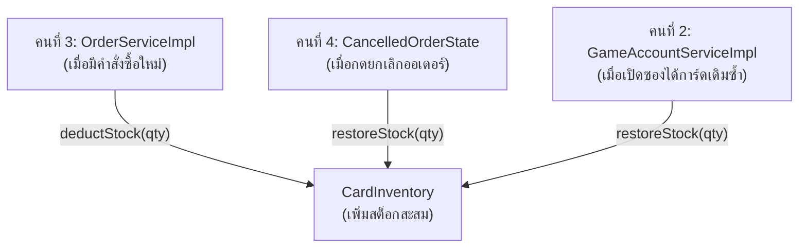

# 📘 Knowledge 08: Stock Deduction & Restoration Methods ใน CardInventory

> **Commit Reference**: `docs: add stock deduction and restoration methods in CardInventory`  
> **Roadmap Item**: ข้อ 8 — `feat: add stock deduction and restoration methods in CardInventory`  
> **ผู้รับผิดชอบ**: นายสัพพัญญู คำตุ้ม (673380066-4) — สมาชิกคนที่ 2: Game Account Vault & Inventory Manager  
> **โมดูล**: Domain Layer (`com.pokevault.domain.entity.CardInventory`)  
> **สถานะ**: Implemented & Integrated

---

## 1. 🎯 วัตถุประสงค์และภาพรวม (Overview & Context)

ใน Roadmap การพัฒนาโปรเจกต์ของสมาชิกคนที่ 2 **ข้อ 8** ระบุให้พัฒนาเมธอดจัดการสต็อกการ์ด ได้แก่:
- `deductStock(int qty)`: การหักสต็อกการ์ดออกจากคลัง
- `restoreStock(int qty)`: การคืนสต็อกการ์ดกลับเข้าคลัง
- `hasSufficientStock(int requestedQuantity)`: การตรวจสอบความเพียงพอของสต็อก

ในทางปฏิบัติ เมธอดทั้ง 3 นี้จัดเป็น **Core Domain Business Invariants** ที่สำคัญยิ่งยวด และตามหลัก **Information Expert Pattern (GRASP)** เอนทิตี `CardInventory` ควรเป็นผู้รับผิดชอบจัดการข้อมูลและสถานะของตนเองโดยตรง เพื่อไม่ให้เกิดภาวะ Anemic Domain Model 

ด้วยเหตุนี้ ฟังก์ชันของข้อ 8 จึงได้ถูกออกแบบ พัฒนา และเขียน Unit Tests ครอบคลุมไว้แล้วตั้งแต่การสร้างเอนทิตี `CardInventory` (ใน Commit `9b41086`) เพื่อเป็นรากฐานให้สมาชิกคนอื่นในทีม (คนที่ 3 และ 4) สามารถนำไปเชื่อมโยงกับระบบคำสั่งซื้อและสถานะออเดอร์ได้อย่างต่อเนื่อง

---

## 2. 🧩 เจาะลึกโค้ดและ Business Invariants

ไฟล์: `src/main/java/com/pokevault/domain/entity/CardInventory.java` (บรรทัดที่ 52–73)

```java
public boolean hasSufficientStock(int requestedQuantity) {
    validatePositiveQuantity(requestedQuantity);
    return quantity != null && quantity >= requestedQuantity;
}

public void deductStock(int count) {
    validatePositiveQuantity(count);
    if (!hasSufficientStock(count)) {
        throw new InsufficientStockException(
                "Insufficient stock for inventory ID " + this.id + " (Requested: " + count + ", Available: "
                        + this.quantity + ")");
    }
    this.quantity -= count;
}

public void restoreStock(int count) {
    validatePositiveQuantity(count);
    if (this.quantity == null) {
        this.quantity = 0;
    }
    this.quantity += count;
}
```

### 🔍 กฎความปลอดภัยทางธุรกิจ (Business Rules):
1. **Defensive Validation**: มีการเรียก `validatePositiveQuantity(count)` ในทุกเมธอด เพื่อป้องกันไม่ให้รับค่า 0 หรือค่าติดลบเข้ามาเปลี่ยนแปลงสต็อก
2. **Fail-Fast Exception**: ใน `deductStock` หากจำนวนที่ขอมากกว่าจำนวนคงเหลือ (`quantity`) จะทำการโยน `InsufficientStockException` ทันที โดยที่จำนวนการ์ดเดิมจะไม่ถูกแตะต้องหรือลดลง
3. **Null-Safety**: ใน `restoreStock` มีการป้องกันกรณี `quantity` เป็น `null` โดยจะกำหนดให้เป็น 0 ก่อนทำการบวกเพิ่ม

---

## 3. 🌐 การประสานงานและการนำไปใช้จริงในทั้งระบบ (System Integration)

เมธอดที่พัฒนาไว้ในข้อ 8 นี้ ถูกเรียกใช้งานร่วมกันจาก 3 โมดูลหลักของระบบ:



1. **Order Engine (สมาชิกคนที่ 3)**: ใน `OrderServiceImpl.createOrder()` เมื่อตรวจสอบคำสั่งซื้อผ่าน จะสั่ง `inventory.deductStock(itemReq.getQuantity())` ทันทีเพื่อตัดสต็อกแบบ Real-time
2. **GoF State Pattern Lifecycle (สมาชิกคนที่ 4)**: ใน `CancelledOrderState.cancel()` เมื่อลูกค้าหรือแอดมินยกเลิกออเดอร์ ระบบจะวนลูปสั่ง `inventory.restoreStock(item.getQuantity())` เพื่อคืนการ์ดกลับเข้าคลังร้านอัตโนมัติ
3. **Pack Pull Recording (สมาชิกคนที่ 2)**: ใน `GameAccountServiceImpl.addPulledCard()` เมื่อร้านเปิดซองสุ่มได้การ์ดใบเดิม สภาพเดิม ในไอดีเดิม ระบบจะเรียก `inventory.restoreStock(quantityToAdd)` เพื่อเพิ่มจำนวนการ์ด

---

## 4. 🧪 ผลการทดสอบ (Verification & Test Coverage)

ฟังก์ชันนี้ได้รับการตรวจสอบความถูกต้องผ่าน 2 ระดับ:
1. **Domain Unit Tests (`CardInventoryTest.java`)**:
   - `deductStockReducesQuantityWhenStockIsAvailable`: ตัดสต็อกสำเร็จ จำนวนลดลงถูกต้อง
   - `deductStockRejectsRequestsExceedingAvailableQuantity`: ปฏิเสธการตัดสต็อกเกินที่มี พร้อมโยน `InsufficientStockException`
   - `stockChangesRequirePositiveQuantities`: ปฏิเสธค่า 0 และค่าติดลบ
   - `restoreStockIncreasesQuantity`: คืนสต็อกสำเร็จ จำนวนเพิ่มขึ้นถูกต้อง
2. **Integration Tests (`OrderServiceTest.java`)**:
   - ทดสอบว่าการสร้างคำสั่งซื้อตัดสต็อกถูกต้อง และเมื่อสต็อกไม่พอระบบจะ Rollback และโยน Exception
- **ผลลัพธ์**: Automated Tests ผ่านครบ 100% (**31/31 tests passed**)
