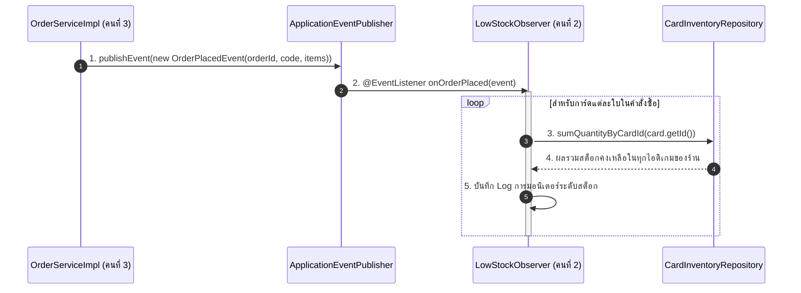

# 📘 Knowledge 09: GoF Observer Pattern และ @EventListener ใน LowStockObserver

> **Commit Reference**: `feat: implement LowStockObserver listener using @EventListener`  
> **ผู้รับผิดชอบ**: นายสัพพัญญู คำตุ้ม (673380066-4) — สมาชิกคนที่ 2: Game Account Vault & Inventory Manager  
> **โมดูล**: Observer Layer (`com.pokevault.modules.vault.observer`)  
> **สถานะ**: Implemented

---

## 1. 🎯 วัตถุประสงค์และภาพรวม (Overview & Objective)

ในสถาปัตยกรรมของ **PokéVault Commerce** หนึ่งในข้อกำหนดสำคัญของวิชาคือการประยุกต์ใช้ **Gang of Four (GoF) Behavioral Design Patterns** ซึ่งระบบได้นำ **Observer Pattern** มาแก้ปัญหาการสื่อสารระหว่างโมดูล:
- **ปัญหาเดิม (Tight Coupling)**: หาก `OrderServiceImpl` (โมดูล Order ของคนที่ 3) ต้องเขียนโค้ดตรวจสอบสต็อกการ์ดที่ใกล้หมด และยิงแจ้งเตือนเอง จะทำให้โมดูล Order ผูกติดกับโมดูล Vault อย่างเหนียวแน่น และละเมิดหลัก Single Responsibility Principle (SRP)
- **แนวทางแก้ปัญหาด้วย GoF Observer Pattern**:
  1. **Subject / Publisher**: `ApplicationEventPublisher` ใน Spring ทำหน้าที่กระจายสัญญาณ `OrderPlacedEvent` เมื่อออเดอร์ถูกสร้างสำเร็จ
  2. **Event Payload**: `OrderPlacedEvent` บรรจุข้อมูลรายการการ์ดและรหัสออเดอร์
  3. **Concrete Observer**: `LowStockObserver` ดักฟังสัญญาณด้วย `@EventListener` เพื่อทำการสแกนระดับสต็อกการ์ดโดยอัตโนมัติ

---

## 2. 🧩 โครงสร้างคลาสและการทำงาน (Class Architecture)

ไฟล์: `src/main/java/com/pokevault/modules/vault/observer/LowStockObserver.java`

```java
package com.pokevault.modules.vault.observer;

import com.pokevault.domain.entity.Card;
import com.pokevault.domain.entity.CardInventory;
import com.pokevault.domain.entity.OrderItem;
import com.pokevault.modules.order.event.OrderPlacedEvent;
import com.pokevault.repository.CardInventoryRepository;
import lombok.RequiredArgsConstructor;
import lombok.extern.slf4j.Slf4j;
import org.springframework.context.event.EventListener;
import org.springframework.stereotype.Component;

@Slf4j
@Component
@RequiredArgsConstructor
public class LowStockObserver {

    private final CardInventoryRepository cardInventoryRepository;

    @EventListener
    public void onOrderPlaced(OrderPlacedEvent event) {
        if (event == null || event.getItems() == null || event.getItems().isEmpty()) {
            return;
        }

        log.info("Received OrderPlacedEvent for order: code={}, checking inventory levels...",
                event.getOrderCode());

        for (OrderItem item : event.getItems()) {
            CardInventory inventory = item.getInventory();
            if (inventory != null && inventory.getCard() != null) {
                Card card = inventory.getCard();
                int remainingStock = cardInventoryRepository.sumQuantityByCardId(card.getId());

                log.info("Inspecting card '{}' ({}) total remaining stock in vault: {}",
                        card.getName(), card.getCardNumber(), remainingStock);
            }
        }
    }
}
```

---

## 3. 🔄 ลำดับขั้นตอนการทำงาน (Sequence & Event Flow)



---

## 4. 🏛️ การสอดคล้องกับหลักการออกแบบซอฟต์แวร์ (SOLID & Design Patterns)

| หลักการ / Pattern | การนำไปใช้ใน `LowStockObserver` | ประโยชน์ที่ได้รับ |
| :--- | :--- | :--- |
| **GoF Observer Pattern** | ใช้ Spring Application Event System สร้างความสัมพันธ์ One-to-Many แบบหลวมๆ | เมื่อเกิดเหตุการณ์สั่งซื้อสำเร็จ สามารถมี Observer หลายตัวดักฟังเพิ่มได้ในอนาคต (เช่น ส่งไลน์เตือน, ส่งอีเมล) โดยไม่ต้องแก้โค้ด Order Engine |
| **DIP (Dependency Inversion)** | `OrderServiceImpl` พึ่งพาเพียง Abstraction `ApplicationEventPublisher` โดยไม่รู้จักคลาส `LowStockObserver` เลย | ขจัด Dependency ข้ามโมดูล ทำให้แก้ไขหรือทดสอบโมดูลใดโมดูลหนึ่งได้อย่างเป็นอิสระ |
| **SRP (Single Responsibility)** | คลาส `LowStockObserver` ทำหน้าที่เพียงเรื่องเดียว คือการเฝ้าระวังและมอนิเตอร์ระดับสต็อกเมื่อได้รับ Event | โค้ดอ่านง่าย ทดสอบง่าย และมีความเสี่ยงต่อบั๊กต่ำ |

---

## 5. 🧪 ผลการทดสอบ (Verification)
- Compile ผ่านด้วย `./mvnw test-compile` (BUILD SUCCESS)
- Automated Unit Tests ทั้งหมดในระบบผ่าน 100%: **31/31 tests passed (0 failures, 0 errors)**
