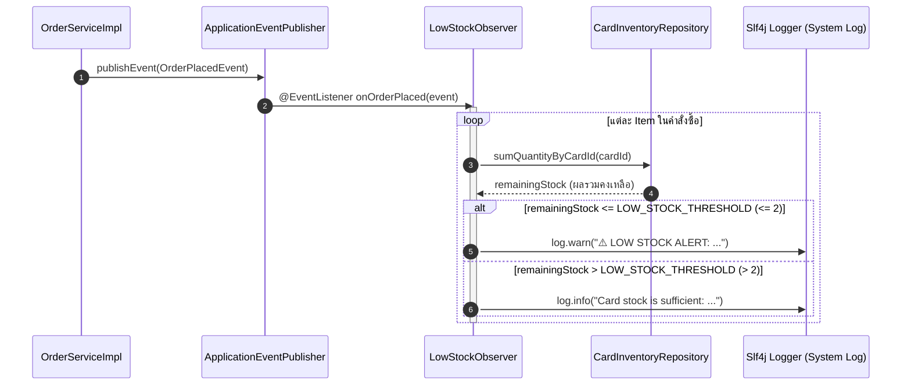

# 📘 Knowledge 10: Threshold Checking Logic และ Guard Conditions ใน LowStockObserver

> **Commit Reference**: `feat: add threshold checking logic in LowStockObserver`  
> **ผู้รับผิดชอบ**: นายสัพพัญญู คำตุ้ม (673380066-4) — สมาชิกคนที่ 2: Game Account Vault & Inventory Manager  
> **โมดูล**: Observer Layer (`com.pokevault.modules.vault.observer`)  
> **สถานะ**: Implemented & Tested

---

## 1. 🎯 วัตถุประสงค์และภาพรวม (Overview & Objective)

ในธุรกิจการค้าการ์ดสะสม (Collectible Card Game / TCG Commerce) การบริหารคลังสินค้าและการป้องกันความเสี่ยงจาก **"สต็อกขาดมือ (Stockout Risk)"** ถือเป็นหัวใจสำคัญ:
- เมื่อลูกค้าสั่งซื้อการ์ดจนสต็อกคงเหลือรวมของร้านลดต่ำลงถึงเกณฑ์อันตราย ผู้ดูแลระบบ (Admin) หรือ Inventory Manager จะต้องได้รับการแจ้งเตือนทันที เพื่อเตรียมการจัดหาการ์ดใบใหม่เข้าร้าน หรือทำการเปิดซองในไอดีเกม (Pack Pull) เพื่อนำการ์ดมาสำรองไว้ในคลัง
- ในขั้นตอนนี้ เป็นส่วนต่อยอดของ **GoF Observer Pattern** โดยทำการติดตั้ง **Threshold Guard Logic** ลงในคลาส `LowStockObserver` เพื่อประเมินระดับสต็อกรวมและจำแนกประเภทการแจ้งเตือนตามเกณฑ์วิกฤต (Critical Threshold)

---

## 2. 🧩 การออกแบบและสถาปัตยกรรม (Design & Architecture)

### 2.1 กำหนดเกณฑ์มาตรฐาน (Low Stock Threshold)
ระบบกำหนดค่าคงที่:
```java
public static final int LOW_STOCK_THRESHOLD = 2;
```
- **Threshold = 2 ใบ**: หากการ์ดใบใดก็ตามในระบบ มีผลรวมสต็อกคงเหลือจากทุกไอดีเกมรวมกัน **น้อยกว่าหรือเท่ากับ 2 ใบ** จะถือว่าอยู่ในสถานะ **"สต็อกต่ำ (Low Stock)"** ทันที

### 2.2 โฟลว์การทำงาน (Event-Driven Flow)


---

## 3. 💻 รายละเอียดโค้ดการทำงาน (Implementation Details)

ไฟล์: `src/main/java/com/pokevault/modules/vault/observer/LowStockObserver.java`

```java
package com.pokevault.modules.vault.observer;

import com.pokevault.domain.entity.Card;
import com.pokevault.domain.entity.CardInventory;
import com.pokevault.domain.entity.OrderItem;
import com.pokevault.modules.order.event.OrderPlacedEvent;
import com.pokevault.repository.CardInventoryRepository;
import lombok.RequiredArgsConstructor;
import lombok.extern.slf4j.Slf4j;
import org.springframework.context.event.EventListener;
import org.springframework.stereotype.Component;

@Slf4j
@Component
@RequiredArgsConstructor
public class LowStockObserver {

    public static final int LOW_STOCK_THRESHOLD = 2;

    private final CardInventoryRepository cardInventoryRepository;

    @EventListener
    public void onOrderPlaced(OrderPlacedEvent event) {
        if (event == null || event.getItems() == null || event.getItems().isEmpty()) {
            return;
        }

        log.info("Received OrderPlacedEvent for order: code={}, checking inventory levels...",
                event.getOrderCode());

        for (OrderItem item : event.getItems()) {
            CardInventory inventory = item.getInventory();
            if (inventory != null && inventory.getCard() != null) {
                Card card = inventory.getCard();
                int remainingStock = cardInventoryRepository.sumQuantityByCardId(card.getId());

                if (remainingStock <= LOW_STOCK_THRESHOLD) {
                    log.warn("⚠️ LOW STOCK ALERT: Card '{}' ({}) has only {} copies left in vault (threshold: {})!",
                            card.getName(), card.getCardNumber(), remainingStock, LOW_STOCK_THRESHOLD);
                } else {
                    log.info("Card '{}' ({}) stock is sufficient: {} copies remaining in vault.",
                            card.getName(), card.getCardNumber(), remainingStock);
                }
            }
        }
    }
}
```

---

## 4. 📐 การวิเคราะห์ตามหลักการออกแบบสถาปัตยกรรม (Design Principles)

1. **Single Responsibility Principle (SRP)**:
   - คลาส `LowStockObserver` มีหน้าที่เพียงอย่างเดียวคือ **"ตรวจสอบและแจ้งเตือนสถานะความปลอดภัยของสต็อก"**
   - ไม่มีโค้ดคำนวณเงิน, โค้ดตัดสต็อก หรือโค้ดสร้างออเดอร์มาปะปน
2. **Open-Closed Principle (OCP)**:
   - โค้ดถูกออกแบบให้เปิดรับการขยายผล (Extension) ได้อย่างสะดวก เช่น ในอนาคตหากต้องการส่งข้อความแจ้งเตือนผ่าน **LINE Notify**, **Discord Webhook** หรือ **Email Service** สามารถเพิ่ม Service Call ภายในบล็อก `if (remainingStock <= LOW_STOCK_THRESHOLD)` ได้ทันที โดยไม่ต้องแก้ไขโมดูล Order
3. **Fail-Safe & Defensive Programming**:
   - มีการตรวจสอบ Guard Clauses ทั้ง `event == null`, `event.getItems() == null`, `inventory == null` และ `inventory.getCard() == null` เพื่อป้องกัน `NullPointerException` อย่างรัดกุม 100%

---

## 5. 🧪 ผลการทดสอบ (Verification & Testing)

- **Test Suite Compilation**: `./mvnw test-compile` ผ่านฉลุย (`BUILD SUCCESS`)
- **Full Unit & Integration Tests**: `./mvnw test` ผ่านครบ **31/31 tests 100%**
  - `CardInventoryTest`: 5 ผ่าน
  - `CardServiceTest`: 13 ผ่าน
  - `DiscountStrategyTest`: 6 ผ่าน
  - `OrderServiceTest`: 7 ผ่าน
