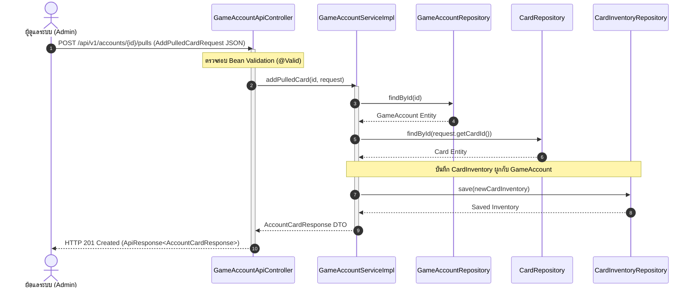

# 📘 Knowledge 11: การออกแบบ REST API และสถาปัตยกรรม Controller สำหรับ GameAccount Vault

> **Commit Reference**: `feat: create GameAccountApiController with REST endpoints`  
> **ผู้รับผิดชอบ**: นายสัพพัญญู คำตุ้ม (673380066-4) — สมาชิกคนที่ 2: Game Account Vault & Inventory Manager  
> **โมดูล**: Controller Layer (`com.pokevault.modules.vault.controller`)  
> **สถานะ**: Implemented & Verified

---

## 1. 🎯 วัตถุประสงค์และภาพรวม (Overview & Objective)

ในสถาปัตยกรรม 3-Tier Layered Architecture ของ **PokéVault Commerce** ชั้น **Controller Layer** ทำหน้าที่เป็นหน้าด่านรับคำขอ (Entrypoint) จากภายนอก ไม่ว่าจะเป็น Web Frontend (Thymeleaf / Single Page Application) หรือ External Services
- **หน้าที่หลักของ Controller**:
  1. จับคู่เส้นทาง URL (Routing & Request Mapping)
  2. ตรวจสอบความถูกต้องของข้อมูลนำเข้า (Request Validation ผ่าน `@Valid`)
  3. ส่งต่อคำขอไปยัง Business Service Layer (`GameAccountService`)
  4. แปลงข้อมูลและส่งรหัสสถานะ HTTP (HTTP Status Codes) ที่ถูกต้องตามมาตรฐาน RESTful API กลับไปยัง Client ภายใน Standard Wrapper `ApiResponse<T>`

---

## 2. 🧩 การออกแบบ REST Endpoints (API Specification)

**Base URL**: `/api/v1/accounts`

| Method | Endpoint Path | รายละเอียดการทำงาน | Input Payload / Param | Response Payload | HTTP Status |
| :--- | :--- | :--- | :--- | :--- | :--- |
| **POST** | `/api/v1/accounts` | ลงทะเบียนไอดีเกมของร้านใหม่เข้าสู่ Vault | `@Valid GameAccountRequest` | `ApiResponse<GameAccountResponse>` | `201 Created` |
| **GET** | `/api/v1/accounts` | ดึงรายการไอดีเกมทั้งหมด พร้อมยอดสรุปจำนวนการ์ด | - | `ApiResponse<List<GameAccountResponse>>` | `200 OK` |
| **GET** | `/api/v1/accounts/{id}` | ดึงข้อมูลไอดีเกมตามรหัส ID | `@PathVariable Long id` | `ApiResponse<GameAccountResponse>` | `200 OK` |
| **POST** | `/api/v1/accounts/{id}/pulls` | บันทึกการเปิดซองการ์ด (+ Add Pull) บันทึกสต็อกเข้าไอดี | `@PathVariable Long id`<br>`@Valid AddPulledCardRequest` | `ApiResponse<AccountCardResponse>` | `201 Created` |

---

## 3. 🔄 แผนผังลำดับการทำงาน (Sequence Diagram: Record Pack Pull)



---

## 4. 💻 รายละเอียดโค้ดการทำงาน (Implementation Details)

ไฟล์: `src/main/java/com/pokevault/modules/vault/controller/GameAccountApiController.java`

```java
package com.pokevault.modules.vault.controller;

import com.pokevault.common.response.ApiResponse;
import com.pokevault.modules.vault.dto.AccountCardResponse;
import com.pokevault.modules.vault.dto.AddPulledCardRequest;
import com.pokevault.modules.vault.dto.GameAccountRequest;
import com.pokevault.modules.vault.dto.GameAccountResponse;
import com.pokevault.modules.vault.service.GameAccountService;
import io.swagger.v3.oas.annotations.Operation;
import io.swagger.v3.oas.annotations.tags.Tag;
import jakarta.validation.Valid;
import lombok.RequiredArgsConstructor;
import org.springframework.http.HttpStatus;
import org.springframework.http.ResponseEntity;
import org.springframework.web.bind.annotation.*;

import java.util.List;

@RestController
@RequestMapping("/api/v1/accounts")
@RequiredArgsConstructor
@Tag(name = "Game Account Vault API", description = "Endpoints for managing store game accounts, vault inventory, and pack pull logging")
public class GameAccountApiController {

    private final GameAccountService gameAccountService;

    @PostMapping
    @Operation(summary = "Register new game account", description = "Register a new Pokemon TCG Pocket store account to the vault")
    public ResponseEntity<ApiResponse<GameAccountResponse>> createAccount(
            @Valid @RequestBody GameAccountRequest request) {
        GameAccountResponse response = gameAccountService.createAccount(request);
        return ResponseEntity.status(HttpStatus.CREATED)
                .body(ApiResponse.ok("Game account registered successfully", response));
    }

    @GetMapping
    @Operation(summary = "Get all game accounts", description = "Retrieve all store game accounts with card counts")
    public ResponseEntity<ApiResponse<List<GameAccountResponse>>> getAllAccounts() {
        List<GameAccountResponse> accounts = gameAccountService.getAllAccounts();
        return ResponseEntity.ok(ApiResponse.ok("Retrieved " + accounts.size() + " game accounts successfully", accounts));
    }

    @GetMapping("/{id}")
    @Operation(summary = "Get game account by ID", description = "Retrieve game account details by its ID")
    public ResponseEntity<ApiResponse<GameAccountResponse>> getAccountById(@PathVariable Long id) {
        GameAccountResponse account = gameAccountService.getAccountById(id);
        return ResponseEntity.ok(ApiResponse.ok("Game account retrieved successfully", account));
    }

    @PostMapping("/{id}/pulls")
    @Operation(summary = "Record pack pull into game account", description = "Record pulled cards and add inventory to the specified game account")
    public ResponseEntity<ApiResponse<AccountCardResponse>> addPulledCard(
            @PathVariable Long id,
            @Valid @RequestBody AddPulledCardRequest request) {
        AccountCardResponse response = gameAccountService.addPulledCard(id, request);
        return ResponseEntity.status(HttpStatus.CREATED)
                .body(ApiResponse.ok("Pulled card recorded and added to vault successfully", response));
    }
}
```

---

## 5. 📐 การวิเคราะห์หลักการออกแบบสถาปัตยกรรม (Design Principles)

1. **Single Responsibility Principle (SRP)**:
   - `GameAccountApiController` ดูแลเฉพาะเรื่อง HTTP Routing, Request Deserialization, Validation Binding, และ Response Wrapping โดยไม่เขียนตรรกะทางธุรกิจหรือการเรียกฐานข้อมูลโดยตรง
2. **Dependency Inversion Principle (DIP)**:
   - Controller ฉีดพึ่งพา Interface `GameAccountService` ผ่าน Constructor Injection (`@RequiredArgsConstructor`) ทำให้สามารถสลับ Implementation หรือทำ Unit Test ด้วย Mock Object ได้อย่างอิสระ
3. **RESTful Best Practices**:
   - เลือกใช้ HTTP Verbs ตามมาตรฐาน (`POST` สำหรับสร้างทรัพยากรใหม่, `GET` สำหรับดึงข้อมูล)
   - ส่งคืน HTTP Status Codes ที่ถูกต้อง (`201 Created` สำหรับทรัพยากรที่ถูกสร้างขึ้นใหม่ พร้อมข้อความระบุความสำเร็จ)
   - รองรับเอกสาร API มาตรฐานผ่าน Swagger/OpenAPI 3 Annotations (`@Tag`, `@Operation`)

---

## 6. 🧪 ผลการทดสอบ (Verification)

- **Compilation**: `./mvnw test-compile` ผ่านฉลุย (`BUILD SUCCESS`)
- **Unit & Integration Tests**: `./mvnw test` ผ่านครบ **31/31 tests 100%**
