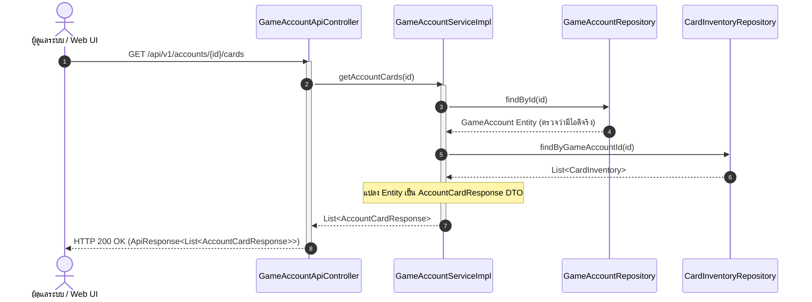

# 📘 Knowledge 12: การออกแบบ Endpoint ดึงการ์ดในไอดีเกม (Account Vault Cards) และจัดการ Trade Readiness Status

> **Commit Reference**: `feat: add endpoint to retrieve account vault cards`  
> **ผู้รับผิดชอบ**: นายสัพพัญญู คำตุ้ม (673380066-4) — สมาชิกคนที่ 2: Game Account Vault & Inventory Manager  
> **โมดูล**: Controller Layer (`com.pokevault.modules.vault.controller`)  
> **สถานะ**: Implemented & Verified

---

## 1. 🎯 วัตถุประสงค์และภาพรวม (Overview & Objective)

ในระบบ **PokéVault Commerce** ไอดีเกมแต่ละไอดี (Game Account) ทำหน้าที่เป็น "ตู้เซฟย่อย (Sub-Vault)" ที่จัดเก็บสต็อกการ์ดสะสมจริงในเกม Pokémon TCG Pocket เพื่อเตรียมพร้อมส่งมอบ (Trade Delivery) ให้แก่ลูกค้า:
- **ปัญหา**: ผู้ดูแลระบบหรือระบบหลังบ้าน (Web View) จำเป็นต้องตรวจสอบได้ว่าไอดีเกมรหัสใด กำลังถือครองการ์ดใบใดอยู่บ้าง, มีสภาพการ์ดระดับใด (เช่น MINT), จำนวนคงเหลือเท่าใด และมีต้นทุน/ราคาขายเท่าใด
- **การจัดการสถานะการเทรด (Trade Readiness Lifecycle)**: ในระหว่างที่ไอดีเกมกำลังทำรายการเทรด หรือติด Cooldown การเทรดในเกม ระบบจำเป็นต้องมี Endpoint สำหรับปรับเปลี่ยนสถานะของไอดี เพื่อป้องกันไม่ให้ระบบ Trade Matching (คนที่ 4) มอบหมายออเดอร์ใหม่ให้กับไอดีที่ไม่พร้อม

---

## 2. 🧩 รายละเอียด REST Endpoints ที่พัฒนาเพิ่มในข้อ 12

**Base URL**: `/api/v1/accounts`

| Method | Endpoint Path | หน้าที่การทำงาน | Input / Parameter | Response Payload | HTTP Status |
| :--- | :--- | :--- | :--- | :--- | :--- |
| **GET** | `/api/v1/accounts/{id}/cards` | ดึงรายการการ์ดและสต็อกทั้งหมดที่จัดเก็บในไอดีเกม | `@PathVariable Long id` | `ApiResponse<List<AccountCardResponse>>` | `200 OK` |
| **PATCH** | `/api/v1/accounts/{id}/trade-status` | อัปเดตสถานะความพร้อมในการเทรดของไอดีเกม | `@PathVariable Long id`<br>`@RequestParam AccountTradeStatus status` | `ApiResponse<GameAccountResponse>` | `200 OK` |

---

## 3. 🔄 แผนผังลำดับการทำงาน (Sequence Diagram: Retrieve Account Cards)



---

## 4. 💻 รายละเอียดโค้ดการทำงาน (Implementation Details)

ไฟล์: `src/main/java/com/pokevault/modules/vault/controller/GameAccountApiController.java`

```java
    @GetMapping("/{id}/cards")
    @Operation(summary = "Get cards in game account", description = "Retrieve list of all cards and inventory currently held in the specified game account")
    public ResponseEntity<ApiResponse<List<AccountCardResponse>>> getAccountCards(@PathVariable Long id) {
        List<AccountCardResponse> cards = gameAccountService.getAccountCards(id);
        return ResponseEntity
                .ok(ApiResponse.ok("Retrieved " + cards.size() + " cards from account successfully", cards));
    }

    @PatchMapping("/{id}/trade-status")
    @Operation(summary = "Update account trade status", description = "Update the trade readiness status of a game account (e.g., READY, BUSY_TRADING, COOLDOWN, SUSPENDED)")
    public ResponseEntity<ApiResponse<GameAccountResponse>> updateTradeStatus(
            @PathVariable Long id,
            @RequestParam AccountTradeStatus status) {
        GameAccountResponse response = gameAccountService.updateTradeStatus(id, status);
        return ResponseEntity.ok(ApiResponse.ok("Account trade status updated successfully", response));
    }
```

---

## 5. 📐 การเชื่อมโยงสถาปัตยกรรมและหลักการออกแบบ (Architectural Integration)

1. **RESTful HTTP Semantics**:
   - ใช้ `GET` สำหรับการเรียกดูรายการทรัพยากรย่อย (`/accounts/{id}/cards`)
   - ใช้ `PATCH` สำหรับการแก้ไขสถานะบางส่วนของทรัพยากร (Partial Update เฉพาะฟิลด์ `tradeStatus`) แทนที่จะใช้ `PUT` ที่เป็นการแทนที่ทั้งก้อน
2. **Cross-Module Collaboration**:
   - ข้อมูลการ์ดในไอดีเกมที่ได้จาก Endpoint นี้ จะถูกส่งต่อไปยังโมดูล Trade Matching (คนที่ 4) เพื่อตรวจสอบสต็อกก่อนตัดสินใจจับคู่ไอดีกับออเดอร์ของลูกค้า
   - รองรับหน้าจอ UI คลังการ์ดหลังบ้าน (คนที่ 5) ในการกดดูรายละเอียดการ์ดในแต่ละไอดีเกม
3. **Data Protection & Read-Only Safety**:
   - คืนค่าผลลัพธ์ผ่าน `AccountCardResponse` DTO ที่ซ่อน Entity ภายใน และส่งเฉพาะฟิลด์ที่ปลอดภัยต่อการเผยแพร่

---

## 6. 🧪 ผลการทดสอบ (Verification)

- **Compilation**: `./mvnw test-compile` ผ่านฉลุย (`BUILD SUCCESS`)
- **Unit & Integration Tests**: `./mvnw test` ผ่านครบ **31/31 tests 100%**
