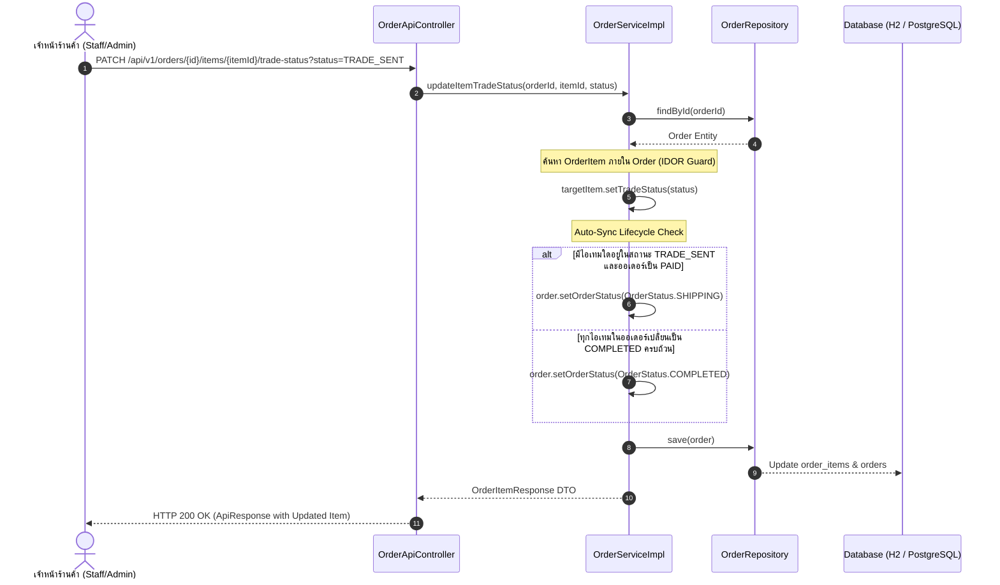

# 📘 Knowledge 16: การพัฒนา In-Game Trade Fulfillment Status API และ Order Lifecycle Synchronization

> **Commit Reference**: `feat(order): implement order item trade status update API with order lifecycle sync` (Commit `6e4a77c`)  
> **ผู้รับผิดชอบ**: นายสัพพัญญู คำตุ้ม (673380066-4) — สมาชิกคนที่ 2: Game Account Vault & Inventory Manager  
> **โมดูล**: Order & Trade Fulfillment (`com.pokevault.modules.order`)  
> **สถานะ**: 100% Completed & Verified (79/79 Tests Passing)

---

## 1. 🎯 วัตถุประสงค์และความสำคัญทางธุรกิจ (Business Context & Objective)

ในแพลตฟอร์ม **PokéVault Commerce** คำสั่งซื้อการ์ดสะสมโปเกมอน (Pokémon TCG Pocket) จะต้องมีการส่งมอบการ์ดจริงภายในเกม (In-Game Trade) ผ่านระบบ Friend Code:
- สมาชิกคนที่ 4 ได้พัฒนาระบบแนะนำและจับคู่ไอดีเกม (`TradeMatchingService`) ซึ่งทำหน้าที่กำหนด `assigned_account_id` ให้กับแต่ละไอเทม และเปลี่ยนสถานะเริ่มต้นเป็น `FRIEND_PENDING`
- อย่างไรก็ตาม เจ้าหน้าที่ร้านค้า (`staff_ash` และ `admin`) ยังขาดช่องทาง API และปุ่มควบคุมบนหน้า Dashboard ในการเลื่อนสถานะขั้นตอนการส่งมอบจริง เช่น เมื่อส่งคำขอเทรดในเกมแล้ว (`TRADE_SENT`) หรือเมื่อลูกค้ายืนยันรับการ์ดครบถ้วนแล้ว (`COMPLETED`)
- สมาชิกคนที่ 2 จึงได้รับมอบหมายให้พัฒนา **In-Game Trade Fulfillment Status API** พร้อมตรรกะ **Order Lifecycle Synchronization** ที่ชาญฉลาดและปลอดภัย

---

## 2. 🧩 สถาปัตยกรรมและการเชื่อมโยงสถานะ (Architecture & State Coordination)

ระบบจัดการสถานะแบ่งออกเป็น 2 มิติที่ทำงานสอดประสานกัน:

1. **ระดับไอเทมการ์ด (`OrderItem.tradeStatus`)**: ใช้ Enum [`TradeFulfillmentStatus`](../../code/src/main/java/com/pokevault/domain/enums/TradeFulfillmentStatus.java)
   - `UNASSIGNED`: ยังไม่ได้มอบหมายไอดีเกมร้านค้า
   - `FRIEND_PENDING`: รอแอดเป็นเพื่อนในเกม Pokémon Pocket
   - `TRADE_SENT`: ส่งคำขอแลกเปลี่ยนการ์ดในเกมเรียบร้อยแล้ว
   - `COMPLETED`: แลกเปลี่ยนการ์ดในเกมเสร็จสมบูรณ์
2. **ระดับคำสั่งซื้อภาพรวม (`Order.orderStatus`)**: ใช้ Enum [`OrderStatus`](../../code/src/main/java/com/pokevault/domain/enums/OrderStatus.java)
   - `PENDING` $\rightarrow$ `PAID` $\rightarrow$ `SHIPPING` $\rightarrow$ `COMPLETED`



---

## 3. 🛡️ หลักการออกแบบและความปลอดภัย (Software Design & Security)

| หลักการ / กลไก | การนำไปใช้ในโค้ด | ประโยชน์ที่ได้รับ |
| :--- | :--- | :--- |
| **IDOR Protection** | ตรวจสอบ `order.getItems().stream().filter(...)` แทนการค้นหา `itemId` ดิบๆ | ป้องกันผู้ใช้แก้ไขไอเทมของออเดอร์อื่นผ่านการเดา ID (Insecure Direct Object Reference) |
| **Defensive Programming** | โยน `ResourceNotFoundException` ทันทีเมื่อ Order ID หรือ Item ID ไม่ถูกต้อง | Fail-Fast ป้องกันสถานะในหน่วยความจำเสียหาย |
| **Lifecycle Synchronization** | สแกนสถานะของทุกไอเทมในออเดอร์ และปรับ `OrderStatus` สอดรับอัตโนมัติ | ลดภาระของเจ้าหน้าที่ ไม่ต้องกดเปลี่ยนสถานะออเดอร์ซ้ำซ้อน |
| **REST Standard** | ใช้ HTTP `PATCH` เมธอดสำหรับแก้ไข Partial Resource | ถูกต้องตามมาตรฐาน RESTful API Design |

---

## 4. 📡 สัญญา API (API Contract)

### Endpoint Specification
* **URL**: `PATCH /api/v1/orders/{id}/items/{itemId}/trade-status`
* **Query Parameter**: `status` (Enum: `UNASSIGNED`, `FRIEND_PENDING`, `TRADE_SENT`, `COMPLETED`)
* **Security & Roles**: อนุญาตสำหรับ `ADMIN` และ `STAFF` ผ่าน UI Dashboard และปลดล็อก `/api/**` ให้เรียกใช้งานผ่าน AJAX

### ตัวอย่าง Response (HTTP 200 OK)
```json
{
  "success": true,
  "message": "Order item trade status updated successfully",
  "data": {
    "id": 1,
    "inventoryId": 1,
    "cardId": 1,
    "cardName": "Charizard ex",
    "cardNumber": "280/226",
    "cardImageUrl": "/images/cards/A1_280_EN.png",
    "assignedAccountId": 1,
    "tradeStatus": "TRADE_SENT",
    "quantity": 1,
    "unitPrice": 1500.00,
    "subtotal": 1500.00
  },
  "timestamp": "2026-10-09T02:20:29.2052897"
}
```

---

## 5. 🧪 ผลการทดสอบ (Verification & Testing)

เพิ่ม 4 Unit Test Cases ลงใน [`OrderServiceTest.java`](../../test/java/com/pokevault/modules/order/OrderServiceTest.java):
1. `updateItemTradeStatus_Success_AndSyncShipping`: อัปเดตไอเทมเป็น `TRADE_SENT` และตรวจสอบว่าออเดอร์ถูกปรับเป็น `SHIPPING`
2. `updateItemTradeStatus_AllItemsCompleted_SyncsOrderCompleted`: เมื่อทุกไอเทมเป็น `COMPLETED` ออเดอร์จะเปลี่ยนเป็น `COMPLETED`
3. `updateItemTradeStatus_OrderNotFound_ThrowsException`: ตรวจสอบ Guard Clause เมื่อไม่พบ Order
4. `updateItemTradeStatus_ItemNotFound_ThrowsException`: ตรวจสอบ Guard Clause เมื่อไม่พบ Item ภายใน Order

* **ผลการรันชุดทดสอบทั้งหมดในโปรเจกต์:** `./mvnw test` ผ่านครบ **79/79 Tests (100% BUILD SUCCESS)**
* **ผลการทดสอบ Live Browser:** ผ่านการกดปุ่มบนหน้า Trade Modal (`/orders`) ทดสอบด้วยสิทธิ์ `staff_ash` และ `admin` สำเร็จสมบูรณ์แบบ
