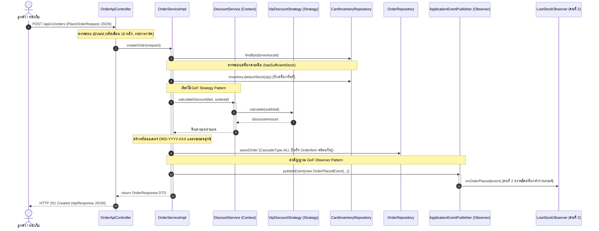

# 📘 คู่มืออธิบายโค้ดและการตอบคำถามอาจารย์ (Defense Guide)
## โครงการ: Pokémon TCG Pocket Vault & Chat Commerce Trade Platform
> **ผู้รับผิดชอบ**: สมาชิกคนที่ 3 — **นายธนภูมิ จันทรา (รหัสนักศึกษา: 673380272-1)**  
> **บทบาท**: Order Engine & Strategy Pattern Specialist  
> **วิชา**: CP353002 Principles of Software Design and Development (Spring Boot)

---

## 📑 สารบัญ (Table of Contents)
1. [ภาพรวมบทบาทหน้าที่ของคนที่ 3 (Role & Scope)](#1-ภาพรวมบทบาทหน้าที่ของคนที่-3-role--scope)
2. [สถาปัตยกรรมการทำงานและแผนภาพ Flow การทำงาน (Architecture & Flow)](#2-สถาปัตยกรรมการทำงานและแผนภาพ-flow-การทำงาน-architecture--flow)
3. [เจาะลึกอธิบายโค้ดทุกไฟล์อย่างละเอียด (Source Code Deep-Dive)](#3-เจาะลึกอธิบายโค้ดทุกไฟล์อย่างละเอียด-source-code-deep-dive)
   - 3.1 [กลุ่ม Entity & Enum (Domain Layer)](#31-กลุ่ม-entity--enum-domain-layer)
   - 3.2 [กลุ่ม Data Access (Repository Layer)](#32-กลุ่ม-data-access-repository-layer)
   - 3.3 [กลุ่ม GoF Strategy Pattern (ระบบคำนวณส่วนลด)](#33-กลุ่ม-gof-strategy-pattern-ระบบคำนวณส่วนลด)
   - 3.4 [กลุ่ม GoF Observer Pattern (Event Publisher)](#34-กลุ่ม-gof-observer-pattern-event-publisher)
   - 3.5 [กลุ่ม Service Engine (Core Business Logic)](#35-กลุ่ม-service-engine-core-business-logic)
   - 3.6 [กลุ่ม DTO & Bean Validation (Presentation Layer)](#36-กลุ่ม-dto--bean-validation-presentation-layer)
   - 3.7 [กลุ่ม REST Controller (Web API Layer)](#37-กลุ่ม-rest-controller-web-api-layer)
   - 3.8 [กลุ่ม Automated Unit Tests (JUnit 5 & Mockito)](#38-กลุ่ม-automated-unit-tests-junit-5--mockito)
4. [การประยุกต์ใช้หลักการ SOLID ครบ 5 ข้อ (พร้อมชี้บรรทัดโค้ดจริง)](#4-การประยุกต์ใช้หลักการ-solid-ครบ-5-ข้อ-พร้อมชี้บรรทัดโค้ดจริง)
5. [เก็ง 10 คำถามเด็ดที่อาจารย์ชอบถาม พร้อมแนวทางการตอบ (Q&A Cheat Sheet)](#5-เก็ง-10-คำถามเด็ดที่อาจารย์ชอบถาม-พร้อมแนวทางการตอบ-qa-cheat-sheet)

---

## 1. ภาพรวมบทบาทหน้าที่ของคนที่ 3 (Role & Scope)

ในฐานะ **Order Engine & Strategy Pattern Specialist** รับผิดชอบการขับเคลื่อนหัวใจหลักด้านรายได้ของระบบ:
1. **ระบบคำสั่งซื้อ (Order Engine)**: รับคำสั่งจองการ์ดจากหน้าเว็บ เชื่อมต่อระบบคลังการ์ด (`CardInventory`) ตรวจสอบความถูกต้อง หักสำรองสต็อกการ์ดทันทีแบบ Transactional ป้องกันการขายเกิน (Overselling)
2. **ระบบส่วนลดอัจฉริยะ (GoF Strategy Pattern)**: ออกแบบเครื่องยนต์คำนวณส่วนลดตามระดับสมาชิก (`MembershipTier`) ของลูกค้า (`REGULAR` 0%, `VIP` 10%, `WHOLESALE` 15%) โดยใช้ Spring Dependency Injection รวบรวม Strategies เข้าสู่ Context แบบเปิดรับการขยายแต่ปิดการแก้ไข (Open/Closed Principle)
3. **การส่งสัญญาณแจ้งเตือนคลัง (GoF Observer Pattern - Event Publisher)**: เมื่อสร้างออเดอร์สำเร็จ จะทำการกระจายสัญญาณ `OrderPlacedEvent` ผ่าน Spring Event Bus ไปยังผู้สังเกตการณ์ (`LowStockObserver`) เพื่อตรวจสอบระดับสต็อกการ์ดที่เหลือแบบ Real-time
4. **ความถูกต้องของข้อมูล (Data Integrity & Validation)**: ตรวจสอบความถูกต้องของคำขอ เช่น รหัสเพื่อนในเกม 16 หลักด้วย Regular Expression และการจัดรูปแบบโค้ดออเดอร์อัตโนมัติ `ORD-YYYY-XXX`

---

## 2. สถาปัตยกรรมการทำงานและแผนภาพ Flow การทำงาน (Architecture & Flow)



---

## 3. เจาะลึกอธิบายโค้ดทุกไฟล์อย่างละเอียด (Source Code Deep-Dive)

### 3.1 กลุ่ม Entity & Enum (Domain Layer)

#### 📄 `Order.java` (`com.pokevault.domain.entity.Order`)
* **หน้าที่**: เป็น JPA Entity ตัวแทนตาราง `orders` ในฐานข้อมูล
* **ฟิลด์สำคัญ**:
  * `orderCode`: รหัสคำสั่งซื้อที่ไม่ซ้ำกัน (`unique = true`, เช่น `ORD-2026-001`)
  * `user`: ผูก Foreign Key ไปยังผู้ใช้งาน (`@ManyToOne(fetch = FetchType.LAZY)`)
  * `customerFriendId`: รหัสเพื่อนในเกมของผู้ซื้อ 16 หลัก
  * `orderStatus`: สถานะคำสั่งซื้อ ใช้ Enum `OrderStatus` (ค่าเริ่มต้น: `PENDING`)
  * `totalAmount`, `discountAmount`, `finalAmount`: ตัวเลขยอดเงินใช้ `BigDecimal` ความละเอียด 2 ตำแหน่งทศนิยม
  * `items`: รายการสินค้าที่อยู่ในออเดอร์ (`List<OrderItem>`)
* **จุดที่ต้องเน้นกับอาจารย์**:
  * `@OneToMany(mappedBy = "order", cascade = CascadeType.ALL, orphanRemoval = true)`:
    * `cascade = CascadeType.ALL`: เมื่อทำการบันทึก (`save`), อัปเดต หรือลบ `Order` ตัว `OrderItem` ทั้งหมดที่อยู่ข้างในจะถูกบันทึกตามไปด้วยอัตโนมัติ ทำให้ไม่ต้องเรียก `orderItemRepository.save()` แยกทีละแถว
    * `orphanRemoval = true`: หากไอเทมถูกถอดออกจาก List จะถูกลบออกจากตารางอัตโนมัติ
  * เมธอด `addItem(OrderItem item)`: ทำการผูกความสัมพันธ์แบบ Bidirectional Synchronization (`this.items.add(item); item.setOrder(this);`) เพื่อให้ทั้งสองฝั่งรู้จักกันก่อนสั่ง Persist ลง Database

#### 📄 `OrderItem.java` (`com.pokevault.domain.entity.OrderItem`)
* **หน้าที่**: เป็น JPA Entity ตัวแทนตาราง `order_items` เก็บรายละเอียดการ์ดแต่ละใบในคำสั่งซื้อ
* **ฟิลด์สำคัญ**:
  * `order`: เชื่อมกลับไปยัง Order หลัก
  * `inventory`: เชื่อมกับ `CardInventory` ที่ถูกหักสต็อก
  * `assignedAccount`: ไอดีเกมของร้านค้าที่ได้รับมอบหมายให้เป็นผู้ส่งเทรด
  * `tradeStatus`: สถานะการเทรดระดับไอเทม (`UNASSIGNED`, `FRIEND_PENDING`, `TRADE_SENT`, `COMPLETED`)
  * `quantity`: จำนวนใบที่ซื้อ
  * `unitPrice`: ราคาต่อหน่วย ณ วันที่ซื้อ
  * `subtotal`: ราคารวมของไอเทมนั้น (`quantity * unitPrice`)
* **จุดที่ต้องเน้นกับอาจารย์**:
  * **Price Snapshot Pattern**: ทำไมต้องมี `unitPrice` ใน `OrderItem` ทั้งที่มี `sellingPrice` อยู่ใน `CardInventory` แล้ว?  
    *👉 ตอบ: เพื่อ "ฟรีซราคา ณ วันที่ซื้อ" ไว้ หากในอนาคตร้านค้าปรับราคาการ์ดในคลัง ย้อนหลังประวัติออเดอร์เก่าจะต้องไม่ได้รับผลกระทบ*

#### 📄 `OrderStatus.java` (`com.pokevault.domain.enums.OrderStatus`)
* **หน้าที่**: Enum กำหนดวงจรชีวิตของออเดอร์ (Order Lifecycle) 5 สถานะ:
  1. `PENDING`: ลูกค้าสั่งจองบนเว็บแล้ว อยู่ระหว่างรอทักแชท/แจ้งโอนเงิน
  2. `PAID`: ตรวจสอบสลิปเงินเรียบร้อยแล้ว
  3. `SHIPPING`: เจ้าหน้าที่กำลังดำเนินการส่งคำขอเพื่อนหรือส่งการ์ดเทรดในเกม
  4. `COMPLETED`: ลูกค้ายืนยันรับการ์ดในเกมครบถ้วน ปิดคำสั่งซื้อ
  5. `CANCELLED`: คำสั่งซื้อถูกยกเลิก และคืนสต็อกการ์ดเข้าคลัง

---

### 3.2 กลุ่ม Data Access (Repository Layer)

#### 📄 `OrderRepository.java` (`com.pokevault.repository.OrderRepository`)
* **หน้าที่**: Interface จัดการข้อมูลคำสั่งซื้อผ่าน Spring Data JPA
* **ฟังก์ชันเด่น**:
  * `Optional<Order> findByOrderCode(String orderCode)`: ค้นหาออเดอร์ด้วยรหัส เช่น `ORD-2026-001`
  * `List<Order> findByUserId(Long userId)`: ค้นหาประวัติการสั่งซื้อของลูกค้ารายบุคคล

#### 📄 `OrderItemRepository.java` (`com.pokevault.repository.OrderItemRepository`)
* **หน้าที่**: Data Access สำหรับรายการการ์ดในออเดอร์
* **ฟังก์ชันเด่น**:
  * `List<OrderItem> findByOrderId(Long orderId)`: ดึงรายการไอเทมทั้งหมดในออเดอร์
  * `List<OrderItem> findByAssignedAccountId(Long accountId)`: ดึงรายการการ์ดที่ไอดีเกมร้านค้านั้น ๆ ต้องเป็นคนส่งเทรด

---

### 3.3 กลุ่ม GoF Strategy Pattern (ระบบคำนวณส่วนลด)

#### 📄 `DiscountStrategy.java` (`com.pokevault.modules.order.strategy.DiscountStrategy`)
* **หน้าที่**: Strategy Interface ตาม Gang of Four Design Patterns
* **สัญญาการทำงาน (Contract)**:
  * `BigDecimal calculate(BigDecimal subtotal)`: ขั้นตอนวิธีคำนวณยอดเงินส่วนลด
  * `boolean supports(MembershipTier tier)`: ระบุว่า Strategy นี้รองรับระดับสมาชิกใด
  * `BigDecimal getDiscountPercentage()`: ดึงค่าเปอร์เซ็นต์ส่วนลดแสดงผล

#### 📄 Concrete Strategies 3 คลาส:
1. **`RegularDiscountStrategy.java`**:
   * รองรับ: `MembershipTier.REGULAR`
   * การคิดส่วนลด: คืนค่า `BigDecimal.ZERO` (ส่วนลด 0%)
2. **`VipDiscountStrategy.java`**:
   * รองรับ: `MembershipTier.VIP`
   * การคิดส่วนลด: `subtotal.multiply(new BigDecimal("0.10"))` (ส่วนลด 10%)
3. **`WholesaleDiscountStrategy.java`**:
   * รองรับ: `MembershipTier.WHOLESALE`
   * การคิดส่วนลด: `subtotal.multiply(new BigDecimal("0.15"))` (ส่วนลด 15%)

#### 📄 `DiscountService.java` (`com.pokevault.modules.order.service.DiscountService`)
* **หน้าที่**: ทำหน้าที่เป็น **Context** ใน GoF Strategy Pattern
* **ความลับทางเทคนิค (Spring DI List Injection)**:
  ```java
  private final List<DiscountStrategy> strategies;

  public DiscountService(List<DiscountStrategy> strategies) {
      this.strategies = strategies != null ? strategies : List.of();
  }
  ```
  Spring Framework จะทำการค้นหา Bean ทุกตัวที่ `@Component` และ `implements DiscountStrategy` ในระบบ มารวมเป็น `List` แล้วส่งผ่าน Constructor ให้โดยอัตโนมัติ!
* **เมธอด `getApplicableStrategy(MembershipTier tier)`**:
  * วนหา Strategy ด้วย Java Stream API:
    `strategies.stream().filter(s -> s.supports(tier)).findFirst()`
  * หากไม่พบ จะ Fallback กลับไปใช้ `REGULAR` หรือโยน Exception
* **จุดที่ต้องเน้นกับอาจารย์**: สอดคล้องกับ **Open/Closed Principle (OCP)** โดยตรง เมื่อร้านต้องการออกแคมเปญใหม่ เช่น `StaffDiscountStrategy (ลด 20%)` เพียงสร้างคลาสใหม่ที่ `implements DiscountStrategy` โดย**ไม่ต้องแก้โค้ดใน `DiscountService` แม้แต่บรรทัดเดียว!**

---

### 3.4 กลุ่ม GoF Observer Pattern (Event Publisher)

#### 📄 `OrderPlacedEvent.java` (`com.pokevault.modules.order.event.OrderPlacedEvent`)
* **หน้าที่**: เป็น **Event Object / Message Payload** สำหรับส่งต่อเหตุการณ์ในระบบ
* **ข้อมูลที่แนบไป**:
  * `orderId`: Primary Key ID ของออเดอร์
  * `orderCode`: รหัสคำสั่งซื้อ (เช่น `ORD-2026-001`)
  * `items`: รายการ `List<OrderItem>` เพื่อให้ Observer ตรวจเช็คว่าการ์ดใบไหนถูกสั่งซื้อไปบ้าง
  * `timestamp`: วันที่และเวลาที่สั่งซื้อสำเร็จ

---

### 3.5 กลุ่ม Service Engine (Core Business Logic)

#### 📄 `OrderServiceImpl.java` (`com.pokevault.modules.order.service.OrderServiceImpl`)
* **หน้าที่**: หัวใจหลักในการประมวลผลคำสั่งซื้อทั้งหมด
* **การตั้งค่าระดับคลาส**:
  * `@Service`: ประกาศเป็น Spring Service Component
  * `@RequiredArgsConstructor`: สร้าง Constructor สำหรับ Dependency Injection อัตโนมัติ (DIP)
  * `@Transactional`: ครอบการทำงานแบบ Database Transaction เพื่อความถูกต้องตามหลัก ACID
* **ขั้นตอนการทำงานของเมธอด `createOrder(PlaceOrderRequest request)` ทีละสเต็ป**:
  1. **ค้นหาลูกค้า**: ค้นหา `User` จาก `request.getUserId()` หากไม่พบโยน `ResourceNotFoundException`
  2. **ดึงระดับสมาชิก**: ดึง `user.getUserProfile().getMembershipTier()` (หากไม่มี ให้เป็น `REGULAR`)
  3. **ลูปตรวจเช็คและตัดสต็อกการ์ด (Stock Deduction)**:
     - ค้นหา `CardInventory` ด้วย ID
     - เช็คสต็อก `inventory.hasSufficientStock(quantity)` หากสต็อกไม่พอ จะ Fail-Fast โยน `InsufficientStockException` ทันที
     - **ตัดสต็อกทันที**: `inventory.deductStock(quantity); cardInventoryRepository.save(inventory);`
     - สะสมยอดเงินรวมย่อย (`subtotal`)
     - สร้าง `OrderItem` และผูกเข้ากับ `Order` ผ่าน `order.addItem(orderItem)`
  4. **คำนวณส่วนลดด้วย Strategy Pattern**:
     - เรียก `discountService.calculateDiscount(tier, subtotal)`
     - คำนวณยอดสุทธิ: `finalAmount = subtotal - discountAmount` (ไม่ให้ติดลบด้วย `.max(BigDecimal.ZERO)`)
  5. **สร้างรหัสออเดอร์และบันทึก**:
     - เรียก `generateOrderCode()` เพื่อสร้างรหัสเช่น `ORD-2026-001`
     - สั่ง `orderRepository.save(order)` บันทึกทั้ง Order และ Items พร้อมกัน
  6. **กระจายสัญญาณ Event (Observer Pattern)**:
     - เรียก `eventPublisher.publishEvent(new OrderPlacedEvent(...))` เพื่อแจ้งเตือนคลังสินค้า
  7. **ส่งผลลัพธ์กลับ**: แปลง Entity เป็น `OrderResponse` DTO แล้วส่งกลับ Controller
* **เมธอด `generateOrderCode()`**:
  ```java
  private String generateOrderCode() {
      long count = orderRepository.count() + 1;
      return String.format("ORD-%d-%03d", LocalDate.now().getYear(), count);
  }
  ```
  สร้างรหัสตามปีปัจจุบันและลำดับ เช่น ปี 2026 ลำดับที่ 1 ➔ `ORD-2026-001`

---

### 3.6 กลุ่ม DTO & Bean Validation (Presentation Layer)

#### 📄 `PlaceOrderRequest.java` (`com.pokevault.modules.order.dto.PlaceOrderRequest`)
* **หน้าที่**: รับข้อมูล JSON Payload จากหน้าบ้านสำหรับสั่งจองการ์ด
* **กฎความปลอดภัย (Bean Validation Annotations)**:
  * `@NotNull(message = "User ID is required")`: ต้องระบุ User ID
  * `@NotBlank(message = "Customer friend ID is required")`
  * `@Pattern(regexp = "^\\d{4}-\\d{4}-\\d{4}-\\d{4}$|^\\d{16}$", message = "Customer friend ID must be 16 digits...")`:
    * ตรวจสอบว่ารหัสเพื่อนในเกมต้องเป็นตัวเลข 16 หลักเท่านั้น (รองรับทั้งแบบมีขีดคั่น `1234-5678-9012-3456` หรือพิมพ์ติดกัน 16 ตัว)
  * `@NotEmpty`: รายการสั่งซื้อต้องมีสินค้าอย่างน้อย 1 รายการ
  * `@Valid`: ตรวจสอบความถูกต้องลึกลงไปถึงแต่ละไอเทมใน `items`

#### 📄 `OrderResponse.java` & `OrderItemResponse.java`
* **หน้าที่**: ส่งผลลัพธ์ข้อมูลคำสั่งซื้อกลับไปให้ผู้ใช้ โดยคัดกรองเฉพาะข้อมูลที่จำเป็น และมี Factory Method `fromEntity(Order order)` สำหรับแปลง Entity เป็น DTO อย่างปลอดภัย ป้องกันปัญหา Circular Reference และ Data Leak

---

### 3.7 กลุ่ม REST Controller (Web API Layer)

#### 📄 `OrderApiController.java` (`com.pokevault.modules.order.controller.OrderApiController`)
* **หน้าที่**: REST Controller เปิดทางให้ Client เชื่อมต่อผ่าน HTTP
* **Endpoints**:
  * `POST /api/v1/orders`:
    * สั่งจองการ์ด รับ `@Valid @RequestBody PlaceOrderRequest request`
    * คืนค่า HTTP 201 Created พร้อม `ApiResponse.ok("Order placed successfully", response)`
  * `GET /api/v1/orders/{id}`: ดึงข้อมูลคำสั่งซื้อรายออเดอร์
  * `GET /api/v1/orders`: ดึงรายการคำสั่งซื้อทั้งหมดในระบบ

---

### 3.8 กลุ่ม Automated Unit Tests (JUnit 5 & Mockito)

#### 📄 `DiscountStrategyTest.java` (6 Test Cases)
* ทดสอบคำนวณส่วนลดของ Strategy ทั้ง 3 ตัว:
  1. `RegularDiscountStrategy` ➔ คืนค่า 0.00
  2. `VipDiscountStrategy` ➔ คืนค่า 10% ถูกต้อง
  3. `WholesaleDiscountStrategy` ➔ คืนค่า 15% ถูกต้อง
  4. กรณี Subtotal เป็น 0 หรือติดลบ ➔ คืนค่า 0.00 ไม่ติดลบ
  5. `DiscountService` สลับ Strategy ตาม Tier สำเร็จ
  6. กรณี Tier ไม่ตรง ➔ Fallback เป็น Regular สำเร็จ

#### 📄 `OrderServiceTest.java` (7 Test Cases หลัก)
* ใช้ `@ExtendWith(MockitoExtension.class)` จำลอง Mock Dependencies:
  1. `createOrder_Success`: ทดสอบ Happy Path (ตัดสต็อก, คำนวณส่วนลด VIP, เซฟออเดอร์, ยิง Event ครบถ้วน)
  2. `createOrder_InsufficientStock_ThrowsException`: ทดสอบเมื่อสต็อกไม่พอ ➔ โยน `InsufficientStockException` และไม่เซฟออเดอร์
  3. `createOrder_UserNotFound_ThrowsException`: ทดสอบเมื่อไม่พบ User ID ➔ โยน `ResourceNotFoundException`
  4. `createOrder_InventoryNotFound_ThrowsException`: ทดสอบเมื่อไม่พบสินค้าในคลัง
  5. `getOrderById_Success`: ดึงข้อมูลสำเร็จเมื่อ ID มีอยู่จริง
  6. `getOrderById_NotFound_ThrowsException`: โยน Exception เมื่อหา ID ไม่เจอ
  7. `getAllOrders_ReturnsList`: ดึงรายการออเดอร์ทั้งหมดถูกต้อง

---

## 4. การประยุกต์ใช้หลักการ SOLID ครบ 5 ข้อ (พร้อมชี้บรรทัดโค้ดจริง)

| หลักการ SOLID | จุดที่ประยุกต์ใช้ในโค้ดของคนที่ 3 | คำอธิบายเพื่อตอบอาจารย์ |
| :--- | :--- | :--- |
| **S - Single Responsibility Principle (SRP)** | • `DiscountService.java`<br>• `OrderServiceImpl.java`<br>• `OrderApiController.java` | แต่ละคลาสมีหน้าที่เดียวชัดเจน `DiscountService` คิดส่วนลดอย่างเดียว ไม่ยุ่งกับฐานข้อมูล, `OrderServiceImpl` จัดการ Transaction และสต็อก, `OrderApiController` รับส่ง HTTP Request เท่านั้น |
| **O - Open/Closed Principle (OCP)** | • `DiscountStrategy.java`<br>• `DiscountService.java:14-18` | เมื่อต้องการเพิ่มระดับส่วนลดใหม่ (เช่น BirthdayDiscount 25%) สามารถสร้างคลาสใหม่ที่ implement `DiscountStrategy` ได้ทันที โดย**ไม่ต้องแก้ไขโค้ดเดิมหรือเพิ่ม `if-else`** ใน `DiscountService` |
| **L - Liskov Substitution Principle (LSP)** | • `RegularDiscountStrategy`<br>• `VipDiscountStrategy`<br>• `WholesaleDiscountStrategy` | ทุก Strategy สามารถนำไปแทนที่ในตัวแปร Interface `DiscountStrategy` ได้อย่างสมบูรณ์แบบโดยไม่ทำให้พฤติกรรมการคำนวณผิดเพี้ยน หรือเกิดข้อผิดพลาดที่ไม่คาดคิด |
| **I - Interface Segregation Principle (ISP)** | • `OrderService.java`<br>• `DiscountStrategy.java` | `DiscountStrategy` ประกาศเฉพาะ `calculate()` และ `supports()` ที่จำเป็น ไม่ยัดเยียดเมธอดที่ไม่เกี่ยวข้อง ทำให้คลาสลูกไม่ต้อง implement โค้ดว่างเปล่า |
| **D - Dependency Inversion Principle (DIP)** | • `OrderApiController.java:23`<br>• `OrderServiceImpl.java:34-38`<br>• `DiscountService.java:14` | โมดูลระดับสูงไม่พึ่งพาโมดูลระดับต่ำโดยตรง Controller พึ่งพา Interface `OrderService`, Service พึ่งพา `OrderRepository` และทุกคลาสใช้ **Constructor Injection** ผ่าน Lombok `@RequiredArgsConstructor` (ไม่มี Field Injection `@Autowired` บน private field) |

---

## 5. เก็ง 10 คำถามเด็ดที่อาจารย์ชอบถาม พร้อมแนวทางการตอบ (Q&A Cheat Sheet)

### Q1: ทำไมถึงเลือกใช้ GoF Strategy Pattern ในการคำนวณส่วนลด ทำไมไม่เขียน `if-else` หรือ `switch-case` ใน Service ไปเลย?
> **แนวทางการตอบ**:  
> "ถ้าเราใช้ `if-else` หรือ `switch-case` เมื่อธุรกิจมีการออกโปรโมชันใหม่หรือเปลี่ยน Tier สมาชิก เราจะต้องกลับมาแก้ไขโค้ดเดิมใน Service ซึ่งเสี่ยงกระทบกับระบบเดิมและขัดต่อหลักการ **Open/Closed Principle (OCP)** ของ SOLID ครับ  
> การใช้ **Strategy Pattern** ช่วยแยกอัลกอริทึมการคิดส่วนลดแต่ละแบบออกเป็นคลาสอิสระ (Encapsulated Algorithm) และทำให้ Spring DI สามารถรวบรวมผ่าน `List<DiscountStrategy>` ได้โดยอัตโนมัติ ทำให้ระบบสามารถต่อขยายได้ไม่จำกัดและเขียน Unit Test แยกแต่ละกลยุทธ์ได้อย่างง่ายดายครับ"

---

### Q2: ใน `DiscountService` ตัว Spring Framework รู้ได้อย่างไรว่าจะเอาคลาสไหนมาใส่ใน `List<DiscountStrategy>`?
> **แนวทางการตอบ**:  
> "เพราะว่า Concrete Strategy ทุกคลาส (`Regular`, `Vip`, `Wholesale`) ถูกกำกับด้วย Annotation `@Component` ครับ เมื่อ Spring Boot เริ่มทำงาน (Application Startup) Component Scanner จะค้นหาคลาสทั้งหมดที่ `implements DiscountStrategy` แล้วทำการ Inject มารวมกันใน `List<DiscountStrategy>` ผ่าน Constructor Injection ให้โดยอัตโนมัติครับ"

---

### Q3: ทำไมตัวเลขราคาสินค้าและส่วนลดถึงใช้ `BigDecimal` แทนที่จะใช้ `double` หรือ `float`?
> **แนวทางการตอบ**:  
> "เพราะว่า `float` และ `double` ในภาษาคอมพิวเตอร์เก็บข้อมูลในรูปแบบ Binary Floating-Point (IEEE 754) ซึ่งไม่สามารถแทนค่าทศนิยมฐาน 10 บางตัวได้อย่างแม่นยำ (เกิดปัญหา Rounding Error เช่น `0.1 + 0.2 = 0.30000000000000004`) ซึ่งในระบบการเงินและการซื้อขายถือเป็นข้อผิดพลาดร้ายแรง  
> เราจึงใช้ **`BigDecimal`** ร่วมกับ `RoundingMode.HALF_UP` และ Scale 2 ตำแหน่ง เพื่อกำหนดการปัดเศษเงินอย่างชัดเจน ผลลัพธ์ขึ้นกับสูตรและตำแหน่งที่ปัดเศษ จึงต้องมีชุดทดสอบค่าขอบเขตประกอบครับ"

---

### Q4: ระบบ Observer Pattern ในฝั่งของคุณทำหน้าที่อะไร และทำงานร่วมกับเพื่อนในทีมอย่างไร?
> **แนวทางการตอบ**:  
> "ฝั่งผมรับบทบาทเป็น **Event Publisher (ผู้ส่งสัญญาณ)** ครับ เมื่อกระบวนการสั่งซื้อการ์ดใน `OrderServiceImpl` ดำเนินการตัดสต็อกและบันทึกออเดอร์สำเร็จ จะเรียก `eventPublisher.publishEvent(new OrderPlacedEvent(...))`  
> สัญญาณนี้จะถูกส่งต่อไปยัง Spring Event Bus และไปกระตุ้น `@EventListener` ในคลาส `LowStockObserver` ของเพื่อนคนที่ 2 (คลังสินค้า) เพื่อตรวจสอบว่าสต็อกการ์ดใบดังกล่าวลดลงจนต่ำกว่าเกณฑ์ความปลอดภัย ($\le 2$ ใบ) หรือไม่ โดยที่โค้ดโมดูล Order ของผมไม่ต้องผูกติด (Loose Coupling) กับโค้ดของคลังสินค้าเลยครับ"

---

### Q5: ถ้ามีลูกค้าสั่งซื้อการ์ดใบเดียวกันพร้อมกัน 2 คน แต่การ์ดในคลังเหลือแค่ 1 ใบ ระบบจัดการอย่างไร?
> **แนวทางการตอบ**:  
> "ในเมธอด `createOrder` ของ `OrderServiceImpl` ได้ใส่ `@Transactional` ไว้ และมีคำสั่งตรวจสอบก่อนตัดสต็อก:
> ```java
> if (!inventory.hasSufficientStock(itemReq.getQuantity())) {
>     throw new InsufficientStockException("Insufficient stock...");
> }
> inventory.deductStock(itemReq.getQuantity());
> ```
> คนที่ทำรายการสำเร็จก่อนจะตัดสต็อกเหลือ 0 ส่วนคนที่เข้ามาทีหลังจะถูกตรวจพบว่าสต็อกไม่พอ และระบบจะโยน `InsufficientStockException` ส่งกลับเป็น HTTP 400 Bad Request ทันที และด้วยกลไก Transaction จะไม่มีการสร้างคำสั่งซื้อที่ค้างคาอยู่ในระบบครับ"

---

### Q6: ทำไมต้องใส่ `@Transactional` ที่ระดับคลาส `OrderServiceImpl`?
> **แนวทางการตอบ**:  
> "เพื่อรักษาคุณสมบัติ **ACID (Atomicity, Consistency, Isolation, Durability)** ของฐานข้อมูลครับ  
> ในการสร้างออเดอร์หนึ่งครั้ง มีการทำงานหลายขั้นตอน ทั้งการตัดสต็อกใน `card_inventories`, การบันทึก `orders`, และการบันทึก `order_items` หากมีข้อผิดพลาดเกิดขึ้นในขั้นตอนใดขั้นตอนหนึ่ง เช่น สต็อกตัดไปแล้วแต่บันทึกออเดอร์ไม่สำเร็จ `@Transactional` จะสั่ง **Rollback** การเปลี่ยนแปลงทั้งหมดกลับคืนสถานะเดิมทันที ป้องกันไม่ให้สต็อกการ์ดสูญหายฟรีครับ"

---

### Q7: ใน `Order.java` ทำไมถึงใส่ `cascade = CascadeType.ALL` และ `orphanRemoval = true` บนฟิลด์ `items`?
> **แนวทางการตอบ**:  
> "`cascade = CascadeType.ALL` ช่วยให้เกิดการถ่ายทอดคำสั่ง (Cascade Lifecycle) ไปยังคลาสลูกครับ เมื่อเราสั่ง `orderRepository.save(order)` ตัว JPA Provider (Hibernate) จะทำการบันทึกรายการ `OrderItem` ทุกตัวที่อยู่ใน List ลงตาราง `order_items` ให้โดยอัตโนมัติในคำสั่งเดียว  
> ส่วน `orphanRemoval = true` ช่วยดูแลความสะอาดของข้อมูล หากมีการนำไอเทมออกจาก List ของ Order ตัวแถวข้อมูลในฐานข้อมูลจะถูกลบทิ้งอัตโนมัติ ไม่กลายเป็นข้อมูลขยะ (Orphaned records) ครับ"

---

### Q8: ในคลาส `OrderItem` ทำไมต้องเก็บ `unitPrice` ซ้ำอีก ในเมื่อสามารถดึงจาก `inventory.getSellingPrice()` ได้?
> **แนวทางการตอบ**:  
> "เป็นหลักการ **Price Freezing (Snapshot Pattern)** ครับ ในระบบ E-Commerce ราคาสินค้าในคลังสามารถเปลี่ยนแปลงได้ตลอดเวลาตามกลไกตลาดหรือแอดมินปรับราคา หากเราไม่เก็บ `unitPrice` ไว้ใน `OrderItem` เมื่อร้านปรับราคาการ์ดในอนาคต ยอดรวมของออเดอร์ในอดีตจะเปลี่ยนตามไปด้วย ซึ่งผิดหลักความถูกต้องทางบัญชี เราจึงต้องบันทึกราคาที่ซื้อขายจริง ณ เวลาที่เกิดคำสั่งซื้อฟรีซเอาไว้ครับ"

---

### Q9: ทำไมต้องมี Regular Expression ตรวจสอบรหัสเพื่อนใน `PlaceOrderRequest`?
> **แนวทางการตอบ**:  
> "เกม Pokémon TCG Pocket กำหนดรหัสเพื่อนเป็นตัวเลข 16 หลัก เช่น `1234-5678-9012-3456` หรือพิมพ์ติดกัน 16 ตัว เราจึงใช้ Regular Expression:
> `^\\d{4}-\\d{4}-\\d{4}-\\d{4}$|^\\d{16}$`
> ร่วมกับ `@Pattern` เพื่อดักจับข้อผิดพลาดตั้งแต่ระดับ Presentation Layer (Fail-Fast Validation) ก่อนที่คำขอจะหลุดเข้าไปถึงชั้น Service ป้องกันไม่ให้เจ้าหน้าที่ร้านค้าได้รหัสเพื่อนที่ผิดรูปแบบและไม่สามารถส่งเทรดการ์ดในเกมได้จริงครับ"

---

### Q10: ในการทดสอบ Unit Test ทำไมถึงใช้ Mockito แทนที่จะต่อกับฐานข้อมูลจริง?
> **แนวทางการตอบ**:  
> "เพื่อให้เป็น **Unit Test ที่แท้จริง (Isolation Testing)** ครับ เราต้องการทดสอบ Business Logic ภายใน `OrderServiceImpl` และ `DiscountService` ว่าทำงานถูกต้องหรือไม่ โดยไม่ให้มีผลกระทบจากภายนอก เช่น ความเร็วของ Database หรือการมีอยู่ของข้อมูลจริงในตาราง  
> เราใช้ `@Mock` จำลอง Repository และ EventPublisher แล้วใช้ `when(...).thenReturn(...)` กำหนดพฤติกรรม ทำให้การทดสอบทำงานได้รวดเร็วระดับมิลลิวินาที สามารถรันซ้ำได้ทุกครั้งใน CI/CD Pipeline โดยไม่ต้องเชื่อมต่อฐานข้อมูลจริงครับ"
