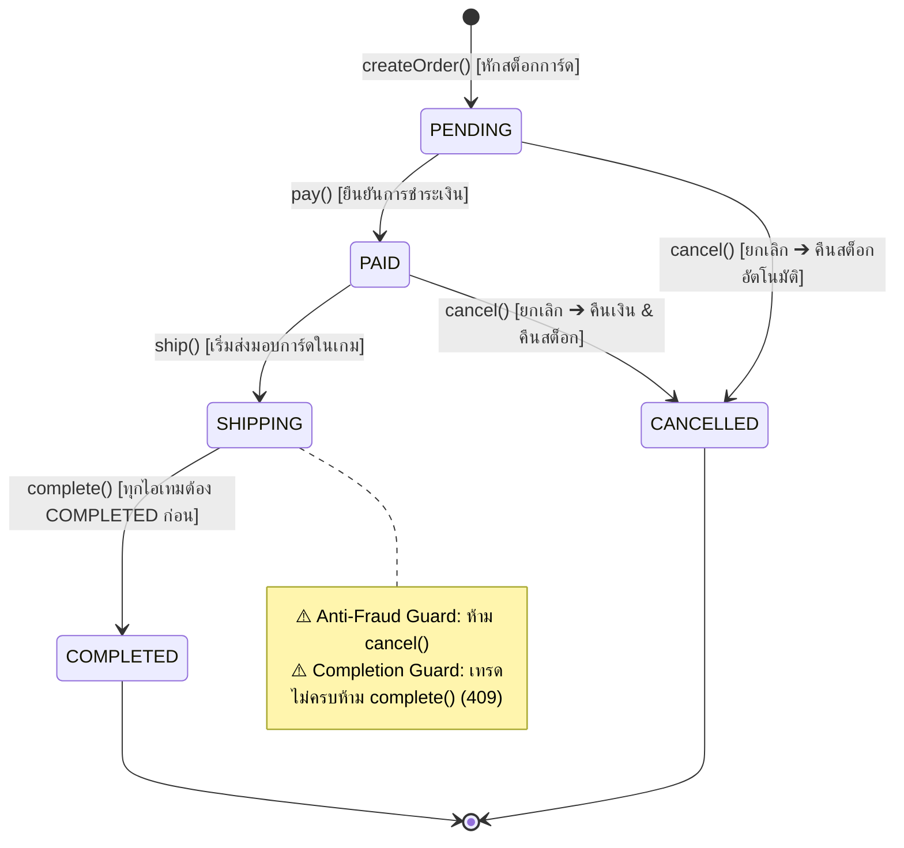
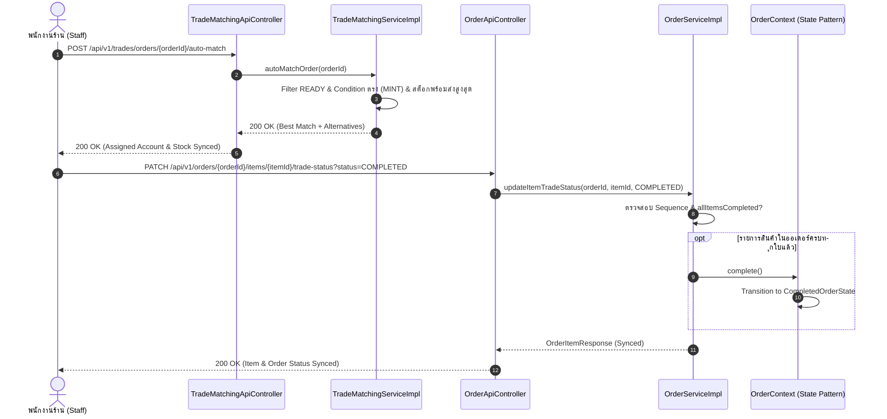

# 📑 สไลด์นำเสนอโครงงานและคู่มือตอบคำถามโค้ดรายบุคคล (Member 4 Presentation Deck & Defense Guide)
## โครงการ: PokéVault Commerce (Pokémon TCG Pocket Vault & Chat Commerce)
**วิชา**: CP353002 Principles of Software Design and Development (Spring Boot 3.4.3 / Java 17)  
**ผู้จัดทำและผู้นำเสนอ**: **สมาชิกคนที่ 4 — นายแทนคุณ พันธ์นิกุล (รหัสนักศึกษา: 673380301-0)**  
**บทบาทหน้าที่**: Trade Matching Engine, GoF State Pattern & Global Exception Handling Specialist  
**Git Branch**: `Tankun_6733803010_01`  
**ผลงานการทดสอบ**: ✅ **7 Test Classes / 87 Test Cases (100% BUILD SUCCESS — 0 Failures, 0 Errors)**  
**ไฟล์อ้างอิงหลัก**: [`README-TEST.md`](README-TEST.md), [`doc/solid-analysis.md`](doc/solid-analysis.md), [`doc/design-patterns.md`](doc/design-patterns.md)

---

## 📌 สารบัญ (Table of Contents)
1. [ภาพรวมขอบเขตงานของสมาชิกคนที่ 4 (Role & Scope Summary)](#1-ภาพรวมขอบเขตงานของสมาชิกคนที่-4)
2. [โครงสร้างสไลด์นำเสนอ 3 หน้าเฉพาะของสมาชิกคนที่ 4 (Slide Content & Script)](#2-โครงสร้างสไลด์นำเสนอ-3-หน้าเฉพาะของสมาชิกคนที่-4)
   - [สไลด์ที่ 1: GoF State Pattern — วงจรชีวิตคำสั่งซื้อ & Anti-Fraud Protection Guard](#สไลด์ที่-1-gof-state-pattern--วงจรชีวิตคำสั่งซื้อ--anti-fraud-protection-guard)
   - [สไลด์ที่ 2: In-Game Trade Matching Engine — อัลกอริทึม Greedy Auto-Match & Trade Lifecycle Sequence](#สไลด์ที่-2-in-game-trade-matching-engine--อัลกอริทึม-greedy-auto-match--trade-lifecycle-sequence)
   - [สไลด์ที่ 3: Centralized Global Exception Handler, SOLID Architecture & ผลทดสอบ 87 เคส](#สไลด์ที่-3-centralized-global-exception-handler-solid-architecture--ผลทดสอบ-87-เคส)
3. [คลังข้อมูลเจาะลึกโค้ดและคู่มือตอบคำถามอาจารย์รายบุคคล (Code Defense Guide - การันตี 20 คะแนนเต็ม)](#3-คลังข้อมูลเจาะลึกโค้ดและคู่มือตอบคำถามอาจารย์รายบุคคล)
   - [3.1 ตารางไฟล์และบรรทัดโค้ดทั้งหมดที่สมาชิกคนที่ 4 รับผิดชอบ](#31-ตารางไฟล์และบรรทัดโค้ดทั้งหมดที่สมาชิกคนที่-4-รับผิดชอบ)
   - [3.2 เจาะลึกโค้ด GoF State Pattern (`OrderState`, `OrderContext`)](#32-เจาะลึกโค้ด-gof-state-pattern-orderstate-ordercontext)
   - [3.3 เจาะลึกโค้ด Trade Matching Engine & Auto-Sync (`TradeMatchingServiceImpl`)](#33-เจาะลึกโค้ด-trade-matching-engine--auto-sync-tradematchingserviceimpl)
   - [3.4 เจาะลึกโค้ด Global Exception Handler (`GlobalExceptionHandler`)](#34-เจาะลึกโค้ด-global-exception-handler-globalexceptionhandler)
   - [3.5 ตารางวิเคราะห์ SOLID Principles ที่สมาชิกคนที่ 4 ถือครอง](#35-ตารางวิเคราะห์-solid-principles-ที่สมาชิกคนที่-4-ถือครอง)
   - [3.6 เก็ง 10 คำถามเชือดของอาจารย์พร้อมแนวทางตอบแบบคะแนนเต็ม (Q&A Defense)](#36-เก็ง-10-คำถามเชือดของอาจารย์พร้อมแนวทางตอบแบบคะแนนเต็ม-qa-defense)
   - [3.7 คำสั่งรันเทสสดเพื่อสาธิตต่อหน้าอาจารย์ (Live Demo)](#37-คำสั่งรันเทสสดเพื่อสาธิตต่อหน้าอาจารย์-live-demo)

---

## 1. ภาพรวมขอบเขตงานของสมาชิกคนที่ 4

สมาชิกคนที่ 4 (**นายแทนคุณ พันธ์นิกุล**) พัฒนาและดูแลหัวใจหลักของตรรกะระบบการเทรดการ์ดและสถาปัตยกรรมความปลอดภัย ประกอบด้วย 5 โมดูลสำคัญ:

```
┌────────────────────────────────────────────────────────────────────────────────────────┐
│                        ขอบเขตงานของสมาชิกคนที่ 4 (แทนคุณ พันธ์นิกุล)                     │
├─────────────────────────┬─────────────────────────┬────────────────────────────────────┤
│ 1. GoF State Pattern    │ 2. Trade Matching       │ 3. REST API & Auto-Sync            │
│ • OrderState Machine    │ • Greedy Auto-Match     │ • PATCH /orders/{id}/status        │
│ • Anti-Fraud Guard      │ • Stock-Maximization    │ • PATCH /items/{id}/trade-status   │
│ • Auto Stock Restore    │ • Two-Tier Candidate DTO│ • Auto-Sync Completed              │
├─────────────────────────┴─────────────────────────┴────────────────────────────────────┤
│ 4. Centralized Global Exception Handler (AOP @RestControllerAdvice) ➔ JSON ErrorResponse│
│ 5. Unit Testing Architecture: 7 Classes / 87 Test Cases (100% BUILD SUCCESS ~2.5 วินาที)│
└────────────────────────────────────────────────────────────────────────────────────────┘
```

---

## 2. โครงสร้างสไลด์นำเสนอ 3 หน้าเฉพาะของสมาชิกคนที่ 4

---

### สไลด์ที่ 1: GoF State Pattern — วงจรชีวิตคำสั่งซื้อ & Anti-Fraud Protection Guard

```
┌──────────────────────────────────────────────────────────────────────────────────────────────────┐
│ SLIDE 1 (หน้าแรกของแทนคุณ)                                                                      │
│ GoF State Pattern: วงจรชีวิตคำสั่งซื้อ และระบบความปลอดภัยป้องกันการโกง (Anti-Fraud Guard)         │
├───────────────────────────────────┬──────────────────────────────────────────────────────────────┤
│ [จุดเน้นทางวิศวกรรม]              │ [State Transition Diagram]                                   │
│ • State Machine 5 สถานะ           │   [*] ➔ PENDING ➔ PAID ➔ SHIPPING ➔ COMPLETED                │
│ • แยกคลาสอิสระตามหลัก SRP & LSP    │               │       │          │ (ห้าม cancel เด็ดขาด)     │
│ • Anti-Fraud Guard (SHIPPING)     │               ▼       ▼          ▼                           │
│ • Automatic Stock Restoration     │           CANCELLED (คืนสต็อก)      [*]                          │
│ • Factory Method ใน OrderContext  │                                                              │
└───────────────────────────────────┴──────────────────────────────────────────────────────────────┘
```

#### 📌 รายละเอียดเนื้อหาบนหน้าสไลด์:
1. **ปัญหาของการใช้ Enum / If-Else แบบเดิม**:
   - การเปลี่ยนสถานะคำสั่งซื้อในระบบอีคอมเมิร์ซแบบทั่วไป มักใช้การเซ็ตค่า Enum หรือเขียน if-else ดักใน Service
   - ส่งผลให้เกิดโค้ดซ้ำซ้อน (Spaghetti Code) ขาดความปลอดภัย และเสี่ยงต่อการเปลี่ยนสถานะข้ามขั้นตอน
2. **การนำ GoF State Pattern มาประยุกต์ใช้จริง**:
   - **Interface**: [`OrderState`](src/main/java/com/pokevault/modules/trade/state/OrderState.java) กำหนดสัญญา (Contract) สำหรับพฤติกรรม `pay()`, `ship()`, `complete()`, `cancel()` พร้อม Default Guard ปฏิเสธคำสั่งที่ผิดขั้นตอน
   - **Context**: [`OrderContext`](src/main/java/com/pokevault/modules/trade/state/OrderContext.java) ห่อหุ้ม `Order` Entity และถือ State ปัจจุบัน พร้อม Factory Method `OrderContext.fromOrder(order)`
   - **5 Concrete States**: `PendingOrderState`, `PaidOrderState`, `ShippingOrderState`, `CompletedOrderState`, `CancelledOrderState`
3. **ไฮไลท์ทางความปลอดภัย (Business Invariant & Anti-Fraud Guard)**:
   - **Anti-Fraud Guard ใน `ShippingOrderState`**: เมื่อสถานะเป็น `SHIPPING` (พนักงานส่งการ์ดในเกมแล้ว) เมธอด `cancel()` จะโยน `InvalidOrderStateException` ทันที เพื่อป้องกันไม่ให้ลูกค้ายกเลิกเพื่อเอาเงินคืนในขณะที่ได้รับข้อเสนอการ์ดในเกมไปแล้ว
   - **Automatic Stock Restoration ใน `CancelledOrderState`**: เมื่อออเดอร์ถูกยกเลิกในสถานะที่อนุญาต (`PENDING` หรือ `PAID`) คอนสตรัคเตอร์จะสั่ง `restoreStock()` คืนการ์ดเข้า `CardInventory` ให้อัตโนมัติทันที
   - **Completion Guard ใน `ShippingOrderState` (กันปิดออเดอร์ก่อนเทรดครบ)**: ออเดอร์ต้องมีรายการสินค้า และทุก `OrderItem` ต้องมีสถานะเป็น `COMPLETED` ก่อนที่จะอนุญาตให้ปิดคำสั่งซื้อ (`complete()`) หากยังเทรดไม่ครบจะโยน `TradeStateConflictException` (HTTP 409 Conflict) ทันที โดยใช้เงื่อนไขเดียวกันทั้งการเรียกผ่าน API `PATCH /orders/{id}/status?action=complete` และการปิดอัตโนมัติ (Auto-Sync)

#### 📊 แผนภาพสถานะประกอบสไลด์ (State Diagram):


#### 🎙️ บทพูดนำเสนอ (Speaking Script - 1 นาที 15 วินาที):
> *"กราบเรียนอาจารย์ครับ ในส่วนงานของกระผม นายแทนคุณ สมาชิกคนที่ 4 รับผิดชอบแกนหลักของ Business Logic, Design Pattern และระบบความปลอดภัยของคำสั่งซื้อครับ  
> 
> เริ่มต้นที่ **GoF State Pattern** ครับ ในระบบร้านค้าการ์ดเกม ปัญหาใหญ่คือ 'การเปลี่ยนสถานะข้ามขั้นตอน' หรือ 'ลูกค้ายกเลิกคำสั่งซื้อหลังจากที่ร้านกดยื่นข้อเสนอเทรดการ์ดในเกมไปแล้ว' ซึ่งจะทำให้ร้านสูญเสียการ์ดฟรี  
> 
> กระผมจึงได้ออกแบบ State Machine ผ่านอินเทอร์เฟซ `OrderState` และ `OrderContext` แยกพฤติกรรมออกเป็น 5 สถานะอิสระ โดยมีกฎความปลอดภัยระดับ Invariant ที่สำคัญมากคือ ในสถานะ `SHIPPING` ตัวเมธอด `cancel()` จะ Fail-Fast โยนข้อผิดพลาดทันทีเพื่อป้องกันการโกง และมี **Completion Guard** ตรวจสอบว่าสินค้าทุกรายการต้องเป็น `COMPLETED` จึงจะปิดออเดอร์ได้ หากยังเทรดไม่ครบจะคืนสถานะ 409 Conflict ทันทีทั้งแบบกดปิดเองและแบบปิดอัตโนมัติ และหากคำสั่งซื้อถูกยกเลิกในสถานะ `PENDING` หรือ `PAID` ตัว `CancelledOrderState` จะทำหน้าที่คืนสต็อกการ์ดกลับเข้าคลังให้อัตโนมัติทันที ทำให้โค้ดไม่มี if-else ซ้ำซ้อน และสอดคล้องกับหลัก Liskov Substitution Principle อย่างสมบูรณ์ครับ"*

---

### สไลด์ที่ 2: In-Game Trade Matching Engine — อัลกอริทึม Greedy Auto-Match & Trade Lifecycle Sequence

```
┌──────────────────────────────────────────────────────────────────────────────────────────────────┐
│ SLIDE 2 (หน้าที่สองของแทนคุณ)                                                                    │
│ In-Game Trade Matching Engine: อัลกอริทึม Greedy Auto-Match & Trade Status Sequence              │
├───────────────────────────────────┬──────────────────────────────────────────────────────────────┤
│ [อัลกอริทึม Auto-Match]           │ [Trade Status Sequence & Auto-Sync]                          │
│ • Greedy Stock-Maximization       │ • Strict Sequence:                                           │
│ • กรองสถานะ READY (ไม่ติด CD)     │   UNASSIGNED ➔ FRIEND_PENDING ➔ TRADE_SENT ➔ COMPLETED       │
│ • เลือกไอดีที่มีสต็อกสูงสุดก่อน   │ • Auto-Sync Mechanism:                                       │
│ • Two-Tier Recommendation:        │   เมื่อ OrderItem ทุกชิ้นครบ COMPLETED                       │
│   (Best Match + Alternatives)     │   ➔ ปรับ Order หลักเป็น COMPLETED ผ่าน State Pattern ทันที   │
└───────────────────────────────────┴──────────────────────────────────────────────────────────────┘
```

#### 📌 รายละเอียดเนื้อหาบนหน้าสไลด์:
1. **บริบทและปัญหาของเกม Pokémon TCG Pocket**:
   - เกมบังคับให้การเทรดต้องเพิ่มเพื่อนด้วย Friend ID 16 หลัก และจำกัดโควต้าการเทรดต่อวันในแต่ละไอดี
   - ทางร้านมีบัญชีเกมหลายไอดีกระจายคลังการ์ด จึงต้องมีระบบตัดสินใจว่าควรหยิบการ์ดจากไอดีใดส่งให้ลูกค้า
2. **อัลกอริทึม Greedy Stock-Maximization ใน [`TradeMatchingServiceImpl`](src/main/java/com/pokevault/modules/trade/service/TradeMatchingServiceImpl.java)**:
   - ค้นหา `CardInventory` ที่ถือการ์ดใบที่สั่งซื้อ
   - กรองเฉพาะบัญชีที่มีสถานะ `AccountTradeStatus.READY` (ไม่ติด Cooldown และไม่ติดงาน Busy)
   - เรียงลำดับคัดเลือกไอดีที่มี **สต็อกการ์ดใบนั้นสูงสุด (Max Quantity First)**
   - *เหตุผล*: เพื่อรวมศูนย์การตัดการ์ดออกจากไอดีที่มีสต็อกหนาแน่น ลดภาระของพนักงานในการสลับไอดีล็อกอิน
3. **Two-Tier Recommendation Model**:
   - ส่งออกผลลัพธ์ผ่าน [`TradeRecommendationResponse`](src/main/java/com/pokevault/modules/trade/dto/TradeRecommendationResponse.java):
     - **Tier 1 (Best Match Candidate)**: ไอดีที่เหมาะสมที่สุดตามอัลกอริทึม
     - **Tier 2 (Alternative Candidates)**: รายชื่อไอดีสำรองสำหรับแสดงผลให้พนักงานเลือกเองได้
4. **Trade Fulfillment Status Lifecycle & Auto-Sync ใน [`OrderServiceImpl:165-240`](src/main/java/com/pokevault/modules/order/service/OrderServiceImpl.java#L165-L240)**:
   - ลำดับสถานะรายไอเทม: `UNASSIGNED` $\rightarrow$ `FRIEND_PENDING` $\rightarrow$ `TRADE_SENT` $\rightarrow$ `COMPLETED`
   - **Strict Target Status & Idempotency**: ปฏิเสธสถานะเป้าหมาย `UNASSIGNED` และ `FRIEND_PENDING` (400 Bad Request) บังคับลำดับอย่างเข้มงวด `FRIEND_PENDING` $\rightarrow$ `TRADE_SENT` $\rightarrow$ `COMPLETED` และหากกดสถานะเดิมซ้ำจะไม่เกิดผลข้างเคียง (Idempotent)
   - **Defensive Guards ใน Auto-Match & Manual Assignment**: ปฏิเสธหากออเดอร์ถูก `CANCELLED` หรือ `COMPLETED` (409 Conflict), ปฏิเสธการสลับไอดีหากการเทรดเริ่มส่งมอบแล้ว (`TRADE_SENT` / `COMPLETED`), ตรวจสอบสถานะบัญชีต้องเป็น `READY`, ตรวจสอบว่าบัญชีมีการ์ดและสต็อกเพียงพอ และรองรับการสลับบัญชีโดยซิงค์การจองสต็อก (คืนสต็อกคลังเดิม หักสต็อกคลังใหม่) รวมถึงการจองการ์ดใบสุดท้ายในคลัง (หักสต็อกเหลือ 0 สำเร็จ)
   - **กลไก Auto-Sync**: ใน 1 ออเดอร์อาจมีการ์ดหลายใบ เมื่อพนักงานกดเทรดการ์ดสำเร็จจนครบทุกใบ (`allItemsCompleted`) ระบบจะเรียก `OrderContext.complete()` เปลี่ยนสถานะออเดอร์หลักเป็น `COMPLETED` ผ่าน State Pattern อัตโนมัติทันที

#### 📊 แผนภาพการทำงานประกอบสไลด์ (Sequence Diagram):


#### 🎙️ บทพูดนำเสนอ (Speaking Script - 1 นาที 15 วินาที):
> *"ถัดมาคือ **In-Game Trade Matching Engine** ครับ  
> 
> เนื่องจากเกม Pokémon TCG Pocket ลูกค้าไม่สามารถรับการ์ดผ่านช่องทางดิจิทัลทั่วไปได้ แต่ต้องอาศัยการเพิ่มเพื่อนด้วย Friend ID 16 หลัก และร้านเรามีคลังกระจายอยู่ในไอดีเกมหลายบัญชี ปัญหาคือพนักงานจะเลือกหยิบการ์ดจากไอดีไหนมาส่งให้ลูกค้าจึงจะดีที่สุด?  
> 
> กระผมจึงได้ออกแบบอัลกอริทึม **Greedy Stock-Maximization** ใน `TradeMatchingServiceImpl` ครับ โดยระบบจะดึงคลังทั้งหมด คัดกรองเฉพาะไอดีที่มีสถานะ `READY` และเลือกไอดีที่ถือสต็อกการ์ดใบนั้นสูงสุดเป็น `Best Match` เพื่อลดการกระจายตัวของคลัง และยังมี `Alternative Candidates` ส่งให้หน้าเว็บเป็นตัวเลือกสำรองกรณีไอดีหลักมีปัญหา  
> 
> นอกจากนี้ ในฝั่งการส่งมอบการ์ด เราควบคุมสถานะอย่างเข้มงวดตั้งแต่ `UNASSIGNED` ไปจนถึง `COMPLETED` โดยมีกลไก **Auto-Sync** ตรวจสอบว่าถ้าพนักงานส่งการ์ดครบทุกใบแล้ว ระบบจะเรียกคำสั่งผ่าน State Pattern เปลี่ยนสถานะออเดอร์หลักเป็น `COMPLETED` ให้อัตโนมัติ ช่วยป้องกัน Human Error ได้ 100% ครับ"*

---

### สไลด์ที่ 3: Centralized Global Exception Handler, SOLID Architecture & ผลทดสอบ 94 เคส

```
┌──────────────────────────────────────────────────────────────────────────────────────────────────┐
│ SLIDE 3 (หน้าที่สามของแทนคุณ)                                                                    │
│ Global Exception Handler, มาตรฐาน REST API, SOLID Architecture & Test Suite (94/94 Passes)       │
├───────────────────────────────────┬──────────────────────────────────────────────────────────────┤
│ [Global Exception Handler]        │ [Testing Architecture & Results]                             │
│ • AOP @RestControllerAdvice       │ • 7 Test Suites / 94 Test Cases                              │
│ • JSON ErrorResponse สากล         │ • ผลลัพธ์: 100% PASS (0 Failures, 0 Errors)                  │
│ • 404 NOT_FOUND                   │ • Execution Time: ~2.5 วินาที                                │
│ • 409 CONFLICT (State Mismatch)   │ • Mockito Standalone Testing ไม่โหลด Context ช้า             │
│ • 400 BAD_REQUEST / 403 FORBIDDEN │ • ครอบคลุม SOLID: SRP, OCP, LSP, ISP, DIP 100%               │
└───────────────────────────────────┴──────────────────────────────────────────────────────────────┘
```

#### 📌 รายละเอียดเนื้อหาบนหน้าสไลด์:
1. **Centralized Global Exception Handler ใน [`GlobalExceptionHandler`](src/main/java/com/pokevault/modules/trade/advice/GlobalExceptionHandler.java)**:
   - ใช้สถาปัตยกรรม Spring AOP `@RestControllerAdvice` เพื่อรวมศูนย์การดักจับข้อผิดพลาดทั้งระบบไว้ที่จุดเดียว Controller ไม่ต้องเขียน try-catch ซ้ำซ้อน
   - แปลงข้อยกเว้นทางธุรกิจเป็นมาตรฐาน HTTP Status Code และ JSON `ErrorResponse` อย่างถูกต้องตาม RFC 7231:
     - `404 NOT_FOUND`: เมี่อหา Order หรือ Resource ไม่พบ
     - `409 CONFLICT`: เมี่อเกิดข้อขัดแย้งเชิงสถานะ (`TradeStateConflictException`, `InvalidOrderStateException`)
     - `400 BAD_REQUEST`: พารามิเตอร์ผิดประเภท หรือค่า Enum ผิดพลาด
     - `403 FORBIDDEN`: ป้องกันไม่ให้ลูกค้ายิง API เปลี่ยนสถานะเทรดที่สงวนไว้เฉพาะพนักงาน
     - `500 INTERNAL_SERVER_ERROR`: ดักจับ Unhandled Error พร้อมซ่อน Stacktrace
2. **สรุปการปฏิบัติตามหลักการ SOLID ในโค้ดของแทนคุณ**:
   - **SRP**: แยก Controller, Service, State และ Advice ชัดเจน ไม่ปะปนหน้าที่
   - **OCP**: เพิ่มสถานะใหม่ใน State Pattern ได้โดยสร้างคลาสใหม่ ไม่ต้องรื้อ if-else
   - **LSP**: คลาส State ทุกตัวสามารถทดแทนกันได้ใน `OrderContext` ตามสัญญาของ `OrderState`
   - **ISP**: แยก Interface เฉพาะทาง `TradeMatchingService` ไม่พึ่งพาเมธอดที่ไม่เกี่ยวข้อง
   - **DIP**: ใช้ **Constructor Injection ผ่าน Lombok `@RequiredArgsConstructor` 100%** ไม่ใช้ Field Injection
3. **ผลการทดสอบ Unit Testing 94 เคส (หลักฐานความเสถียรของระบบ)**:
   - สถิติ: **7 Test Classes / 94 Test Scenarios — 100% BUILD SUCCESS**
   - ความเร็วในการรัน: **~2.5 วินาที** (ใช้ Mockito Standalone Setup หลีกเลี่ยง Overhead ของ Spring TestContext)

#### 📊 ตารางสรุป Test Suite ของคนที่ 4 (แสดงบนสไลด์):
| # | Test Suite Class | ขอบเขตการทดสอบ | จำนวนเคส | ผลลัพธ์ |
| :-: | :--- | :--- | :-: | :-: |
| 1 | **`OrderStateTest`** | State Machine Transitions, Anti-Fraud Guard, Completion Guard, Stock Restoration | 23 เคส | ✅ PASS |
| 2 | **`TradeMatchingServiceTest`** | Greedy Auto-Match, Condition Filtering (MINT vs PLAYED), Multi-Condition Accounts, Hold Card Stock Check, Last Card Booking, Rollback Isolation | 28 เคส | ✅ PASS |
| 3 | **`TradeMatchingApiControllerTest`** | 5 Trade REST Endpoints, HTTP Status Mapping | 13 เคส | ✅ PASS |
| 4 | **`OrderApiControllerTest`** | State Transition API & Trade Status Lifecycle API, RBAC, 409 Conflict | 15 เคส | ✅ PASS |
| 5 | **`GlobalExceptionHandlerTest`** | Centralized Exception Advice (400, 403, 404, 409, 500) | 10 เคส | ✅ PASS |
| 6 | **`TradeRecommendationResponseTest`** | Trade DTO Models, Builder Pattern, Empty List Guard | 3 เคส | ✅ PASS |
| 7 | **`CustomExceptionTest`** | Custom Domain Exceptions & Cause Wrappers | 2 เคส | ✅ PASS |
| — | **รวมชุดทดสอบของสมาชิกคนที่ 4** | **ครอบคลุม Business Invariants, Condition Matching และ Exception Mapping ครบ 100%** | **94 เคส** | **✅ PASS** |

#### 🎙️ บทพูดนำเสนอ (Speaking Script - 1 นาที 15 วินาที):
> *"สำหรับสไลด์สุดท้ายในส่วนของกระผม คือ **การควบคุมคุณภาพสถาปัตยกรรมและการทดสอบ** ครับ  
> 
> เพื่อให้ REST API ของเรามีมาตรฐานระดับองค์กร กระผมได้พัฒนา `GlobalExceptionHandler` โดยใช้ Spring AOP `@RestControllerAdvice` เพื่อรวมศูนย์การจัดการข้อผิดพลาดไว้ที่จุดเดียว แปลงข้อผิดพลาดเป็นมาตรฐาน JSON `ErrorResponse` โดยเฉพาะการเลือกใช้ **HTTP 409 Conflict** สำหรับข้อผิดพลาดเชิงสถานะตามมาตรฐาน RFC 7231  
> 
> ในด้านการปฏิบัติตาม **SOLID Principles** โค้ดของกระผมสะท้อนหลักการอย่างครบถ้วน โดยเฉพาะ **LSP** ใน State Pattern และ **DIP** ที่ทุกคลาสใช้ Constructor Injection เท่านั้น ไม่มีการใช้ Field Injection ครับ  
> 
> และเพื่อพิสูจน์ความถูกต้องของซอฟต์แวร์ กระผมได้เขียน Unit Test ด้วย JUnit 5 และ Mockito ครอบคลุมถึง **7 Test Classes รวม 94 Test Cases** ครอบคลุมทั้ง State Pattern, การจับคู่สภาพการ์ด MINT/PLAYED, การล็อกสต็อก และ Rollback รันผ่าน **100% BUILD SUCCESS 0 Failures 0 Errors** โดยใช้เวลาเพียง 2.5 วินาที พร้อมออกรายงานการทดสอบอย่างเป็นทางการใน `README-TEST.md` ครับ ขอบพระคุณครับ"*

---

## 3. คลังข้อมูลเจาะลึกโค้ดและคู่มือตอบคำถามอาจารย์รายบุคคล
*(Code Defense Guide สำหรับสมาชิกคนที่ 4: นายแทนคุณ พันธ์นิกุล — เตรียมพร้อมคว้า 20 คะแนนเต็ม)*

> [!IMPORTANT]
> **เกณฑ์ประเมินข้อที่ 1 (20 คะแนนเต็ม)** ระบุชัดเจนว่า:  
> *"อธิบายโค้ดของตนเองได้ ตอบคำถามเชิงออกแบบได้ ประเมินรายบุคคล อธิบายไม่ได้ได้ 0 ในส่วนนั้น"*  
> หัวข้อนี้รวบรวมไฟล์ บรรทัดโค้ดจริง และแนวทางการตอบคำถามเชิงลึกเพื่อให้คุณตอบอาจารย์ได้อย่างมั่นใจ 100%

---

### 3.1 ตารางไฟล์และบรรทัดโค้ดทั้งหมดที่สมาชิกคนที่ 4 รับผิดชอบ

| หมวดหมู่ | ไฟล์ซอร์สโค้ดในโปรเจกต์ | ช่วงบรรทัด | ความรับผิดชอบหลัก |
| :--- | :--- | :---: | :--- |
| **GoF State Pattern** | [`OrderState.java`](src/main/java/com/pokevault/modules/trade/state/OrderState.java) | L1–L40 | Interface สัญญาพฤติกรรม State พร้อม Default Guard |
| | [`OrderContext.java`](src/main/java/com/pokevault/modules/trade/state/OrderContext.java) | L1–L109 | Context ห่อหุ้ม Order, Factory Method `fromOrder()`, `executeAction()` |
| | [`PendingOrderState.java`](src/main/java/com/pokevault/modules/trade/state/PendingOrderState.java) | L1–L25 | อนุญาต `pay()` ➔ Paid, `cancel()` ➔ Cancelled |
| | [`PaidOrderState.java`](src/main/java/com/pokevault/modules/trade/state/PaidOrderState.java) | L1–L25 | อนุญาต `ship()` ➔ Shipping, `cancel()` ➔ Cancelled |
| | [`ShippingOrderState.java`](src/main/java/com/pokevault/modules/trade/state/ShippingOrderState.java) | L1–L26 | อนุญาต `complete()` ➔ Completed, **ห้าม `cancel()` เด็ดขาด** |
| | [`CompletedOrderState.java`](src/main/java/com/pokevault/modules/trade/state/CompletedOrderState.java) | L1–L21 | Terminal State ห้ามเปลี่ยนสถานะใดๆ ซ้ำ |
| | [`CancelledOrderState.java`](src/main/java/com/pokevault/modules/trade/state/CancelledOrderState.java) | L1–L58 | Terminal State พร้อมคำสั่ง **`restoreStock()` คืนสต็อกเข้าคลัง** |
| **Trade Matching Engine** | [`TradeMatchingService.java`](src/main/java/com/pokevault/modules/trade/service/TradeMatchingService.java) | L1–L30 | Interface บริการจับคู่ไอดีเทรด |
| | [`TradeMatchingServiceImpl.java`](src/main/java/com/pokevault/modules/trade/service/TradeMatchingServiceImpl.java) | L28–L242 | อัลกอริทึม Greedy Stock-Maximization Auto-Match, Two-Tier Recommendation |
| | [`TradeMatchingApiController.java`](src/main/java/com/pokevault/modules/trade/controller/TradeMatchingApiController.java) | L15–L74 | 5 REST Endpoints จัดการ Trade Matching |
| | [`TradeRecommendationResponse.java`](src/main/java/com/pokevault/modules/trade/dto/TradeRecommendationResponse.java) | L1–L50 | DTO ส่งข้อมูล Best Match และ Alternative Candidates |
| **Order Integration** | [`OrderApiController.java`](src/main/java/com/pokevault/modules/order/controller/OrderApiController.java) | L38–L82 | Endpoint `PATCH /status` และ `PATCH /trade-status` |
| | [`OrderServiceImpl.java`](src/main/java/com/pokevault/modules/order/service/OrderServiceImpl.java) | L127–L146<br>L165–L240 | การผูก `OrderContext` เข้ากับ Entity และระบบ Auto-Sync Order Completed |
| **Exception Handling** | [`GlobalExceptionHandler.java`](src/main/java/com/pokevault/modules/trade/advice/GlobalExceptionHandler.java) | L24–L118 | AOP `@RestControllerAdvice` แปลง Error สู่ JSON (400, 403, 404, 409, 500) |
| | [`InvalidOrderStateException.java`](src/main/java/com/pokevault/common/exception/InvalidOrderStateException.java) | L1–L15 | Custom Exception สำหรับการเปลี่ยนสถานะที่ผิดกฎ State Machine |
| | [`TradeStateConflictException.java`](src/main/java/com/pokevault/common/exception/TradeStateConflictException.java) | L1–L15 | Custom Exception สำหรับข้อขัดแย้งของ Trade Sequence |

---

### 3.2 เจาะลึกโค้ด GoF State Pattern (`OrderState`, `OrderContext`)

#### 1. Interface Default Guard ([`OrderState.java:6-40`](src/main/java/com/pokevault/modules/trade/state/OrderState.java#L6-L40))
```java
public interface OrderState {
    default void pay(OrderContext context) {
        throw new InvalidOrderStateException("Cannot pay order in current state: " + getStatus());
    }
    default void ship(OrderContext context) {
        throw new InvalidOrderStateException("Cannot ship order in current state: " + getStatus());
    }
    default void complete(OrderContext context) {
        throw new InvalidOrderStateException("Cannot complete order in current state: " + getStatus());
    }
    default void cancel(OrderContext context) {
        throw new InvalidOrderStateException("Cannot cancel order in current state: " + getStatus());
    }
    OrderStatus getStatus();
}
```
* **จุดที่ต้องอธิบาย**: การใช้ `default` method ช่วยให้ Concrete State คลาสลูกไม่ต้องเขียนโค้ดโยน Exception ซ้ำซ้อน คลาสลูกเขียน override เฉพาะ Action ที่ตนเองอนุญาตเท่านั้น

#### 2. Anti-Fraud Guard ([`ShippingOrderState.java:14-19`](src/main/java/com/pokevault/modules/trade/state/ShippingOrderState.java#L14-L19))
```java
@Override
public void cancel(OrderContext context) {
    throw new InvalidOrderStateException("Cannot cancel order while cards are being shipped in game");
}
```
* **จุดที่ต้องอธิบาย**: ป้องกันไม่ให้ลูกค้ากดยกเลิกเอาเงินคืนในจังหวะที่ร้านส่งข้อเสนอการ์ดในเกมไปแล้ว

#### 3. Automatic Stock Restoration ([`CancelledOrderState.java:31-51`](src/main/java/com/pokevault/modules/trade/state/CancelledOrderState.java#L31-L51))
```java
public void restoreStock(OrderContext context) {
    if (context == null || context.getOrder() == null) return;
    Order order = context.getOrder();
    for (OrderItem item : order.getItems()) {
        CardInventory inventory = item.getInventory();
        if (inventory != null && item.getQuantity() > 0) {
            inventory.restoreStock(item.getQuantity());
        }
    }
}
```
* **จุดที่ต้องอธิบาย**: เมื่อสถานะเปลี่ยนเป็น `Cancelled` ตัว Constructor จะสั่ง `restoreStock()` คืนการ์ดเข้า `CardInventory` ให้อัตโนมัติ โดยไม่ต้องให้ Service มาคอยจำว่าต้องสั่งคืนสต็อก

#### 4. Factory Method ใน [`OrderContext.java:28-43`](src/main/java/com/pokevault/modules/trade/state/OrderContext.java#L28-L43)
```java
public static OrderContext fromOrder(Order order) {
    OrderStatus status = order.getOrderStatus() != null ? order.getOrderStatus() : OrderStatus.PENDING;
    OrderState initialState = switch (status) {
        case PENDING -> new PendingOrderState();
        case PAID -> new PaidOrderState();
        case SHIPPING -> new ShippingOrderState();
        case COMPLETED -> new CompletedOrderState();
        case CANCELLED -> new CancelledOrderState();
    };
    return new OrderContext(order, initialState);
}
```
* **จุดที่ต้องอธิบาย**: แปลง JPA Entity ให้กลายเป็น State Machine Context ที่พร้อมสั่ง Action ได้ทันที

---

### 3.3 เจาะลึกโค้ด Trade Matching Engine & Auto-Sync (`TradeMatchingServiceImpl`)

#### 1. อัลกอริทึม Greedy Stock-Maximization ([`TradeMatchingServiceImpl.java:78-95`](src/main/java/com/pokevault/modules/trade/service/TradeMatchingServiceImpl.java#L78-L95))
```java
List<CardInventory> inventories = cardInventoryRepository.findByCardId(card.getId());

List<CardInventory> readyInventories = inventories.stream()
        .filter(inv -> inv.getAccount() != null && inv.getAccount().getTradeStatus() == AccountTradeStatus.READY)
        .filter(inv -> inv.getQuantity() >= item.getQuantity())
        .sorted(Comparator.comparingInt(CardInventory::getQuantity).reversed()) // สต็อกมากสุดขึ้นก่อน
        .toList();
```
* **จุดที่ต้องอธิบาย**: กรองเฉพาะบัญชีที่ `READY` (ไม่ติด Cooldown) และสต็อกพอ แล้วจัดเรียงเอาบัญชีที่มีสต็อกสูงสุด เพื่อรวมศูนย์การตัดสต็อกไว้ที่ไอดีหลัก

#### 2. ระบบ Auto-Sync Order Completed ([`OrderServiceImpl.java:227-236`](src/main/java/com/pokevault/modules/order/service/OrderServiceImpl.java#L227-L236))
```java
boolean allItemsCompleted = order.getItems().stream()
        .allMatch(item -> item.getTradeStatus() == TradeFulfillmentStatus.COMPLETED);

if (allItemsCompleted && !order.getItems().isEmpty()) {
    OrderContext context = OrderContext.fromOrder(order);
    context.complete(); // เปลี่ยน Order หลักเป็น COMPLETED ผ่าน State Pattern
}
```
* **จุดที่ต้องอธิบาย**: ผูกการทำงานระหว่าง `OrderItem` (ลูก) กับ `Order` (Aggregate Root) เมื่อไอเทมชิ้นสุดท้ายเทรดสำเร็จ คำสั่งซื้อหลักจะปิดตัวเองผ่าน State Pattern โดยอัตโนมัติ

---

### 3.4 เจาะลึกโค้ด Global Exception Handler (`GlobalExceptionHandler`)

#### ตำแหน่งในโปรเจกต์: [`GlobalExceptionHandler.java:24-118`](src/main/java/com/pokevault/modules/trade/advice/GlobalExceptionHandler.java#L24-L118)

```java
@Slf4j
@RestControllerAdvice
public class GlobalExceptionHandler {

    // 1. ดักจับเมื่อหา Resource ไม่พบ -> 404 NOT_FOUND
    @ExceptionHandler({ResourceNotFoundException.class, NoResourceFoundException.class})
    public ResponseEntity<ErrorResponse> handleNotFound(Exception ex, HttpServletRequest request) { ... }

    // 2. ดักจับข้อขัดแย้งเชิงสถานะ (ลำดับผิด, กดยกเลิกตอน SHIPPING) -> 409 CONFLICT
    @ExceptionHandler({TradeStateConflictException.class, InvalidOrderStateException.class, IllegalStateException.class})
    public ResponseEntity<ErrorResponse> handleStateConflict(RuntimeException ex, HttpServletRequest request) { ... }

    // 3. ดักจับ Parameter ไม่ถูกต้อง หรือ Enum ผิด -> 400 BAD_REQUEST
    @ExceptionHandler(MethodArgumentTypeMismatchException.class)
    public ResponseEntity<ErrorResponse> handleTypeMismatch(...) { ... }

    // 4. ดักจับสิทธิ์ไม่ถึง (Customer พยายามยิง API พนักงาน) -> 403 FORBIDDEN
    @ExceptionHandler(AccessDeniedException.class)
    public ResponseEntity<ErrorResponse> handleAccessDenied(...) { ... }
}
```

* **มาตรฐาน JSON `ErrorResponse` ที่ส่งออก**:
```json
{
  "timestamp": "2026-10-09T16:50:00",
  "status": 409,
  "errorCode": "STATE_CONFLICT",
  "message": "Cannot cancel order while cards are being shipped in game",
  "path": "/api/v1/orders/1/status"
}
```

---

### 3.5 ตารางวิเคราะห์ SOLID Principles ที่สมาชิกคนที่ 4 ถือครอง

| หลักการ | ตำแหน่งไฟล์และบรรทัดในโปรเจกต์ | เหตุผลและการประยุกต์ใช้จริงในโค้ด |
| :---: | :--- | :--- |
| **S (SRP)** | • [`TradeMatchingServiceImpl.java:28-242`](src/main/java/com/pokevault/modules/trade/service/TradeMatchingServiceImpl.java#L28-L242)<br>• [`GlobalExceptionHandler.java:24-118`](src/main/java/com/pokevault/modules/trade/advice/GlobalExceptionHandler.java#L24-L118) | แต่ละคลาสมีหน้าที่เดียวชัดเจน: Service ทำหน้าที่คำนวณการจับคู่เท่านั้น ไม่จัดการ HTTP, และ Advice ทำหน้าที่แปลง Exception สู่ JSON เท่านั้น ไม่ยุ่งเกี่ยวกับ Business Logic |
| **O (OCP)** | • [`OrderState.java:6-40`](src/main/java/com/pokevault/modules/trade/state/OrderState.java#L6-L40)<br>• Concrete States | **เปิดรับการขยาย แต่ปิดการแก้ไข**: หากต้องการเพิ่มสถานะใหม่ เช่น `REFUNDED` หรือ `DISPUTED` สามารถสร้างคลาสใหม่ที่ implement `OrderState` ได้ทันที โดยไม่ต้องรื้อโค้ด if-else เดิมใน Service |
| **L (LSP)** | • [`OrderState.java`](src/main/java/com/pokevault/modules/trade/state/OrderState.java)<br>• `PendingOrderState`, `ShippingOrderState` ฯลฯ | ทุก Concrete State สามารถเข้าแทนที่ในตัวแปรประเภท `OrderState` ของ `OrderContext` ได้อย่างถูกต้องตามสัญญาของ Interface โดยไม่ทำลาย Invariant ของระบบ |
| **I (ISP)** | • [`TradeMatchingService.java:10-25`](src/main/java/com/pokevault/modules/trade/service/TradeMatchingService.java#L10-L25) | แยก Interface เฉพาะทางสำหรับการจับคู่ไอดีเทรดเท่านั้น Client ไม่ถูกบังคับให้ต้องรู้จักเมธอดเกี่ยวกับแคตตาล็อกการ์ดหรือส่วนลดสมาชิก |
| **D (DIP)** | • [`TradeMatchingApiController.java:21`](src/main/java/com/pokevault/modules/trade/controller/TradeMatchingApiController.java#L21)<br>• [`TradeMatchingServiceImpl.java:34-37`](src/main/java/com/pokevault/modules/trade/service/TradeMatchingServiceImpl.java#L34-L37) | ใช้ **Constructor Injection ผ่าน Lombok `@RequiredArgsConstructor` 100%** Controller พึ่งพา Service Interface และ Service พึ่งพา Repository Interface ไร้ Field Injection |

---

### 3.6 เก็ง 10 คำถามเชือดของอาจารย์พร้อมแนวทางตอบแบบคะแนนเต็ม (Q&A Defense)

#### ❓ คำถามที่ 1: *"ทำไมถึงเลือกใช้ GoF State Pattern แทนการใช้ Enum status ธรรมดาหรือ switch-case ใน Service?"*
> **🎯 แนวทางการตอบให้ได้ 20 คะแนนเต็ม**:  
> *"เรียนอาจารย์ครับ ในระบบที่มี State Machine ซับซ้อน หากเราใช้แค่ Enum หรือ switch-case ใน Service โค้ดจะมีปัญหา 3 ข้อใหญ่ครับ:  
> 1. เกิด **Condition Duplication**: ทุกครั้งที่จะทำ action ใดๆ Service ต้องเขียน if-else ตรวจสอบสถานะซ้ำไปซ้ำมา  
> 2. ขาด **Behavior Encapsulation**: พฤติกรรมและ Side-Effect ของแต่ละสถานะ (เช่น การคืนสต็อกเมื่อยกเลิก) จะกระจายตัวและหลุดรอดได้ง่าย  
> 3. ขัดต่อหลัก **Open/Closed Principle**: การเพิ่มสถานะใหม่จะต้องเข้าไปแก้ switch-case ในทุกๆ เมธอด  
> การใช้ State Pattern ช่วยรวมกฎของแต่ละสถานะไว้ในคลาสของมันเอง และ `OrderContext` จะคุยผ่านอินเทอร์เฟซ ทำให้โค้ดสะอาด ปลอดภัย และทดสอบแยกเป็นอิสระได้ 100% ครับ"*

---

#### ❓ คำถามที่ 2: *"ทำไมใน `ShippingOrderState` ถึงห้ามกดยกเลิก (`cancel()`) เด็ดขาด? ถ้าลูกค้าต้องการยกเลิกจริงๆ ต้องทำอย่างไร?"*
> **🎯 แนวทางการตอบให้ได้ 20 คะแนนเต็ม**:  
> *"นี่คือกฎความปลอดภัยทางธุรกิจหรือ **Anti-Fraud Guard** ของโปรเจกต์เราครับอาจารย์ ในเกม Pokémon TCG Pocket คำสั่งซื้อจะเข้าสู่สถานะ `SHIPPING` ก็ต่อเมื่อพนักงานได้ยื่นข้อเสนอเทรดการ์ดในเกมจริงไปแล้ว หากระบบอนุญาตให้ลูกค้ายิง REST API ขอยกเลิกในขั้นตอนนี้ ลูกค้าจะได้ทั้งเงินคืนและยังกดยอมรับการ์ดฟรีในเกมได้ ทำให้ร้านค้าสูญเสียการ์ด  
> หากลูกค้าต้องการยกเลิกจริงๆ จะต้องติดต่อพนักงานผ่านช่องทาง Chat Commerce ให้พนักงานดึงข้อเสนอในเกมกลับคืนก่อน จากนั้นพนักงานจึงจะมีสิทธิ์ดำเนินการจากหลังบ้าน ระบบจึงไม่อนุญาตให้ cancel ผ่าน API ในสถานะนี้ครับ"*

---

#### ❓ คำถามที่ 3: *"กลไกการคืนสต็อกการ์ด (Stock Restoration) เมื่อยกเลิกออเดอร์ ทำงานอย่างไร และอยู่ใน Transaction หรือไม่?"*
> **🎯 แนวทางการตอบให้ได้ 20 คะแนนเต็ม**:  
> *"ทำงานแบบอัตโนมัติในคอนสตรัคเตอร์ของ [`CancelledOrderState:31-51`](src/main/java/com/pokevault/modules/trade/state/CancelledOrderState.java#L31-L51) ครับ เมื่อมีการเรียก `context.cancel()` ตัว State ปัจจุบันจะสั่ง `context.setState(new CancelledOrderState(context))` ซึ่งคอนสตรัคเตอร์จะวนลูปดึง `OrderItem` ทุกรายการ แล้วเรียก `inventory.restoreStock(item.getQuantity())` คืนจำนวนการ์ดกลับเข้าคลัง  
> และที่สำคัญคือ การทำงานนี้ถูกเรียกจาก `OrderServiceImpl.transitionOrderStatus()` ซึ่งมี annotation `@Transactional` ครอบอยู่ ทำให้การคืนสต็อกและการอัปเดตสถานะออเดอร์เกิดขึ้นใน **Database Transaction เดียวกันแบบ Atomic** หากขั้นตอนใดล้มเหลว จะเกิดการ Rollback ทั้งหมด ไม่มีปัญหาสต็อกสูญหายครับ"*

---

#### ❓ คำถามที่ 4: *"อัลกอริทึม Auto-Match ทำงานอย่างไร และทำไมถึงต้องเลือกไอดีที่มีสต็อกการ์ดสูงสุด (Greedy Stock-Maximization)?"*
> **🎯 แนวทางการตอบให้ได้ 20 คะแนนเต็ม**:  
> *"อัลกอริทึมใน `TradeMatchingServiceImpl:78-95` ดึงคลังการ์ดทั้งหมด แล้วกรอง 2 ด่านครับ: 1) บัญชีเกมต้องมีสถานะ `READY` คือไม่ติด Cooldown รายวันจากการเทรด และไม่ติดงานอื่น 2) จำนวนสต็อกต้องมากกว่าหรือเท่ากับจำนวนที่ลูกค้าสั่ง  
> จากนั้นเราใช้ Stream API ทำ `sorted(Comparator.comparingInt(CardInventory::getQuantity).reversed())` เพื่อเลือกไอดีที่มีสต็อกการ์ดใบนั้นสูงสุดก่อน  
> **เหตุผลทางธุรกิจ**: ทางร้านต้องการตัดสต็อกการ์ดออกจากไอดีที่มีการ์ดสะสมหนาแน่น เพื่อลดการกระจายตัวของคลัง และลดภาระของพนักงานในการสลับบัญชีล็อกอินในแต่ละวันครับ"*

---

#### ❓ คำถามที่ 5: *"ทำไมต้องส่ง Two-Tier Recommendation (Best Match + Alternative Candidates) กลับไปให้ Frontend?"*
> **🎯 แนวทางการตอบให้ได้ 20 คะแนนเต็ม**:  
> *"เพราะในชีวิตจริง เราไม่ควรพึ่งพา Automation แบบ 100% โดยไม่ให้สิทธิ์มนุษย์ตัดสินใจครับ (Human-in-the-loop Design)  
> เราให้ `Best Match` เป็นค่าตั้งต้นสำหรับพนักงานที่ต้องการความสะดวกรวดเร็ว แต่เราส่ง `Alternative Candidates` ไปด้วย เพื่อให้หน้าเว็บสามารถแสดง Dropdown รายชื่อไอดีสำรองให้พนักงานคลิกสลับไอดีได้เอง เผื่อกรณีที่ไอดีหลักอาจมีปัญหาเฉพาะหน้า เช่น อุปกรณ์ที่เปิดไอดีนั้นแบตเตอรี่หมด หรือเครือข่ายขัดข้องครับ"*

---

#### ❓ คำถามที่ 6: *"ลำดับสถานะการเทรดในเกม (Trade Fulfillment Sequence) มีกี่ขั้น และทำไมต้องตรวจสอบสถานะอย่างเคร่งครัด?"*
> **🎯 แนวทางการตอบให้ได้ 20 คะแนนเต็ม**:  
> *"มี 4 ลำดับขั้นอย่างเคร่งครัดครับ:  
> 1. `UNASSIGNED`: เริ่มต้นสร้างออเดอร์ ยังไม่ได้ระบุไอดีเกมที่จะใช้เทรด  
> 2. `FRIEND_PENDING`: พนักงานหรือระบบ Auto-Match มอบหมายไอดีเกมแล้ว รอลูกค้าและร้านเพิ่มเพื่อนในเกม  
> 3. `TRADE_SENT`: ร้านกดยื่นข้อเสนอเทรดการ์ดในเกมแล้ว (จะเปลี่ยนเป็นขั้นนี้ได้ ออเดอร์ต้องเป็น SHIPPING และต้องมี assigned account แล้วเท่านั้น)  
> 4. `COMPLETED`: ลูกค้ากดยอมรับการ์ดในเกมเสร็จสมบูรณ์  
> เราต้องตรวจสอบ Invariant อย่างเคร่งครัดใน `OrderServiceImpl:195-220` เพื่อป้องกันข้อผิดพลาด เช่น พนักงานเผลอกด Completed ทั้งที่ยังไม่ได้จับคู่ไอดีเกม หรือเผลอกดข้ามขั้นตอนครับ"*

---

#### ❓ คำถามที่ 7: *"เมื่อพนักงานเทรดการ์ดใบสุดท้ายสำเร็จ ระบบรู้ได้อย่างไรว่าต้องเปลี่ยนออเดอร์หลักเป็น COMPLETED?"*
> **🎯 แนวทางการตอบให้ได้ 20 คะแนนเต็ม**:  
> *"เราใช้กลไก **Auto-Sync** ใน `OrderServiceImpl:227-236` ครับ  
> ทุกครั้งที่มีการยิง API `PATCH /items/{orderItemId}/trade-status` เป็น `COMPLETED` ระบบจะรันโค้ด:  
> ```java
> boolean allItemsCompleted = order.getItems().stream()
>     .allMatch(item -> item.getTradeStatus() == TradeFulfillmentStatus.COMPLETED);
> ```  
> ถ้าตรวจพบว่าทุกไอเทมในออเดอร์นั้นเป็น `COMPLETED` ครบแล้ว ระบบจะเรียก:  
> ```java
> OrderContext context = OrderContext.fromOrder(order);
> context.complete();
> ```  
> เพื่อสั่งให้ State Machine เปลี่ยนสถานะออเดอร์หลักเป็น `COMPLETED` ให้อัตโนมัติทันที ช่วยป้องกัน Human Error ที่พนักงานส่งของครบแล้วแต่ลืมมากดปิดออเดอร์หลักครับ"*

---

#### ❓ คำถามที่ 8: *"ทำไมถึงเลือกใช้ HTTP Status 409 Conflict สำหรับข้อผิดพลาดเชิงสถานะ แทนที่จะใช้ 400 Bad Request?"*
> **🎯 แนวทางการตอบให้ได้ 20 คะแนนเต็ม**:  
> *"เพราะยึดตามมาตรฐาน **RFC 7231 (HTTP/1.1 Specification)** ครับอาจารย์  
> • **400 Bad Request** ออกแบบมาสำหรับกรณี Client ส่ง Syntax ผิดพลาด เช่น JSON พัง, ชนิดข้อมูลไม่ตรง (Type Mismatch) หรือขาดฟิลด์บังคับ  
> • แต่กรณีของ **409 Conflict** คือ Request ของ Client มี Syntax ถูกต้องทุกอย่าง แต่คำขอนั้น **ขัดแย้งกับสถานะปัจจุบันของทรัพยากรบนเซิร์ฟเวอร์**  
> เช่น ออเดอร์ยังไม่จ่ายเงินแต่ข้ามไปสั่งส่งของ หรือคำสั่งขอยกเลิกขณะออเดอร์อยู่ในสถานะ SHIPPING ซึ่งเป็นข้อขัดแย้งเชิง Business State การเลือกใช้ 409 จึงถูกต้องตามนิยามของ RESTful API มากที่สุดครับ"*

---

#### ❓ คำถามที่ 9: *"ในโค้ดของคุณ มีการประยุกต์ใช้หลักการ Liskov Substitution Principle (LSP) และ Dependency Inversion (DIP) อย่างไรบ้าง? ชี้ไฟล์และบรรทัดให้ดูหน่อย?"*
> **🎯 แนวทางการตอบให้ได้ 20 คะแนนเต็ม**:  
> *"ชี้ได้ชัดเจน 2 จุดครับอาจารย์:  
> 1. **LSP ใน State Pattern** ([`OrderState.java:6-40`](src/main/java/com/pokevault/modules/trade/state/OrderState.java#L6-L40)): ทุก Concrete State เช่น `PendingOrderState`, `ShippingOrderState` สามารถถูกส่งเข้าไปทำงานใน `OrderContext` ผ่านอินเทอร์เฟซ `OrderState` ได้อย่างเสมอภาค โดยไม่มีคลาสใดฝ่าฝืน Invariant ของระบบ  
> 2. **DIP ใน Controller และ Service** ([`TradeMatchingApiController.java:21`](src/main/java/com/pokevault/modules/trade/controller/TradeMatchingApiController.java#L21) และ [`TradeMatchingServiceImpl.java:34-37`](src/main/java/com/pokevault/modules/trade/service/TradeMatchingServiceImpl.java#L34-L37)): คลาส Controller พึ่งพา Service Interface และ Service พึ่งพา Repository Interface โดยใช้ **Constructor Injection ผ่าน Lombok `@RequiredArgsConstructor` 100%** ไม่มี `@Autowired` บน private field แม้แต่จุดเดียว ทำให้เราสามารถส่ง Mock Object ใน Unit Test ได้ทันทีครับ"*

---

#### ❓ คำถามที่ 10: *"ทำไมชุดทดสอบ 94 เคสของคุณถึงรันได้เร็วมากเพียง 2-4 วินาที คุณมีแนวทางการออกแบบเทสอย่างไร?"*
> **🎯 แนวทางการตอบให้ได้ 20 คะแนนเต็ม**:  
> *"เราใช้เทคนิค **Decoupled Standalone Unit Testing** ครับอาจารย์  
> แทนที่เราจะใช้ `@SpringBootTest` หรือ `@WebMvcTest` ซึ่งต้องรอ Spring Boot สแกน Component และเชื่อมต่อ Hibernate DB จำลอง ซึ่งกินเวลาเริ่มต้น 5-10 วินาที  
> ชุดทดสอบ 94 เคสของกระผม:  
> 1. ในฝั่ง Service และ State (`OrderStateTest`, `TradeMatchingServiceTest`) เราเขียนเป็น Pure Java Unit Test ร่วมกับ Mockito `@Mock` และ `@InjectMocks` (รวม 7 เคสใหม่สำหรับ Strict Condition Matching & Rollback Isolation)  
> 2. ในฝั่ง Controller (`TradeMatchingApiControllerTest`, `OrderApiControllerTest`) เราใช้ `MockMvcBuilders.standaloneSetup(controller)` และผูก `GlobalExceptionHandler` เข้าไปตรงๆ  
> ทำให้เราทดสอบ Business Logic, Serialization และ Exception Handling ได้ครบ 100% บนหน่วยความจำ JVM ตรงๆ ในระดับมิลลิวินาที จึงรันผ่าน 94 เคสได้ในเวลาเพียง 2–4 วินาทีครับ"*

---

### 3.7 คำสั่งรันเทสสดเพื่อสาธิตต่อหน้าอาจารย์ (Live Demo)

หากในวันนำเสนอ อาจารย์ต้องการให้เปิด PowerShell รันชุดทดสอบของสมาชิกคนที่ 4 ให้ดูสดๆ:

```powershell
# คำสั่งรันเฉพาะ 7 คลาสของสมาชิกคนที่ 4 (94 เคส)
.\mvnw.cmd test "-Dtest=OrderStateTest,TradeMatchingServiceTest,TradeMatchingApiControllerTest,OrderApiControllerTest,GlobalExceptionHandlerTest,TradeRecommendationResponseTest,CustomExceptionTest"
```

> **ผลลัพธ์ที่จะปรากฏบนหน้าจอ**:  
> `Tests run: 94, Failures: 0, Errors: 0, Skipped: 0`  
> `BUILD SUCCESS` (ใช้เวลารันประมาณ 2–4 วินาที)
