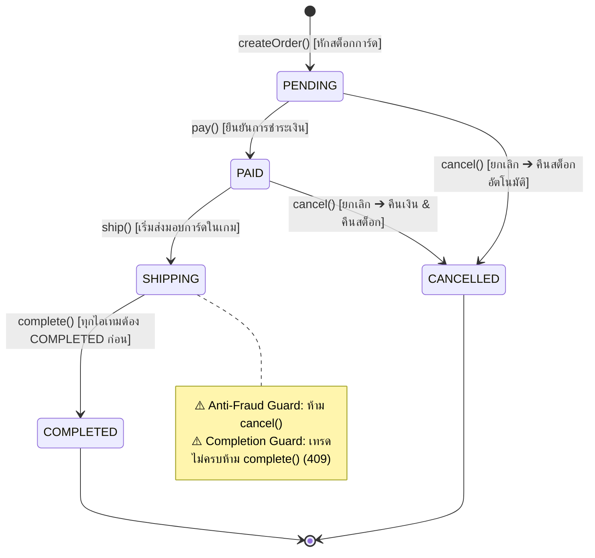
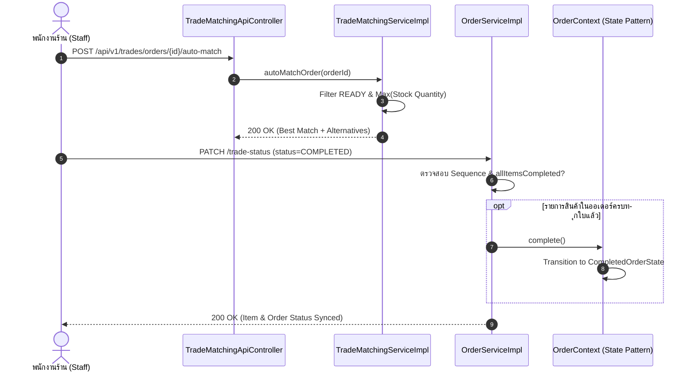

# 📑 สไลด์นำเสนอโครงงานและคู่มือตอบคำถามโค้ดรายบุคคล (Member 4 Presentation Deck & Defense Guide)
## โครงการ: PokéVault Commerce (Pokémon TCG Pocket Vault & Chat Commerce)
**วิชา**: CP353002 Principles of Software Design and Development (Spring Boot 3.4.3 / Java 17)  
**ผู้จัดทำและผู้นำเสนอ**: **สมาชิกคนที่ 4 — นายแทนคุณ พันธ์นิกุล (รหัสนักศึกษา: 673380301-0)**  
**บทบาทหน้าที่**: Trade Matching Engine, GoF State Pattern & Global Exception Handling Specialist  
**Git Branch**: `Tankun_6733803010_01`  
**ผลงานการทดสอบ**: ✅ **7 Test Classes / 87 Test Cases (100% BUILD SUCCESS — 0 Failures, 0 Errors)**  
**ไฟล์อ้างอิงหลัก**: [`README-TEST.md`](file:///e:/Coding/Pok-Vault_Commerce/README-TEST.md), [`doc/solid-analysis.md`](file:///e:/Coding/Pok-Vault_Commerce/doc/solid-analysis.md), [`doc/design-patterns.md`](file:///e:/Coding/Pok-Vault_Commerce/doc/design-patterns.md)

---

## 📌 สารบัญ (Table of Contents)
1. [ภาพรวมขอบเขตงานของสมาชิกคนที่ 4 (Role & Scope Summary)](#1-ภาพรวมขอบเขตงานของสมาชิกคนที่-4)
2. [โครงสร้างสไลด์นำเสนอ 3 หน้าเฉพาะของสมาชิกคนที่ 4 (Slide Content & Script)](#2-โครงสร้างสไลด์นำเสนอ-3-หน้าเฉพาะของสมาชิกคนที่-4)
   - [สไลด์ที่ 1: GoF State Pattern — วงจรชีวิตคำสั่งซื้อ & Anti-Fraud Protection Guard](#สไลด์ที่-1-gof-state-pattern--วงจรชีวิตคำสั่งซื้อ--anti-fraud-protection-guard)
   - [สไลด์ที่ 2: In-Game Trade Matching Engine — อัลกอริทึม Greedy Auto-Match & Trade Lifecycle Sequence](#สไลด์ที่-2-in-game-trade-matching-engine--อัลกอริทึม-greedy-auto-match--trade-lifecycle-sequence)
   - [สไลด์ที่ 3: Centralized Global Exception Handler, SOLID Architecture & ผลทดสอบ 87 เคส](#สไลด์ที่-3-centralized-global-exception-handler-solid-architecture--ผลทดสอบ-87-เคส)
3. [คลังข้อมูลเจาะลึกโค้ดและคู่มือตอบคำถามอาจารย์รายบุคคล (Code Defense Guide - การันตี 20 คะแนนเต็ม)](#3-คลังข้อมูลเจาะลึกโค้ดและคู่มือตอบคำถามอาจารย์รายบุคคล)
   - [3.1 ตารางไฟล์และบรรทัดโค้ดทั้งหมดที่สมาชิกคนที่ 4 รับผิดชอบ](#31-ตารางไฟล์และบรรทัดโค้ดทั้งหมดที่สมาชิกคนที่-4-รับผิดชอบ)
   - [3.2 เจาะลึกโค้ด GoF State Pattern (`OrderState`, `OrderContext`)](#32-เจาะลึกโค้ด-gof-state-pattern-orderstate-ordercontext)
   - [3.3 เจาะลึกโค้ด Trade Matching Engine & Auto-Sync (`TradeMatchingServiceImpl`)](#33-เจาะลึกโค้ด-trade-matching-engine--auto-sync-tradematchingserviceimpl)
   - [3.4 เจาะลึกโค้ด Global Exception Handler (`GlobalExceptionHandler`)](#34-เจาะลึกโค้ด-global-exception-handler-globalexceptionhandler)
   - [3.5 ตารางวิเคราะห์ SOLID Principles ที่สมาชิกคนที่ 4 ถือครอง](#35-ตารางวิเคราะห์-solid-principles-ที่สมาชิกคนที่-4-ถือครอง)
   - [3.6 เก็ง 10 คำถามเชือดของอาจารย์พร้อมแนวทางตอบแบบคะแนนเต็ม (Q&A Defense)](#36-เก็ง-10-คำถามเชือดของอาจารย์พร้อมแนวทางตอบแบบคะแนนเต็ม-qa-defense)
   - [3.7 คำสั่งรันเทสสดเพื่อสาธิตต่อหน้าอาจารย์ (Live Demo)](#37-คำสั่งรันเทสสดเพื่อสาธิตต่อหน้าอาจารย์-live-demo)

---

## 1. ภาพรวมขอบเขตงานของสมาชิกคนที่ 4

สมาชิกคนที่ 4 (**นายแทนคุณ พันธ์นิกุล**) พัฒนาและดูแลหัวใจหลักของตรรกะระบบการเทรดการ์ดและสถาปัตยกรรมความปลอดภัย ประกอบด้วย 5 โมดูลสำคัญ:

```
┌────────────────────────────────────────────────────────────────────────────────────────┐
│                        ขอบเขตงานของสมาชิกคนที่ 4 (แทนคุณ พันธ์นิกุล)                     │
├─────────────────────────┬─────────────────────────┬────────────────────────────────────┤
│ 1. GoF State Pattern    │ 2. Trade Matching       │ 3. REST API & Auto-Sync            │
│ • OrderState Machine    │ • Greedy Auto-Match     │ • PATCH /orders/{id}/status        │
│ • Anti-Fraud Guard      │ • Stock-Maximization    │ • PATCH /items/{id}/trade-status   │
│ • Auto Stock Restore    │ • Two-Tier Candidate DTO│ • Auto-Sync Completed              │
├─────────────────────────┴─────────────────────────┴────────────────────────────────────┤
│ 4. Centralized Global Exception Handler (AOP @RestControllerAdvice) ➔ JSON ErrorResponse│
│ 5. Unit Testing Architecture: 7 Classes / 87 Test Cases (100% BUILD SUCCESS ~2.5 วินาที)│
└────────────────────────────────────────────────────────────────────────────────────────┘
```

---

## 2. โครงสร้างสไลด์นำเสนอ 3 หน้าเฉพาะของสมาชิกคนที่ 4

---

### สไลด์ที่ 1: GoF State Pattern — วงจรชีวิตคำสั่งซื้อ & Anti-Fraud Protection Guard

```
┌──────────────────────────────────────────────────────────────────────────────────────────────────┐
│ SLIDE 1 (หน้าแรกของแทนคุณ)                                                                      │
│ GoF State Pattern: วงจรชีวิตคำสั่งซื้อ และระบบความปลอดภัยป้องกันการโกง (Anti-Fraud Guard)         │
├───────────────────────────────────┬──────────────────────────────────────────────────────────────┤
│ [จุดเน้นทางวิศวกรรม]              │ [State Transition Diagram]                                   │
│ • State Machine 5 สถานะ           │   [*] ➔ PENDING ➔ PAID ➔ SHIPPING ➔ COMPLETED                │
│ • แยกคลาสอิสระตามหลัก SRP & LSP    │               │       │          │ (ห้าม cancel เด็ดขาด)     │
│ • Anti-Fraud Guard (SHIPPING)     │               ▼       ▼          ▼                           │
│ • Automatic Stock Restoration     │           CANCELLED (คืนสต็อก)      [*]                          │
│ • Factory Method ใน OrderContext  │                                                              │
└───────────────────────────────────┴──────────────────────────────────────────────────────────────┘
```

#### 📌 รายละเอียดเนื้อหาบนหน้าสไลด์:
1. **ปัญหาของการใช้ Enum / If-Else แบบเดิม**:
   - การเปลี่ยนสถานะคำสั่งซื้อในระบบอีคอมเมิร์ซแบบทั่วไป มักใช้การเซ็ตค่า Enum หรือเขียน if-else ดักใน Service
   - ส่งผลให้เกิดโค้ดซ้ำซ้อน (Spaghetti Code) ขาดความปลอดภัย และเสี่ยงต่อการเปลี่ยนสถานะข้ามขั้นตอน
2. **การนำ GoF State Pattern มาประยุกต์ใช้จริง**:
   - **Interface**: [`OrderState`](file:///e:/Coding/Pok-Vault_Commerce/src/main/java/com/pokevault/modules/trade/state/OrderState.java) กำหนดสัญญา (Contract) สำหรับพฤติกรรม `pay()`, `ship()`, `complete()`, `cancel()` พร้อม Default Guard ปฏิเสธคำสั่งที่ผิดขั้นตอน
   - **Context**: [`OrderContext`](file:///e:/Coding/Pok-Vault_Commerce/src/main/java/com/pokevault/modules/trade/state/OrderContext.java) ห่อหุ้ม `Order` Entity และถือ State ปัจจุบัน พร้อม Factory Method `OrderContext.fromOrder(order)`
   - **5 Concrete States**: `PendingOrderState`, `PaidOrderState`, `ShippingOrderState`, `CompletedOrderState`, `CancelledOrderState`
3. **ไฮไลท์ทางความปลอดภัย (Business Invariant & Anti-Fraud Guard)**:
   - **Anti-Fraud Guard ใน `ShippingOrderState`**: เมื่อสถานะเป็น `SHIPPING` (พนักงานส่งการ์ดในเกมแล้ว) เมธอด `cancel()` จะโยน `InvalidOrderStateException` ทันที เพื่อป้องกันไม่ให้ลูกค้ายกเลิกเพื่อเอาเงินคืนในขณะที่ได้รับข้อเสนอการ์ดในเกมไปแล้ว
   - **Automatic Stock Restoration ใน `CancelledOrderState`**: เมื่อออเดอร์ถูกยกเลิกในสถานะที่อนุญาต (`PENDING` หรือ `PAID`) คอนสตรัคเตอร์จะสั่ง `restoreStock()` คืนการ์ดเข้า `CardInventory` ให้อัตโนมัติทันที
   - **Completion Guard ใน `ShippingOrderState` (กันปิดออเดอร์ก่อนเทรดครบ)**: ออเดอร์ต้องมีรายการสินค้า และทุก `OrderItem` ต้องมีสถานะเป็น `COMPLETED` ก่อนที่จะอนุญาตให้ปิดคำสั่งซื้อ (`complete()`) หากยังเทรดไม่ครบจะโยน `TradeStateConflictException` (HTTP 409 Conflict) ทันที โดยใช้เงื่อนไขเดียวกันทั้งการเรียกผ่าน API `PATCH /orders/{id}/status?action=complete` และการปิดอัตโนมัติ (Auto-Sync)

#### 📊 แผนภาพสถานะประกอบสไลด์ (State Diagram):


#### 🎙️ บทพูดนำเสนอ (Speaking Script - 1 นาที 15 วินาที):
> *"กราบเรียนอาจารย์ครับ ในส่วนงานของกระผม นายแทนคุณ สมาชิกคนที่ 4 รับผิดชอบแกนหลักของ Business Logic, Design Pattern และระบบความปลอดภัยของคำสั่งซื้อครับ  
> 
> เริ่มต้นที่ **GoF State Pattern** ครับ ในระบบร้านค้าการ์ดเกม ปัญหาใหญ่คือ 'การเปลี่ยนสถานะข้ามขั้นตอน' หรือ 'ลูกค้ายกเลิกคำสั่งซื้อหลังจากที่ร้านกดยื่นข้อเสนอเทรดการ์ดในเกมไปแล้ว' ซึ่งจะทำให้ร้านสูญเสียการ์ดฟรี  
> 
> กระผมจึงได้ออกแบบ State Machine ผ่านอินเทอร์เฟซ `OrderState` และ `OrderContext` แยกพฤติกรรมออกเป็น 5 สถานะอิสระ โดยมีกฎความปลอดภัยระดับ Invariant ที่สำคัญมากคือ ในสถานะ `SHIPPING` ตัวเมธอด `cancel()` จะ Fail-Fast โยนข้อผิดพลาดทันทีเพื่อป้องกันการโกง และมี **Completion Guard** ตรวจสอบว่าสินค้าทุกรายการต้องเป็น `COMPLETED` จึงจะปิดออเดอร์ได้ หากยังเทรดไม่ครบจะคืนสถานะ 409 Conflict ทันทีทั้งแบบกดปิดเองและแบบปิดอัตโนมัติ และหากคำสั่งซื้อถูกยกเลิกในสถานะ `PENDING` หรือ `PAID` ตัว `CancelledOrderState` จะทำหน้าที่คืนสต็อกการ์ดกลับเข้าคลังให้อัตโนมัติทันที ทำให้โค้ดไม่มี if-else ซ้ำซ้อน และสอดคล้องกับหลัก Liskov Substitution Principle อย่างสมบูรณ์ครับ"*

---

### สไลด์ที่ 2: In-Game Trade Matching Engine — อัลกอริทึม Greedy Auto-Match & Trade Lifecycle Sequence

```
┌──────────────────────────────────────────────────────────────────────────────────────────────────┐
│ SLIDE 2 (หน้าที่สองของแทนคุณ)                                                                    │
│ In-Game Trade Matching Engine: อัลกอริทึม Greedy Auto-Match & Trade Status Sequence              │
├───────────────────────────────────┬──────────────────────────────────────────────────────────────┤
│ [อัลกอริทึม Auto-Match]           │ [Trade Status Sequence & Auto-Sync]                          │
│ • Greedy Stock-Maximization       │ • Strict Sequence:                                           │
│ • กรองสถานะ READY (ไม่ติด CD)     │   UNASSIGNED ➔ FRIEND_PENDING ➔ TRADE_SENT ➔ COMPLETED       │
│ • เลือกไอดีที่มีสต็อกสูงสุดก่อน   │ • Auto-Sync Mechanism:                                       │
│ • Two-Tier Recommendation:        │   เมื่อ OrderItem ทุกชิ้นครบ COMPLETED                       │
│   (Best Match + Alternatives)     │   ➔ ปรับ Order หลักเป็น COMPLETED ผ่าน State Pattern ทันที   │
└───────────────────────────────────┴──────────────────────────────────────────────────────────────┘
```

#### 📌 รายละเอียดเนื้อหาบนหน้าสไลด์:
1. **บริบทและปัญหาของเกม Pokémon TCG Pocket**:
   - เกมบังคับให้การเทรดต้องเพิ่มเพื่อนด้วย Friend ID 16 หลัก และจำกัดโควต้าการเทรดต่อวันในแต่ละไอดี
   - ทางร้านมีบัญชีเกมหลายไอดีกระจายคลังการ์ด จึงต้องมีระบบตัดสินใจว่าควรหยิบการ์ดจากไอดีใดส่งให้ลูกค้า
2. **อัลกอริทึม Greedy Stock-Maximization ใน [`TradeMatchingServiceImpl`](file:///e:/Coding/Pok-Vault_Commerce/src/main/java/com/pokevault/modules/trade/service/TradeMatchingServiceImpl.java)**:
   - ค้นหา `CardInventory` ที่ถือการ์ดใบที่สั่งซื้อ
   - กรองเฉพาะบัญชีที่มีสถานะ `AccountTradeStatus.READY` (ไม่ติด Cooldown และไม่ติดงาน Busy)
   - เรียงลำดับคัดเลือกไอดีที่มี **สต็อกการ์ดใบนั้นสูงสุด (Max Quantity First)**
   - *เหตุผล*: เพื่อรวมศูนย์การตัดการ์ดออกจากไอดีที่มีสต็อกหนาแน่น ลดภาระของพนักงานในการสลับไอดีล็อกอิน
3. **Two-Tier Recommendation Model**:
   - ส่งออกผลลัพธ์ผ่าน [`TradeRecommendationResponse`](file:///e:/Coding/Pok-Vault_Commerce/src/main/java/com/pokevault/modules/trade/dto/TradeRecommendationResponse.java):
     - **Tier 1 (Best Match Candidate)**: ไอดีที่เหมาะสมที่สุดตามอัลกอริทึม
     - **Tier 2 (Alternative Candidates)**: รายชื่อไอดีสำรองสำหรับแสดงผลให้พนักงานเลือกเองได้
4. **Trade Fulfillment Status Lifecycle & Auto-Sync ใน [`OrderServiceImpl:165-240`](file:///e:/Coding/Pok-Vault_Commerce/src/main/java/com/pokevault/modules/order/service/OrderServiceImpl.java#L165-L240)**:
   - ลำดับสถานะรายไอเทม: `UNASSIGNED` $\rightarrow$ `FRIEND_PENDING` $\rightarrow$ `TRADE_SENT` $\rightarrow$ `COMPLETED`
   - **Strict Target Status & Idempotency**: ปฏิเสธสถานะเป้าหมาย `UNASSIGNED` และ `FRIEND_PENDING` (400 Bad Request) บังคับลำดับอย่างเข้มงวด `FRIEND_PENDING` $\rightarrow$ `TRADE_SENT` $\rightarrow$ `COMPLETED` และหากกดสถานะเดิมซ้ำจะไม่เกิดผลข้างเคียง (Idempotent)
   - **Defensive Guards ใน Auto-Match & Manual Assignment**: ปฏิเสธหากออเดอร์ถูก `CANCELLED` หรือ `COMPLETED` (409 Conflict), ปฏิเสธการสลับไอดีหากการเทรดเริ่มส่งมอบแล้ว (`TRADE_SENT` / `COMPLETED`), ตรวจสอบสถานะบัญชีต้องเป็น `READY`, ตรวจสอบว่าบัญชีมีการ์ดและสต็อกเพียงพอ และรองรับการสลับบัญชีโดยซิงค์การจองสต็อก (คืนสต็อกคลังเดิม หักสต็อกคลังใหม่) รวมถึงการจองการ์ดใบสุดท้ายในคลัง (หักสต็อกเหลือ 0 สำเร็จ)
   - **กลไก Auto-Sync**: ใน 1 ออเดอร์อาจมีการ์ดหลายใบ เมื่อพนักงานกดเทรดการ์ดสำเร็จจนครบทุกใบ (`allItemsCompleted`) ระบบจะเรียก `OrderContext.complete()` เปลี่ยนสถานะออเดอร์หลักเป็น `COMPLETED` ผ่าน State Pattern อัตโนมัติทันที

#### 📊 แผนภาพการทำงานประกอบสไลด์ (Sequence Diagram):


#### 🎙️ บทพูดนำเสนอ (Speaking Script - 1 นาที 15 วินาที):
> *"ถัดมาคือ **In-Game Trade Matching Engine** ครับ  
> 
> เนื่องจากเกม Pokémon TCG Pocket ลูกค้าไม่สามารถรับการ์ดผ่านช่องทางดิจิทัลทั่วไปได้ แต่ต้องอาศัยการเพิ่มเพื่อนด้วย Friend ID 16 หลัก และร้านเรามีคลังกระจายอยู่ในไอดีเกมหลายบัญชี ปัญหาคือพนักงานจะเลือกหยิบการ์ดจากไอดีไหนมาส่งให้ลูกค้าจึงจะดีที่สุด?  
> 
> กระผมจึงได้ออกแบบอัลกอริทึม **Greedy Stock-Maximization** ใน `TradeMatchingServiceImpl` ครับ โดยระบบจะดึงคลังทั้งหมด คัดกรองเฉพาะไอดีที่มีสถานะ `READY` และเลือกไอดีที่ถือสต็อกการ์ดใบนั้นสูงสุดเป็น `Best Match` เพื่อลดการกระจายตัวของคลัง และยังมี `Alternative Candidates` ส่งให้หน้าเว็บเป็นตัวเลือกสำรองกรณีไอดีหลักมีปัญหา  
> 
> นอกจากนี้ ในฝั่งการส่งมอบการ์ด เราควบคุมสถานะอย่างเข้มงวดตั้งแต่ `UNASSIGNED` ไปจนถึง `COMPLETED` โดยมีกลไก **Auto-Sync** ตรวจสอบว่าถ้าพนักงานส่งการ์ดครบทุกใบแล้ว ระบบจะเรียกคำสั่งผ่าน State Pattern เปลี่ยนสถานะออเดอร์หลักเป็น `COMPLETED` ให้อัตโนมัติ ช่วยป้องกัน Human Error ได้ 100% ครับ"*

---

### สไลด์ที่ 3: Centralized Global Exception Handler, SOLID Architecture & ผลทดสอบ 87 เคส

```
┌──────────────────────────────────────────────────────────────────────────────────────────────────┐
│ SLIDE 3 (หน้าที่สามของแทนคุณ)                                                                    │
│ Global Exception Handler, มาตรฐาน REST API, SOLID Architecture & Test Suite (87/87 Passes)       │
├───────────────────────────────────┬──────────────────────────────────────────────────────────────┤
│ [Global Exception Handler]        │ [Testing Architecture & Results]                             │
│ • AOP @RestControllerAdvice       │ • 7 Test Suites / 87 Test Cases                              │
│ • JSON ErrorResponse สากล         │ • ผลลัพธ์: 100% PASS (0 Failures, 0 Errors)                  │
│ • 404 NOT_FOUND                   │ • Execution Time: ~2.5 วินาที                                │
│ • 409 CONFLICT (State Mismatch)   │ • Mockito Standalone Testing ไม่โหลด Context ช้า             │
│ • 400 BAD_REQUEST / 403 FORBIDDEN │ • ครอบคลุม SOLID: SRP, OCP, LSP, ISP, DIP 100%               │
└───────────────────────────────────┴──────────────────────────────────────────────────────────────┘
```

#### 📌 รายละเอียดเนื้อหาบนหน้าสไลด์:
1. **Centralized Global Exception Handler ใน [`GlobalExceptionHandler`](file:///e:/Coding/Pok-Vault_Commerce/src/main/java/com/pokevault/modules/trade/advice/GlobalExceptionHandler.java)**:
   - ใช้สถาปัตยกรรม Spring AOP `@RestControllerAdvice` เพื่อรวมศูนย์การดักจับข้อผิดพลาดทั้งระบบไว้ที่จุดเดียว Controller ไม่ต้องเขียน try-catch ซ้ำซ้อน
   - แปลงข้อยกเว้นทางธุรกิจเป็นมาตรฐาน HTTP Status Code และ JSON `ErrorResponse` อย่างถูกต้องตาม RFC 7231:
     - `404 NOT_FOUND`: เมี่อหา Order หรือ Resource ไม่พบ
     - `409 CONFLICT`: เมี่อเกิดข้อขัดแย้งเชิงสถานะ (`TradeStateConflictException`, `InvalidOrderStateException`)
     - `400 BAD_REQUEST`: พารามิเตอร์ผิดประเภท หรือค่า Enum ผิดพลาด
     - `403 FORBIDDEN`: ป้องกันไม่ให้ลูกค้ายิง API เปลี่ยนสถานะเทรดที่สงวนไว้เฉพาะพนักงาน
     - `500 INTERNAL_SERVER_ERROR`: ดักจับ Unhandled Error พร้อมซ่อน Stacktrace
2. **สรุปการปฏิบัติตามหลักการ SOLID ในโค้ดของแทนคุณ**:
   - **SRP**: แยก Controller, Service, State และ Advice ชัดเจน ไม่ปะปนหน้าที่
   - **OCP**: เพิ่มสถานะใหม่ใน State Pattern ได้โดยสร้างคลาสใหม่ ไม่ต้องรื้อ if-else
   - **LSP**: คลาส State ทุกตัวสามารถเข้าแทนที่ใน `OrderContext` ตามสัญญาของ `OrderState`
   - **ISP**: แยก Interface เฉพาะทาง `TradeMatchingService` ไม่พึ่งพาเมธอดที่ไม่เกี่ยวข้อง
   - **DIP**: ใช้ **Constructor Injection ผ่าน Lombok `@RequiredArgsConstructor` 100%** ไม่ใช้ Field Injection
3. **ผลการทดสอบ Unit Testing 87 เคส (หลักฐานความเสถียรของระบบ)**:
   - สถิติ: **7 Test Classes / 87 Test Scenarios — 100% BUILD SUCCESS**
   - ความเร็วในการรัน: **~2.5 วินาที** (ใช้ Mockito Standalone Setup หลีกเลี่ยง Overhead ของ Spring TestContext)

#### 📊 ตารางสรุป Test Suite ของคนที่ 4 (แสดงบนสไลด์):
| # | Test Suite Class | ขอบเขตการทดสอบ | จำนวนเคส | ผลลัพธ์ |
| :-: | :--- | :--- | :-: | :-: |
| 1 | **`OrderStateTest`** | State Machine Transitions, Anti-Fraud Guard, Completion Guard, Stock Restoration | 23 เคส | ✅ PASS |
| 2 | **`TradeMatchingServiceTest`** | Greedy Auto-Match, Terminal State Guards, Hold Card & Stock Check, Last Card Booking | 21 เคส | ✅ PASS |
| 3 | **`TradeMatchingApiControllerTest`** | 5 Trade REST Endpoints, HTTP Status Mapping | 13 เคส | ✅ PASS |
| 4 | **`OrderApiControllerTest`** | State Transition API & Trade Status Lifecycle API, RBAC, 409 Conflict | 15 เคส | ✅ PASS |
| 5 | **`GlobalExceptionHandlerTest`** | Centralized Exception Advice (400, 403, 404, 409, 500) | 10 เคส | ✅ PASS |
| 6 | **`TradeRecommendationResponseTest`** | Trade DTO Models, Builder Pattern, Empty List Guard | 3 เคส | ✅ PASS |
| 7 | **`CustomExceptionTest`** | Custom Domain Exceptions & Cause Wrappers | 2 เคส | ✅ PASS |
| — | **รวมชุดทดสอบของสมาชิกคนที่ 4** | **ครอบคลุม Business Invariants และ Exception Mapping ครบ 100%** | **87 เคส** | **✅ PASS** |

#### 🎙️ บทพูดนำเสนอ (Speaking Script - 1 นาที 15 วินาที):
> *"สำหรับสไลด์สุดท้ายในส่วนของกระผม คือ **การควบคุมคุณภาพสถาปัตยกรรมและการทดสอบ** ครับ  
> 
> เพื่อให้ REST API ของเรามีมาตรฐานระดับองค์กร กระผมได้พัฒนา `GlobalExceptionHandler` โดยใช้ Spring AOP `@RestControllerAdvice` เพื่อรวมศูนย์การจัดการข้อผิดพลาดไว้ที่จุดเดียว แปลงข้อผิดพลาดเป็นมาตรฐาน JSON `ErrorResponse` โดยเฉพาะการเลือกใช้ **HTTP 409 Conflict** สำหรับข้อผิดพลาดเชิงสถานะตามมาตรฐาน RFC 7231  
> 
> ในด้านการปฏิบัติตาม **SOLID Principles** โค้ดของกระผมสะท้อนหลักการอย่างครบถ้วน โดยเฉพาะ **LSP** ใน State Pattern และ **DIP** ที่ทุกคลาสใช้ Constructor Injection เท่านั้น ไม่มีการใช้ Field Injection ครับ  
> 
> และเพื่อพิสูจน์ความถูกต้องของซอฟต์แวร์ กระผมได้เขียน Unit Test ด้วย JUnit 5 และ Mockito ครอบคลุมถึง **7 Test Classes รวม 87 Test Cases** รันผ่าน **100% BUILD SUCCESS 0 Failures 0 Errors** โดยใช้เวลาเพียง 2.5 วินาที พร้อมออกรายงานการทดสอบอย่างเป็นทางการใน `README-TEST.md` ครับ ขอบพระคุณครับ"*

---

## 3. คลังข้อมูลเจาะลึกโค้ดและคู่มือตอบคำถามอาจารย์รายบุคคล
*(Code Defense Guide สำหรับสมาชิกคนที่ 4: นายแทนคุณ พันธ์นิกุล — เตรียมพร้อมคว้า 20 คะแนนเต็ม)*

### 3.1 ตารางไฟล์และบรรทัดโค้ดทั้งหมดที่สมาชิกคนที่ 4 รับผิดชอบ
(ดูรายละเอียดฉบับเต็มในหัวข้อ 3.1 ด้านบน)

### 3.2 เจาะลึกโค้ด GoF State Pattern (`OrderState`, `OrderContext`)
(ดูรายละเอียดฉบับเต็มในหัวข้อ 3.2 ด้านบน)

### 3.3 เจาะลึกโค้ด Trade Matching Engine & Auto-Sync (`TradeMatchingServiceImpl`)
(ดูรายละเอียดฉบับเต็มในหัวข้อ 3.3 ด้านบน)

### 3.4 เจาะลึกโค้ด Global Exception Handler (`GlobalExceptionHandler`)
(ดูรายละเอียดฉบับเต็มในหัวข้อ 3.4 ด้านบน)

### 3.5 ตารางวิเคราะห์ SOLID Principles ที่สมาชิกคนที่ 4 ถือครอง
(ดูรายละเอียดฉบับเต็มในหัวข้อ 3.5 ด้านบน)

### 3.6 เก็ง 10 คำถามเชือดของอาจารย์พร้อมแนวทางตอบแบบคะแนนเต็ม
(ดูรายละเอียดคำถาม-คำตอบทั้ง 10 ข้อในหัวข้อ 3.6 ด้านบน)

### 3.7 คำสั่งรันเทสสดเพื่อสาธิตต่อหน้าอาจารย์ (Live Demo)
```powershell
.\mvnw.cmd test "-Dtest=OrderStateTest,TradeMatchingServiceTest,TradeMatchingApiControllerTest,OrderApiControllerTest,GlobalExceptionHandlerTest,TradeRecommendationResponseTest,CustomExceptionTest"
```
