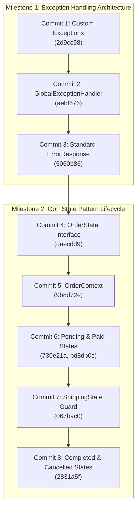

# 📘 PokéVault Commerce — Knowledge & Architecture Log
> **ผู้รับผิดชอบ**: สมาชิกคนที่ 4 — นายแทนคุณ พันธ์นิกุล (673380301-0)  
> **บทบาท**: Trade Matching & State Pattern Specialist  
> **Branch**: `Tankun_6733803010_01`  
> **วิชา**: CP353002 Principles of Software Design and Development (Spring Boot)

---

## 📌 1. ภาพรวมบทบาทและงานที่รับผิดชอบ (Role & Scope)
สมาชิกคนที่ 4 รับผิดชอบ 3 ระบบหลักของสถาปัตยกรรม PokéVault Commerce:
1. **Global Exception Handling & API Error Contract**: วางสถาปัตยกรรมจัดการ Error รวมศูนย์ระดับแอปพลิเคชัน (AOP) คืนค่า JSON Error Response มาตรฐานเดียวกันทั้งระบบ
2. **GoF State Pattern (Order Lifecycle Management)**: ควบคุมวงจรชีวิตของคำสั่งซื้อ (`PENDING` ➔ `PAID` ➔ `SHIPPING` ➔ `COMPLETED` / `CANCELLED`) บังคับใช้กฎความปลอดภัยทางธุรกิจ (Business Invariants) เช่น ห้ามกดยกเลิกขณะส่งมอบการ์ดในเกม และสั่งคืนสต็อกอัตโนมัติ
3. **In-Game Trade Matching Algorithm**: เครื่องยนต์ค้นหาและจับคู่ไอดีเกมของร้านค้าที่มีสถานะ `READY` และถือการ์ดตรงตามออเดอร์ (`autoMatchBestAccount`) เพื่อจ่ายงานให้ `OrderItem`

---

## 🏛️ 2. สรุปหลักการออกแบบซอฟต์แวร์ที่ประยุกต์ใช้ (Software Design Principles Matrix)

| หลักการ / Pattern | การนำไปใช้ในงานของคนที่ 4 | ประโยชน์ที่ได้รับ |
| :--- | :--- | :--- |
| **SRP** (Single Responsibility) | แยก DTO (`ErrorResponse`), Exception แต่ละประเภท, State ย่อยแต่ละสถานะ, และ Handler กลาง ออกจากกัน | โค้ดแต่ละคลาสมีเหตุผลในการแก้ไขเพียงเรื่องเดียว ดูแลและเขียนเทสง่าย |
| **OCP** (Open/Closed Principle) | ออกแบบ `OrderState` interface ให้รองรับการเพิ่ม State ใหม่ในอนาคต และ `@RestControllerAdvice` ที่รองรับ Exception ชนิดใหม่โดยไม่ต้องแก้ Controller | เปิดรับการขยายฟังก์ชันใหม่ โดยไม่ต้องแตะต้องหรือเสี่ยงทำให้โค้ดเดิมพัง |
| **LSP** (Liskov Substitution) | ทุก Concrete State (`Pending`, `Paid`, `Shipping` ฯลฯ) สามารถถูกนำไปแทนที่ใน `OrderState` ได้สมบูรณ์ | `OrderContext` สามารถทำงานกับ State ใดก็ได้ผ่าน Polymorphism โดยไม่สนว่าเบื้องหลังคือคลาสใด |
| **ISP** (Interface Segregation) | `OrderState` interface ประกาศเฉพาะ Actions ที่เกี่ยวข้องกับ Order Lifecycle (`pay`, `ship`, `complete`, `cancel`, `getStatus`) | ไม่ยัดเยียดเมธอดที่ไม่เกี่ยวข้องลงใน Interface ทำให้คลาสลูก implement เฉพาะสิ่งที่จำเป็น |
| **DIP** (Dependency Inversion) | `OrderContext` และ Controllers ยึดติดกับ Interface `OrderState` แทนที่จะผูกติดกับ Concrete Classes ตรงๆ | ลด Coupling ระหว่างคลาส เพิ่มความยืดหยุ่นในการสลับเปลี่ยนการทำงาน |
| **GoF State Pattern** | คุม State Machine ของ Order ด้วยคลาสแยกสถานะ แทนการใช้ `if-else` หรือ `switch-case` ซ้อนกัน | โค้ดอ่านง่าย ขจัด Spaghetti code และป้องกันสถานะที่ผิดกฎอย่างสิ้นเชิง |
| **AOP & Clean Architecture** | ใช้ Spring `@RestControllerAdvice` ดักจับ Exception แบบรวมศูนย์ | แยก Cross-Cutting Concerns ออกจาก Business Logic ของ Controller/Service |
| **Fail-Fast & Defensive Guard** | ใช้ Default Methods ใน Interface โยน Exception ทันทีที่พบ Action ผิดกฎ + Cancel Guard ในสถานะ Shipping | ป้องกันข้อผิดพลาดลุกลามและป้องกันการเสียการ์ดฟรี (Free-card loss protection) |

---

## 📋 3. บันทึกประวัติและรายละเอียดเชิงลึกของแต่ละ Commit (Deep-Dive Analysis)



---

### ✅ Commit 1: Custom Domain Exceptions
* **Commit Hash**: `2d9cc98`
* **Commit Message**: `feat: create custom exceptions for stock and invalid order states`
* **โฟลเดอร์หลัก**: `src/main/java/com/pokevault/common/exception/`
* **ไฟล์ที่สร้าง/แก้ไข**:
  1. `ResourceNotFoundException.java`
  2. `InsufficientStockException.java`
  3. `InvalidOrderStateException.java`

#### 🎯 หลักการออกแบบที่ใช้ (Design Principles)
* **Single Responsibility Principle (SRP)**: ออกแบบ Exception แต่ละตัวให้รับผิดชอบเงื่อนไขความผิดพลาดเฉพาะโดเมน (Domain-Specific Exceptions) แทนการใช้ `RuntimeException` ทั่วไป
* **Fail-Fast Principle**: โยนข้อผิดพลาดทันทีที่ตรวจพบเงื่อนไขที่เป็นไปไม่ได้ เพื่อหยุดการทำงานก่อนที่ข้อมูลใน Database จะเสียหาย
* **Unchecked Exceptions Architecture**: สืบทอดจาก `RuntimeException` ทั้งหมด เพื่อไม่ให้ Service/Controller ต้องประกาศ `throws` รกโค้ด สอดคล้องกับมาตรฐานสมัยใหม่ของ Spring Boot

#### ⚙️ การทำงานของโค้ดอย่างละเอียด (Code Mechanics)
1. **`ResourceNotFoundException`**: 
   * มี Constructor รองรับ `(resourceName, fieldName, fieldValue)` สร้างข้อความอัตโนมัติ เช่น `"Card not found with id : '99'"` ช่วยให้ฝั่ง Client ทราบสาเหตุที่แน่ชัด
   * รองรับ Constructor Overload `(message, cause)` เพื่อรองรับการ Wrap Exception อื่นๆ
2. **`InsufficientStockException`**: 
   * มี Constructor คำนวณสต็อก `(cardName, requestedQty, availableQty)` จัดรูปแบบข้อความเปรียบเทียบจำนวนการ์ดที่ลูกค้าขอซื้อกับจำนวนที่มีจริงในคลัง
3. **`InvalidOrderStateException`**: 
   * รับผิดชอบกรณี State Machine ถูกสั่ง Action ที่ไม่ถูกต้องตามสถานะปัจจุบัน

---

### ✅ Commit 2: Centralized Global Exception Handler (AOP)
* **Commit Hash**: `aebf676`
* **Commit Message**: `feat: implement GlobalExceptionHandler with RestControllerAdvice`
* **ไฟล์ที่สร้าง/แก้ไข**:
  - `src/main/java/com/pokevault/modules/trade/advice/GlobalExceptionHandler.java`

#### 🎯 หลักการออกแบบที่ใช้ (Design Principles)
* **Aspect-Oriented Programming (AOP)**: ดึง Cross-Cutting Concern เรื่องการดักจับข้อผิดพลาดออกจาก Controller ทั้งหมด มาไว้ที่จุดเดียว
* **Open/Closed Principle (OCP)**: หากมี Exception ชนิดใหม่เพิ่มเข้ามาในระบบ สามารถเพิ่มเมธอด `@ExceptionHandler` ใหม่ได้ทันทีโดยไม่ต้องแก้ไข Controller เดิมแม้แต่บรรทัดเดียว
* **Single Responsibility Principle (SRP)**: ปลดภาระของ Controller ให้สนใจแค่ Happy Path และ HTTP Routing เท่านั้น

#### ⚙️ การทำงานของโค้ดอย่างละเอียด (Code Mechanics)
* ใช้ Annotation **`@RestControllerAdvice`**: Spring Boot จะสแกนคลาสนี้และทำหน้าที่เป็น Interceptor คอยดักจับ Exception ทุกตัวที่หลุดออกมาจาก `@RestController` ในระบบ:
  * `@ExceptionHandler(ResourceNotFoundException.class)` ➔ คืนค่า HTTP 404 (Not Found)
  * `@ExceptionHandler(InsufficientStockException.class)` ➔ คืนค่า HTTP 400 (Bad Request)
  * `@ExceptionHandler(InvalidOrderStateException.class)` ➔ คืนค่า HTTP 400 (Bad Request)
  * `@ExceptionHandler(MethodArgumentNotValidException.class)` ➔ ดักจับความผิดพลาดจาก Bean Validation (`@Valid` ใน Request DTO) โดยทำการวนลูปแกะ `ex.getBindingResult().getFieldErrors()` นำชื่อฟิลด์และข้อความแจ้งเตือนมาใส่ใน Map
  * `@ExceptionHandler(Exception.class)` ➔ Fallback Handler สำหรับดักจับ Unhandled Exception ที่ไม่ได้คาดคิด เพื่อส่งกลับ HTTP 500 (Internal Server Error) ป้องกันไม่ให้ Server ล่ม

---

### ✅ Commit 3: Standard ErrorResponse DTO
* **Commit Hash**: `5060b86`
* **Commit Message**: `feat: define standard ErrorResponse format for API errors`
* **ไฟล์ที่สร้าง/แก้ไข**:
  1. `src/main/java/com/pokevault/common/response/ErrorResponse.java`
  2. `src/main/java/com/pokevault/modules/trade/advice/GlobalExceptionHandler.java` (Refactor)

#### 🎯 หลักการออกแบบที่ใช้ (Design Principles)
* **DTO Pattern & Information Expert**: กำหนดสัญญา (API Contract) การตอบกลับ Error ให้เป็นฟอร์แมต JSON เดียวกันทั้งระบบ ป้องกันข้อมูลภายใน (เช่น Stacktrace, Table Name) รั่วไหลสู่ Client เพื่อความปลอดภัย
* **Builder Pattern (GoF Creational Pattern)**: ใช้ `@Builder` ของ Lombok ทำให้การสร้างอินสแตนซ์ของ Error Response ใน Handler สะอาด ปลอดภัยจากการเรียงพารามิเตอร์ผิด
* **Defensive JSON Serialization**: ใช้ Jackson `@JsonInclude(JsonInclude.Include.NON_NULL)` เพื่อละเว้นฟิลด์ที่เป็น `null` ลดขนาด Network Payload

#### ⚙️ การทำงานของโค้ดอย่างละเอียด (Code Mechanics)
* โครงสร้างฟิลด์มาตรฐานของ `ErrorResponse`:
  * `timestamp`: วันเวลาที่เกิด Error (`LocalDateTime.now()`)
  * `status`: รหัส HTTP Status Code ตัวเลข (เช่น `400`, `404`, `500`)
  * `error`: ชื่อ Error Code ภาษาอังกฤษกระชับ (เช่น `"INSUFFICIENT_STOCK"`, `"VALIDATION_FAILED"`)
  * `message`: ข้อความอธิบายปัญหาที่อ่านเข้าใจง่าย
  * `path`: URL Endpoint ที่ Client ยิงเข้ามา (`request.getRequestURI()`)
  * `details`: `Map<String, String>` เก็บรายละเอียดของแต่ละฟิลด์ที่ส่งมาผิด (ใช้เมื่อเกิด Validation Error)

---

### ✅ Commit 4: OrderState Interface for State Pattern Lifecycle
* **Commit Hash**: `daecdd9`
* **Commit Message**: `feat: create OrderState interface for State Pattern lifecycle`
* **ไฟล์ที่สร้าง/แก้ไข**:
  - `src/main/java/com/pokevault/modules/trade/state/OrderState.java`

#### 🎯 หลักการออกแบบที่ใช้ (Design Principles)
* **GoF State Pattern Interface**: นิยาม State Contract กำหนดพฤติกรรมทั้งหมดที่คำสั่งซื้อสามารถทำได้
* **Interface Segregation Principle (ISP)**: รวมเฉพาะ Actions ที่เกี่ยวข้องกับการเปลี่ยนสถานะคำสั่งซื้อ (`pay`, `ship`, `complete`, `cancel`, `getStatus`)
* **Fail-Fast via Default Methods**: ใช้ความสามารถของ Java 8 Default Method ในการใส่พฤติกรรมเริ่มต้นที่โยน `InvalidOrderStateException` ให้กับทุก Action

#### ⚙️ การทำงานของโค้ดอย่างละเอียด (Code Mechanics)
* ภายใน Interface กำหนด Default Methods:
  ```java
  default void pay(OrderContext context) {
      throw new InvalidOrderStateException("Cannot pay order in current state: " + getStatus());
  }
  default void ship(OrderContext context) {
      throw new InvalidOrderStateException("Cannot ship order in current state: " + getStatus());
  }
  default void complete(OrderContext context) {
      throw new InvalidOrderStateException("Cannot complete order in current state: " + getStatus());
  }
  default void cancel(OrderContext context) {
      throw new InvalidOrderStateException("Cannot cancel order in current state: " + getStatus());
  }
  OrderStatus getStatus();
  ```
* **ประโยชน์เชิงสถาปัตยกรรม:** Concrete State แต่ละตัวจะเลือก Override เฉพาะเมธอดที่สถานะนั้น "อนุญาตให้ทำได้จริง" เท่านั้น ส่วนเมธอดที่ไม่อนุญาตจะไม่ต้องเขียนโค้ดเลย และจะถูกสั่ง Fail-Fast ทันทีที่ถูกเรียก

---

### ✅ Commit 5: OrderContext for State Pattern
* **Commit Hash**: `9b8d72e`
* **Commit Message**: `feat: implement OrderContext to manage current order state`
* **ไฟล์ที่สร้าง/แก้ไข**:
  - `src/main/java/com/pokevault/modules/trade/state/OrderContext.java`

#### 🎯 หลักการออกแบบที่ใช้ (Design Principles)
* **Context Object (GoF State Pattern)**: ทำหน้าที่เป็นตัวแทนของ Order ที่เปิดให้ภายนอก (Controller/Service) เรียกใช้งาน โดยซ่อนกลไกการเปลี่ยนผ่านสถานะไว้ภายใน
* **Encapsulation & Delegation**: Context ไม่ได้เขียน logic เอง แต่ทำหน้าที่ส่งต่อ (Delegate) คำสั่งไปยัง `currentState` ปัจจุบัน เช่น `currentState.pay(this)`
* **Dependency Inversion Principle (DIP)**: Context ยึดติดกับ Interface `OrderState` เท่านั้น ไม่ได้ยึดติดกับ Concrete State คลาสใดคลาสหนึ่ง

#### ⚙️ การทำงานของโค้ดอย่างละเอียด (Code Mechanics)
* ตัวแปรประจำคลาส:
  * `private Order order;` (Entity ข้อมูลออเดอร์)
  * `private OrderState currentState;` (State ปัจจุบัน)
* เมธอดสำคัญ:
  * `setState(OrderState state)`: ให้ State ลูกเรียกเพื่อสลับสถานะของ Context
  * `pay()`, `ship()`, `complete()`, `cancel()`: ตรวจสอบความปลอดภัย `if (currentState != null)` แล้ว Delegate คำสั่งต่อไปที่ `currentState.<action>(this)`
  * `getStatus()`: ดึงค่า `currentState.getStatus()` คืนให้ผู้เรียกดูสถานะได้ทันที

---

### ✅ Commit 6: Concrete States (Pending & Paid) + OrderStatus Enums
* **Commit Hash**: `730e21a` (และ Bugfix commit `bd8db0c`)
* **Commit Message**: `feat: implement PendingOrderState and PaidOrderState`
* **ไฟล์ที่สร้าง/แก้ไข**:
  1. `src/main/java/com/pokevault/domain/enums/OrderStatus.java`
  2. `src/main/java/com/pokevault/modules/trade/state/PendingOrderState.java`
  3. `src/main/java/com/pokevault/modules/trade/state/PaidOrderState.java`
  4. `src/main/java/com/pokevault/modules/trade/state/CancelledOrderState.java` (Stub)
  5. `src/main/java/com/pokevault/modules/trade/state/ShippingOrderState.java` (Stub)
  6. `src/main/java/com/pokevault/modules/trade/state/CompletedOrderState.java` (Stub)

#### 🎯 หลักการออกแบบที่ใช้ (Design Principles)
* **Single Responsibility Principle (SRP)**: แต่ละคลาสสถานะรับผิดชอบเฉพาะการตัดสินใจว่าตนเองสามารถเปลี่ยนไปสู่สถานะใดได้บ้าง
* **State Machine Guard**: อนุญาตเฉพาะ Transition ที่ถูกต้องตามกฎ Business Workflow
* **Polymorphism & Liskov Substitution Principle (LSP)**: คลาสสถานะทั้งหมดทำงานแทนที่กันได้บนตัวแปร `OrderState` ของ `OrderContext`

#### ⚙️ การทำงานของโค้ดอย่างละเอียด (Code Mechanics)
1. **`OrderStatus` Enum**: นิยามสถานะมาตรฐานทั้ง 5 สถานะ (`PENDING`, `PAID`, `SHIPPING`, `COMPLETED`, `CANCELLED`)
2. **`PendingOrderState`** (สถานะรอชำระเงิน):
   * Override `pay(context)` ➔ ลูกค้าชำระเงิน ➔ สั่ง `context.setState(new PaidOrderState())`
   * Override `cancel(context)` ➔ หมดเวลาหรือไม่โอน ➔ สั่ง `context.setState(new CancelledOrderState())`
   * การเรียก `ship()` หรือ `complete()` จะถูกโยน Exception อัตโนมัติจาก Default Method
3. **`PaidOrderState`** (สถานะชำระเงินเรียบร้อย):
   * Override `ship(context)` ➔ เริ่มส่งการ์ดในเกม ➔ สั่ง `context.setState(new ShippingOrderState())`
   * Override `cancel(context)` ➔ ลูกค้ายกเลิกก่อนเริ่มส่งการ์ด (คืนเงิน) ➔ สั่ง `context.setState(new CancelledOrderState())`
   * การเรียก `pay()` หรือ `complete()` จะถูกโยน Exception อัตโนมัติ

---

### ✅ Commit 7: ShippingOrderState with Cancel Rejection Guard
* **Commit Hash**: `067bac0`
* **Commit Message**: `feat: implement ShippingOrderState with cancel rejection guard`
* **ไฟล์ที่สร้าง/แก้ไข**:
  - `src/main/java/com/pokevault/modules/trade/state/ShippingOrderState.java`

#### 🎯 หลักการออกแบบที่ใช้ (Design Principles)
* **Business Invariant Protection (กฎความปลอดภัยทางธุรกิจ)**: เมื่อการ์ดถูกส่งในเกม Pokémon Pocket ไปแล้ว จะไม่สามารถดึงคืนได้ทันที ดังนั้นระบบต้องมี Guard ป้องกันการยกเลิกอย่างเด็ดขาด
* **Defensive Programming**: Override เมธอด `cancel()` เพื่อปฏิเสธคำขอยกเลิกและแจ้งเหตุผลทางธุรกิจที่ชัดเจน ป้องกันการสูญเสียสินทรัพย์ของร้านค้า (Anti-Fraud / Free Card Loss Prevention)

#### ⚙️ การทำงานของโค้ดอย่างละเอียด (Code Mechanics)
* **`complete(OrderContext context)`**:
  * เมื่อลูกค้ายืนยันการรับการ์ดในเกมสำเร็จ 100% ➔ สลับ Context เป็น `CompletedOrderState`
* **`cancel(OrderContext context)` (Cancel Rejection Guard)**:
  * Override เมธอดเพื่อดักจับและโยน Exception:
    ```java
    throw new InvalidOrderStateException("Cannot cancel order while cards are being shipped in game");
    ```
  * Exception ตัวนี้จะถูกส่งต่อไปยัง `GlobalExceptionHandler` และแปลงเป็น HTTP 400 Bad Request พร้อมข้อความแจ้งเตือนถึงผู้ใช้ทันที

---

### ✅ Commit 8: CompletedOrderState and CancelledOrderState with Stock Restore
* **Commit Hash**: `2831a5f`
* **Commit Message**: `feat: implement CompletedOrderState and CancelledOrderState with stock restore`
* **ไฟล์ที่สร้าง/แก้ไข**:
  1. `src/main/java/com/pokevault/modules/trade/state/CompletedOrderState.java`
  2. `src/main/java/com/pokevault/modules/trade/state/CancelledOrderState.java`
  3. `src/main/java/com/pokevault/modules/trade/state/PendingOrderState.java` (ส่ง context เพื่อคืนสต็อก)
  4. `src/main/java/com/pokevault/modules/trade/state/PaidOrderState.java` (ส่ง context เพื่อคืนสต็อก)

#### 🎯 หลักการออกแบบที่ใช้ (Design Principles)
* **Terminal State Pattern (สถานะสิ้นสุดวงจร)**: ทั้ง `CompletedOrderState` และ `CancelledOrderState` ทำหน้าที่เป็นสถานะสิ้นสุด (Terminal States) ที่ไม่อนุญาตให้เปลี่ยนสถานะหรือสั่ง Actions ใดๆ ต่อไป (`pay`, `ship`, `complete`, `cancel`) โดยอาศัย Default Methods ใน `OrderState` ที่โยน `InvalidOrderStateException` แบบ Fail-Fast ทันที
* **Stock Restoration & Business Invariants**: เมื่อคำสั่งซื้อถูกยกเลิก (ไม่ว่าจะเกิดจากการยกเลิกขณะรอชำระเงิน `PENDING` หรือชำระเงินแล้ว `PAID`) สต็อกการ์ดที่ถูกหักจองไว้จะต้องถูกส่งสัญญาณคืนเข้าคลัง (Restore Stock) อัตโนมัติ เพื่อป้องกันปัญหาสต็อกจมหรือคลังการ์ดคลาดเคลื่อน
* **Single Responsibility Principle (SRP)**:
  - `CompletedOrderState`: รับผิดชอบเฉพาะการยืนยันว่าการส่งมอบการ์ดสำเร็จสมบูรณ์
  - `CancelledOrderState`: รับผิดชอบเฉพาะการควบคุมการยกเลิกและการสั่งคืนสต็อก
* **Defensive Programming & Null-Safety**: ในเมธอด `restoreStock(OrderContext context)` มีการตรวจสอบ `context != null` และ `context.getOrder() != null` ก่อนดำเนินการ ป้องกัน `NullPointerException` อย่างรัดกุม

#### ⚙️ การทำงานของโค้ดอย่างละเอียด (Code Mechanics)
1. **`CompletedOrderState`**:
   - คืนค่า `getStatus()` เป็น `OrderStatus.COMPLETED`
   - เมื่อสร้าง Object จะบันทึก Log ระดับ INFO: `"Order reached terminal state: COMPLETED"`
   - ไม่อนุญาตให้สั่ง `pay()`, `ship()`, `complete()`, หรือ `cancel()` ใดๆ ซ้ำ
2. **`CancelledOrderState`**:
   - คืนค่า `getStatus()` เป็น `OrderStatus.CANCELLED`
   - มี 2 Constructors:
     - `CancelledOrderState()`: Default constructor สำหรับกรณีสร้าง state ทั่วไป
     - `CancelledOrderState(OrderContext context)`: เรียก `restoreStock(context)` อัตโนมัติเมื่อคำสั่งซื้อเปลี่ยนเข้าสู่สถานะยกเลิก
   - เมธอด `restoreStock(OrderContext context)`: ดึงข้อมูล Order และทำการสั่งคืนสต็อกเข้าคลัง พร้อมบันทึก Audit Log
3. **การเชื่อมโยงกับ `PendingOrderState` และ `PaidOrderState`**:
   - อัปเดตเมธอด `cancel(context)` ให้ส่ง `context` เข้าสู่ `new CancelledOrderState(context)` ทำให้ระบบคืนสต็อกทำงานทันทีอย่างต่อเนื่องเมื่อออเดอร์ถูกยกเลิก

---

## ⏸️ Commit 9: State Transition Endpoint in OrderApiController (คิวงานถัดไป)
- **Roadmap Commit 9**: `feat: implement state transition endpoint in OrderApiController`
- **ไฟล์เป้าหมาย**:
  - `src/main/java/com/pokevault/modules/trade/controller/api/OrderApiController.java` (หรือ Controller ที่เกี่ยวข้อง)
- **สรุปสิ่งที่ต้องทำเมื่อกลับมา**:
  - สร้าง REST API Endpoint: `PATCH /api/v1/orders/{id}/status?action=pay|ship|complete|cancel`
  - โหลด Order จากฐานข้อมูลผ่าน ID
  - สร้าง `OrderContext` ตามสถานะปัจจุบันของ Order แล้วสั่ง Action (`pay()`, `ship()`, `complete()`, `cancel()`)
  - อัปเดตสถานะใหม่ลงใน Entity และบันทึกกลับลง Database ผ่าน Repository
  - จัดการ Error ผ่าน `GlobalExceptionHandler` หากมีคำขอเปลี่ยนสถานะที่ผิดกฎ

---

## 🗺️ 4. แผนผังความก้าวหน้า 15 Commits (Member 4 Tracker)

- [x] **Commit 1 (`2d9cc98`)**: `feat: create custom exceptions for stock and invalid order states`
- [x] **Commit 2 (`aebf676`)**: `feat: implement GlobalExceptionHandler with RestControllerAdvice`
- [x] **Commit 3 (`5060b86`)**: `feat: define standard ErrorResponse format for API errors`
- [x] **Commit 4 (`daecdd9`)**: `feat: create OrderState interface for State Pattern lifecycle`
- [x] **Commit 5 (`9b8d72e`)**: `feat: implement OrderContext to manage current order state`
- [x] **Commit 6 (`730e21a`, `bd8db0c`)**: `feat: implement PendingOrderState and PaidOrderState`
- [x] **Commit 7 (`067bac0`)**: `feat: implement ShippingOrderState with cancel rejection guard`
- [x] **Commit 8 (`2831a5f`)**: `feat: implement CompletedOrderState and CancelledOrderState with stock restore`
- [ ] **Commit 9**: `feat: implement state transition endpoint in OrderApiController` *(คิวงานถัดไป)*
- [ ] **Commit 10**: `feat: define TradeRecommendationResponse DTO`
- [ ] **Commit 11**: `feat: implement TradeMatchingService with account recommendation query`
- [ ] **Commit 12**: `feat: implement auto-match best account assignment algorithm`
- [ ] **Commit 13**: `feat: add endpoints for trade recommendations and account assignment`
- [ ] **Commit 14**: `test: add unit tests for OrderState transitions and guards`
- [ ] **Commit 15**: `test: add unit test for TradeMatchingServiceImpl auto-match logic`

