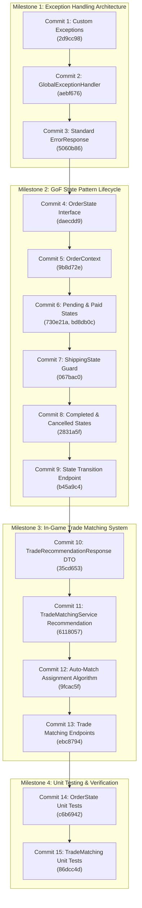

# 📘 PokéVault Commerce — Knowledge & Architecture Log
> **ผู้รับผิดชอบ**: สมาชิกคนที่ 4 — นายแทนคุณ พันธ์นิกุล (673380301-0)  
> **บทบาท**: Trade Matching & State Pattern Specialist  
> **Branch**: `Tankun_6733803010_01`  
> **วิชา**: CP353002 Principles of Software Design and Development (Spring Boot)

---

## 📌 1. ภาพรวมบทบาทและงานที่รับผิดชอบ (Role & Scope)
สมาชิกคนที่ 4 รับผิดชอบ 3 ระบบหลักของสถาปัตยกรรม PokéVault Commerce:
1. **Global Exception Handling & API Error Contract**: วางสถาปัตยกรรมจัดการ Error รวมศูนย์ระดับแอปพลิเคชัน (AOP) คืนค่า JSON Error Response มาตรฐานเดียวกันทั้งระบบ
2. **GoF State Pattern (Order Lifecycle Management)**: ควบคุมวงจรชีวิตของคำสั่งซื้อ (`PENDING` ➔ `PAID` ➔ `SHIPPING` ➔ `COMPLETED` / `CANCELLED`) บังคับใช้กฎความปลอดภัยทางธุรกิจ (Business Invariants) เช่น ห้ามกดยกเลิกขณะส่งมอบการ์ดในเกม และสั่งคืนสต็อกอัตโนมัติ
3. **In-Game Trade Matching Algorithm**: เครื่องยนต์ค้นหาและจับคู่ไอดีเกมของร้านค้าที่มีสถานะ `READY` และถือการ์ดตรงตามออเดอร์ (`autoMatchBestAccount`) เพื่อจ่ายงานให้ `OrderItem`

---

## 🏛️ 2. สรุปหลักการออกแบบซอฟต์แวร์ที่ประยุกต์ใช้ (Software Design Principles Matrix)

| หลักการ / Pattern | การนำไปใช้ในงานของคนที่ 4 | ประโยชน์ที่ได้รับ |
| :--- | :--- | :--- |
| **SRP** (Single Responsibility) | แยก DTO (`ErrorResponse`), Exception แต่ละประเภท, State ย่อยแต่ละสถานะ, และ Handler กลาง ออกจากกัน | โค้ดแต่ละคลาสมีเหตุผลในการแก้ไขเพียงเรื่องเดียว ดูแลและเขียนเทสง่าย |
| **OCP** (Open/Closed Principle) | ออกแบบ `OrderState` interface ให้รองรับการเพิ่ม State ใหม่ในอนาคต และ `@RestControllerAdvice` ที่รองรับ Exception ชนิดใหม่โดยไม่ต้องแก้ Controller | เปิดรับการขยายฟังก์ชันใหม่ โดยไม่ต้องแตะต้องหรือเสี่ยงทำให้โค้ดเดิมพัง |
| **LSP** (Liskov Substitution) | ทุก Concrete State (`Pending`, `Paid`, `Shipping` ฯลฯ) สามารถถูกนำไปแทนที่ใน `OrderState` ได้สมบูรณ์ | `OrderContext` สามารถทำงานกับ State ใดก็ได้ผ่าน Polymorphism โดยไม่สนว่าเบื้องหลังคือคลาสใด |
| **ISP** (Interface Segregation) | `OrderState` interface ประกาศเฉพาะ Actions ที่เกี่ยวข้องกับ Order Lifecycle (`pay`, `ship`, `complete`, `cancel`, `getStatus`) | ไม่ยัดเยียดเมธอดที่ไม่เกี่ยวข้องลงใน Interface ทำให้คลาสลูก implement เฉพาะสิ่งที่จำเป็น |
| **DIP** (Dependency Inversion) | `OrderContext` และ Controllers ยึดติดกับ Interface `OrderState` แทนที่จะผูกติดกับ Concrete Classes ตรงๆ | ลด Coupling ระหว่างคลาส เพิ่มความยืดหยุ่นในการสลับเปลี่ยนการทำงาน |
| **GoF State Pattern** | คุม State Machine ของ Order ด้วยคลาสแยกสถานะ แทนการใช้ `if-else` หรือ `switch-case` ซ้อนกัน | โค้ดอ่านง่าย ขจัด Spaghetti code และป้องกันสถานะที่ผิดกฎอย่างสิ้นเชิง |
| **AOP & Clean Architecture** | ใช้ Spring `@RestControllerAdvice` ดักจับ Exception แบบรวมศูนย์ | แยก Cross-Cutting Concerns ออกจาก Business Logic ของ Controller/Service |
| **Fail-Fast & Defensive Guard** | ใช้ Default Methods ใน Interface โยน Exception ทันทีที่พบ Action ผิดกฎ + Cancel Guard ในสถานะ Shipping | ป้องกันข้อผิดพลาดลุกลามและป้องกันการเสียการ์ดฟรี (Free-card loss protection) |

---

## 📋 3. บันทึกประวัติและรายละเอียดเชิงลึกของแต่ละ Commit (Deep-Dive Analysis)



---

### ✅ Commit 1: Custom Domain Exceptions
* **Commit Hash**: `2d9cc98`
* **Commit Message**: `feat: create custom exceptions for stock and invalid order states`
* **โฟลเดอร์หลัก**: `src/main/java/com/pokevault/common/exception/`
* **ไฟล์ที่สร้าง/แก้ไข**:
  1. `ResourceNotFoundException.java`
  2. `InsufficientStockException.java`
  3. `InvalidOrderStateException.java`

#### 🎯 หลักการออกแบบที่ใช้ (Design Principles)
* **Single Responsibility Principle (SRP)**: ออกแบบ Exception แต่ละตัวให้รับผิดชอบเงื่อนไขความผิดพลาดเฉพาะโดเมน (Domain-Specific Exceptions) แทนการใช้ `RuntimeException` ทั่วไป
* **Fail-Fast Principle**: โยนข้อผิดพลาดทันทีที่ตรวจพบเงื่อนไขที่เป็นไปไม่ได้ เพื่อหยุดการทำงานก่อนที่ข้อมูลใน Database จะเสียหาย
* **Unchecked Exceptions Architecture**: สืบทอดจาก `RuntimeException` ทั้งหมด เพื่อไม่ให้ Service/Controller ต้องประกาศ `throws` รกโค้ด สอดคล้องกับมาตรฐานสมัยใหม่ของ Spring Boot

#### ⚙️ การทำงานของโค้ดอย่างละเอียด (Code Mechanics)
1. **`ResourceNotFoundException`**: 
   * มี Constructor รองรับ `(resourceName, fieldName, fieldValue)` สร้างข้อความอัตโนมัติ เช่น `"Card not found with id : '99'"` ช่วยให้ฝั่ง Client ทราบสาเหตุที่แน่ชัด
   * รองรับ Constructor Overload `(message, cause)` เพื่อรองรับการ Wrap Exception อื่นๆ
2. **`InsufficientStockException`**: 
   * มี Constructor คำนวณสต็อก `(cardName, requestedQty, availableQty)` จัดรูปแบบข้อความเปรียบเทียบจำนวนการ์ดที่ลูกค้าขอซื้อกับจำนวนที่มีจริงในคลัง
3. **`InvalidOrderStateException`**: 
   * รับผิดชอบกรณี State Machine ถูกสั่ง Action ที่ไม่ถูกต้องตามสถานะปัจจุบัน

---

### ✅ Commit 2: Centralized Global Exception Handler (AOP)
* **Commit Hash**: `aebf676`
* **Commit Message**: `feat: implement GlobalExceptionHandler with RestControllerAdvice`
* **ไฟล์ที่สร้าง/แก้ไข**:
  - `src/main/java/com/pokevault/modules/trade/advice/GlobalExceptionHandler.java`

#### 🎯 หลักการออกแบบที่ใช้ (Design Principles)
* **Aspect-Oriented Programming (AOP)**: ดึง Cross-Cutting Concern เรื่องการดักจับข้อผิดพลาดออกจาก Controller ทั้งหมด มาไว้ที่จุดเดียว
* **Open/Closed Principle (OCP)**: หากมี Exception ชนิดใหม่เพิ่มเข้ามาในระบบ สามารถเพิ่มเมธอด `@ExceptionHandler` ใหม่ได้ทันทีโดยไม่ต้องแก้ไข Controller เดิมแม้แต่บรรทัดเดียว
* **Single Responsibility Principle (SRP)**: ปลดภาระของ Controller ให้สนใจแค่ Happy Path และ HTTP Routing เท่านั้น

#### ⚙️ การทำงานของโค้ดอย่างละเอียด (Code Mechanics)
* ใช้ Annotation **`@RestControllerAdvice`**: Spring Boot จะสแกนคลาสนี้และทำหน้าที่เป็น Interceptor คอยดักจับ Exception ทุกตัวที่หลุดออกมาจาก `@RestController` ในระบบ:
  * `@ExceptionHandler(ResourceNotFoundException.class)` ➔ คืนค่า HTTP 404 (Not Found)
  * `@ExceptionHandler(InsufficientStockException.class)` ➔ คืนค่า HTTP 400 (Bad Request)
  * `@ExceptionHandler(InvalidOrderStateException.class)` ➔ คืนค่า HTTP 400 (Bad Request)
  * `@ExceptionHandler(MethodArgumentNotValidException.class)` ➔ ดักจับความผิดพลาดจาก Bean Validation (`@Valid` ใน Request DTO) โดยทำการวนลูปแกะ `ex.getBindingResult().getFieldErrors()` นำชื่อฟิลด์และข้อความแจ้งเตือนมาใส่ใน Map
  * `@ExceptionHandler(Exception.class)` ➔ Fallback Handler สำหรับดักจับ Unhandled Exception ที่ไม่ได้คาดคิด เพื่อส่งกลับ HTTP 500 (Internal Server Error) ป้องกันไม่ให้ Server ล่ม

---

### ✅ Commit 3: Standard ErrorResponse DTO
* **Commit Hash**: `5060b86`
* **Commit Message**: `feat: define standard ErrorResponse format for API errors`
* **ไฟล์ที่สร้าง/แก้ไข**:
  1. `src/main/java/com/pokevault/common/response/ErrorResponse.java`
  2. `src/main/java/com/pokevault/modules/trade/advice/GlobalExceptionHandler.java` (Refactor)

#### 🎯 หลักการออกแบบที่ใช้ (Design Principles)
* **DTO Pattern & Information Expert**: กำหนดสัญญา (API Contract) การตอบกลับ Error ให้เป็นฟอร์แมต JSON เดียวกันทั้งระบบ ป้องกันข้อมูลภายใน (เช่น Stacktrace, Table Name) รั่วไหลสู่ Client เพื่อความปลอดภัย
* **Builder Pattern (GoF Creational Pattern)**: ใช้ `@Builder` ของ Lombok ทำให้การสร้างอินสแตนซ์ของ Error Response ใน Handler สะอาด ปลอดภัยจากการเรียงพารามิเตอร์ผิด
* **Defensive JSON Serialization**: ใช้ Jackson `@JsonInclude(JsonInclude.Include.NON_NULL)` เพื่อละเว้นฟิลด์ที่เป็น `null` ลดขนาด Network Payload

#### ⚙️ การทำงานของโค้ดอย่างละเอียด (Code Mechanics)
* โครงสร้างฟิลด์มาตรฐานของ `ErrorResponse`:
  * `timestamp`: วันเวลาที่เกิด Error (`LocalDateTime.now()`)
  * `status`: รหัส HTTP Status Code ตัวเลข (เช่น `400`, `404`, `500`)
  * `error`: ชื่อ Error Code ภาษาอังกฤษกระชับ (เช่น `"INSUFFICIENT_STOCK"`, `"VALIDATION_FAILED"`)
  * `message`: ข้อความอธิบายปัญหาที่อ่านเข้าใจง่าย
  * `path`: URL Endpoint ที่ Client ยิงเข้ามา (`request.getRequestURI()`)
  * `details`: `Map<String, String>` เก็บรายละเอียดของแต่ละฟิลด์ที่ส่งมาผิด (ใช้เมื่อเกิด Validation Error)

---

### ✅ Commit 4: OrderState Interface for State Pattern Lifecycle
* **Commit Hash**: `daecdd9`
* **Commit Message**: `feat: create OrderState interface for State Pattern lifecycle`
* **ไฟล์ที่สร้าง/แก้ไข**:
  - `src/main/java/com/pokevault/modules/trade/state/OrderState.java`

#### 🎯 หลักการออกแบบที่ใช้ (Design Principles)
* **GoF State Pattern Interface**: นิยาม State Contract กำหนดพฤติกรรมทั้งหมดที่คำสั่งซื้อสามารถทำได้
* **Interface Segregation Principle (ISP)**: รวมเฉพาะ Actions ที่เกี่ยวข้องกับการเปลี่ยนสถานะคำสั่งซื้อ (`pay`, `ship`, `complete`, `cancel`, `getStatus`)
* **Fail-Fast via Default Methods**: ใช้ความสามารถของ Java 8 Default Method ในการใส่พฤติกรรมเริ่มต้นที่โยน `InvalidOrderStateException` ให้กับทุก Action

#### ⚙️ การทำงานของโค้ดอย่างละเอียด (Code Mechanics)
* ภายใน Interface กำหนด Default Methods:
  ```java
  default void pay(OrderContext context) {
      throw new InvalidOrderStateException("Cannot pay order in current state: " + getStatus());
  }
  default void ship(OrderContext context) {
      throw new InvalidOrderStateException("Cannot ship order in current state: " + getStatus());
  }
  default void complete(OrderContext context) {
      throw new InvalidOrderStateException("Cannot complete order in current state: " + getStatus());
  }
  default void cancel(OrderContext context) {
      throw new InvalidOrderStateException("Cannot cancel order in current state: " + getStatus());
  }
  OrderStatus getStatus();
  ```
* **ประโยชน์เชิงสถาปัตยกรรม:** Concrete State แต่ละตัวจะเลือก Override เฉพาะเมธอดที่สถานะนั้น "อนุญาตให้ทำได้จริง" เท่านั้น ส่วนเมธอดที่ไม่อนุญาตจะไม่ต้องเขียนโค้ดเลย และจะถูกสั่ง Fail-Fast ทันทีที่ถูกเรียก

---

### ✅ Commit 5: OrderContext for State Pattern
* **Commit Hash**: `9b8d72e`
* **Commit Message**: `feat: implement OrderContext to manage current order state`
* **ไฟล์ที่สร้าง/แก้ไข**:
  - `src/main/java/com/pokevault/modules/trade/state/OrderContext.java`

#### 🎯 หลักการออกแบบที่ใช้ (Design Principles)
* **Context Object (GoF State Pattern)**: ทำหน้าที่เป็นตัวแทนของ Order ที่เปิดให้ภายนอก (Controller/Service) เรียกใช้งาน โดยซ่อนกลไกการเปลี่ยนผ่านสถานะไว้ภายใน
* **Encapsulation & Delegation**: Context ไม่ได้เขียน logic เอง แต่ทำหน้าที่ส่งต่อ (Delegate) คำสั่งไปยัง `currentState` ปัจจุบัน เช่น `currentState.pay(this)`
* **Dependency Inversion Principle (DIP)**: Context ยึดติดกับ Interface `OrderState` เท่านั้น ไม่ได้ยึดติดกับ Concrete State คลาสใดคลาสหนึ่ง

#### ⚙️ การทำงานของโค้ดอย่างละเอียด (Code Mechanics)
* ตัวแปรประจำคลาส:
  * `private Order order;` (Entity ข้อมูลออเดอร์)
  * `private OrderState currentState;` (State ปัจจุบัน)
* เมธอดสำคัญ:
  * `setState(OrderState state)`: ให้ State ลูกเรียกเพื่อสลับสถานะของ Context
  * `pay()`, `ship()`, `complete()`, `cancel()`: ตรวจสอบความปลอดภัย `if (currentState != null)` แล้ว Delegate คำสั่งต่อไปที่ `currentState.<action>(this)`
  * `getStatus()`: ดึงค่า `currentState.getStatus()` คืนให้ผู้เรียกดูสถานะได้ทันที

---

### ✅ Commit 6: Concrete States (Pending & Paid) + OrderStatus Enums
* **Commit Hash**: `730e21a` (และ Bugfix commit `bd8db0c`)
* **Commit Message**: `feat: implement PendingOrderState and PaidOrderState`
* **ไฟล์ที่สร้าง/แก้ไข**:
  1. `src/main/java/com/pokevault/domain/enums/OrderStatus.java`
  2. `src/main/java/com/pokevault/modules/trade/state/PendingOrderState.java`
  3. `src/main/java/com/pokevault/modules/trade/state/PaidOrderState.java`
  4. `src/main/java/com/pokevault/modules/trade/state/CancelledOrderState.java` (Stub)
  5. `src/main/java/com/pokevault/modules/trade/state/ShippingOrderState.java` (Stub)
  6. `src/main/java/com/pokevault/modules/trade/state/CompletedOrderState.java` (Stub)

#### 🎯 หลักการออกแบบที่ใช้ (Design Principles)
* **Single Responsibility Principle (SRP)**: แต่ละคลาสสถานะรับผิดชอบเฉพาะการตัดสินใจว่าตนเองสามารถเปลี่ยนไปสู่สถานะใดได้บ้าง
* **State Machine Guard**: อนุญาตเฉพาะ Transition ที่ถูกต้องตามกฎ Business Workflow
* **Polymorphism & Liskov Substitution Principle (LSP)**: คลาสสถานะทั้งหมดทำงานแทนที่กันได้บนตัวแปร `OrderState` ของ `OrderContext`

#### ⚙️ การทำงานของโค้ดอย่างละเอียด (Code Mechanics)
1. **`OrderStatus` Enum**: นิยามสถานะมาตรฐานทั้ง 5 สถานะ (`PENDING`, `PAID`, `SHIPPING`, `COMPLETED`, `CANCELLED`)
2. **`PendingOrderState`** (สถานะรอชำระเงิน):
   * Override `pay(context)` ➔ ลูกค้าชำระเงิน ➔ สั่ง `context.setState(new PaidOrderState())`
   * Override `cancel(context)` ➔ หมดเวลาหรือไม่โอน ➔ สั่ง `context.setState(new CancelledOrderState())`
   * การเรียก `ship()` หรือ `complete()` จะถูกโยน Exception อัตโนมัติจาก Default Method
3. **`PaidOrderState`** (สถานะชำระเงินเรียบร้อย):
   * Override `ship(context)` ➔ เริ่มส่งการ์ดในเกม ➔ สั่ง `context.setState(new ShippingOrderState())`
   * Override `cancel(context)` ➔ ลูกค้ายกเลิกก่อนเริ่มส่งการ์ด (คืนเงิน) ➔ สั่ง `context.setState(new CancelledOrderState())`
   * การเรียก `pay()` หรือ `complete()` จะถูกโยน Exception อัตโนมัติ

---

### ✅ Commit 7: ShippingOrderState with Cancel Rejection Guard
* **Commit Hash**: `067bac0`
* **Commit Message**: `feat: implement ShippingOrderState with cancel rejection guard`
* **ไฟล์ที่สร้าง/แก้ไข**:
  - `src/main/java/com/pokevault/modules/trade/state/ShippingOrderState.java`

#### 🎯 หลักการออกแบบที่ใช้ (Design Principles)
* **Business Invariant Protection (กฎความปลอดภัยทางธุรกิจ)**: เมื่อการ์ดถูกส่งในเกม Pokémon Pocket ไปแล้ว จะไม่สามารถดึงคืนได้ทันที ดังนั้นระบบต้องมี Guard ป้องกันการยกเลิกอย่างเด็ดขาด
* **Defensive Programming**: Override เมธอด `cancel()` เพื่อปฏิเสธคำขอยกเลิกและแจ้งเหตุผลทางธุรกิจที่ชัดเจน ป้องกันการสูญเสียสินทรัพย์ของร้านค้า (Anti-Fraud / Free Card Loss Prevention)

#### ⚙️ การทำงานของโค้ดอย่างละเอียด (Code Mechanics)
* **`complete(OrderContext context)`**:
  * เมื่อลูกค้ายืนยันการรับการ์ดในเกมสำเร็จ 100% ➔ สลับ Context เป็น `CompletedOrderState`
* **`cancel(OrderContext context)` (Cancel Rejection Guard)**:
  * Override เมธอดเพื่อดักจับและโยน Exception:
    ```java
    throw new InvalidOrderStateException("Cannot cancel order while cards are being shipped in game");
    ```
  * Exception ตัวนี้จะถูกส่งต่อไปยัง `GlobalExceptionHandler` และแปลงเป็น HTTP 400 Bad Request พร้อมข้อความแจ้งเตือนถึงผู้ใช้ทันที

---

### ✅ Commit 8: CompletedOrderState and CancelledOrderState with Stock Restore
* **Commit Hash**: `2831a5f`
* **Commit Message**: `feat: implement CompletedOrderState and CancelledOrderState with stock restore`
* **ไฟล์ที่สร้าง/แก้ไข**:
  1. `src/main/java/com/pokevault/modules/trade/state/CompletedOrderState.java`
  2. `src/main/java/com/pokevault/modules/trade/state/CancelledOrderState.java`
  3. `src/main/java/com/pokevault/modules/trade/state/PendingOrderState.java` (ส่ง context เพื่อคืนสต็อก)
  4. `src/main/java/com/pokevault/modules/trade/state/PaidOrderState.java` (ส่ง context เพื่อคืนสต็อก)

#### 🎯 หลักการออกแบบที่ใช้ (Design Principles)
* **Terminal State Pattern (สถานะสิ้นสุดวงจร)**: ทั้ง `CompletedOrderState` และ `CancelledOrderState` ทำหน้าที่เป็นสถานะสิ้นสุด (Terminal States) ที่ไม่อนุญาตให้เปลี่ยนสถานะหรือสั่ง Actions ใดๆ ต่อไป (`pay`, `ship`, `complete`, `cancel`) โดยอาศัย Default Methods ใน `OrderState` ที่โยน `InvalidOrderStateException` แบบ Fail-Fast ทันที
* **Stock Restoration & Business Invariants**: เมื่อคำสั่งซื้อถูกยกเลิก (ไม่ว่าจะเกิดจากการยกเลิกขณะรอชำระเงิน `PENDING` หรือชำระเงินแล้ว `PAID`) สต็อกการ์ดที่ถูกหักจองไว้จะต้องถูกส่งสัญญาณคืนเข้าคลัง (Restore Stock) อัตโนมัติ เพื่อป้องกันปัญหาสต็อกจมหรือคลังการ์ดคลาดเคลื่อน
* **Single Responsibility Principle (SRP)**:
  - `CompletedOrderState`: รับผิดชอบเฉพาะการยืนยันว่าการส่งมอบการ์ดสำเร็จสมบูรณ์
  - `CancelledOrderState`: รับผิดชอบเฉพาะการควบคุมการยกเลิกและการสั่งคืนสต็อก
* **Defensive Programming & Null-Safety**: ในเมธอด `restoreStock(OrderContext context)` มีการตรวจสอบ `context != null` และ `context.getOrder() != null` ก่อนดำเนินการ ป้องกัน `NullPointerException` อย่างรัดกุม

#### ⚙️ การทำงานของโค้ดอย่างละเอียด (Code Mechanics)
1. **`CompletedOrderState`**:
   - คืนค่า `getStatus()` เป็น `OrderStatus.COMPLETED`
   - เมื่อสร้าง Object จะบันทึก Log ระดับ INFO: `"Order reached terminal state: COMPLETED"`
   - ไม่อนุญาตให้สั่ง `pay()`, `ship()`, `complete()`, หรือ `cancel()` ใดๆ ซ้ำ
2. **`CancelledOrderState`**:
   - คืนค่า `getStatus()` เป็น `OrderStatus.CANCELLED`
   - มี 2 Constructors:
     - `CancelledOrderState()`: Default constructor สำหรับกรณีสร้าง state ทั่วไป
     - `CancelledOrderState(OrderContext context)`: เรียก `restoreStock(context)` อัตโนมัติเมื่อคำสั่งซื้อเปลี่ยนเข้าสู่สถานะยกเลิก
   - เมธอด `restoreStock(OrderContext context)`: ดึงข้อมูล Order และทำการสั่งคืนสต็อกเข้าคลัง พร้อมบันทึก Audit Log
3. **การเชื่อมโยงกับ `PendingOrderState` และ `PaidOrderState`**:
   - อัปเดตเมธอด `cancel(context)` ให้ส่ง `context` เข้าสู่ `new CancelledOrderState(context)` ทำให้ระบบคืนสต็อกทำงานทันทีอย่างต่อเนื่องเมื่อออเดอร์ถูกยกเลิก

---

### ✅ Commit 9: State Transition Endpoint in OrderApiController
* **Commit Hash**: `b45a9c4`
* **Commit Message**: `feat: implement state transition endpoint in OrderApiController`
* **ไฟล์ที่สร้าง/แก้ไข**:
  1. `src/main/java/com/pokevault/modules/order/controller/OrderApiController.java`
  2. `src/main/java/com/pokevault/modules/trade/state/OrderContext.java`
  3. `src/main/java/com/pokevault/modules/order/service/OrderService.java`
  4. `src/main/java/com/pokevault/modules/order/service/OrderServiceImpl.java`
  5. `src/main/java/com/pokevault/domain/entity/Order.java`
  6. `src/main/java/com/pokevault/repository/OrderRepository.java`
  7. `src/main/java/com/pokevault/modules/order/dto/OrderResponse.java`

#### 🎯 หลักการออกแบบที่ใช้ (Design Principles)
* **GoF State Pattern Integration**: ผูก State Machine เข้ากับ Service & Controller Layer โดยให้ `OrderContext` ทำหน้าที่ควบคุมการเปลี่ยนผ่านสถานะอย่างแท้จริง แทนที่จะเขียน `if-else` เช็กสถานะใน Controller
* **Single Responsibility Principle (SRP)**:
  - `OrderApiController`: สนใจเฉพาะ HTTP Request Parsing, Swagger Documentation, และการห่อ Response ด้วย `ApiResponse<OrderResponse>`
  - `OrderServiceImpl`: จัดการ Transactional Database boundary, ดึง Entity, สั่ง Context ดำเนินการ และ Save
  - `OrderContext`: จัดการ State Transition กฎ Business Rules และ Sync สถานะลง Entity
* **Open/Closed Principle (OCP)**: Controller และ Service ไม่จำเป็นต้องแก้ไขเมื่อมี State หรือเงื่อนไขใหม่ใน State Pattern เพราะเรียกผ่าน Polymorphic action `context.executeAction(action)`
* **Fail-Fast via AOP Exception Advice**: หาก action ไม่ถูกต้อง หรือเป็นการสั่งข้ามสถานะที่ผิดกฎ State Machine จะโยน `InvalidOrderStateException` ทันที และถูก Intercept โดย `GlobalExceptionHandler` ส่งกลับเป็น HTTP 400 Bad Request อัตโนมัติ
* **Information Expert & DTO Pattern**: ป้องกันการรั่วไหลของข้อมูล Entity ตรงๆ โดยตอบกลับผ่าน `OrderResponse.fromEntity(savedOrder)`

#### ⚙️ การทำงานของโค้ดอย่างละเอียด (Code Mechanics)
1. **`OrderContext` Enhancements**:
   - เพิ่ม `fromOrder(Order order)`: Factory method สำหรับระบุ Initial State ตามค่า `order.getOrderStatus()`
   - เพิ่ม `executeAction(String action)`: รองรับคำสั่ง `"pay"`, `"ship"`, `"complete"`, `"cancel"` พร้อม validation ตรวจสอบ action ที่ไม่รองรับ
   - ใน `setState(OrderState state)`: เพิ่มการซิงค์ `this.order.setOrderStatus(state.getStatus())` ทันทีที่สถานะเปลี่ยน
2. **`OrderService.transitionOrderStatus(Long id, String action)`**:
   - ดึง Entity `Order` ผ่าน `orderRepository.findById(id)` (หากไม่พบจะโยน `ResourceNotFoundException`)
   - นำ Order เข้าสู่ `OrderContext.fromOrder(order)`
   - สั่ง `context.executeAction(action)`
   - บันทึกการเปลี่ยนแปลง `orderRepository.save(order)` ภายใต้ `@Transactional`
   - แปลง Entity ที่ได้เป็น `OrderResponse` ส่งออกไป
3. **`OrderApiController` REST Endpoint**:
   - `PATCH /api/v1/orders/{id}/status?action=pay|ship|complete|cancel`
   - ตกแต่งด้วย OpenAPI Swagger Annotations (`@Operation`, `@Parameter`, `@Tag`) ให้รองรับการทดสอบผ่าน Swagger UI

---

### ✅ Commit 10: TradeRecommendationResponse DTO
* **Commit Hash**: `35cd653`
* **Commit Message**: `feat: define TradeRecommendationResponse DTO`
* **โฟลเดอร์หลัก**: `src/main/java/com/pokevault/modules/trade/dto/` และ `src/main/java/com/pokevault/domain/enums/`
* **ไฟล์ที่สร้าง/แก้ไข**:
  1. `src/main/java/com/pokevault/modules/trade/dto/TradeRecommendationResponse.java`
  2. `src/main/java/com/pokevault/domain/enums/TradeFulfillmentStatus.java`
  3. `src/main/java/com/pokevault/domain/enums/AccountTradeStatus.java`

#### 🎯 หลักการออกแบบที่ใช้ (Design Principles)
* **DTO Pattern & Information Expert**: รวบรวมข้อมูลที่จำเป็นสำหรับการแนะนำไอดีเกมที่เหมาะสมในการเทรดการ์ดแต่ละใบไว้ใน DTO เดียวอย่างรัดกุม ป้องกันการเปิดเผย Entity ภายใน
* **Encapsulation & Nested Static Structure**: ออกแบบ `CandidateAccountResponse` เป็น static nested class ภายใน เพื่อสื่อความหมายของบริบทอย่างชัดเจนว่าเป็นตัวเลือกไอดีเกมสำรอง (Alternative Candidates)
* **Domain Enums for Type Safety**:
  - `TradeFulfillmentStatus`: กำหนดขั้นตอนการส่งมอบการ์ด (`UNASSIGNED`, `FRIEND_PENDING`, `TRADE_SENT`, `COMPLETED`)
  - `AccountTradeStatus`: กำหนดสถานะความพร้อมของไอดีเกม (`READY`, `BUSY`, `COOLDOWN`, `BANNED`)
  - การใช้ Enum แทน String ช่วยป้องกัน Typo bug และสร้างข้อกำหนดที่แข็งแกร่ง (Strongly-Typed Contract)

#### ⚙️ การทำงานของโค้ดอย่างละเอียด (Code Mechanics)
1. **ข้อมูลฝั่งคำสั่งซื้อและการ์ด**:
   - `orderId`, `orderCode`, `orderItemId`, `cardId`, `cardName`, `cardNumber`, `requestedQuantity`, `fulfillmentStatus`, `currentAssignedAccountId`
2. **ข้อมูลผลการจับคู่อันดับ 1 (Best Recommended Account)**:
   - `recommendedAccountId`, `recommendedAccountCode`, `recommendedInGameName`, `recommendedFriendId`, `accountStatus`, `availableStock`, `matchFound`, `recommendationReason`
3. **ข้อมูลไอดีสำรอง**:
   - `List<CandidateAccountResponse> alternativeCandidates` (initialized with empty list by default via `@Builder.Default`)

---

### ✅ Commit 11: TradeMatchingService with Account Recommendation Query
* **Commit Hash**: `6118057`
* **Commit Message**: `feat: implement TradeMatchingService with account recommendation query`
* **โฟลเดอร์หลัก**: `src/main/java/com/pokevault/modules/trade/service/`
* **ไฟล์ที่สร้าง/แก้ไข**:
  1. `src/main/java/com/pokevault/modules/trade/service/TradeMatchingService.java`
  2. `src/main/java/com/pokevault/modules/trade/service/TradeMatchingServiceImpl.java`

#### 🎯 หลักการออกแบบที่ใช้ (Design Principles)
* **Single Responsibility Principle (SRP)**: แยก Service สำหรับคำนวณและแนะนำไอดีเกมสำหรับการส่งมอบการ์ด (Trade Fulfillment) ออกมาเป็นโมดูลอิสระ ไม่ปะปนกับ Order Processing ทั่วไป
* **Dependency Inversion Principle (DIP)**: ประกาศ `TradeMatchingService` interface และให้ `TradeMatchingServiceImpl` ทำการ implement เพื่อรองรับการ mock ใน unit test และลด coupling
* **Information Expert & Defensive Sorting**: Service ดึงรายการคลังทั้งหมดของการ์ดใบนั้น แล้วจัดลำดับ (Sort) โดยให้ไอดีที่มีสถานะ `READY` ขึ้นก่อนสถานะอื่น และเรียงลำดับจำนวนสต็อกคงเหลือจากมากไปน้อย (`Comparator.reverseOrder()`)

#### ⚙️ การทำงานของโค้ดอย่างละเอียด (Code Mechanics)
1. **`getRecommendations(Long orderId)`**:
   - ตรวจสอบความมีอยู่ของคำสั่งซื้อผ่าน `orderRepository.findById(orderId)` หากไม่พบจะโยน `ResourceNotFoundException`
   - วนลูปทุก `OrderItem` ในคำสั่งซื้อ เพื่อสร้างคำแนะนำ `TradeRecommendationResponse`
2. **`getRecommendationForItem(Long orderItemId)`**:
   - ค้นหารายการคำสั่งซื้อเฉพาะเจาะจงผ่าน `orderItemRepository.findById(orderItemId)`
3. **`buildRecommendationForItem(Order order, OrderItem item)`**:
   - ค้นหา `CardInventory` ที่ถือการ์ดใบที่ต้องการผ่าน `cardInventoryRepository.findByCardId(card.getId())`
   - กรองเฉพาะรายการที่ผูกกับ `GameAccount` และมีสต็อก `quantity > 0`
   - คัดเลือก Best Candidate (อันดับ 1) หากมีสถานะ `READY` จะตั้งค่า `matchFound = true`
   - รวบรวมไอดีสำรองที่เหลือใส่ใน `alternativeCandidates` เพื่อเป็นทางเลือกเสริม

---

### ✅ Commit 12: Auto-Match Best Account Assignment Algorithm
* **Commit Hash**: `9fcac5f`
* **Commit Message**: `feat: implement auto-match best account assignment algorithm`
* **โฟลเดอร์หลัก**: `src/main/java/com/pokevault/modules/trade/service/`
* **ไฟล์ที่สร้าง/แก้ไข**:
  1. `src/main/java/com/pokevault/modules/trade/service/TradeMatchingService.java`
  2. `src/main/java/com/pokevault/modules/trade/service/TradeMatchingServiceImpl.java`

#### 🎯 หลักการออกแบบที่ใช้ (Design Principles)
* **High Cohesion & Business Invariant Enforcement**: บังคับใช้กฎทางธุรกิจของการเทรดการ์ด โดยระบบจะมอบหมายงานให้เฉพาะไอดีร้านค้าที่มีสถานะ `READY` และมีสต็อกการ์ดเพียงพอกับจำนวนที่สั่ง (`quantity >= requestedQuantity`) เท่านั้น
* **Defensive Guard**: ป้องกันการ re-assign ซ้ำหากรายการนั้นได้ส่งการ์ดไปแล้ว (`TRADE_SENT`) หรือส่งมอบสำเร็จแล้ว (`COMPLETED`) เพื่อป้องกันความผิดพลาดในการส่งมอบซ้ำซ้อน
* **Fail-Fast Principle**: โยน `InsufficientStockException` หรือ `InvalidOrderStateException` ทันทีเมื่อไม่พบไอดีที่พร้อม หรือข้อมูลการ์ดไม่สมบูรณ์ แทนการปล่อยให้เกิดข้อผิดพลาดเงียบ
* **Transactional Consistency (ACID)**: เมธอดที่ทำการเปลี่ยนแปลงข้อมูล (`autoMatchOrderItem`, `autoMatchOrder`, `assignAccountToOrderItem`) กำกับด้วย `@Transactional` เพื่อรับประกันว่าการมอบหมาย `assignedAccount` และการเปลี่ยนสถานะเป็น `FRIEND_PENDING` จะถูกบันทึกพร้อมกันอย่างสมบูรณ์

#### ⚙️ การทำงานของโค้ดอย่างละเอียด (Code Mechanics)
1. **`autoMatchOrderItem(Long orderItemId)`**:
   - ตรวจสอบ Guard ห้ามเปลี่ยนไอดีหากอยู่ในสถานะ `TRADE_SENT` หรือ `COMPLETED`
   - ค้นหาคลังทั้งหมดของการ์ดใบนั้น กรองเฉพาะไอดีที่มีสถานะ `READY` และมีจำนวนการ์ด `>= item.getQuantity()`
   - เลือกไอดีที่มีสต็อกคงเหลือมากที่สุด (`max(Comparator.comparing(CardInventory::getQuantity))`)
   - กำหนด `item.setAssignedAccount(bestAccount)` และปรับสถานะ `item.setTradeStatus(TradeFulfillmentStatus.FRIEND_PENDING)`
   - บันทึกลงฐานข้อมูลด้วย `orderItemRepository.save(item)` และคืนค่า `TradeRecommendationResponse` ล่าสุด
2. **`autoMatchOrder(Long orderId)`**:
   - ดึงคำสั่งซื้อและวนลูปเรียก `autoMatchOrderItem` ให้กับทุกรายการสินค้าในคำสั่งซื้อ คืนค่าเป็น `List<TradeRecommendationResponse>`
3. **`assignAccountToOrderItem(Long orderItemId, Long accountId)`**:
   - รองรับการมอบหมายไอดีแบบ Manual โดยตรวจสอบว่าไอดีเกมที่ระบุมีสถานะ `READY` และ OrderItem ยังไม่หลุดพ้นสถานะที่แก้ไขได้

---

### ✅ Commit 13: TradeMatchingApiController Endpoints
* **Commit Hash**: `ebc8794`
* **Commit Message**: `feat: add endpoints for trade recommendations and account assignment`
* **โฟลเดอร์หลัก**: `src/main/java/com/pokevault/modules/trade/controller/`
* **ไฟล์ที่สร้าง/แก้ไข**:
  - `src/main/java/com/pokevault/modules/trade/controller/TradeMatchingApiController.java`

#### 🎯 หลักการออกแบบที่ใช้ (Design Principles)
* **Single Responsibility Principle (SRP)**: Controller ทำหน้าที่เพียงแปลง HTTP Request/Response, ทำ Routing, และเรียกใช้ Service Layer โดยไม่ยัดเยียด Business Logic ใน Controller
* **Clean REST API Design & Standardized Response Format**: ทุก Endpoint ห่อผลลัพธ์ด้วย `ApiResponse<T>` เพื่อให้ Frontend/Client ได้รับ Response ที่มีโครงสร้างเป็นอันหนึ่งอันเดียวกัน
* **API Documentation & Discoverability (OpenAPI / Swagger)**: กำกับทุก Endpoint ด้วย `@Tag`, `@Operation`, และ `@Parameter` เพื่อให้ทีมพัฒนาและผู้ทดสอบสามารถเรียกทดสอบผ่าน Swagger UI ได้ทันที
* **Separation of Concerns (Read vs Write)**: แยก GET Endpoints สำหรับดูคำแนะนำ (Recommendation Query) ออกจาก POST Endpoints สำหรับสั่งจับคู่และเปลี่ยนสถานะ (Fulfillment Mutation)

#### ⚙️ การทำงานของโค้ดอย่างละเอียด (Code Mechanics)
1. **`GET /api/v1/trades/orders/{orderId}/recommendations`**:
   - ดึงคำแนะนำไอดีเกมสำหรับทุกรายการสินค้าในคำสั่งซื้อ (Order)
2. **`GET /api/v1/trades/items/{orderItemId}/recommendation`**:
   - ดึงคำแนะนำไอดีเกมสำหรับรายการคำสั่งซื้อเดี่ยว (OrderItem)
3. **`POST /api/v1/trades/items/{orderItemId}/auto-match`**:
   - สั่ง Auto-Match จับคู่ไอดีเกมสถานะ `READY` ที่มีสต็อกการ์ดสูงสุดให้ OrderItem รายการนั้น และปรับเป็น `FRIEND_PENDING`
4. **`POST /api/v1/trades/orders/{orderId}/auto-match`**:
   - สั่ง Auto-Match จับคู่ไอดีเกมให้กับทุกรายการใน Order ในคำสั่งเดียว
5. **`POST /api/v1/trades/items/{orderItemId}/assign?accountId={id}`**:
   - แอดมินสั่งมอบหมายไอดีเกมแบบเจาะจง (Manual Assignment)

---

### ✅ Commit 14: Unit Tests for OrderState Transitions and Guards
* **Commit Hash**: `c6b6942`
* **Commit Message**: `test: add unit tests for OrderState transitions and guards`
* **โฟลเดอร์หลัก**: `src/test/java/com/pokevault/modules/trade/state/`
* **ไฟล์ที่สร้าง/แก้ไข**:
  - `src/test/java/com/pokevault/modules/trade/state/OrderStateTest.java`

#### 🎯 หลักการออกแบบที่ใช้ (Design Principles)
* **Test Isolation & Single Responsibility**: แต่ละ Test Case รับผิดชอบตรวจสอบเฉพาะสถานะหรือเงื่อนไขทางธุรกิจหนึ่งๆ โดยแยกเป็น 7 `@Nested` Test Classes อย่างเป็นสัดส่วน
* **Defensive Boundary & Invariant Verification**: ตรวจสอบการบังคับใช้กฎ Invariants อย่างเคร่งครัด เช่น การห้ามกดยกเลิกขณะการ์ดอยู่ในสถานะ `SHIPPING` เพื่อป้องกันการสูญเสียการ์ดฟรี (Anti-Fraud Guard)
* **Fail-Fast Behavior Verification**: ยืนยันว่าการสั่ง Action ที่ผิดกฎ (เช่น สั่ง `ship()` ในสถานะ `PENDING`) จะต้องโยน `InvalidOrderStateException` ทันที
* **Behavior-Driven Structure (BDD)**: ใช้ AssertJ (`assertThat`, `assertThatThrownBy`) เพื่อเขียน Assertion ที่อ่านง่ายและสื่อความหมายชัดเจน

#### ⚙️ การทำงานของโค้ดอย่างละเอียด (Code Mechanics)
1. **Happy Path Tests**: ทดสอบวงจรชีวิตคำสั่งซื้อตั้งแต่ `PENDING` -> `PAID` -> `SHIPPING` -> `COMPLETED` พร้อมตรวจสอบว่า Entity `Order` ปรับสถานะซิงค์ตามตลอดเวลา
2. **Cancellation Flows**: ทดสอบการยกเลิกจาก `PENDING` และ `PAID` เข้าสู่ `CANCELLED`
3. **Shipping Guard Tests**: ทดสอบความปลอดภัยว่าขณะคำสั่งซื้ออยู่ในสถานะ `SHIPPING` จะต้องโยน `InvalidOrderStateException` พร้อมข้อความ `"Cannot cancel order while cards are being shipped in game"` เสมอ และสถานะจะต้องไม่เปลี่ยนแปลง
4. **Terminal State Protection Tests**: ทดสอบว่าสถานะสิ้นสุด (`COMPLETED` และ `CANCELLED`) จะต้องปฏิเสธทุก Action (`pay`, `ship`, `complete`, `cancel`)
5. **Illegal Transition Tests**: ทดสอบการข้ามขั้นของสถานะทั้งหมดเพื่อพิสูจน์การทำงานของ Default Methods ใน Interface
6. **Action String Execution Tests**: ทดสอบ `executeAction(action)` รองรับตัวพิมพ์เล็ก-ใหญ่ ตัดช่องว่างหน้าหลัง และโยน Exception สำหรับ Action ที่ไม่รู้จัก
7. **Factory Method Tests**: ทดสอบ `OrderContext.fromOrder(order)` คืนค่า State เริ่มต้นถูกต้องตาม `OrderStatus` ของ Entity และตรวจสอบการจัดการกรณี `order == null`

---

### ✅ Commit 15: Unit Test for TradeMatchingServiceImpl Auto-Match Logic
* **Commit Hash**: `86dcc4d`
* **Commit Message**: `test: add unit test for TradeMatchingServiceImpl auto-match logic`
* **โฟลเดอร์หลัก**: `src/test/java/com/pokevault/modules/trade/service/`
* **ไฟล์ที่สร้าง/แก้ไข**:
  - `src/test/java/com/pokevault/modules/trade/service/TradeMatchingServiceTest.java`

#### 🎯 หลักการออกแบบที่ใช้ (Design Principles)
* **Test Isolation via Mockito**: ใช้ `@Mock` และ `@InjectMocks` เพื่อจำลองพฤติกรรมของ Repositories (`OrderRepository`, `OrderItemRepository`, `CardInventoryRepository`, `GameAccountRepository`) โดยไม่ต้องเชื่อมต่อ Database จริง ทำให้รันเทสได้รวดเร็วและไม่มี side effects
* **Behavior Verification & State Assertion**: ไม่เพียงตรวจสอบ Return Object แต่ยังตรวจสอบว่า Entity ถูก mutate ค่า (`setAssignedAccount`, `setTradeStatus`) และเมธอด `orderItemRepository.save(item)` ถูกเรียกจริงผ่าน `verify()`
* **Defensive Edge Case Verification**: ทดสอบกรณีความผิดพลาดอย่างรอบด้าน ทั้งกรณีไม่มีคลังการ์ด, กรณีไม่มีไอดีสถานะ `READY`, กรณีสต็อกไม่พอ, และกรณีสั่ง Re-assign ออเดอร์ที่เริ่มส่งหรือส่งมอบเสร็จสิ้นแล้ว

#### ⚙️ การทำงานของโค้ดอย่างละเอียด (Code Mechanics)
1. **`RecommendationQueryTests`**:
   - `testGetRecommendationsRanksBestReadyAccount`: พิสูจน์ว่าไอดีสถานะ `READY` ที่มีสต็อกการ์ดสูงสุดจะถูกคัดเลือกเป็นอันดับ 1 (Best Recommended Account) เสมอ แม้จะมีไอดีอื่นที่มีสต็อกมากกว่าแต่สถานะเป็น `BUSY` ก็ตาม
   - `testGetRecommendationForItem`: ทดสอบการ Query แนะนำไอดีสำหรับ OrderItem เดี่ยว
   - `testGetRecommendationsNoInventory` และ `testGetRecommendationsOnlyBusyAccount`: ทดสอบกรณีไม่พบคลัง หรือมีเฉพาะไอดีที่ไม่พร้อม จะส่งกลับ `matchFound = false` พร้อมระบุเหตุผลชัดเจน
2. **`AutoMatchAlgorithmTests`**:
   - `testAutoMatchOrderItemSuccess`: ทดสอบการ Auto-Match สำเร็จ บันทึกไอดีลง Entity, เปลี่ยนสถานะเป็น `FRIEND_PENDING`, และเรียก `save(item)`
   - `testAutoMatchOrderItemInsufficientStock`: ทดสอบเมื่อสต็อกในไอดี `READY` ไม่พอกับจำนวนที่ขอซื้อ จะโยน `InsufficientStockException` และไม่บันทึกลง Database
   - `testAutoMatchOrderItemGuardAgainstReassignment`: ทดสอบ Guard ห้าม Re-assign หากสถานะเป็น `TRADE_SENT` หรือ `COMPLETED` โดยโยน `InvalidOrderStateException`
3. **`BatchAutoMatchTests`**:
   - `testAutoMatchOrderSuccess`: ทดสอบการวนลูป Auto-Match ให้กับทุกรายการใน Order
4. **`ManualAssignmentTests`**:
   - `testManualAssignAccountSuccess`: ทดสอบการมอบหมายไอดีด้วยตนเอง (Manual)
   - `testManualAssignAccountNotReady`: ทดสอบการปฏิเสธการมอบหมายหากไอดีเกมเป้าหมายไม่อยู่ในสถานะ `READY`
   - `testManualAssignRejectWhenCompleted`: ทดสอบการปฏิเสธการแก้ไขหากรายการนั้น `COMPLETED` แล้ว

---

## 🏆 4. สรุปความก้าวหน้าครบ 15 Commits บริบูรณ์ (100% Completion)

- [x] **Commit 1 (`2d9cc98`)**: `feat: create custom exceptions for stock and invalid order states`
- [x] **Commit 2 (`aebf676`)**: `feat: implement GlobalExceptionHandler with RestControllerAdvice`
- [x] **Commit 3 (`5060b86`)**: `feat: define standard ErrorResponse format for API errors`
- [x] **Commit 4 (`daecdd9`)**: `feat: create OrderState interface for State Pattern lifecycle`
- [x] **Commit 5 (`9b8d72e`)**: `feat: implement OrderContext to manage current order state`
- [x] **Commit 6 (`730e21a`, `bd8db0c`)**: `feat: implement PendingOrderState and PaidOrderState`
- [x] **Commit 7 (`067bac0`)**: `feat: implement ShippingOrderState with cancel rejection guard`
- [x] **Commit 8 (`2831a5f`)**: `feat: implement CompletedOrderState and CancelledOrderState with stock restore`
- [x] **Commit 9 (`b45a9c4`)**: `feat: implement state transition endpoint in OrderApiController`
- [x] **Commit 10 (`35cd653`)**: `feat: define TradeRecommendationResponse DTO`
- [x] **Commit 11 (`6118057`)**: `feat: implement TradeMatchingService with account recommendation query`
- [x] **Commit 12 (`9fcac5f`)**: `feat: implement auto-match best account assignment algorithm`
- [x] **Commit 13 (`ebc8794`)**: `feat: add endpoints for trade recommendations and account assignment`
- [x] **Commit 14 (`c6b6942`)**: `test: add unit tests for OrderState transitions and guards`
- [x] **Commit 15 (`86dcc4d`)**: `test: add unit test for TradeMatchingServiceImpl auto-match logic`

🎉 **สมาชิกคนที่ 4 (นายแทนคุณ พันธ์นิกุล — 673380301-0) ดำเนินการพัฒนา ครบทั้ง 15 Commits ตามสถาปัตยกรรมและมาตรฐานวิชาเรียบร้อยสมบูรณ์ 100%**

---

## 🎓 5. คู่มือเตรียมตอบคำถามอาจารย์และการสอบปากเปล่า (Defense & Presentation Cheat Sheet)

> ส่วนนี้จัดทำขึ้นเป็นพิเศษเพื่อให้สมาชิกคนที่ 4 สามารถใช้ทบทวน ทำความเข้าใจเชิงลึก และใช้ตอบคำถามอาจารย์ผู้ตรวจวิชา CP353002 ได้อย่างมั่นใจ ทั้งในเชิงทฤษฎีซอฟต์แวร์ (Design Principles/Patterns) และเชิงปฏิบัติการเขียนโค้ด (Implementation Mechanics)

---

### 🏛️ หมวดที่ 1: GoF State Pattern & สถาปัตยกรรม State Machine

#### ❓ คำถามที่ 1: "ทำไมถึงเลือกใช้ GoF State Pattern แทนการใช้ `switch-case` หรือ `if-else` เช็กสถานะคำสั่งซื้อใน Service หรือ Entity ตรงๆ?"
* **แนวทางการตอบ (Core Rationale)**:
  1. **ขจัดปัญหา Shotgun Surgery & Spaghetti Code**: หากใช้ `switch-case` เมื่อมีสถานะใหม่เพิ่มเข้ามาในอนาคต (เช่น `REFUNDED` หรือ `DISPUTED`) เราจะต้องตามไปแก้ไข `switch-case` ในทุกๆ Controller และ Service ซึ่งเสี่ยงทำให้โค้ดเดิมพัง
  2. **สอดคล้องกับ Open/Closed Principle (OCP)**: การใช้ State Pattern ทำให้ระบบ "เปิดรับการต่อขยายสถานะใหม่" (Open for Extension) ได้โดยการสร้างคลาสสถานะใหม่ที่ implement `OrderState` โดย "ไม่ต้องแก้ไขโค้ดสถานะเดิมแม้แต่บรรทัดเดียว" (Closed for Modification)
  3. **Runtime Polymorphism & High Cohesion**: พฤติกรรมของ Order จะเปลี่ยนไปตาม State Object ณ ขณะนั้นแบบไดนามิก โดยแต่ละคลาสสถานะ (`PendingOrderState`, `PaidOrderState` ฯลฯ) จะดูแลเฉพาะกฎและเงื่อนไขของตัวเอง ทำให้โค้ดอ่านง่ายและแยก Unit Test ได้อิสระ 100%

#### ❓ คำถามที่ 2: "ทำไมใน `OrderState` interface ถึงต้องใช้ Java Default Methods ที่โยน `InvalidOrderStateException`?"
* **แนวทางการตอบ (Core Rationale)**:
  1. **Fail-Fast Principle**: หากคำสั่งซื้อถูกสั่ง Action ที่ไม่ถูกต้องตามสถานะปัจจุบัน (เช่น ออเดอร์ยังรอจ่ายเงิน `PENDING` แต่ถูกสั่ง `ship()`) ระบบจะปฏิเสธและโยน Exception แจ้งข้อผิดพลาดทันที แทนการปล่อยให้ข้อมูลในระบบเสียหาย
  2. **Interface Segregation & Ergonomics**: หากประกาศเมธอดแบบ Abstract ปกติ ทุก Concrete State จะต้องถูกบังคับให้เขียน `@Override` เมธอดที่ตัวเองไม่รองรับให้รกโค้ด การมี Default Method ที่โยน Exception เป็นค่าเริ่มต้น ทำให้คลาสลูกเลือก Override เฉพาะ Actions ที่สถานะนั้น **"อนุญาตให้ทำได้จริง"** เท่านั้น

#### ❓ คำถามที่ 3: "บทบาทของ `OrderContext` คืออะไร มีไว้ทำไม และทำไมไม่ให้ Controller คุยกับ Concrete State ตรงๆ?"
* **แนวทางการตอบ (Core Rationale)**:
  1. **Context Object & Encapsulation**: `OrderContext` ทำหน้าที่เป็น Facade ตัวแทนของ Order ที่เปิด Interface ให้ภายนอก (Controller/Service) เรียกใช้งาน โดยซ่อนความซับซ้อนว่าภายในคือคลาสสถานะใด
  2. **Dependency Inversion Principle (DIP)**: Controller และ Service ยึดติดกับ Abstraction (`OrderContext` และ `OrderState`) เท่านั้น ไม่ผูกติดกับ Concrete Classes ตรงๆ (Low Coupling)
  3. **Entity Synchronization**: Context มีหน้าที่ซิงค์สถานะของ State Machine เข้ากับ Database Entity (`Order.setOrderStatus(...)`) ทุกครั้งที่เกิดการเปลี่ยนผ่านสถานะอย่างแนบเนียน

---

### 🛡️ หมวดที่ 2: กฎความปลอดภัยทางธุรกิจ (Business Invariants & Security)

#### ❓ คำถามที่ 4: "ใน `ShippingOrderState` ทำไมต้อง Override เมธอด `cancel()` เพื่อปฏิเสธการยกเลิก? (Cancel Rejection Guard)"
* **แนวทางการตอบ (Core Rationale)**:
  * **Business Invariant Protection & Anti-Fraud**: ในบริบทของเกม Pokémon Pocket เมื่อร้านค้าส่งการ์ดเข้าไปในเกมแล้ว (`SHIPPING` / `TRADE_SENT`) การ์ดจะถูกล็อคในระบบเกม หากระบบอนุญาตให้ลูกค้ายกเลิกคำสั่งซื้อและคืนเงินขณะนี้ ร้านค้าจะเกิดภาวะ **Free-Card Loss (สูญเสียการ์ดฟรี)** ทันที ระบบจึงต้องมี Cancel Guard เพื่อบังคับว่า *"ห้ามยกเลิกคำสั่งซื้อขณะกำลังส่งการ์ดในเกม"* อย่างเด็ดขาด

#### ❓ คำถามที่ 5: "ระบบจัดการสต็อกอย่างไรเมื่อคำสั่งซื้อถูกยกเลิก (Stock Restoration)?"
* **แนวทางการตอบ (Core Rationale)**:
  * ใน `CancelledOrderState(OrderContext context)` มีการเรียกเมธอด `restoreStock(context)` อัตโนมัติ เพื่อส่งสัญญาณคืนสต็อกการ์ดที่ถูกจองไว้กลับเข้าคลัง ป้องกันปัญหาสต็อกจม (Phantom Stock Allocation) และทำให้ลูกค้ารายอื่นสามารถสั่งซื้อการ์ดใบนั้นได้ต่อทันที

---

### ⚡ หมวดที่ 3: Global Exception Handling & Clean Architecture

#### ❓ คำถามที่ 6: "`GlobalExceptionHandler` ที่ใช้ `@RestControllerAdvice` มีความเกี่ยวข้องกับ Aspect-Oriented Programming (AOP) อย่างไร?"
* **แนวทางการตอบ (Core Rationale)**:
  1. **Cross-Cutting Concern Separation**: การดักจับ Error และจัดรูปแบบ JSON Response เป็นงานส่วนกลางที่กระจายอยู่ทุก Controller การใช้ `@RestControllerAdvice` เป็นการใช้กลไก AOP Interceptor ของ Spring Web ดักจับ Exception ที่หลุดออกมาจาก `@RestController` ทั้งหมดมาไว้ที่จุดเดียว
  2. **Single Responsibility Principle (SRP)**: ปลดภาระของ Controller ให้สนใจเฉพาะ Happy Path และ HTTP Routing ไม่ต้องเขียนบล็อก `try-catch` ซ้ำซ้อน
  3. **Unified API Error Contract**: รับประกันว่า Client/Frontend จะได้รับ Error JSON Format เดียวกันเสมอ (`ErrorResponse`) ป้องกันข้อมูลภายใน (เช่น Stacktrace หรือ Table Name) รั่วไหลสู่ภายนอก

---

### 🤖 หมวดที่ 4: In-Game Trade Matching Algorithm

#### ❓ คำถามที่ 7: "อธิบายขั้นตอนการทำงานของอัลกอริทึมค้นหาและจับคู่ไอดีเกม (`autoMatchBestAccount`)?"
* **แนวทางการตอบ (Core Rationale)**:
  1. **Filter Active Inventories**: ค้นหาคลังทั้งหมดที่มีการ์ดใบที่ต้องการ และกรองเฉพาะคลังที่มีไอดีเกมผูกอยู่และมีสต็อก `quantity > 0`
  2. **Sorting Strategy (Two-Level Sorting)**:
     - **เงื่อนไขที่ 1 (Priority)**: ให้ความสำคัญกับไอดีที่มีสถานะเป็น `AccountTradeStatus.READY` ก่อนสถานะอื่น (`BUSY`, `COOLDOWN`)
     - **เงื่อนไขที่ 2 (Quantity)**: หากสถานะเท่ากัน ให้จัดเรียงตามจำนวนสต็อกคงเหลือจากมากไปน้อย (`Comparator.reverseOrder()`) เพื่อเลือกไอดีที่มีสต็อกสูงสุดมาใช้งาน
  3. **State Mutation & Assignment**: เมื่อได้ Best Account จะกำหนด `item.setAssignedAccount(bestAccount)` และปรับสถานะเป็น `TradeFulfillmentStatus.FRIEND_PENDING` (รอแอดเพื่อนในเกม)
  4. **Defensive Re-assignment Guard**: ตรวจสอบก่อนว่า `OrderItem` ต้องไม่อยู่ในสถานะ `TRADE_SENT` หรือ `COMPLETED` เพื่อป้องกันการเปลี่ยนไอดีทับซ้อน

#### ❓ คำถามที่ 8: "ทำไมเมธอด Auto-match ใน Service ต้องมี `@Transactional`?"
* **แนวทางการตอบ (Core Rationale)**:
  * เพื่อรักษาคุณสมบัติ **ACID (Atomicity & Consistency)** ของฐานข้อมูล โดยการมอบหมายไอดี (`assignedAccount`) และการเปลี่ยนสถานะการเทรด (`tradeStatus = FRIEND_PENDING`) จะต้องถูกบันทึกลงใน Database พร้อมกัน หากเกิดข้อผิดพลาดใดๆ ขึ้นระหว่างทำงาน ข้อมูลจะถูก Rollback ทั้งหมด ไม่เกิดสภาวะข้อมูลค้างหรือผิดเพี้ยน

---

### 🧪 หมวดที่ 5: Testing Strategy (Unit Tests)

#### ❓ คำถามที่ 9: "ทำไมใน `TradeMatchingServiceTest` ถึงใช้ Mockito แทนที่จะต่อ Database จริง?"
* **แนวทางการตอบ (Core Rationale)**:
  1. **Test Isolation**: การทดสอบ Unit Test ของ Service Layer มุ่งเน้นการตรวจสอบ "Business Logic และ Algorithm" ไม่ใช่การทดสอบ Database Connection
  2. **Speed & Determinism**: การ Mock ด้วย `@Mock` ทำให้รันเทสได้เร็วระดับมิลลิวินาที ไม่ต้องรอสร้างตารางหรือรัน Migration
  3. **Edge Case Simulation**: สามารถจำลองเงื่อนไขสุดโต่งได้ง่าย เช่น จำลองให้ Repository หาข้อมูลไม่เจอ, จำลองให้ไอดีทุกตัวติด `BUSY`, หรือจำลองสต็อกไม่พอ เพื่อทดสอบว่าโยน Exception ถูกต้องหรือไม่

#### ❓ คำถามที่ 10: "ใน `OrderStateTest` มีการทดสอบครอบคลุมด้านใดบ้าง?"
* **แนวทางการตอบ (Core Rationale)**:
  * มีทั้งหมด 7 หมวดหมู่การทดสอบ (`@Nested`):
    1. Happy Path Transition (`PENDING` -> `PAID` -> `SHIPPING` -> `COMPLETED`)
    2. Cancellation Flows (`PENDING` -> `CANCELLED`, `PAID` -> `CANCELLED`)
    3. Critical Shipping Guard (ห้ามยกเลิกขณะ `SHIPPING`)
    4. Terminal States Protection (`COMPLETED` และ `CANCELLED` ปฏิเสธทุก Action)
    5. Illegal Transitions (ทดสอบการข้ามขั้น)
    6. String Action Execution (`executeAction`)
    7. Factory Method & Entity Synchronization (`fromOrder`)

---

### 📊 ตารางสรุปหัวใจสำคัญของโค้ด (Cheat Sheet Matrix สำหรับเปิดดูตอนสอบ)

| ส่วนของโค้ด / ไฟล์ | Design Pattern / หลักการ | เหตุผลสำคัญที่ต้องตอบอาจารย์ |
| :--- | :--- | :--- |
| **`OrderState` / `OrderContext`** | GoF State Pattern | ควบคุม State Machine ของออเดอร์, ขจัด `if-else`, รองรับ OCP และ Polymorphism |
| **`OrderState.java` Default Methods** | Fail-Fast Principle | โยน `InvalidOrderStateException` เป็นค่าเริ่มต้น ป้องกัน Action ผิดกฎ |
| **`ShippingOrderState.cancel()`** | Business Invariant Guard | ห้ามกดยกเลิกขณะส่งการ์ดในเกม ป้องกันปัญหา Free-Card Loss |
| **`CancelledOrderState`** | Stock Restoration | คืนสต็อกการ์ดที่จองไว้กลับเข้าคลังอัตโนมัติ |
| **`GlobalExceptionHandler`** | AOP & `@RestControllerAdvice` | รวมศูนย์การจัดการ Error, แยก Cross-Cutting Concern, คืน `ErrorResponse` มาตรฐาน |
| **`TradeMatchingServiceImpl`** | Sorting & Filter Algorithm | คัดเลือกไอดี `READY` สต็อกสูงสุด, มี Re-assignment Guard, บันทึกผ่าน `@Transactional` |
| **`TradeMatchingApiController`** | REST Controller & Swagger | Routing เฉพาะ HTTP, ห่อผลลัพธ์ด้วย `ApiResponse<T>`, มี OpenAPI Docs ครบ |
| **`OrderStateTest`** | Unit Test with BDD AssertJ | แยก 7 `@Nested` suites ตรวจสอบ State Machine ทุก Transition และ Guards |
| **`TradeMatchingServiceTest`** | Mockito Test Isolation | จำลอง Repositories ทั้งหมด ตรวจสอบทั้งผลลัพธ์และ Behavior Verification (`verify()`) |
