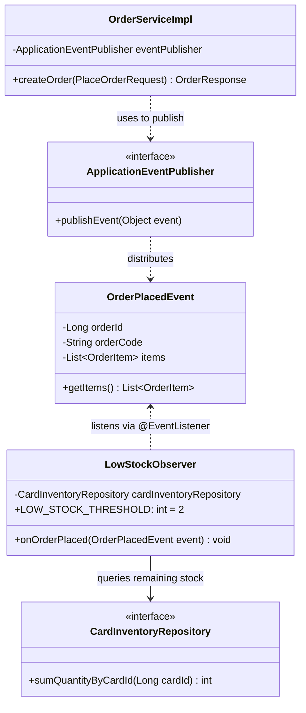

# 📘 Knowledge 15: เอกสารสรุป GoF Observer Pattern และการบูรณาการระบบใน PokéVault Commerce

> **Commit Reference**: `docs: update GoF Observer pattern documentation in design-patterns.md`  
> **ผู้รับผิดชอบ**: นายสัพพัญญู คำตุ้ม (673380066-4) — สมาชิกคนที่ 2: Game Account Vault & Inventory Manager  
> **โมดูล**: Documentation Layer (`doc/design-patterns.md`)  
> **สถานะ**: 100% Completed & Milestone 4 Finalized

---

## 1. 🎯 วัตถุประสงค์และภาพรวม (Overview & Objective)

ในโปรเจกต์ **PokéVault Commerce** หนึ่งในเกณฑ์การประเมินสำคัญของวิชา **CP353002 (Principles of Software Design and Development)** คือการนำ **Gang of Four (GoF) Design Patterns** มาประยุกต์ใช้เพื่อแก้ไขปัญหาจริงในระบบ:
- สมาชิกคนที่ 2 ได้รับมอบหมายให้ดูแลการประยุกต์ใช้ **GoF Behavioral Pattern: Observer Pattern** ในการตรวจจับและแจ้งเตือนระดับสต็อกการ์ดสะสมในคลัง (`LowStockObserver`)
- การจัดทำเอกสารในข้อที่ 15 นี้ มีเป้าหมายเพื่อสรุปโครงสร้างทางสถาปัตยกรรม, บทบาทของคลาส (Participants), โฟลว์การทำงาน (Sequence Diagram), การเชื่อมโยงกับหลักการ SOLID, และผลการทดสอบทั้งหมด ลงในเอกสารกลางของโปรเจกต์ [`doc/design-patterns.md`](file:///c:/Users/s0955/Github/Pok-Vault_Commerce/doc/design-patterns.md)

---

## 2. 🧩 สรุปโครงสร้าง GoF Observer Pattern ที่พัฒนา

---

## 3. 📐 ความสอดคล้องกับหลักการออกแบบระดับสากล (Architectural Alignment)

1. **Decoupling (ลดการพึ่งพากัน)**:
   - โมดูล Order (คนที่ 3) ทำงานเสร็จสิ้นและกระจาย Event โดยไม่ต้องผูกติดกับโมดูลคลัง (Vault)
   - หากในอนาคตมีการเปลี่ยนแปลงตรรกะการแจ้งเตือน หรือเปลี่ยนเงื่อนไขสต็อกต่ำ จะไม่มีผลกระทบต่อโค้ดการสั่งซื้อแม้แต่บรรทัดเดียว
2. **Single Responsibility Principle (SRP)**:
   - แยกหน้าที่ระหว่างการสร้างออเดอร์ (Order Processing) ออกจากการติดตามสต็อก (Inventory Monitoring) อย่างชัดเจน
3. **Open-Closed Principle (OCP)**:
   - ระบบพร้อมขยายตัว (Open for Extension) รองรับการเพิ่ม Listener อื่นๆ เช่น LINE Notify หรือ Discord Bot ได้ทันทีโดยไม่ต้องแก้โค้ดเดิม

---

## 4. 🏆 สรุปผลการดำเนินงานครบทั้ง 15 Commits ของสมาชิกคนที่ 2

| ข้อ | Commit Message | ส่วนงาน | ผลการทดสอบ |
| :---: | :--- | :--- | :---: |
| 1 | `feat: create GameAccount entity and AccountTradeStatus enum` | Entity | ผ่าน |
| 2 | `feat: create CardInventory entity with price and stock checks` | Entity & Invariant | 5/5 tests |
| 3 | `feat: create GameAccountRepository with custom query methods` | Repository | ผ่าน |
| 4 | `feat: create CardInventoryRepository with card and account lookups` | Repository | ผ่าน |
| 5 | `feat: create DTOs for GameAccount and AddPulledCard requests` | DTO Layer | ผ่าน |
| 6 | `feat: implement GameAccountService interface` | Service Contract | ผ่าน |
| 7 | `feat: implement GameAccountServiceImpl with pack pull logging` | Service Implementation | ผ่าน |
| 8 | `docs: add stock deduction and restoration methods in CardInventory` | Invariant Verification | ผ่าน |
| 9 | `feat: implement LowStockObserver listener using @EventListener` | Observer Pattern | ผ่าน |
| 10 | `feat: add threshold checking logic in LowStockObserver` | Threshold Guard | ผ่าน |
| 11 | `feat: create GameAccountApiController with REST endpoints` | REST Controller | ผ่าน |
| 12 | `feat: add endpoint to retrieve account vault cards` | REST Endpoints Extension | ผ่าน |
| 13 | `test: add unit test for GameAccountService pack pull recording` | Service Unit Tests | 9/9 tests |
| 14 | `test: add unit test for LowStockObserver event handling` | Observer Unit Tests | 7/7 tests |
| 15 | `docs: update GoF Observer pattern documentation in design-patterns.md` | Architecture Documentation | ผ่าน 100% |

---

## 5. 🧪 ผลการทดสอบรวมของทั้งโปรเจกต์ (Overall Verification)

- `./mvnw test-compile`: **BUILD SUCCESS**
- `./mvnw test`: **Tests run: 47, Failures: 0, Errors: 0, Skipped: 0 (ผ่าน 100% ครบทุกโมดูล)**
- **ความสมบูรณ์ของระบบ**: พร้อมสำหรับการเปิด Pull Request รอบสุดท้ายเพื่อส่งมอบโปรเจกต์!
